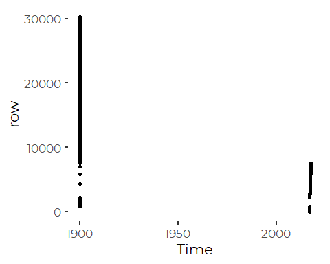
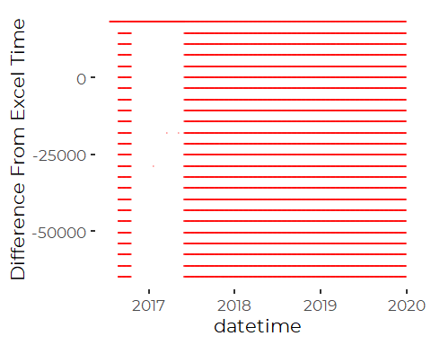
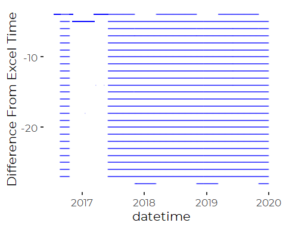
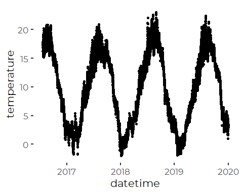
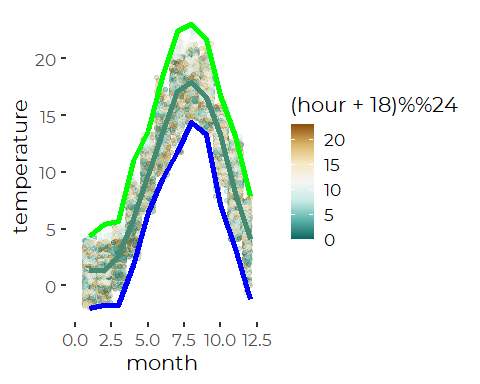
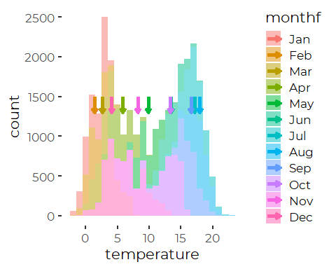
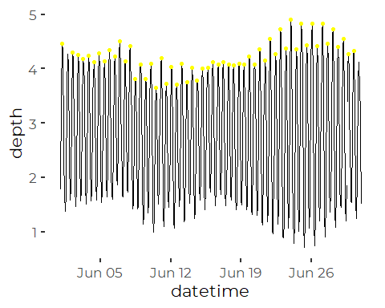
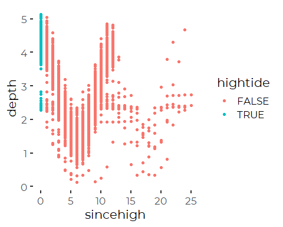
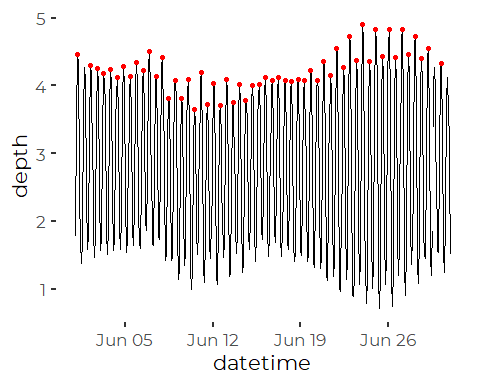
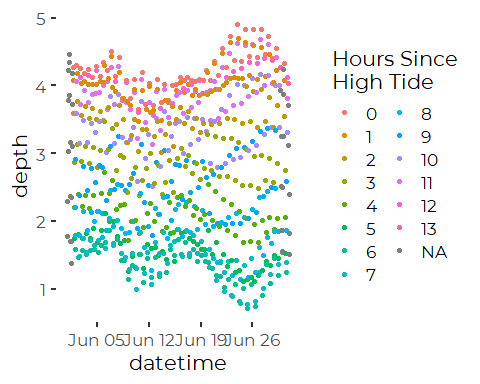

FOCB Continuous Data Preliminary Analysis, Checking Times and Tides
================
Curtis C. Bohlen, Casco Bay Estuary Partnership
2/18/2021

-   [Folders](#folders)
-   [Primary Data](#primary-data)
-   [Add Manually Created Times](#add-manually-created-times)
-   [Metadata](#metadata)
-   [Evaluating Time Coordinates](#evaluating-time-coordinates)
    -   [Common Timezone Names for
        Reference](#common-timezone-names-for-reference)
    -   [Plot Sequential Times](#plot-sequential-times)
    -   [Checking start of DST](#checking-start-of-dst)
    -   [Missing Data](#missing-data)
-   [Evaluating Bimodal
    Distributions](#evaluating-bimodal-distributions)
-   [Logic for Finding the Time Since High
    Tide](#logic-for-finding-the-time-since-high-tide)
    -   [Finding High tides in a Record of Water
        Depths](#finding-high-tides-in-a-record-of-water-depths)
    -   [Finding Times Since Last High](#finding-times-since-last-high)
-   [Clarifying the Code](#clarifying-the-code)
-   [Constructing Draft Functions](#constructing-draft-functions)


\#Load Data \#\# Libraries

``` r
library(tidyverse)
#> Warning: package 'tidyverse' was built under R version 4.0.5
#> -- Attaching packages --------------------------------------- tidyverse 1.3.1 --
#> v ggplot2 3.3.3     v purrr   0.3.4
#> v tibble  3.1.2     v dplyr   1.0.6
#> v tidyr   1.1.3     v stringr 1.4.0
#> v readr   1.4.0     v forcats 0.5.1
#> Warning: package 'tidyr' was built under R version 4.0.5
#> Warning: package 'dplyr' was built under R version 4.0.5
#> Warning: package 'forcats' was built under R version 4.0.5
#> -- Conflicts ------------------------------------------ tidyverse_conflicts() --
#> x dplyr::filter() masks stats::filter()
#> x dplyr::lag()    masks stats::lag()
library(readxl)
library(GGally)
#> Warning: package 'GGally' was built under R version 4.0.5
#> Registered S3 method overwritten by 'GGally':
#>   method from   
#>   +.gg   ggplot2
library(zoo)
#> Warning: package 'zoo' was built under R version 4.0.5
#> 
#> Attaching package: 'zoo'
#> The following objects are masked from 'package:base':
#> 
#>     as.Date, as.Date.numeric

library(CBEPgraphics)
load_cbep_fonts()
theme_set(theme_cbep())
```

## Folders

``` r
sibfldnm <- 'Original_Data'
parent   <- dirname(getwd())
sibling  <- file.path(parent,sibfldnm)
```

## Primary Data

``` r
fn    <-  'CMS1 Data through 2019.xlsx'
fpath <- file.path(sibling,fn)

the_data <- read_excel(fpath, col_types = c("numeric", "date", "date",
                                            "numeric","numeric","numeric",
                                            "numeric","numeric","numeric",
                                            "numeric","numeric",
                                            "numeric","numeric",
                                            "numeric","numeric",
                                            "numeric", "numeric","numeric"))
```

Both the “Date” and “Time” columns appear to contain excel date-time
coordinates. The two columns were just were formatted differently in
Excel. However, not all Time entries are consistent. Some were entered
as text, some as dates, leading to import errors:

``` r
the_data %>%
  mutate(row = row_number()) %>%
ggplot(aes(Time, row)) + geom_point()
#> Warning: Removed 1 rows containing missing values (geom_point).
```



Some times are bare times, with the Excel default “Year zero” in the
early 1900s. Others are complete dates and times.

## Add Manually Created Times

We create two Date Time values from the Month, Year, Day and Hour
Columns, with different assumptions about timezone. We compare them to
the datetime column (originally “date”) to see what’s going on. That
allows us to evaluate what time coordinates were used. The challenge
here is that we are dealing with Excel’s time handling and date/time
formatting, as well as FOCB’s data entry and QA/QC practices.

``` r
the_data <- the_data %>%
  mutate(DateTime_EST = ISOdatetime(Year, Month, Day, 
                                    Hour, 0, 0, 
                                    tz = 'Etc/GMT-5'),
         DateTime_EST_EDT  = ISOdatetime(Year, Month, Day, 
                                                 Hour, 0, 0, 
                                                 tz = "America/New_York"),
         dt = as.Date(Date)) %>%
  relocate(dt, DateTime_EST, DateTime_EST_EDT, .after = Time) %>%
  relocate(Year, Month, Day, Hour, .after = DateTime_EST_EDT)
```

We delete the first row, which contained units metadata, and modify
column names because FOCB used non-syntactic names, which are
frustrating to work with here in R.

``` r
the_data <- the_data %>%
  slice(-1) %>%
  select(-Time) %>%
  rename_with(.fn = tolower) %>%
  rename(datetime = date,
         depth = `water depth`,
       pctsat = `do%`,
       omega_a = `omega aragonite`)
```

# Metadata

\|—————–\|————————-\|—————-\| date \| Internal Representation \| \| time
\| Internal Representation \| Has errors \| datetime\_est \| GMT-5 hours
(EST) \| Constructed from components \| datetime\_est\_edt \| Local
CLock Time (EST and EDT \| Constructed from components\| depth \| meters
\| \| temperature \| Degrees C \| \| salinity \| PSU \| \| do \| mg/l \|
\| pctsat \| Percent \| \| ph \| NBS \| \| hl \| Chlorophyll A, in ug/l
\| \| pCO2 \| ppm \| \| month \| Integer \| \| year \| Integer \| \| day
\| Integer \| \| hour \| Integer \| \| ta \| Total alkalinity, uM/kg\|
\|  
DIC \| Dissolved inorganic carbon, uM/kg \| \| omega\_a \| Omega
Aragonite, Dimensionless \| \| \|—————–\|————————-\|—————-\|

# Evaluating Time Coordinates

There has been some ambiguity in the past about how datetimes were
created by FOCB. We check here to confirm that those problems have been
resolved

## Common Timezone Names for Reference

`OlsonNames()` is a function that returns a collection of timezone names
that R can accept.

``` r
table(sl <- grepl("/", OlsonNames()))
#> 
#> FALSE  TRUE 
#>    44   550

OlsonNames()[ !sl ] # the simple ones, without slashes in the name
#>  [1] "CET"       "CST6CDT"   "Cuba"      "EET"       "Egypt"     "Eire"     
#>  [7] "EST"       "EST5EDT"   "GB"        "GB-Eire"   "GMT"       "GMT-0"    
#> [13] "GMT+0"     "GMT0"      "Greenwich" "Hongkong"  "HST"       "Iceland"  
#> [19] "Iran"      "Israel"    "Jamaica"   "Japan"     "Kwajalein" "Libya"    
#> [25] "MET"       "MST"       "MST7MDT"   "Navajo"    "NZ"        "NZ-CHAT"  
#> [31] "Poland"    "Portugal"  "PRC"       "PST8PDT"   "ROC"       "ROK"      
#> [37] "Singapore" "Turkey"    "UCT"       "Universal" "UTC"       "W-SU"     
#> [43] "WET"       "Zulu"
```

## Plot Sequential Times

``` r
ggplot(the_data, aes(datetime)) + 
  geom_point(aes(y =  datetime - datetime_est), color = 'red', alpha = 0.2, size = 0.2) +
  ylab('Difference From Excel Time')
#> Don't know how to automatically pick scale for object of type difftime. Defaulting to continuous.
```



That suggest that we are off by as much as a day (60*60*24 seconds),
perhaps because the datetime conversion is assigning records to the
wrong day sometimes.

``` r
ggplot(the_data, aes(datetime)) + 
  geom_point(aes(y =  datetime - datetime_est_edt), 
             color = 'blue', size = 0.1, alpha = 0.1) +
  ylab('Difference From Excel Time')
#> Don't know how to automatically pick scale for object of type difftime. Defaulting to continuous.
```



So, when we convert using clock time the difference between our
constructed times and Excel Date is smaller, but still not zero. But
here we are off by SECONDS for the most part.

Data in Excel was stored in clock time, but there are still
inconsistencies, probably because times in Excel has both values and
formats, which can lead to confusion.

The conclusion is, we need to work wit calculated dates and times, not
rely on the ones in the Excel spreadsheets.

``` r
the_data <- the_data %>%
  select(-datetime) %>%
  rename(datetime = datetime_est_edt)
```

## Checking start of DST

Lets look around the start of daylight savings:

2017 March 12 November 5  
2018 March 11 November 4

Formally, EDT starts because there is no 2:00 am hour as we switch to
EDT. We confirm that that is true here.

``` r
the_data %>%
  filter(year == 2017, month == 3, day == 12, hour < 5)
#> # A tibble: 4 x 19
#>   count dt         datetime_est        datetime             year month   day
#>   <dbl> <date>     <dttm>              <dttm>              <dbl> <dbl> <dbl>
#> 1  5630 2017-03-12 2017-03-12 00:00:00 2017-03-12 00:00:00  2017     3    12
#> 2  5631 2017-03-12 2017-03-12 01:00:00 2017-03-12 01:00:00  2017     3    12
#> 3  5632 2017-03-12 2017-03-12 03:00:00 2017-03-12 03:00:00  2017     3    12
#> 4  5633 2017-03-12 2017-03-12 04:00:00 2017-03-12 04:00:00  2017     3    12
#> # ... with 12 more variables: hour <dbl>, depth <dbl>, temperature <dbl>,
#> #   salinity <dbl>, do <dbl>, pctsat <dbl>, ph <dbl>, chl <dbl>, pco2 <dbl>,
#> #   ta <dbl>, dic <dbl>, omega_a <dbl>
```

``` r
the_data %>%
  filter(year == 2018, month == 3, day == 11, hour < 5)
#> # A tibble: 4 x 19
#>   count dt         datetime_est        datetime             year month   day
#>   <dbl> <date>     <dttm>              <dttm>              <dbl> <dbl> <dbl>
#> 1 14366 2018-03-11 2018-03-11 00:00:00 2018-03-11 00:00:00  2018     3    11
#> 2 14367 2018-03-11 2018-03-11 01:00:00 2018-03-11 01:00:00  2018     3    11
#> 3 14368 2018-03-11 2018-03-11 03:00:00 2018-03-11 03:00:00  2018     3    11
#> 4 14369 2018-03-11 2018-03-11 04:00:00 2018-03-11 04:00:00  2018     3    11
#> # ... with 12 more variables: hour <dbl>, depth <dbl>, temperature <dbl>,
#> #   salinity <dbl>, do <dbl>, pctsat <dbl>, ph <dbl>, chl <dbl>, pco2 <dbl>,
#> #   ta <dbl>, dic <dbl>, omega_a <dbl>
```

So FOCB has correctly converted times to clock time.

## Missing Data

Rows 14615 and 14616 correspond to real times, but appear to be empty of
data. Since we have time stamps, we can ignore these rows for most
purposes, relying on R’s standard handling of missing values.

``` r
the_data %>%
  filter(count > 14612, count < 14618)
#> # A tibble: 5 x 19
#>   count dt         datetime_est        datetime             year month   day
#>   <dbl> <date>     <dttm>              <dttm>              <dbl> <dbl> <dbl>
#> 1 14613 2018-03-21 2018-03-21 08:00:00 2018-03-21 08:00:00  2018     3    21
#> 2 14614 2018-03-21 2018-03-21 09:00:00 2018-03-21 09:00:00  2018     3    21
#> 3 14615 2018-03-21 2018-03-21 10:00:00 2018-03-21 10:00:00  2018     3    21
#> 4 14616 2018-03-21 2018-03-21 11:00:00 2018-03-21 11:00:00  2018     3    21
#> 5 14617 2018-03-21 2018-03-21 12:00:00 2018-03-21 12:00:00  2018     3    21
#> # ... with 12 more variables: hour <dbl>, depth <dbl>, temperature <dbl>,
#> #   salinity <dbl>, do <dbl>, pctsat <dbl>, ph <dbl>, chl <dbl>, pco2 <dbl>,
#> #   ta <dbl>, dic <dbl>, omega_a <dbl>
```

``` r
which(is.na(the_data$datetime))
#> integer(0)
```

Are there times separated by more than an hour? (because times could be
slightly different in the seconds place, we actually search for times
more than an hour and one minute apart). We find about 27 gaps in the
data, where data is missing for a few hours. We show both the record
immediately before the gap and immediately after the gap.

Many gaps appear to start at midnight, and so may reflect at aQA/QC
practices.

``` r
thespots <- which(the_data$datetime_est - lag(the_data$datetime_est) > 60*61)
before <- thespots - 1

allspots <- c(thespots, before)
allspots <- sort(allspots)
the_data[allspots,]
#> # A tibble: 54 x 19
#>    count dt         datetime_est        datetime             year month   day
#>    <dbl> <date>     <dttm>              <dttm>              <dbl> <dbl> <dbl>
#>  1   828 2016-08-23 2016-08-23 23:00:00 2016-08-23 23:00:00  2016     8    23
#>  2   829 2016-08-24 2016-08-24 13:00:00 2016-08-24 13:00:00  2016     8    24
#>  3   852 2016-08-24 2016-08-24 12:00:00 2016-08-24 12:00:00  2016     8    24
#>  4   853 2016-08-25 2016-08-25 00:00:00 2016-08-25 00:00:00  2016     8    25
#>  5  4405 2017-01-19 2017-01-19 23:00:00 2017-01-19 23:00:00  2017     1    19
#>  6  4406 2017-01-20 2017-01-20 13:00:00 2017-01-20 13:00:00  2017     1    20
#>  7  4419 2017-01-20 2017-01-20 12:00:00 2017-01-20 12:00:00  2017     1    20
#>  8  4420 2017-01-20 2017-01-20 14:00:00 2017-01-20 14:00:00  2017     1    20
#>  9  5631 2017-03-12 2017-03-12 01:00:00 2017-03-12 01:00:00  2017     3    12
#> 10  5632 2017-03-12 2017-03-12 03:00:00 2017-03-12 03:00:00  2017     3    12
#> # ... with 44 more rows, and 12 more variables: hour <dbl>, depth <dbl>,
#> #   temperature <dbl>, salinity <dbl>, do <dbl>, pctsat <dbl>, ph <dbl>,
#> #   chl <dbl>, pco2 <dbl>, ta <dbl>, dic <dbl>, omega_a <dbl>
```

``` r
the_data <- the_data %>%
  select(-count, -datetime_est)
```

# Evaluating Bimodal Distributions

-   Depth and temperature show strong bimodal distributions.  
-   DO shows some bimodal structure, but DOSat does not.

So, lets look at those bimodal distributions

``` r
the_data %>% ggplot(aes(datetime, temperature)) + 
  geom_point()
#> Warning: Removed 339 rows containing missing values (geom_point).
```



Slicing that by temperature wil lshow higher densities of observations
at seasonal high and low values, where temperatures do not change as
rapidly.

``` r
monthmeans <- the_data %>% 
        group_by(month) %>% 
        summarise(meantemp = mean(temperature, na.rm = TRUE),
                  mintemp = min(temperature, na.rm = TRUE),
                  maxtemp = max(temperature, na.rm = TRUE)) %>%
  mutate(monthf = factor(month, levels = as.character(1:12),
                                   labels = c('Jan','Feb','Mar','Apr','May',
                                              'Jun', 'Jul','Aug','Sep','Oct',
                                              'Nov','Dec'))) %>%
  arrange(monthf) %>%
  filter(! is.na(month))
```

We plot against time shifted by six hours, so the value of zero is six
a.m, which should be about the coolest time of day.

``` r
ggplot() +
  geom_jitter(data = the_data, aes(x = month,
                                   y = temperature, 
                                   color = (hour + 18)%%24), 
              alpha = 0.25) +
  scale_colour_distiller( type = "div", palette = 1) +
  xlim(0,12) +
    geom_line(data = monthmeans, aes(x = month, y = meantemp), 
              color = 'aquamarine4', lwd = 2) +
    geom_line(data = monthmeans, aes(x = month, y = mintemp), 
              color = 'blue', lwd = 2) +
    geom_line(data = monthmeans, aes(x = month, y = maxtemp), 
              color = 'green', lwd = 2)
#> Warning: Removed 1807 rows containing missing values (geom_point).
```



So, it looks like the bimodal distribution of temperatures reflects the
long periods of the year that are relatively warm (July, August and
September) and relatively cold (Latter half of December, January,
February, March).

Let's try to color code by month, and add markers for the monthly means.
The only trick here was getting the color ramps to assign consistently
and correctly. Note the use of “arrange” to reorder the dataframes.
Apparently, ggplot assigns colors in order of first appearance of a
factor level.

``` r
the_data %>% mutate(monthf = factor(month, levels = 1:12,
                                   labels = c('Jan','Feb','Mar','Apr','May','Jun',
                                              'Jul','Aug','Sep','Oct','Nov','Dec'))) %>% 
  arrange(monthf) %>%
  ggplot(aes(x =temperature, fill = monthf)) +
  scale_fill_hue(aesthetics = c("colour", "fill")) +
  geom_histogram(binwidth = 1, alpha = .5) +
  geom_segment(data = monthmeans,
               aes(x = meantemp, y = 1500,
                   xend = meantemp, yend = 1300,
                   color = monthf),
               lwd = 2, arrow = arrow(length = unit(0.2,"cm"))) 
#> Warning: Removed 339 rows containing non-finite values (stat_bin).
```



Presumably Depth is bimodal for similar reasons, but perhaps by tidal
phase, not day or month.

Of course, the problem is that the tidal data does not follow any of the
predictor time variables. We would have to find successive high tides
some how…

# Logic for Finding the Time Since High Tide

## Finding High tides in a Record of Water Depths

We are searching for the highest tide within each 15 hour period, and if
the central hour (hour 8 of 15) is the highest tide, we set `localmax`
to TRUE. We then pad `localmax` to be the same length as the source
data, and use if to index into the source data and figure out what the
depth was at that time.

``` r
tmp <- the_data %>% filter(year == 2017, month == 6)

localmax <- rollapply(tmp$depth, 15, function (x) which.max(x)==8, align = 'center')
localmax <- c(rep(FALSE,7), localmax, c(rep(FALSE,7)))

localmaxdatetime <- tmp$datetime[localmax]
localmaxdepth    <- tmp$depth[localmax]

ggplot() + geom_line(data = tmp, aes(x= datetime, y= depth) ) +
  geom_point(aes(x=localmaxdatetime, y = localmaxdepth), color = 'yellow') +
  scale_x_datetime()
```



``` r
rm(tmp)
```

Pretty cool….

## Finding Times Since Last High

Now that I have a list of the hours nearest successive high tides, We
need to calculate how long ago the previous high tide was. We
demonstrate the logic here using only data internal to the FOCB data,
but the same logic can apply working with NOAA tide data. We use the
same logic analyzing tidal relationships with our OA data.

Here’s a potentially useful function:

``` r
findInterval(c(0, 1,2,3,4,5,6,7,8,9), c(2,4,6,8,10))
#>  [1] 0 0 1 1 2 2 3 3 4 4
```

You might think `findInterval()` as a function that assigns values in
the first list to bins defined in the second list. You might, for
example, use this to define categories or assign values to histogram
bars.

For our use, we put the list of all times in the first parameter, and
the list of ONLY high tides in the second parameter, and the function
will figure out which interval (defined by values in the second list)
each value in the first list belongs to. The function returns a list of
the INDEXES of the “closest but smaller” value in the second list.

``` r
localmax <- rollapply(the_data$depth, 15, function (x) which.max(x)==8, 
                      align = 'center')
localmax <- c(rep(FALSE,7), localmax, c(rep(FALSE,7)))
the_data$hightide <- localmax     # Add a flag indicating high tides

localmaxdatetime <- the_data$datetime[localmax]
localmaxdepth    <- the_data$depth[localmax]

localmaxdatetime <-  sort(localmaxdatetime)  #Not sure why this needed sorting
                                             # It may reflect missing values?

hightides <- tibble(thetime = localmaxdatetime, depth = localmaxdepth)
```

``` r
tideindexes <- findInterval(the_data$datetime, hightides$thetime)
tideindexes[tideindexes == 0] = NA  # These occur before the first high tide
head(tideindexes, 100)
#>   [1] NA NA NA NA NA NA NA NA NA NA NA NA  1  1  1  1  1  1  1  1  1  1  1  1  1
#>  [26]  2  2  2  2  2  2  2  2  2  2  2  2  3  3  3  3  3  3  3  3  3  3  3  3  3
#>  [51]  4  4  4  4  4  4  4  4  4  4  4  4  5  5  5  5  5  5  5  5  5  5  5  5  6
#>  [76]  6  6  6  6  6  6  6  6  6  6  6  6  7  7  7  7  7  7  7  7  7  7  7  7  8
```

Those are the only twelve `NA` values in the record. There is one value
for each time in the\_data$datetime.

``` r
sum(is.na(tideindexes))
#> [1] 12
```

``` r
tidetimes =  localmaxdatetime[tideindexes]
head(tidetimes, 50)
#>  [1] NA                        NA                       
#>  [3] NA                        NA                       
#>  [5] NA                        NA                       
#>  [7] NA                        NA                       
#>  [9] NA                        NA                       
#> [11] NA                        NA                       
#> [13] "2016-07-21 00:00:00 EDT" "2016-07-21 00:00:00 EDT"
#> [15] "2016-07-21 00:00:00 EDT" "2016-07-21 00:00:00 EDT"
#> [17] "2016-07-21 00:00:00 EDT" "2016-07-21 00:00:00 EDT"
#> [19] "2016-07-21 00:00:00 EDT" "2016-07-21 00:00:00 EDT"
#> [21] "2016-07-21 00:00:00 EDT" "2016-07-21 00:00:00 EDT"
#> [23] "2016-07-21 00:00:00 EDT" "2016-07-21 00:00:00 EDT"
#> [25] "2016-07-21 00:00:00 EDT" "2016-07-21 13:00:00 EDT"
#> [27] "2016-07-21 13:00:00 EDT" "2016-07-21 13:00:00 EDT"
#> [29] "2016-07-21 13:00:00 EDT" "2016-07-21 13:00:00 EDT"
#> [31] "2016-07-21 13:00:00 EDT" "2016-07-21 13:00:00 EDT"
#> [33] "2016-07-21 13:00:00 EDT" "2016-07-21 13:00:00 EDT"
#> [35] "2016-07-21 13:00:00 EDT" "2016-07-21 13:00:00 EDT"
#> [37] "2016-07-21 13:00:00 EDT" "2016-07-22 01:00:00 EDT"
#> [39] "2016-07-22 01:00:00 EDT" "2016-07-22 01:00:00 EDT"
#> [41] "2016-07-22 01:00:00 EDT" "2016-07-22 01:00:00 EDT"
#> [43] "2016-07-22 01:00:00 EDT" "2016-07-22 01:00:00 EDT"
#> [45] "2016-07-22 01:00:00 EDT" "2016-07-22 01:00:00 EDT"
#> [47] "2016-07-22 01:00:00 EDT" "2016-07-22 01:00:00 EDT"
#> [49] "2016-07-22 01:00:00 EDT" "2016-07-22 01:00:00 EDT"
```

``` r
the_data$sincehigh <- as.integer(difftime(the_data$datetime,
                                          tidetimes,units = 'hours'))
```

How’d that work?

``` r
tmp <- the_data %>% 
  filter (year == 2017, month <6)

ggplot(tmp, aes(sincehigh, depth, color = hightide)) + 
  geom_point()
#> Warning: Removed 3 rows containing missing values (geom_point).
```


No interval since high tide should be over 13 hours, so we are looking
at data with some impossible values. They arise because we have some
gaps in the data, creating spaces between high tides that are longer
than 13 hours. Those are not meaningful values, but a result of limits
in the source data. They would not occur with consistent high tide
times, as one can get from NOAA.

# Clarifying the Code

Let’s apply that to the tides again.

``` r
tmp <- the_data %>%
  filter(year == 2017, month == 6)
```

``` r
h <- function(x) ifelse(any(is.na(x)), NA, which(x == max(x))==8)
localmax <- rollapply(tmp$depth, 15, h, align = 'center')

# Pad out the results of rollapply to match the inout vector in length and alignment
localmax = c(rep(FALSE,7), localmax, c(rep(FALSE,7)))

# Now, add datetime and depth to the data frame
localmaxdatetime <- tmp$datetime[localmax]
localmaxdatetime <- localmaxdatetime[!is.na(localmaxdatetime)]
localmaxdepth <- tmp$depth[localmax]
localmaxdepth <- localmaxdepth[!is.na(localmaxdepth)]
```

``` r
# finally, figure out when the previous high tide occurred
# Identify the index of the previous high tide in `localmaxdatetime`
tideindexes <- findInterval(tmp$datetime, localmaxdatetime)
# Eliminate spurious values before the first high tide
tideindexes[tideindexes== 0] = NA
# Lookup the time that corresponds
tidetimes =  localmaxdatetime[tideindexes]
# Calculate a time difference
tmp$sincehigh <- as.integer(difftime(tmp$datetime,tidetimes,units = 'hours'))
# Any that are more than 13 hours after a high tide must be from a period where some data were missing.
tmp$sincehigh[tmp$sincehigh>13]<- NA
```

``` r
 ggplot() + geom_line(data = tmp, aes(x= datetime, y= depth) ) +
  geom_point(aes(x=localmaxdatetime, y = localmaxdepth), color = 'Red') +
  scale_x_datetime()
```



Note that there are a couple of High tides, both early and late that we
have not picked out. Those are periods with some missing data.

# Constructing Draft Functions

``` r
h <- function(x) ifelse(any(is.na(x)), NA, which(x == max(x))==8)

findhightides <- function (dpth, datetime, windo = 15, fxn = h) {
  #Find local maximum depths 
  dpth     <- dpth[order(datetime)]
  datetime <- datetime[order(datetime)]
  localmax <- rollapply(dpth, windo, fxn, align = 'center')
  #browser()
  # Pad out the results of rollapply to match the input vector in length
  # Does this need to use `floor()' instead of `as.integer()`?
  # Should this be padded with `NA`?
  localmax = c(rep(FALSE,(as.integer(windo/2))),
                   localmax,
                   rep(FALSE,(as.integer(windo/2)))
                   )
  
  # Now, find corresponding datetime and depth
  localmaxdatetime <- datetime[localmax]
  localmaxdatetime <- localmaxdatetime[!is.na(localmaxdatetime)]
  
  localmaxdepth <- tmp$depth[localmax]
  localmaxdepth <- localmaxdepth[!is.na(localmaxdepth)]
  #Return columns
  return(tibble(dt = localmaxdatetime,depth = localmaxdepth))
}
```

``` r
tmp2 <- the_data %>% filter(year == 2017, month == 6)

findhightides(tmp2$depth, tmp2$datetime)
#> # A tibble: 55 x 2
#>    dt                  depth
#>    <dttm>              <dbl>
#>  1 2017-06-01 18:00:00  4.34
#>  2 2017-06-02 06:00:00  4.3 
#>  3 2017-06-02 19:00:00  4.25
#>  4 2017-06-03 07:00:00  4.18
#>  5 2017-06-03 20:00:00  4.24
#>  6 2017-06-04 08:00:00  4.12
#>  7 2017-06-04 21:00:00  4.29
#>  8 2017-06-05 09:00:00  4.14
#>  9 2017-06-05 21:00:00  4.34
#> 10 2017-06-06 10:00:00  4.23
#> # ... with 45 more rows
```

``` r
sincehightide <- function (dpth, datetime, windo = 15, fxn = h) {
  #Find local maximum depths 
  tides <- findhightides(dpth, datetime)
  
  #figure out when the previous high tide occured
  # Identify the index of the previous high tide in the tides dataframe
  tideindexes <- findInterval(datetime, tides$dt)
  # Eliminate spurious values before the first high tide
  tideindexes[tideindexes== 0] <- NA
  # Lookup the corresponding times.
  tidetimes <-  tides$dt[tideindexes]
  #Calculate time differences
  sincehigh <- as.integer(difftime(datetime, tidetimes, units = 'hours'))
  # Any that are more than 13 hours after a high tide must be from a period where some data were missing.
  sincehigh[sincehigh>13]<- NA
  return(sincehigh)
}
```

``` r
sincehightide(tmp2$depth, tmp2$datetime)
#>   [1] NA NA NA NA NA NA  0  1  2  3  4  5 NA NA NA NA NA NA NA NA NA NA NA NA  6
#>  [26]  7  8  9 10 11  0  1  2  3  4  5  6  7  8  9 10 11 12  0  1  2  3  4  5  6
#>  [51]  7  8  9 10 11  0  1  2  3  4  5  6  7  8  9 10 11 12  0  1  2  3  4  5  6
#>  [76]  7  8  9 10 11  0  1  2  3  4  5  6  7  8  9 10 11 12  0  1  2  3  4  5  6
#> [101]  7  8  9 10 11  0  1  2  3  4  5  6  7  8  9 10 11  0  1  2  3  4  5  6  7
#> [126]  8  9 10 11 12  0  1  2  3  4  5  6  7  8  9 10 11  0  1  2  3  4  5  6  7
#> [151]  8  9 10 11 12  0  1  2  3  4  5  6  7  8  9 10 11  0  1  2  3  4  5  6  7
#> [176]  8  9 10 11  0  1  2  3  4  5  6  7  8  9 10 11 12  0  1  2  3  4  5  6  7
#> [201]  8  9 10 11  0  1  2  3  4  5  6  7  8  9 10 11  0  1  2  3  4  5  6  7  8
#> [226]  9 10 11 12  0  1  2  3  4  5  6  7  8  9 10 11  0  1  2  3  4  5  6  7  8
#> [251]  9 10 11  0  1  2  3  4  5  6  7  8  9 10 11  0  1  2  3  4  5  6  7  8  9
#> [276] 10 11 12  0  1  2  3  4  5  6  7  8  9 10 11  0  1  2  3  4  5  6  7  8  9
#> [301] 10 11 12  0  1  2  3  4  5  6  7  8  9 10 11  0  1  2  3  4  5  6  7  8  9
#> [326] 10 11  0  1  2  3  4  5  6  7  8  9 10 11 12  0  1  2  3  4  5  6  7  8  9
#> [351] 10 11  0  1  2  3  4  5  6  7  8  9 10 11  0  1  2  3  4  5  6  7  8  9 10
#> [376] 11 12  0  1  2  3  4  5  6  7  8  9 10 11  0  1  2  3  4  5  6  7  8  9 10
#> [401] 11 12  0  1  2  3  4  5  6  7  8  9 10 11  0  1  2  3  4  5  6  7  8  9 10
#> [426] 11 12  0  1  2  3  4  5  6  7  8  9 10 11  0  1  2  3  4  5  6  7  8  9 10
#> [451] 11  0  1  2  3  4  5  6  7  8  9 10 11 12  0  1  2  3  4  5  6  7  8  9 10
#> [476] 11  0  1  2  3  4  5  6  7  8  9 10 11 12  0  1  2  3  4  5  6  7  8  9 10
#> [501] 11  0  1  2  3  4  5  6  7  8  9 10 11 12  0  1  2  3  4  5  6  7  8  9 10
#> [526] 11  0  1  2  3  4  5  6  7  8  9 10 11 12  0  1  2  3  4  5  6  7  8  9 10
#> [551] 11  0  1  2  3  4  5  6  7  8  9 10 11 12  0  1  2  3  4  5  6  7  8  9 10
#> [576] 11  0  1  2  3  4  5  6  7  8  9 10 11 12  0  1  2  3  4  5  6  7  8  9 10
#> [601] 11  0  1  2  3  4  5  6  7  8  9 10 11 12  0  1  2  3  4  5  6  7  8  9 10
#> [626] 11  0  1  2  3  4  5  6  7  8  9 10 11 12  0  1  2  3  4  5  6  7  8  9 10
#> [651] 11  0  1  2  3  4  5  6  7  8  9 10 11 12  0  1  2  3  4  5  6  7  8  9 10
#> [676] 11  0  1  2  3  4  5  6  7  8  9 10 11 12 13 NA NA NA NA NA NA NA NA NA NA
#> [701] NA  0  1  2  3  4  5  6  7  8  9 10 11 12 13 NA NA NA NA NA
```

``` r
tmp2 <- tmp2 %>%
  mutate(sincehigh = sincehightide(tmp2$depth, tmp2$datetime))

 ggplot(tmp2, aes(x= datetime, y= depth, color = as.factor(sincehigh))) + 
   geom_point() +
   scale_color_discrete(name = "Hours Since\nHigh Tide") +
  guides(color=guide_legend(ncol=2))
#> Warning: Removed 1 rows containing missing values (geom_point).
```



``` r
  #scale_x_datetime()
```
