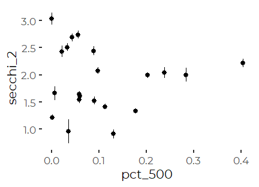
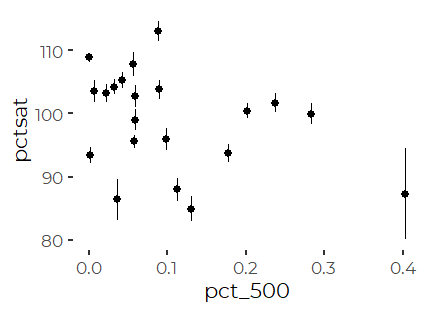
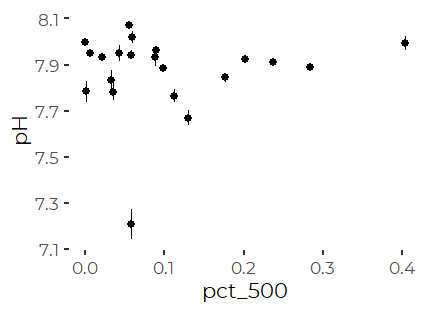
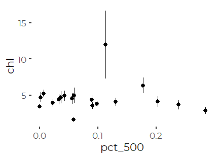
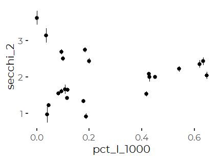
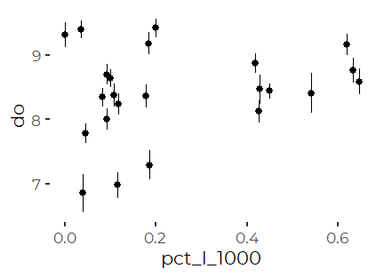
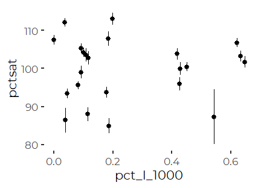
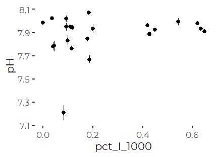
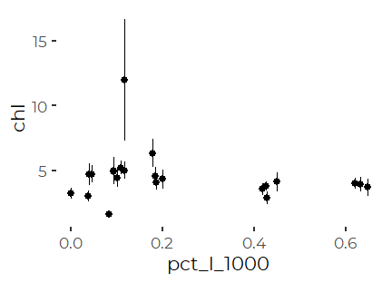

Analysis of Water Quality and Urbanization
================
Curtis C. Bohlen, Casco Bay Estuary Partnership
3/09/2021

-   [Introduction](#introduction)
-   [Load Libraries](#load-libraries)
-   [Load Data](#load-data)
    -   [Establish Folder Reference](#establish-folder-reference)
    -   [Primary Data](#primary-data)
        -   [Remove 2020 only data](#remove-2020-only-data)
    -   [Add Station Names](#add-station-names)
    -   [Address Secchi Censored
        Values](#address-secchi-censored-values)
    -   [Create Recent Data](#create-recent-data)
    -   [Add Impervious Cover Data](#add-impervious-cover-data)
-   [Create Nested Tibble](#create-nested-tibble)
-   [Exploratory Graphics](#exploratory-graphics)
-   [Hierarchical Linear Models](#hierarchical-linear-models)
    -   [Review ANOVAs](#review-anovas)
    -   [500 Meter IC](#meter-ic)
        -   [Total Percentage of Nearby
            IC](#total-percentage-of-nearby-ic)
        -   [Percent Imperviousness on Nearby
            Land](#percent-imperviousness-on-nearby-land)
    -   [Near Land Models](#near-land-models)
-   [Conclusion](#conclusion)


# Introduction

This Notebook analyzes FOCB’s “Surface” data. In particular, it compares
observed water quality conditions with the level of nearby impervious
surfaces. Imperviouos surfaces, like roads, parking areas,a nd rooftops,
area reasonable surrogate for urbanization, and are used here in that
context.

The water quality data are pulled from 23 long term monitoring locations
around the Bay. The data comes from sites visited regularly by FOCB
staff, either by boat or on land. The focus is on warm season sampling
(April through October), with roughly monthly samples. Earlier data from
some land-based sites was collected by volunteers.

Impervious cover values were based on 2007 impervious cover data, based
on GIS analysis. Details of the GIS analysis are provided in the
‘DATA\_NOTES.md’ file found with the GIS data in the Derived Data
archives.

# Load Libraries

``` r
library(tidyverse)
#> -- Attaching packages --------------------------------------- tidyverse 1.3.0 --
#> v ggplot2 3.3.3     v purrr   0.3.4
#> v tibble  3.0.5     v dplyr   1.0.3
#> v tidyr   1.1.2     v stringr 1.4.0
#> v readr   1.4.0     v forcats 0.5.0
#> -- Conflicts ------------------------------------------ tidyverse_conflicts() --
#> x dplyr::filter() masks stats::filter()
#> x dplyr::lag()    masks stats::lag()
library(readxl)
library(readr)

library(lme4)
#> Loading required package: Matrix
#> 
#> Attaching package: 'Matrix'
#> The following objects are masked from 'package:tidyr':
#> 
#>     expand, pack, unpack
#library(mgcv)
#library(maxLik)

library(GGally)
#> Registered S3 method overwritten by 'GGally':
#>   method from   
#>   +.gg   ggplot2
#library(zoo)
#library(lubridate)  # here, for the make_datetime() function

library(broom)

library(CBEPgraphics)
load_cbep_fonts()
theme_set(theme_cbep())
```

# Load Data

## Establish Folder Reference

``` r
sibfldnm <- 'Original_Data'
parent   <- dirname(getwd())
sibling  <- file.path(parent,sibfldnm)
#dir.create(file.path(getwd(), 'figures'), showWarnings = FALSE)
```

## Primary Data

We specify column names because FOCB data has a row of names, a row of
units, then the data. This approach is simpler than reading names from
the first row and correcting them to be R syntactic names.

``` r
fn    <- 'FOCB Surface All Current Sites With BSV Data.xlsx'
fpath <- file.path(sibling,fn)

mynames <- c('station', 'dt', 'time', 'sample_depth',
             'secchi', 'water_depth','temperature', 'salinity',
             'do', 'pctsat', 'pH', 'chl', 
             'month', 'year', 'fdom', 'bga', 
             'turbidity', 'blank', 'clouds', 'wndspd',
             'winddir'
             ) 

the_data <- read_excel(fpath, skip=2, col_names = mynames) %>%
  mutate(month = factor(month, levels = 1:12, labels = month.abb))

rm(mynames)
```

### Remove 2020 only data

``` r
the_data <- the_data %>%
select(-c(fdom:winddir))
```

## Add Station Names

``` r
fn    <- 'FOCB Monitoring Sites.xlsx'
fpath <- file.path(sibling,fn)
loc_data <- read_excel(fpath) %>%
  select(Station_ID, Station_Name) %>%
  rename(station = Station_ID,
         station_name = Station_Name)

the_data <- the_data %>%
  left_join(loc_data, by = 'station') %>%
  relocate(station_name, .after = station) %>%
  
  relocate(year, .after = dt) %>%
  relocate(month, .after = year)
```

Our data contains two stations that are not associated with locations
that were included in our spatial data. We can see that because when we
`left_join()` by `station`, no `station_name` value is carried over.

``` r
l <- the_data %>%
  group_by(station) %>%
  summarize(missing = sum(is.na(station_name))) %>%
  filter(missing > 0) %>%
  pull(station)
l
#> [1] "CMS3"  "P6CBI"
```

If we look at those records, on is represented by only a single
observation, and the other only by data from 2020. Neither matter for
the current analysis. They will get filtered out when we select data to
describe recent conditions, and trends.

``` r
the_data %>%
  filter(station %in% l)
#> # A tibble: 7 x 15
#>   station station_name dt                   year month time               
#>   <chr>   <chr>        <dttm>              <dbl> <fct> <dttm>             
#> 1 P6CBI   <NA>         2006-09-13 00:00:00  2006 Sep   1899-12-31 11:40:00
#> 2 CMS3    <NA>         2020-06-17 00:00:00  2020 Jun   1899-12-31 11:22:54
#> 3 CMS3    <NA>         2020-07-15 00:00:00  2020 Jul   1899-12-31 11:08:08
#> 4 CMS3    <NA>         2020-07-30 00:00:00  2020 Jul   1899-12-31 11:39:33
#> 5 CMS3    <NA>         2020-08-19 00:00:00  2020 Aug   1899-12-31 11:36:38
#> 6 CMS3    <NA>         2020-09-17 00:00:00  2020 Sep   1899-12-31 11:52:14
#> 7 CMS3    <NA>         2020-10-05 00:00:00  2020 Oct   1899-12-31 11:23:21
#> # ... with 9 more variables: sample_depth <dbl>, secchi <chr>,
#> #   water_depth <dbl>, temperature <dbl>, salinity <dbl>, do <dbl>,
#> #   pctsat <dbl>, pH <dbl>, chl <dbl>
```

## Address Secchi Censored Values

``` r
the_data <- the_data %>%
  mutate(secchi_2 = if_else(secchi == "BSV", water_depth, as.numeric(secchi)),
         bottom_flag = secchi == "BSV") %>%
  relocate(secchi_2, .after = secchi) %>%
  relocate(bottom_flag, .after = secchi_2)
#> Warning: Problem with `mutate()` input `secchi_2`.
#> i NAs introduced by coercion
#> i Input `secchi_2` is `if_else(secchi == "BSV", water_depth, as.numeric(secchi))`.
```

## Create Recent Data

We filter to the last five FULL years of data, 2015 through 2019.

``` r
recent_data <- the_data %>%
  filter(year > 2014 & year < 2020) %>%
  mutate(station = fct_reorder(station, temperature, mean, na.rm = TRUE),
         station_name = fct_reorder(station_name, temperature, mean, na.rm = TRUE))
```

## Add Impervious Cover Data

``` r
sibfldnm <- 'Derived_Data'
parent   <- dirname(getwd())
sibling  <- file.path(parent,sibfldnm)
#dir.create(file.path(getwd(), 'figures'), showWarnings = FALSE

fn    <- 'focb_monitoring_imperv.csv'
fpath <- file.path(sibling,fn)

imperv_data <- read_csv(fpath,
                        col_types = cols(
                          FID = col_skip(),
                          Station_ID = col_character(),
                          Station_Na = col_skip(),
                          Town = col_skip(),
                          Y = col_skip(),
                          X = col_skip(),
                          Category = col_skip(),
                          land_1000 = col_double(),
                          imperv_100 = col_skip(),
                          land_500 = col_double(),
                          imperv_500 = col_skip(),
                          land_100 = col_double(),
                          imperv_101 = col_skip(),
                          pct_100 = col_double(),
                          pct_500 = col_double(),
                          pct_1000 = col_double(),
                          pct_l_1000 = col_double(),
                          pct_l_500 = col_double(),
                          pct_l_100 = col_double()
                        )) %>%
  mutate(across(contains('pct-'), function (x) x * 100)) %>%
  rename(station = Station_ID)

recent_data <- recent_data %>%
  left_join(imperv_data, by = 'station')
```

# Create Nested Tibble

To run parallel analyses on nested tibbles, we will need to reorganize
the data so that we can analyze along parameters.

``` r
nested_data <- recent_data %>%
  select(-dt, -year, -time, -sample_depth, 
         -secchi, - bottom_flag, -salinity, -temperature) %>%
  relocate(water_depth, .after = month) %>%
  pivot_longer(c(secchi_2:chl), names_to = 'parameter', values_to = 'value') %>%
  filter(! is.na(value)) %>%
  group_by(parameter) %>%
  nest()
```

# Exploratory Graphics

We have many possible plots here, but we focus on the pct impervious
within 1000 m.

``` r
for (p in nested_data$parameter) {
  sel <- nested_data %>%
    filter(parameter == p)
  dat <- sel$data[[1]]

 print(ggplot(dat, aes( x = pct_500, y = value)) +
         stat_summary() +
         #geom_smooth(method = 'lm') +
         ylab(p)
 )
       
}
#> No summary function supplied, defaulting to `mean_se()`
```



    #> No summary function supplied, defaulting to `mean_se()`


    #> No summary function supplied, defaulting to `mean_se()`



    #> No summary function supplied, defaulting to `mean_se()`



    #> No summary function supplied, defaulting to `mean_se()`



None of those look like they hide any strong patterns.

``` r
for (p in nested_data$parameter) {
  sel <- nested_data %>%
    filter(parameter == p)
  dat <- sel$data[[1]]

 print(ggplot(dat, aes( x = pct_l_1000, y = value)) +
         stat_summary() +
         #geom_smooth(method = 'lm') +
         ylab(p)
 )
       
}
#> No summary function supplied, defaulting to `mean_se()`
```



    #> No summary function supplied, defaulting to `mean_se()`



    #> No summary function supplied, defaulting to `mean_se()`



    #> No summary function supplied, defaulting to `mean_se()`



    #> No summary function supplied, defaulting to `mean_se()`



# Hierarchical Linear Models

We have a fundamentally nested analysis here, with each “Station” acting
as a random exemplar of all possible stations. We have no variability in
impervious cover within stations, so the appropriate random term is only
an intercept.

``` r
nested_data <- nested_data %>%
  mutate(lm500 = map(data, function(df) lmer(value ~ pct_500 + month + (1 | station),
                                             REML = FALSE,
                                               data = df)),
         lm_l_500 = map(data, function(df) lmer(value ~ pct_l_500 + month + (1 | station),
                                             REML = FALSE,
                                               data = df)),
         lm1000 = map(data, function(df) lmer(value ~ pct_1000 + month + (1 | station),
                                             REML = FALSE,
                                               data = df)),
         lm_l_1000 = map(data, function(df) lmer(value ~ pct_l_1000 + month + (1 | station),
                                             REML = FALSE,
                                               data = df)))
```

## Review ANOVAs

``` r
for (p in nested_data$parameter) {
  cat(p)
  cat('\n')
  print(anova(nested_data$lm1000[nested_data$parameter == p][[1]],
              nested_data$lm_l_1000[nested_data$parameter == p][[1]]))
}
#> secchi_2
#> Data: df
#> Models:
#> nested_data$lm1000[nested_data$parameter == p][[1]]: value ~ pct_1000 + month + (1 | station)
#> nested_data$lm_l_1000[nested_data$parameter == p][[1]]: value ~ pct_l_1000 + month + (1 | station)
#>                                                        npar    AIC    BIC
#> nested_data$lm1000[nested_data$parameter == p][[1]]      10 1782.3 1832.2
#> nested_data$lm_l_1000[nested_data$parameter == p][[1]]   10 1782.9 1832.8
#>                                                         logLik deviance Chisq
#> nested_data$lm1000[nested_data$parameter == p][[1]]    -881.13   1762.3      
#> nested_data$lm_l_1000[nested_data$parameter == p][[1]] -881.46   1762.9     0
#>                                                        Df Pr(>Chisq)
#> nested_data$lm1000[nested_data$parameter == p][[1]]                 
#> nested_data$lm_l_1000[nested_data$parameter == p][[1]]  0           
#> do
#> Data: df
#> Models:
#> nested_data$lm1000[nested_data$parameter == p][[1]]: value ~ pct_1000 + month + (1 | station)
#> nested_data$lm_l_1000[nested_data$parameter == p][[1]]: value ~ pct_l_1000 + month + (1 | station)
#>                                                        npar    AIC  BIC  logLik
#> nested_data$lm1000[nested_data$parameter == p][[1]]      10 3174.3 3225 -1577.1
#> nested_data$lm_l_1000[nested_data$parameter == p][[1]]   10 3173.3 3224 -1576.6
#>                                                        deviance  Chisq Df
#> nested_data$lm1000[nested_data$parameter == p][[1]]      3154.3          
#> nested_data$lm_l_1000[nested_data$parameter == p][[1]]   3153.3 1.0049  0
#>                                                        Pr(>Chisq)
#> nested_data$lm1000[nested_data$parameter == p][[1]]              
#> nested_data$lm_l_1000[nested_data$parameter == p][[1]]           
#> pctsat
#> Data: df
#> Models:
#> nested_data$lm1000[nested_data$parameter == p][[1]]: value ~ pct_1000 + month + (1 | station)
#> nested_data$lm_l_1000[nested_data$parameter == p][[1]]: value ~ pct_l_1000 + month + (1 | station)
#>                                                        npar    AIC    BIC
#> nested_data$lm1000[nested_data$parameter == p][[1]]      10 9165.8 9216.4
#> nested_data$lm_l_1000[nested_data$parameter == p][[1]]   10 9168.5 9219.1
#>                                                         logLik deviance Chisq
#> nested_data$lm1000[nested_data$parameter == p][[1]]    -4572.9   9145.8      
#> nested_data$lm_l_1000[nested_data$parameter == p][[1]] -4574.2   9148.5     0
#>                                                        Df Pr(>Chisq)
#> nested_data$lm1000[nested_data$parameter == p][[1]]                 
#> nested_data$lm_l_1000[nested_data$parameter == p][[1]]  0           
#> pH
#> Data: df
#> Models:
#> nested_data$lm1000[nested_data$parameter == p][[1]]: value ~ pct_1000 + month + (1 | station)
#> nested_data$lm_l_1000[nested_data$parameter == p][[1]]: value ~ pct_l_1000 + month + (1 | station)
#>                                                        npar     AIC     BIC
#> nested_data$lm1000[nested_data$parameter == p][[1]]      10 -152.42 -102.73
#> nested_data$lm_l_1000[nested_data$parameter == p][[1]]   10 -153.88 -104.20
#>                                                        logLik deviance  Chisq
#> nested_data$lm1000[nested_data$parameter == p][[1]]    86.212  -172.42       
#> nested_data$lm_l_1000[nested_data$parameter == p][[1]] 86.943  -173.88 1.4624
#>                                                        Df Pr(>Chisq)
#> nested_data$lm1000[nested_data$parameter == p][[1]]                 
#> nested_data$lm_l_1000[nested_data$parameter == p][[1]]  0           
#> chl
#> Data: df
#> Models:
#> nested_data$lm1000[nested_data$parameter == p][[1]]: value ~ pct_1000 + month + (1 | station)
#> nested_data$lm_l_1000[nested_data$parameter == p][[1]]: value ~ pct_l_1000 + month + (1 | station)
#>                                                        npar    AIC    BIC
#> nested_data$lm1000[nested_data$parameter == p][[1]]      10 2408.9 2449.1
#> nested_data$lm_l_1000[nested_data$parameter == p][[1]]   10 2408.1 2448.3
#>                                                         logLik deviance  Chisq
#> nested_data$lm1000[nested_data$parameter == p][[1]]    -1194.4   2388.9       
#> nested_data$lm_l_1000[nested_data$parameter == p][[1]] -1194.0   2388.1 0.7809
#>                                                        Df Pr(>Chisq)
#> nested_data$lm1000[nested_data$parameter == p][[1]]                 
#> nested_data$lm_l_1000[nested_data$parameter == p][[1]]  0
```

For all those models the differences between land weighted and total pct
cover within a kilometer are tiny. WE use the land-scaled IC value as
more useful

## 500 Meter IC

### Total Percentage of Nearby IC

``` r
for (p in nested_data$parameter) {
  cat(p)
  cat('\n')
  print(anova(nested_data$lm500[nested_data$parameter == p][[1]]))
  cat('\n\n')
}
#> secchi_2
#> Analysis of Variance Table
#>         npar Sum Sq Mean Sq F value
#> pct_500    1  0.172  0.1719   0.634
#> month      6 34.868  5.8114  21.433
#> 
#> 
#> do
#> Analysis of Variance Table
#>         npar  Sum Sq Mean Sq  F value
#> pct_500    1    0.31   0.306   0.3839
#> month      6 1025.78 170.964 214.7912
#> 
#> 
#> pctsat
#> Analysis of Variance Table
#>         npar Sum Sq Mean Sq F value
#> pct_500    1    644  644.01  4.5302
#> month      6  16213 2702.22 19.0085
#> 
#> 
#> pH
#> Analysis of Variance Table
#>         npar Sum Sq Mean Sq F value
#> pct_500    1 0.0010 0.00097  0.0209
#> month      6 3.1825 0.53042 11.4279
#> 
#> 
#> chl
#> Analysis of Variance Table
#>         npar Sum Sq Mean Sq F value
#> pct_500    1   0.96    0.96  0.0539
#> month      6 991.28  165.21  9.2701
```

Unscaled impervious cover is probably significant for percent
saturation. We need to check significance with better methods.

### Percent Imperviousness on Nearby Land

``` r
for (p in nested_data$parameter) {
  cat(p)
  cat('\n')
  print(anova(nested_data$lm_l_500[nested_data$parameter == p][[1]]))
  cat('\n\n')
}
#> secchi_2
#> Analysis of Variance Table
#>           npar Sum Sq Mean Sq F value
#> pct_l_500    1  0.012  0.0120  0.0444
#> month        6 34.863  5.8105 21.4299
#> 
#> 
#> do
#> Analysis of Variance Table
#>           npar Sum Sq Mean Sq  F value
#> pct_l_500    1    0.0   0.001   0.0006
#> month        6 1025.8 170.961 214.7899
#> 
#> 
#> pctsat
#> Analysis of Variance Table
#>           npar  Sum Sq Mean Sq F value
#> pct_l_500    1   125.1  125.08  0.8799
#> month        6 16207.4 2701.24 19.0017
#> 
#> 
#> pH
#> Analysis of Variance Table
#>           npar Sum Sq Mean Sq F value
#> pct_l_500    1 0.0363 0.03626  0.7812
#> month        6 3.1889 0.53148 11.4508
#> 
#> 
#> chl
#> Analysis of Variance Table
#>           npar Sum Sq Mean Sq F value
#> pct_l_500    1   6.28   6.282  0.3526
#> month        6 994.72 165.787  9.3066
```

So, land-scaled impervious percentage at 500m is NOT related to any of
our water quality parameters.

A similar pattern appears at 1000 meter (Not shown), but with a lower
(possibly not significant?) F value.

## Near Land Models

Why might the scaling matter? Perhaps it’s not IC, but proximity to land
that matters. We explore that by looking at Percent Saturation.

``` r
land_model_500 <-  lmer(pctsat ~ land_500 + month + (1 | station),
                                             REML = FALSE,
                                               data = recent_data)
#> Warning: Some predictor variables are on very different scales: consider
#> rescaling

land_model_1000 <- lmer(pctsat ~ land_1000 + month + (1 | station),
                                             REML = FALSE,
                                               data = recent_data)
#> Warning: Some predictor variables are on very different scales: consider
#> rescaling
```

``` r
anova(land_model_500)
#> Analysis of Variance Table
#>          npar  Sum Sq Mean Sq F value
#> land_500    1  3113.1  3113.1  21.905
#> month       6 16240.8  2706.8  19.047
```

``` r
anova(land_model_1000)
#> Analysis of Variance Table
#>           npar  Sum Sq Mean Sq F value
#> land_1000    1  3907.9  3907.9  27.493
#> month        6 16213.8  2702.3  19.011
```

So, nearby land is highly related to percent saturation. Obviously,
inshore locations have more land nearby than offshore sites, so perhaps
all are learning is that water quality differs inshore versus offshore.
We already knew that, and there are better ways to show that than with a
hierarchical model

# Conclusion

The conclusion is that we see no meaningful relationship between
imperviousness and these water quality metrics.
