Checking Water Quality Trends to See if Changes are Accelerating
================
Curtis C. Bohlen, Casco Bay Estuary Partnership
7/10/2021

-   [Introduction](#introduction)
-   [Load Libraries](#load-libraries)
-   [Load Data](#load-data)
    -   [Establish Folder Reference](#establish-folder-reference)
    -   [Primary Data](#primary-data)
        -   [Remove 2020 only data](#remove-2020-only-data)
    -   [Add Station Names](#add-station-names)
    -   [Add Day of Year Value](#add-day-of-year-value)
    -   [Address Secchi Censored
        Values](#address-secchi-censored-values)
    -   [Limit Data](#limit-data)
-   [Create Trend Data](#create-trend-data)
-   [Check Sample Depths](#check-sample-depths)
-   [Analysis of Temperature](#analysis-of-temperature)
    -   [Hierarchical Polynomial
        Models](#hierarchical-polynomial-models)
    -   [Hierarchical GAM Models](#hierarchical-gam-models)
    -   [Modelling Trends within Sites](#modelling-trends-within-sites)
-   [Analysis of Salinity Data](#analysis-of-salinity-data)
-   [Analysis of Secchi Depths](#analysis-of-secchi-depths)
    -   [Incorporate Regionalization](#incorporate-regionalization)
        -   [Add Seasonal Factor](#add-seasonal-factor)
    -   [Modeling by Region](#modeling-by-region)
-   [Checking muted colors](#checking-muted-colors)


# Introduction

This Notebook analyzes FOCB’s “Surface” data. These data are pulled from
long term monitoring locations around the Bay.

These are sites visited regularly by FOCB staff, either by boat or on
land. The focus is on warm season sampling (April through October), with
roughly monthly samples. Earlier data from some land-based sites was
collected by volunteers.

This reflects only a small portion of FOCB’s monitoring program, but the
surface data provides consistent sampling history with the deepest
historical record.

Tn this notebook, we look specifically at a question raised by one of
our reviewers: Whether the TEMPERATURE and SALINITY show accelerating
changes that we should comment on in State of Casco Bay, and whether
Secchi Depth is behaving differently inshore versus offshore.

# Load Libraries

``` r
library(tidyverse)
#> Warning: package 'tidyverse' was built under R version 4.0.5
#> -- Attaching packages --------------------------------------- tidyverse 1.3.1 --
#> v ggplot2 3.3.3     v purrr   0.3.4
#> v tibble  3.1.2     v dplyr   1.0.6
#> v tidyr   1.1.3     v stringr 1.4.0
#> v readr   1.4.0     v forcats 0.5.1
#> Warning: package 'tidyr' was built under R version 4.0.5
#> Warning: package 'dplyr' was built under R version 4.0.5
#> Warning: package 'forcats' was built under R version 4.0.5
#> -- Conflicts ------------------------------------------ tidyverse_conflicts() --
#> x dplyr::filter() masks stats::filter()
#> x dplyr::lag()    masks stats::lag()
library(readxl)

library(mgcv)     # For `gam()` and `gamm()` models
#> Loading required package: nlme
#> 
#> Attaching package: 'nlme'
#> The following object is masked from 'package:dplyr':
#> 
#>     collapse
#> This is mgcv 1.8-36. For overview type 'help("mgcv-package")'.
library(emmeans)

library(CBEPgraphics)
load_cbep_fonts()
theme_set(theme_cbep())
```

# Load Data

## Establish Folder Reference

``` r
sibfldnm <- 'Original_Data'
parent   <- dirname(getwd())
sibling  <- file.path(parent,sibfldnm)

dir.create(file.path(getwd(), 'figures'), showWarnings = FALSE)
```

## Primary Data

We specify column names because FOCB data has a row of names, a row of
units, then the data. This approach is simpler than reading names from
the first row and correcting them to be R syntactic names.

``` r
fn    <- 'FOCB Surface All Current Sites With BSV Data.xlsx'
fpath <- file.path(sibling,fn)

mynames <- c('station', 'dt', 'time', 'sample_depth',
             'secchi', 'water_depth','temperature', 'salinity',
             'do', 'pctsat', 'pH', 'chl', 
             'month', 'year', 'fdom', 'bga', 
             'turbidity', 'blank', 'clouds', 'wndspd',
             'winddir'
             ) 

the_data <- read_excel(fpath, skip=2, col_names = mynames) %>%
  mutate(month = factor(month, levels = 1:12, labels = month.abb))

rm(mynames)
```

### Remove 2020 only data

``` r
the_data <- the_data %>%
select(-c(fdom:winddir))
```

## Add Station Names

``` r
fn    <- 'FOCB Monitoring Sites.xlsx'
fpath <- file.path(sibling,fn)
loc_data <- read_excel(fpath) %>%
  select(Station_ID, Station_Name) %>%
  rename(station = Station_ID,
         station_name = Station_Name)

the_data <- the_data %>%
  left_join(loc_data, by = 'station') %>%
  relocate(station_name, .after = station) %>%
  
  relocate(year, .after = dt) %>%
  relocate(month, .after = year)
```

Our data contains two stations that are not associated with locations
that were included in our spatial data. We can see that because when we
`left_join()` by `station`, no `station_name` is carried over.

``` r
l <- the_data %>%
  group_by(station) %>%
  summarize(missing = sum(is.na(station_name))) %>%
  filter(missing > 0) %>%
  pull(station)
l
#> [1] "CMS3"  "P6CBI"
```

If we look at those records, one is represented by only a single
observation, and the other only by data from 2020. Neither matter for
the current analysis. They will get filtered out when we select data to
describe recent conditions, and trends.

``` r
the_data %>%
  filter(station %in% l)
#> # A tibble: 7 x 15
#>   station station_name dt                   year month time               
#>   <chr>   <chr>        <dttm>              <dbl> <fct> <dttm>             
#> 1 P6CBI   <NA>         2006-09-13 00:00:00  2006 Sep   1899-12-31 11:40:00
#> 2 CMS3    <NA>         2020-06-17 00:00:00  2020 Jun   1899-12-31 11:22:54
#> 3 CMS3    <NA>         2020-07-15 00:00:00  2020 Jul   1899-12-31 11:08:08
#> 4 CMS3    <NA>         2020-07-30 00:00:00  2020 Jul   1899-12-31 11:39:33
#> 5 CMS3    <NA>         2020-08-19 00:00:00  2020 Aug   1899-12-31 11:36:38
#> 6 CMS3    <NA>         2020-09-17 00:00:00  2020 Sep   1899-12-31 11:52:14
#> 7 CMS3    <NA>         2020-10-05 00:00:00  2020 Oct   1899-12-31 11:23:21
#> # ... with 9 more variables: sample_depth <dbl>, secchi <chr>,
#> #   water_depth <dbl>, temperature <dbl>, salinity <dbl>, do <dbl>,
#> #   pctsat <dbl>, pH <dbl>, chl <dbl>
```

## Add Day of Year Value

``` r
the_data <- the_data %>%
  mutate(doy = as.numeric(format(dt, '%j')),
         yearf = factor (year)) %>%
  relocate(doy, .after = dt) %>%
  relocate(yearf, .after = year)
```

## Address Secchi Censored Values

``` r
the_data <- the_data %>%
  mutate(secchi_2 = if_else(secchi == "BSV", water_depth, as.numeric(secchi)),
         bottom_flag = secchi == "BSV") %>%
  relocate(secchi_2, .after = secchi) %>%
  relocate(bottom_flag, .after = secchi_2)
#> Warning in replace_with(out, !condition, false, fmt_args(~false), glue("length
#> of {fmt_args(~condition)}")): NAs introduced by coercion
```

## Limit Data

``` r
the_data <- the_data %>%
  select(-c(do:chl))
```

# Create Trend Data

First, we create a tibble containing information on years in which each
station was sampled.

``` r
years_data <- the_data %>%
  group_by(station, year) %>%
  summarize(yes = ! all(is.na(temperature)),
            .groups = 'drop_last') %>%
  summarize(years = sum(yes, na.rm = TRUE),
            recent_years =  sum(yes & year > 2014, na.rm = TRUE),
            .groups = 'drop')
```

Then we identify stations with at least 10 years of data, and at least
three years of data from the last five years, and use that list to
select data for trend analysis. Finally, we adjust the levels in the
`station` and `station_name` variables.

``` r
selected_stations <- years_data %>%
  filter(years> 9, recent_years >2) %>%
  pull(station)

trend_data <- the_data %>%
  filter(station %in% selected_stations) %>%
  mutate(station = fct_drop(station),
         station_name = fct_drop(station_name)) %>%
  mutate(station = fct_reorder(station, temperature, mean, na.rm = TRUE),
         station_name = fct_reorder(station_name, temperature, mean, na.rm = TRUE))
rm(selected_stations, years_data)
```

``` r
length(unique(trend_data$station))
#> [1] 17
```

We are reduced to 17 stations with long-term records for trend analysis.

# Check Sample Depths

``` r
summary(the_data$sample_depth)
#>    Min. 1st Qu.  Median    Mean 3rd Qu.    Max. 
#> -0.0440  0.2000  0.2000  0.1885  0.2000  1.0160
```

So almost all samples are from under a meter, presumably because we
filtered out deeper water samples during data preparation.

# Analysis of Temperature

Our goal here is to identify whether there are changes in the RATE of
change of temperature. Are temperatures increasing FASTER in recent
years.

There are several modeling strategies possible here, including quadratic
models, piecewise linear models, or GAM models. WE focus initially on
quatratic models and gam models, always in a hierarchical model context.
These hierarchical models treat stations as random factors. We explore
both models that also treat Years as random factors and models that do
not.

## Hierarchical Polynomial Models

We start by modelling a consistent bay-wide pattern.

``` r
lmer_t1 <- gam(temperature~ poly(year,2) + month + s(yearf, bs = 're') + 
                 s(station, bs = 're'), 
               data = trend_data)
```

``` r
oldpar <- par(mfrow = c(2,2))
gam.check(lmer_t1)
```

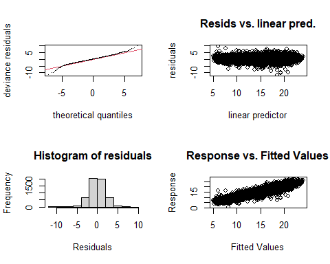

    #> 
    #> Method: GCV   Optimizer: magic
    #> Smoothing parameter selection converged after 10 iterations.
    #> The RMS GCV score gradient at convergence was 6.354412e-06 .
    #> The Hessian was positive definite.
    #> Model rank =  54 / 54 
    #> 
    #> Basis dimension (k) checking results. Low p-value (k-index<1) may
    #> indicate that k is too low, especially if edf is close to k'.
    #> 
    #>              k'  edf k-index p-value
    #> s(yearf)   28.0 23.0      NA      NA
    #> s(station) 17.0 15.9      NA      NA
    par(oldpar)

Residuals are heavy tailed, but otherwise not bad.

``` r
plot(lmer_t1)
```

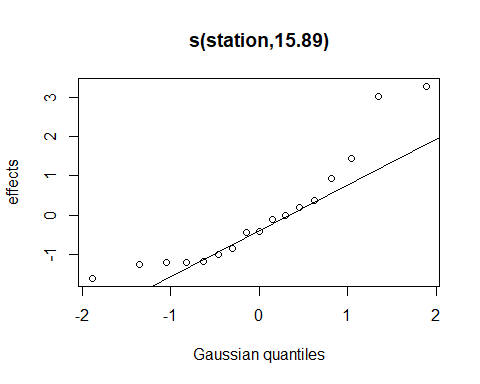

So, year to year variation in temperature is close to normally
distributed, suggesting the use of a random Year term won’t distort the
model all that much, but as we treat year to year variation as random,
we may hide trends.

``` r
summary(lmer_t1)
#> 
#> Family: gaussian 
#> Link function: identity 
#> 
#> Formula:
#> temperature ~ poly(year, 2) + month + s(yearf, bs = "re") + s(station, 
#>     bs = "re")
#> 
#> Parametric coefficients:
#>                Estimate Std. Error t value Pr(>|t|)    
#> (Intercept)      7.4546     0.3662  20.358  < 2e-16 ***
#> poly(year, 2)1  30.0857     6.8108   4.417 1.02e-05 ***
#> poly(year, 2)2  -3.2114     6.8653  -0.468     0.64    
#> monthMay         4.0978     0.1114  36.775  < 2e-16 ***
#> monthJun         8.5030     0.1091  77.916  < 2e-16 ***
#> monthJul        11.4525     0.1026 111.659  < 2e-16 ***
#> monthAug        11.7313     0.1038 112.977  < 2e-16 ***
#> monthSep         9.5121     0.1042  91.297  < 2e-16 ***
#> monthOct         5.5147     0.1135  48.592  < 2e-16 ***
#> ---
#> Signif. codes:  0 '***' 0.001 '**' 0.01 '*' 0.05 '.' 0.1 ' ' 1
#> 
#> Approximate significance of smooth terms:
#>              edf Ref.df      F p-value    
#> s(yearf)   23.05     25  29.39  <2e-16 ***
#> s(station) 15.89     16 211.54  <2e-16 ***
#> ---
#> Signif. codes:  0 '***' 0.001 '**' 0.01 '*' 0.05 '.' 0.1 ' ' 1
#> 
#> R-sq.(adj) =   0.82   Deviance explained = 82.1%
#> GCV = 3.7672  Scale est. = 3.7352    n = 5644
```

The non-linear term in the polynomial term is deemed not significant. We
chose not to further explore that term via analysis of AIC, ecause tere
are other questions of model form that may hav a larger impact on
results.

First, lets drop the idea that year to year variation is in part random.
This has the effect of treating each observation as independent, rather
than assuming that measurements collected within one year are
correlated.

``` r
lmer_t2 <- gam(temperature ~ poly(year,2) + month  + 
                 s(station, bs = 're'), 
               data = trend_data)

summary(lmer_t2)
#> 
#> Family: gaussian 
#> Link function: identity 
#> 
#> Formula:
#> temperature ~ poly(year, 2) + month + s(station, bs = "re")
#> 
#> Parametric coefficients:
#>                Estimate Std. Error t value Pr(>|t|)    
#> (Intercept)      7.4711     0.3738  19.987   <2e-16 ***
#> poly(year, 2)1  30.9672     2.0612  15.024   <2e-16 ***
#> poly(year, 2)2  -2.0350     2.0698  -0.983    0.326    
#> monthMay         4.0645     0.1147  35.445   <2e-16 ***
#> monthJun         8.4762     0.1124  75.431   <2e-16 ***
#> monthJul        11.4451     0.1055 108.467   <2e-16 ***
#> monthAug        11.7123     0.1068 109.633   <2e-16 ***
#> monthSep         9.4754     0.1072  88.403   <2e-16 ***
#> monthOct         5.5026     0.1168  47.099   <2e-16 ***
#> ---
#> Signif. codes:  0 '***' 0.001 '**' 0.01 '*' 0.05 '.' 0.1 ' ' 1
#> 
#> Approximate significance of smooth terms:
#>             edf Ref.df     F p-value    
#> s(station) 15.9     16 168.4  <2e-16 ***
#> ---
#> Signif. codes:  0 '***' 0.001 '**' 0.01 '*' 0.05 '.' 0.1 ' ' 1
#> 
#> R-sq.(adj) =  0.808   Deviance explained = 80.9%
#> GCV = 3.9961  Scale est. = 3.9785    n = 5644
```

The non-linear term is still not significant.

## Hierarchical GAM Models

``` r
lmer_t3 <- gam(temperature ~ s(year, k = 4) + month  + s(yearf, bs = 're') +
                 s(station, bs = 're'), 
               data = trend_data)

summary(lmer_t3)
#> 
#> Family: gaussian 
#> Link function: identity 
#> 
#> Formula:
#> temperature ~ s(year, k = 4) + month + s(yearf, bs = "re") + 
#>     s(station, bs = "re")
#> 
#> Parametric coefficients:
#>             Estimate Std. Error t value Pr(>|t|)    
#> (Intercept)   7.4482     0.3648   20.42   <2e-16 ***
#> monthMay      4.0968     0.1114   36.77   <2e-16 ***
#> monthJun      8.5018     0.1091   77.92   <2e-16 ***
#> monthJul     11.4516     0.1026  111.67   <2e-16 ***
#> monthAug     11.7304     0.1038  112.99   <2e-16 ***
#> monthSep      9.5112     0.1042   91.30   <2e-16 ***
#> monthOct      5.5136     0.1135   48.59   <2e-16 ***
#> ---
#> Signif. codes:  0 '***' 0.001 '**' 0.01 '*' 0.05 '.' 0.1 ' ' 1
#> 
#> Approximate significance of smooth terms:
#>              edf Ref.df      F  p-value    
#> s(year)     1.00      1  19.94 8.22e-06 ***
#> s(yearf)   23.89     26  30.64  < 2e-16 ***
#> s(station) 15.89     16 212.49  < 2e-16 ***
#> ---
#> Signif. codes:  0 '***' 0.001 '**' 0.01 '*' 0.05 '.' 0.1 ' ' 1
#> 
#> R-sq.(adj) =   0.82   Deviance explained = 82.1%
#> GCV = 3.7671  Scale est. = 3.7352    n = 5644
```

Note that the effective degrees of freedom assigned to the GAM smoother
for the Year term is 1, suggesting a linear relationship (i.e., no
acceleration of warming).

``` r
lmer_t4 <- gam(temperature ~ s(year, k = 4) + month  + 
                 s(station, bs = 're'), 
               data = trend_data)

summary(lmer_t4)
#> 
#> Family: gaussian 
#> Link function: identity 
#> 
#> Formula:
#> temperature ~ s(year, k = 4) + month + s(station, bs = "re")
#> 
#> Parametric coefficients:
#>             Estimate Std. Error t value Pr(>|t|)    
#> (Intercept)   7.4747     0.3784   19.76   <2e-16 ***
#> monthMay      4.0608     0.1144   35.49   <2e-16 ***
#> monthJun      8.4709     0.1121   75.55   <2e-16 ***
#> monthJul     11.4351     0.1053  108.60   <2e-16 ***
#> monthAug     11.6973     0.1066  109.70   <2e-16 ***
#> monthSep      9.4584     0.1070   88.40   <2e-16 ***
#> monthOct      5.4969     0.1166   47.16   <2e-16 ***
#> ---
#> Signif. codes:  0 '***' 0.001 '**' 0.01 '*' 0.05 '.' 0.1 ' ' 1
#> 
#> Approximate significance of smooth terms:
#>               edf Ref.df      F p-value    
#> s(year)     2.948  2.998  83.41  <2e-16 ***
#> s(station) 15.903 16.000 168.32  <2e-16 ***
#> ---
#> Signif. codes:  0 '***' 0.001 '**' 0.01 '*' 0.05 '.' 0.1 ' ' 1
#> 
#> R-sq.(adj) =  0.809   Deviance explained =   81%
#> GCV = 3.9807  Scale est. = 3.9625    n = 5644
```

If we granta bit morefreedom to fit every wiggle between yeas, but not
fitting a random effects term for the year, the effective degrees of
freedom suggests a non-linear fit. We plot the GAM to assess its shape
informally.

``` r
plot(lmer_t4)
```

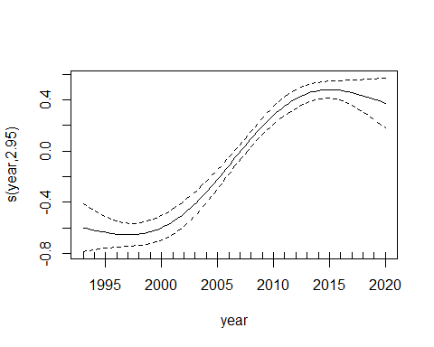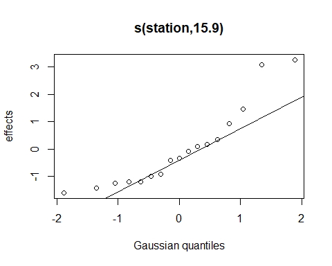

So, a GAM fit suggests rate of temperature increase has either not
changed (if we treat year to year variation as partially random) or
SLOWED in recent years, not accelerated.

## Modelling Trends within Sites

Another approach is to look at temperature changes within each site:

``` r
lmer_t5 <- gam(temperature ~ s(year, k = 4, by = station) + month  + s(yearf, bs = 're') +
                 s(station, bs = 're'), 
               data = trend_data)

summary(lmer_t5)
#> 
#> Family: gaussian 
#> Link function: identity 
#> 
#> Formula:
#> temperature ~ s(year, k = 4, by = station) + month + s(yearf, 
#>     bs = "re") + s(station, bs = "re")
#> 
#> Parametric coefficients:
#>             Estimate Std. Error t value Pr(>|t|)    
#> (Intercept)   7.4912     0.3471   21.58   <2e-16 ***
#> monthMay      4.1016     0.1109   36.98   <2e-16 ***
#> monthJun      8.4734     0.1087   77.92   <2e-16 ***
#> monthJul     11.4315     0.1022  111.89   <2e-16 ***
#> monthAug     11.7170     0.1034  113.33   <2e-16 ***
#> monthSep      9.5028     0.1037   91.60   <2e-16 ***
#> monthOct      5.5123     0.1130   48.80   <2e-16 ***
#> ---
#> Signif. codes:  0 '***' 0.001 '**' 0.01 '*' 0.05 '.' 0.1 ' ' 1
#> 
#> Approximate significance of smooth terms:
#>                         edf Ref.df       F  p-value    
#> s(year):stationP5BSD  1.000  1.000   5.928  0.01493 *  
#> s(year):stationP6FGG  1.000  1.000   4.981  0.02567 *  
#> s(year):stationSMT50  1.000  1.000   5.597  0.01803 *  
#> s(year):stationBMR02  1.000  1.000  18.904 1.42e-05 ***
#> s(year):stationP7CBI  1.000  1.000   2.291  0.13022    
#> s(year):stationEEB18  1.765  2.120   1.945  0.13257    
#> s(year):stationOBY35  1.000  1.000  15.619 7.85e-05 ***
#> s(year):stationKVL84  2.579  2.699   1.207  0.27469    
#> s(year):stationPYC43  1.000  1.000   5.054  0.02461 *  
#> s(year):stationPKT42  1.000  1.000  27.593 3.26e-07 ***
#> s(year):stationHR2    1.723  2.075  12.471 3.72e-06 ***
#> s(year):stationCMS1   1.000  1.000   0.083  0.77323    
#> s(year):stationRRC46  1.000  1.000   8.741  0.00312 ** 
#> s(year):stationSTR54  1.491  1.800   3.366  0.02524 *  
#> s(year):stationRRY47  1.852  2.221   6.401  0.00108 ** 
#> s(year):stationNMM79  2.337  2.684   3.445  0.05325 .  
#> s(year):stationPRV70  1.000  1.000  27.237 3.97e-07 ***
#> s(yearf)             23.920 26.000  19.010  < 2e-16 ***
#> s(station)           15.122 16.000 205.097  < 2e-16 ***
#> ---
#> Signif. codes:  0 '***' 0.001 '**' 0.01 '*' 0.05 '.' 0.1 ' ' 1
#> 
#> R-sq.(adj) =  0.822   Deviance explained = 82.4%
#> GCV = 3.7423  Scale est. = 3.6967    n = 5644
```

Note that the effective degrees of freedom for statistically significant
GAM fits are usually 1, and always under 2. Looking at the fits, these
are linear or barely curved fits, for the most part. Large but
non-significant curves at a few sites help obscure the larger patterns,
but overall, we again see no real evidence for any acceleration of
warming.

``` r
plot(lmer_t5, se = FALSE)
```

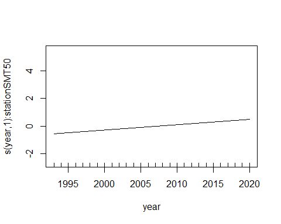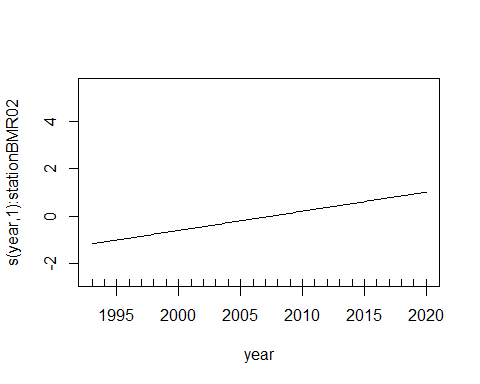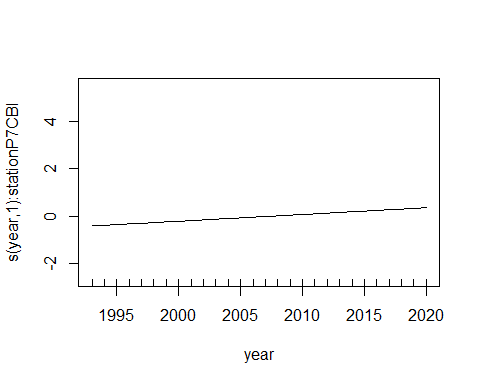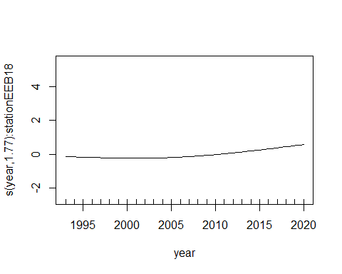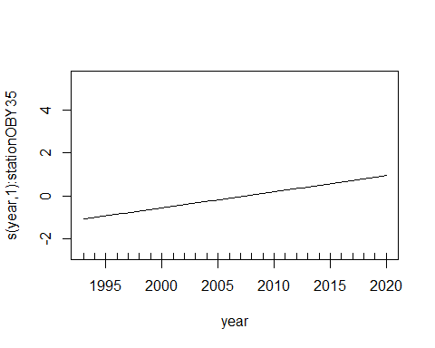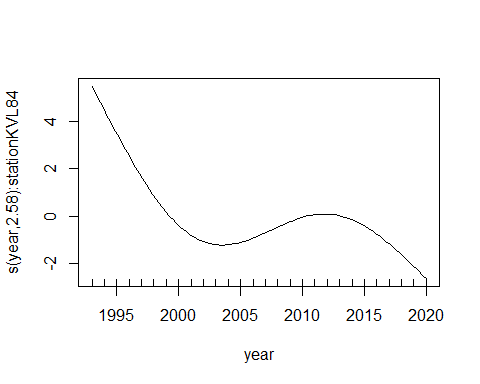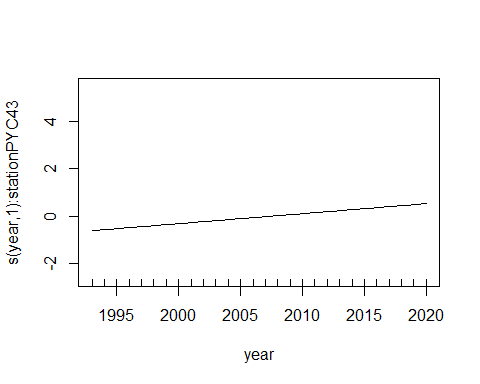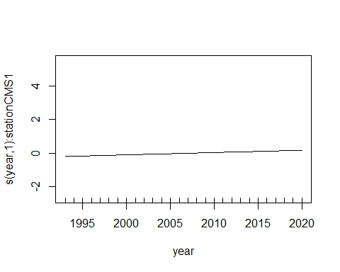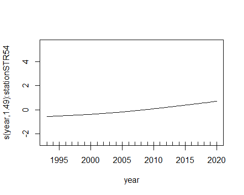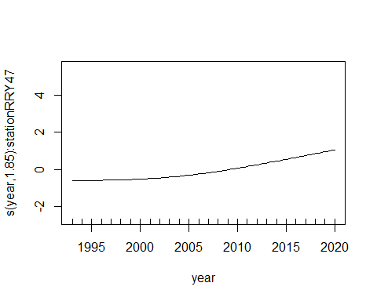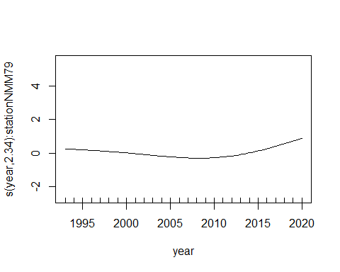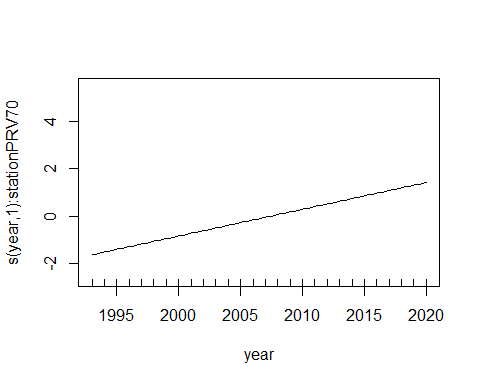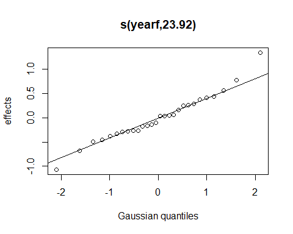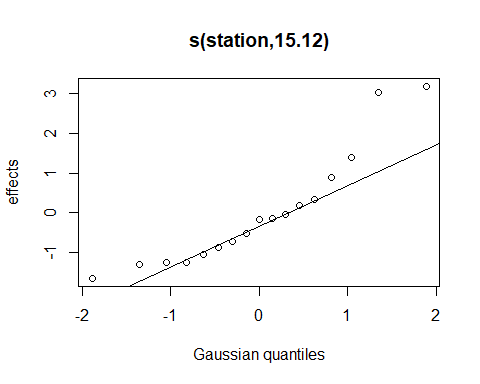

While a FEW sites show acceleration of warming, It is by no means a
universal pattern. While most sites show little evidence for a change in
rate of warming, some show and increase, and some show a decrease.
Claiming any large-scale pattern here appears to be a stretch.

``` r
lmer_t6 <- gam(temperature ~ s(year, k = 4, by = station) + month  + 
                 s(station, bs = 're'), 
               data = trend_data)

summary(lmer_t6)
#> 
#> Family: gaussian 
#> Link function: identity 
#> 
#> Formula:
#> temperature ~ s(year, k = 4, by = station) + month + s(station, 
#>     bs = "re")
#> 
#> Parametric coefficients:
#>             Estimate Std. Error t value Pr(>|t|)    
#> (Intercept)   7.5014     0.6478   11.58   <2e-16 ***
#> monthMay      4.0688     0.1139   35.73   <2e-16 ***
#> monthJun      8.4473     0.1117   75.65   <2e-16 ***
#> monthJul     11.4223     0.1049  108.90   <2e-16 ***
#> monthAug     11.6950     0.1062  110.17   <2e-16 ***
#> monthSep      9.4611     0.1065   88.81   <2e-16 ***
#> monthOct      5.4964     0.1160   47.39   <2e-16 ***
#> ---
#> Signif. codes:  0 '***' 0.001 '**' 0.01 '*' 0.05 '.' 0.1 ' ' 1
#> 
#> Approximate significance of smooth terms:
#>                         edf Ref.df       F  p-value    
#> s(year):stationP5BSD  1.000  1.000   8.856 0.002933 ** 
#> s(year):stationP6FGG  1.000  1.000   7.373 0.006643 ** 
#> s(year):stationSMT50  1.000  1.000  19.753 9.08e-06 ***
#> s(year):stationBMR02  1.000  1.000  25.367 6.66e-07 ***
#> s(year):stationP7CBI  1.443  1.739   2.920 0.103382    
#> s(year):stationEEB18  1.911  2.276   2.267 0.077778 .  
#> s(year):stationOBY35  1.000  1.000  24.395 1.12e-06 ***
#> s(year):stationKVL84  2.982  2.989   4.669 0.003460 ** 
#> s(year):stationPYC43  1.000  1.000   8.434 0.003698 ** 
#> s(year):stationPKT42  2.753  2.955  20.833  < 2e-16 ***
#> s(year):stationHR2    2.562  2.853  18.022  < 2e-16 ***
#> s(year):stationCMS1   2.145  2.271   1.093 0.200712    
#> s(year):stationRRC46  1.000  1.000  17.172 3.48e-05 ***
#> s(year):stationSTR54  1.000  1.000  12.146 0.000496 ***
#> s(year):stationRRY47  2.816  2.973   9.167 4.44e-06 ***
#> s(year):stationNMM79  1.848  2.216   1.854 0.143045    
#> s(year):stationPRV70  1.000  1.000  34.159  < 2e-16 ***
#> s(station)           14.723 16.000 164.368  < 2e-16 ***
#> ---
#> Signif. codes:  0 '***' 0.001 '**' 0.01 '*' 0.05 '.' 0.1 ' ' 1
#> 
#> R-sq.(adj) =  0.811   Deviance explained = 81.2%
#> GCV = 3.9588  Scale est. = 3.9243    n = 5644
```

If we do NOT treat years as partially a random factor, we get more
apparently significnat non-linear (EDF &gt; 1) trends. But a higher
proportion of sites now suggest a decrease in warming.

``` r
plot(lmer_t6, se = FALSE)
```

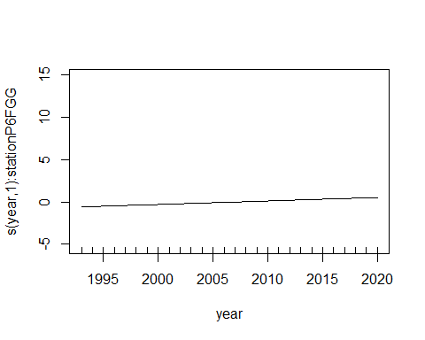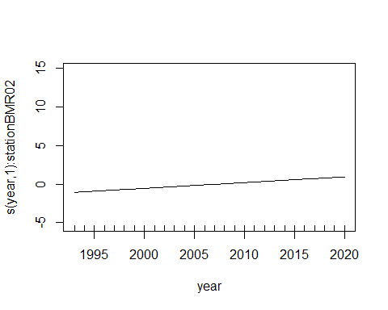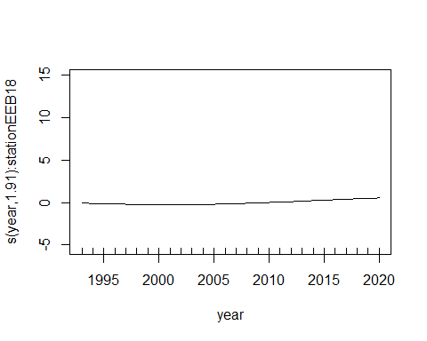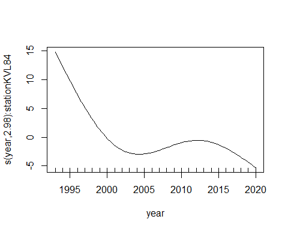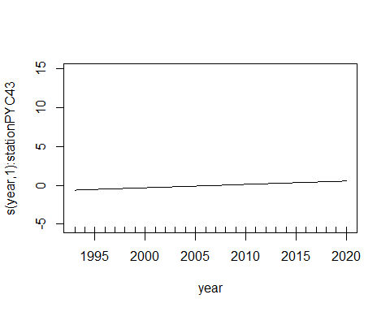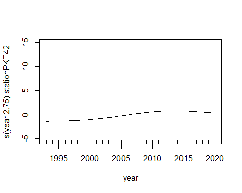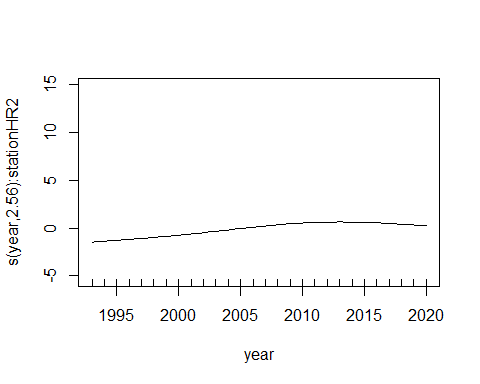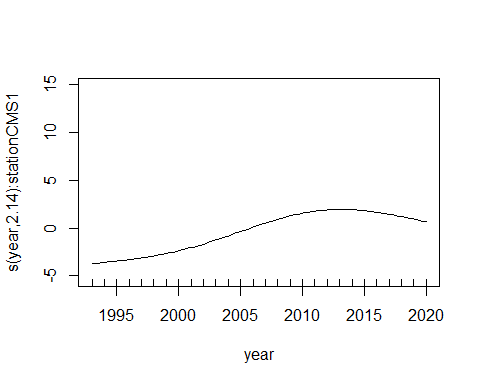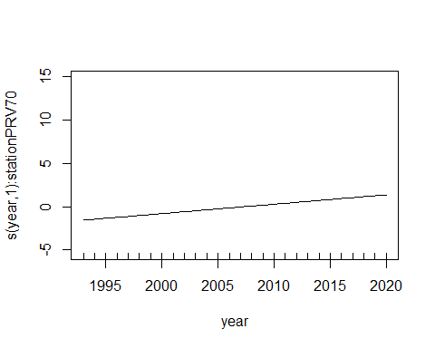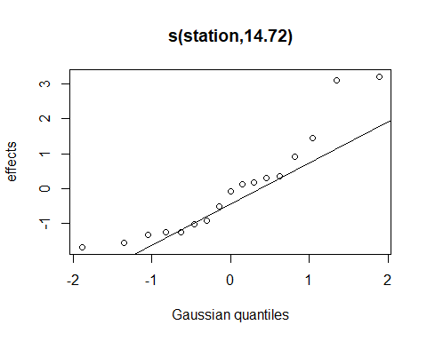

# Analysis of Salinity Data

Our reviewer asked whether the number of “high salinity excursions” had
increased lately. We suspect this may reflect changes in monitoring
methods, rather than real changes in conditions on the water.

If that’s the case, we might expect variability to change, but not means
and medians.

``` r
ggplot(trend_data, aes(dt, salinity)) + 
  geom_point()
#> Warning: Removed 67 rows containing missing values (geom_point).
```


``` r
ann_means <- trend_data %>%
  select(station, dt, year, yearf, month, salinity) %>%
  group_by(year) %>%
  summarize(across(.cols = salinity, 
                   .fns = c(mean = mean, median = median, p90 = quantile), 
                   na.rm = TRUE,
                   probs = .9,
                   .names = "sal_{.fn}"),
            .groups = 'drop') %>%
  mutate(midyear = ISOdate(year, 6, 15))

ann_means
#> # A tibble: 28 x 5
#>     year sal_mean sal_median sal_p90 midyear            
#>    <dbl>    <dbl>      <dbl>   <dbl> <dttm>             
#>  1  1993     28.6       30.0    31.8 1993-06-15 12:00:00
#>  2  1994     27.9       29.9    32.2 1994-06-15 12:00:00
#>  3  1995     26.8       30      31.7 1995-06-15 12:00:00
#>  4  1996     25.4       28.2    30.8 1996-06-15 12:00:00
#>  5  1997     26.8       29.6    31.5 1997-06-15 12:00:00
#>  6  1998     22.6       26.9    30.8 1998-06-15 12:00:00
#>  7  1999     26.5       29.6    31.9 1999-06-15 12:00:00
#>  8  2000     26.6       28.9    31.3 2000-06-15 12:00:00
#>  9  2001     27.5       29.9    31.3 2001-06-15 12:00:00
#> 10  2002     28.3       29.9    31.7 2002-06-15 12:00:00
#> # ... with 18 more rows
```

``` r
ggplot(trend_data, aes(dt, salinity)) + 
  geom_point(color = 'gray50') +
  geom_line(data = ann_means, mapping = aes(midyear, sal_median),
             size = 2, color = 'orange') +
  geom_line(data = ann_means, mapping = aes(midyear, sal_mean),
             size = 2, color = 'yellow') +
  geom_line(data = ann_means, mapping = aes(midyear, sal_p90),
             size = 2, color = 'red') +
  ylim(20, 35)
#> Warning: Removed 889 rows containing missing values (geom_point).
```

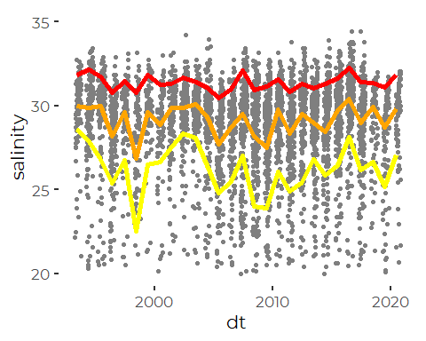
So, I see no evidence that statistical summaries – even the 90th
percentile – show a change in the last few years. This tends to support
the idea that the visually obvious change in outliers reflects better
data quality, not anything going on in the ocean.

# Analysis of Secchi Depths

The key question here was whether there are differences between inshore
and offshore sites.

## Incorporate Regionalization

We assigned nutrient monitoring sites to regions when we chose to
combine maps of locatiosn of FOCB and DEP nitrogen samples. We reuse
that classification here, largely for convenience.

``` r
sibfldnm <- 'Derived_Data'
parent   <- dirname(getwd())
sibling  <- file.path(parent,sibfldnm)
```

``` r
fn = 'combined_locations.csv'
locations <- read_csv(file.path(sibling, fn))
#> 
#> -- Column specification --------------------------------------------------------
#> cols(
#>   site = col_character(),
#>   site_name = col_character(),
#>   short_name = col_character(),
#>   latitude = col_double(),
#>   longitude = col_double(),
#>   source = col_character(),
#>   region = col_character()
#> )
```

``` r
secchi_data <- trend_data %>%
  select(-temperature, -salinity) %>%
  left_join(locations, by = c('station' = 'site'))
```

But there are too many regions, so we further simplify.

``` r
sites_df <- secchi_data %>%
  group_by(station) %>%
  summarize(station = first(station),
            station_name = first(station_name),
            .groups = 'drop') %>%
  left_join(locations, by = c('station' = 'site')) %>%
  select(-latitude, -longitude, -source) %>%
  relocate(region, .after = station_name) %>%
  mutate(mod_region = recode(region, 
                             'Fore River' = 'Embayments',
                             'Harraseeket' = 'Embayments',
                             'New Meadows' = 'Embayments',
                             'Presumpscot Estuary' = 'Embayments',
                             'Royal River Estuary' = 'Embayments'
                             ))

xtabs(~region + mod_region, data = sites_df)
#>                      mod_region
#> region                Embayments Inner Bay Outer Bay
#>   Fore River                   2         0         0
#>   Harraseeket                  1         0         0
#>   Inner Bay                    0         7         0
#>   New Meadows                  1         0         0
#>   Outer Bay                    0         0         3
#>   Presumpscot Estuary          1         0         0
#>   Royal River Estuary          2         0         0
```

``` r
tmp <- sites_df %>%
  group_by(region) %>%
  summarize(mod_region = first(mod_region))

secchi_data <- secchi_data %>%
  left_join(tmp, by = 'region')
```

``` r
ggplot(secchi_data, aes(dt, secchi_2)) + 
  geom_point(aes(color = mod_region), alpha = 0.25)
#> Warning: Removed 482 rows containing missing values (geom_point).
```

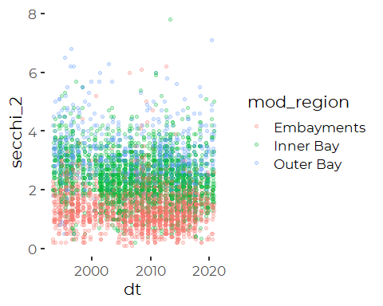

### Add Seasonal Factor

``` r
secchi_data <- secchi_data %>%
  mutate(season_3 =  fct_collapse(month, 
                                 Spring = c('Apr', 'May'), 
                                 Summer = c('Jun','Jul', 'Aug'),
                                 Fall   =  c('Sep', 'Oct'))) %>%
  relocate(season_3, .after = month)
```

## Modeling by Region

Our core question is whether the seasonal changes in Secchi Depth are
more pronounced in some regions compared to others.

``` r
lm_s1 <- lm(secchi_2 ~ season_3  * mod_region * year,
               data = secchi_data)
summary(lm_s1)
#> 
#> Call:
#> lm(formula = secchi_2 ~ season_3 * mod_region * year, data = secchi_data)
#> 
#> Residuals:
#>     Min      1Q  Median      3Q     Max 
#> -2.8315 -0.4494 -0.0638  0.3798  5.3200 
#> 
#> Coefficients:
#>                                          Estimate Std. Error t value Pr(>|t|)
#> (Intercept)                              3.802474   9.840013   0.386    0.699
#> season_3Summer                          11.581797  11.644836   0.995    0.320
#> season_3Fall                            10.866173  12.999883   0.836    0.403
#> mod_regionInner Bay                      8.689458  13.540912   0.642    0.521
#> mod_regionOuter Bay                     18.191515  17.498101   1.040    0.299
#> year                                    -0.001112   0.004904  -0.227    0.821
#> season_3Summer:mod_regionInner Bay      17.079291  16.099810   1.061    0.289
#> season_3Fall:mod_regionInner Bay        26.799118  17.836533   1.502    0.133
#> season_3Summer:mod_regionOuter Bay      -6.362882  20.600906  -0.309    0.757
#> season_3Fall:mod_regionOuter Bay        14.700654  22.690263   0.648    0.517
#> season_3Summer:year                     -0.005915   0.005802  -1.019    0.308
#> season_3Fall:year                       -0.005434   0.006477  -0.839    0.402
#> mod_regionInner Bay:year                -0.003862   0.006748  -0.572    0.567
#> mod_regionOuter Bay:year                -0.008243   0.008723  -0.945    0.345
#> season_3Summer:mod_regionInner Bay:year -0.008481   0.008022  -1.057    0.290
#> season_3Fall:mod_regionInner Bay:year   -0.013365   0.008887  -1.504    0.133
#> season_3Summer:mod_regionOuter Bay:year  0.003223   0.010267   0.314    0.754
#> season_3Fall:mod_regionOuter Bay:year   -0.007386   0.011309  -0.653    0.514
#> 
#> Residual standard error: 0.7314 on 5156 degrees of freedom
#>   (482 observations deleted due to missingness)
#> Multiple R-squared:  0.4283, Adjusted R-squared:  0.4264 
#> F-statistic: 227.2 on 17 and 5156 DF,  p-value: < 2.2e-16
```

``` r
lm_s2 <- step(lm_s1)
#> Start:  AIC=-3218.77
#> secchi_2 ~ season_3 * mod_region * year
#> 
#>                            Df Sum of Sq    RSS     AIC
#> - season_3:mod_region:year  4    1.8844 2760.1 -3223.2
#> <none>                                  2758.2 -3218.8
#> 
#> Step:  AIC=-3223.23
#> secchi_2 ~ season_3 + mod_region + year + season_3:mod_region + 
#>     season_3:year + mod_region:year
#> 
#>                       Df Sum of Sq    RSS     AIC
#> <none>                             2760.1 -3223.2
#> - season_3:mod_region  4    5.9202 2766.0 -3220.1
#> - season_3:year        2    5.5310 2765.6 -3216.9
#> - mod_region:year      2    8.2508 2768.3 -3211.8
summary(lm_s2)
#> 
#> Call:
#> lm(formula = secchi_2 ~ season_3 + mod_region + year + season_3:mod_region + 
#>     season_3:year + mod_region:year, data = secchi_data)
#> 
#> Residuals:
#>     Min      1Q  Median      3Q     Max 
#> -2.7978 -0.4488 -0.0658  0.3768  5.3484 
#> 
#> Coefficients:
#>                                     Estimate Std. Error t value Pr(>|t|)    
#> (Intercept)                        -3.367604   7.054004  -0.477 0.633095    
#> season_3Summer                     17.685105   7.268266   2.433 0.015000 *  
#> season_3Fall                       25.363603   8.027920   3.159 0.001590 ** 
#> mod_regionInner Bay                24.874937   6.191690   4.017 5.97e-05 ***
#> mod_regionOuter Bay                19.048900   7.775989   2.450 0.014330 *  
#> year                                0.002461   0.003515   0.700 0.483866    
#> season_3Summer:mod_regionInner Bay  0.061144   0.057470   1.064 0.287412    
#> season_3Fall:mod_regionInner Bay   -0.025530   0.063657  -0.401 0.688396    
#> season_3Summer:mod_regionOuter Bay  0.103903   0.079950   1.300 0.193796    
#> season_3Fall:mod_regionOuter Bay   -0.126071   0.088276  -1.428 0.153310    
#> season_3Summer:year                -0.008957   0.003621  -2.473 0.013423 *  
#> season_3Fall:year                  -0.012657   0.004000  -3.164 0.001563 ** 
#> mod_regionInner Bay:year           -0.011928   0.003085  -3.866 0.000112 ***
#> mod_regionOuter Bay:year           -0.008669   0.003876  -2.236 0.025371 *  
#> ---
#> Signif. codes:  0 '***' 0.001 '**' 0.01 '*' 0.05 '.' 0.1 ' ' 1
#> 
#> Residual standard error: 0.7314 on 5160 degrees of freedom
#>   (482 observations deleted due to missingness)
#> Multiple R-squared:  0.4279, Adjusted R-squared:  0.4264 
#> F-statistic: 296.8 on 13 and 5160 DF,  p-value: < 2.2e-16
```

``` r
lm_s3 <- lm(secchi_2 ~ season_3  + mod_region +  year +  
              season_3:year +
              mod_region:year,
               data = secchi_data)
summary(lm_s3)
#> 
#> Call:
#> lm(formula = secchi_2 ~ season_3 + mod_region + year + season_3:year + 
#>     mod_region:year, data = secchi_data)
#> 
#> Residuals:
#>     Min      1Q  Median      3Q     Max 
#> -2.8585 -0.4530 -0.0729  0.3800  5.3386 
#> 
#> Coefficients:
#>                           Estimate Std. Error t value Pr(>|t|)    
#> (Intercept)              -3.077398   7.053163  -0.436 0.662627    
#> season_3Summer           17.895538   7.266418   2.463 0.013819 *  
#> season_3Fall             24.714118   8.022592   3.081 0.002077 ** 
#> mod_regionInner Bay      24.566181   6.184812   3.972 7.22e-05 ***
#> mod_regionOuter Bay      18.147210   7.764873   2.337 0.019473 *  
#> year                      0.002310   0.003515   0.657 0.511082    
#> season_3Summer:year      -0.009040   0.003621  -2.497 0.012569 *  
#> season_3Fall:year        -0.012348   0.003997  -3.089 0.002019 ** 
#> mod_regionInner Bay:year -0.011762   0.003081  -3.818 0.000136 ***
#> mod_regionOuter Bay:year -0.008211   0.003869  -2.122 0.033862 *  
#> ---
#> Signif. codes:  0 '***' 0.001 '**' 0.01 '*' 0.05 '.' 0.1 ' ' 1
#> 
#> Residual standard error: 0.7319 on 5164 degrees of freedom
#>   (482 observations deleted due to missingness)
#> Multiple R-squared:  0.4267, Adjusted R-squared:  0.4257 
#> F-statistic:   427 on 9 and 5164 DF,  p-value: < 2.2e-16
```

That is tricky to visualize. We will need a faceted graphic to show
different predictions by regions.

``` r
(emtrends<- emtrends(lm_s3, ~ season_3 + mod_region , var = 'year'))
#>  season_3 mod_region year.trend      SE   df lower.CL upper.CL
#>  Spring   Embayments    0.00231 0.00351 5164 -0.00458  0.00920
#>  Summer   Embayments   -0.00673 0.00260 5164 -0.01183 -0.00163
#>  Fall     Embayments   -0.01004 0.00314 5164 -0.01619 -0.00389
#>  Spring   Inner Bay    -0.00945 0.00344 5164 -0.01620 -0.00270
#>  Summer   Inner Bay    -0.01849 0.00255 5164 -0.02349 -0.01349
#>  Fall     Inner Bay    -0.02180 0.00304 5164 -0.02776 -0.01585
#>  Spring   Outer Bay    -0.00590 0.00420 5164 -0.01413  0.00233
#>  Summer   Outer Bay    -0.01494 0.00345 5164 -0.02170 -0.00818
#>  Fall     Outer Bay    -0.01825 0.00383 5164 -0.02575 -0.01075
#> 
#> Confidence level used: 0.95
```

SO that makes it clear what is going on. Secchi depths are declining
most of the time in all three regions, The change is small and probably
not statistically robust in the spring. Generally, the decline in water
clarity is stronger in each region as you get later in the year. The
strongest declines have been offshore.

But what I really want are the predictions, so I can make a graphic out
of these ideas.

``` r
(emms <- as_tibble(emmeans(lm_s3, 
                           ~ season_3 + mod_region + year, 
                           cov.keep = 'year')) %>%
  mutate(midyear = ISOdate(year, 6, 15)))
#> # A tibble: 252 x 9
#>    season_3 mod_region  year emmean     SE    df lower.CL upper.CL
#>    <fct>    <fct>      <dbl>  <dbl>  <dbl> <dbl>    <dbl>    <dbl>
#>  1 Spring   Embayments  1993   1.53 0.0548  5164     1.42     1.63
#>  2 Summer   Embayments  1993   1.41 0.0426  5164     1.32     1.49
#>  3 Fall     Embayments  1993   1.63 0.0510  5164     1.53     1.73
#>  4 Spring   Inner Bay   1993   2.65 0.0534  5164     2.55     2.76
#>  5 Summer   Inner Bay   1993   2.53 0.0419  5164     2.45     2.61
#>  6 Fall     Inner Bay   1993   2.75 0.0495  5164     2.66     2.85
#>  7 Spring   Outer Bay   1993   3.31 0.0656  5164     3.18     3.44
#>  8 Summer   Outer Bay   1993   3.19 0.0557  5164     3.08     3.30
#>  9 Fall     Outer Bay   1993   3.41 0.0614  5164     3.29     3.53
#> 10 Spring   Embayments  1994   1.53 0.0518  5164     1.43     1.63
#> # ... with 242 more rows, and 1 more variable: midyear <dttm>
```

``` r
dotcolors = scales::muted(cbep_colors2()[c(1,3,5)], l = 50)

ggplot(secchi_data, aes(dt, secchi_2, color = season_3)) +
  geom_point(aes(fill = season_3), shape = 21, alpha = 0.25, size = 2) +
  facet_wrap(~mod_region, nrow = 3) +
  geom_line(data = emms, mapping = aes(x = midyear,
                                   y = emmean), lwd = 1) +
  
  scale_fill_manual(values = dotcolors, name = '') +
  scale_color_manual(values = cbep_colors2()[c(1,3,5)], name = '') +
  
  # geom_linerange(data = emms, mapping = aes(x = midyear, 
  #                                           y = emmean,
  #                                           ymin = lower.CL, 
  #                                           ymax = upper.CL))
  
  theme_cbep(base_size = 12) +
  theme(legend.position = 'bottom',
        panel.grid.major.y = element_line(color = 'gray85')) +
  
  ylab('Secchi Depth (m)') +
  xlab('')
#> Warning: Removed 482 rows containing missing values (geom_point).
```

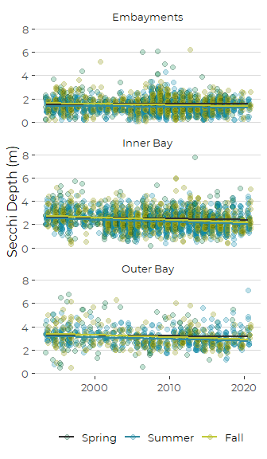

``` r
dotcolors = scales::muted(cbep_colors2()[c(1,3,5)], l = 50)

ggplot(secchi_data, aes(dt, secchi_2, color = mod_region)) +
  geom_point(aes(fill = mod_region), shape = 21, alpha = 0.25, size = 2) +
  facet_wrap(~season_3, nrow = 3) +
  geom_line(data = emms, mapping = aes(x = midyear,
                                   y = emmean), lwd = 1) +
  
  scale_fill_manual(values = dotcolors, name = '') +
  scale_color_manual(values = cbep_colors2()[c(1,2,5)], name = '') +
  
  guides(fill=guide_legend(ncol=2)) +
  
  theme_cbep(base_size = 12) +
  theme(legend.position = 'bottom',
        panel.grid.major.y = element_line(color = 'gray85')) +
  
  ylab('Secchi Depth (m)') +
  xlab('')
#> Warning: Removed 482 rows containing missing values (geom_point).
```

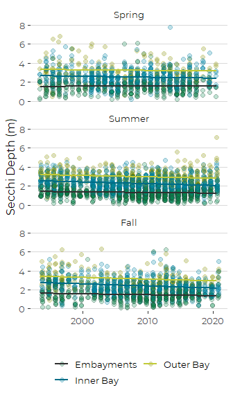

# Checking muted colors

``` r
scales::show_col(c("red",
                   scales::muted("red", l = 0),
                   scales::muted("red", l = 25), 
                   scales::muted("red", l = 50), 
                   scales::muted("red", l = 75),
                   scales::muted("red", l = 100)))
```

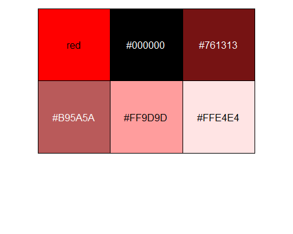

``` r
scales::show_col(c("red",
                   scales::muted("red", c = 0),
                   scales::muted("red", c = 25), 
                   scales::muted("red", c = 50), 
                   scales::muted("red", c = 75),
                   scales::muted("red", c = 100)))
```

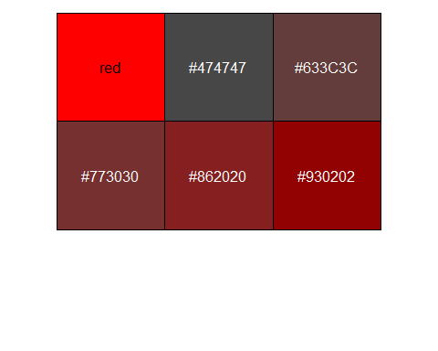
