Analysis of Surface Data from Friends of Casco Bay Monitoring
================
Curtis C. Bohlen, Casco Bay Estuary Partnership
3/03/2021

-   [Introduction](#introduction)
-   [Load Libraries](#load-libraries)
-   [Load Data](#load-data)
    -   [Establish Folder Reference](#establish-folder-reference)
    -   [Primary Data](#primary-data)
        -   [Remove 2020 only data](#remove-2020-only-data)
    -   [Add Station Names](#add-station-names)
    -   [Address Secchi Censored
        Values](#address-secchi-censored-values)
-   [Transform the Secchi and Chlorophyll A
    Data](#transform-the-secchi-and-chlorophyll-a-data)
-   [Recent Conditions](#recent-conditions)
    -   [Create Recent Data](#create-recent-data)
    -   [Summary Statistics](#summary-statistics)
    -   [Create Nested Tibble](#create-nested-tibble)
    -   [Linear Models](#linear-models)
        -   [Review Model Results](#review-model-results)
        -   [Generate Predictions](#generate-predictions)
    -   [Options for More Complex
        Models](#options-for-more-complex-models)
        -   [Hierarchical Models](#hierarchical-models)
        -   [Time Series Considerations](#time-series-considerations)
    -   [Hierarchical Models](#hierarchical-models-1)
        -   [Review Model Results](#review-model-results-1)
        -   [Generate Predictions](#generate-predictions-1)


# Introduction

This Notebook analyzes FOCB’s “Surface” data. These data are pulled from
long term monitoring locations around the Bay.

These are sites visited regularly by FOCB staff, either by boat or on
land. The focus is on warm season sampling (April through October), with
roughly monthly samples. Earlier data from some land-based sites was
collected by volunteers.

This reflects only a small portion of FOCB’s monitoring program, but the
surface data provides consistent sampling history with the deepest
historical record.

# Load Libraries

``` r
library(MASS)     # Here for the `boxcox()` function
library(tidyverse)
#> -- Attaching packages --------------------------------------- tidyverse 1.3.0 --
#> v ggplot2 3.3.3     v purrr   0.3.4
#> v tibble  3.0.5     v dplyr   1.0.3
#> v tidyr   1.1.2     v stringr 1.4.0
#> v readr   1.4.0     v forcats 0.5.0
#> -- Conflicts ------------------------------------------ tidyverse_conflicts() --
#> x dplyr::filter() masks stats::filter()
#> x dplyr::lag()    masks stats::lag()
#> x dplyr::select() masks MASS::select()
library(readxl)
#library(readr)

library(mgcv)     # For `gam()` and `gamm()` models
#> Loading required package: nlme
#> 
#> Attaching package: 'nlme'
#> The following object is masked from 'package:dplyr':
#> 
#>     collapse
#> This is mgcv 1.8-33. For overview type 'help("mgcv-package")'.
#library(maxLik)
library(lme4)    # For mixed effectws models
#> Loading required package: Matrix
#> 
#> Attaching package: 'Matrix'
#> The following objects are masked from 'package:tidyr':
#> 
#>     expand, pack, unpack
#> 
#> Attaching package: 'lme4'
#> The following object is masked from 'package:nlme':
#> 
#>     lmList
#library(nlme)   # probably only needed if we need to model autocorrelation

library(emmeans)

library(GGally)
#> Registered S3 method overwritten by 'GGally':
#>   method from   
#>   +.gg   ggplot2
#> 
#> Attaching package: 'GGally'
#> The following object is masked from 'package:emmeans':
#> 
#>     pigs
#library(zoo)
#library(lubridate)  # here, for the make_datetime() function

#library(broom)

library(CBEPgraphics)
load_cbep_fonts()
theme_set(theme_cbep())
```

# Load Data

## Establish Folder Reference

``` r
sibfldnm <- 'Original_Data'
parent   <- dirname(getwd())
sibling  <- file.path(parent,sibfldnm)

dir.create(file.path(getwd(), 'figures'), showWarnings = FALSE)
```

## Primary Data

We specify column names because FOCB data has a row of names, a row of
units, then the data. This approach is simpler than reading names from
the first row and correcting them to be R syntactic names.

``` r
fn    <- 'FOCB Surface All Current Sites With BSV Data.xlsx'
fpath <- file.path(sibling,fn)

mynames <- c('station', 'dt', 'time', 'sample_depth',
             'secchi', 'water_depth','temperature', 'salinity',
             'do', 'pctsat', 'pH', 'chl', 
             'month', 'year', 'fdom', 'bga', 
             'turbidity', 'blank', 'clouds', 'wndspd',
             'winddir'
             ) 

the_data <- read_excel(fpath, skip=2, col_names = mynames) %>%
  mutate(month = factor(month, levels = 1:12, labels = month.abb))

rm(mynames)
```

### Remove 2020 only data

``` r
the_data <- the_data %>%
select(-c(fdom:winddir))
```

## Add Station Names

``` r
fn    <- 'FOCB Monitoring Sites.xlsx'
fpath <- file.path(sibling,fn)
loc_data <- read_excel(fpath) %>%
  select(Station_ID, Station_Name) %>%
  rename(station = Station_ID,
         station_name = Station_Name)

the_data <- the_data %>%
  left_join(loc_data, by = 'station') %>%
  relocate(station_name, .after = station) %>%
  
  relocate(year, .after = dt) %>%
  relocate(month, .after = year)
```

Our data contains two stations that are not associated with locations
that were included in our spatial data. We can see that because when we
`left_join()` by `station`, no `station_name` value is carried over.

``` r
l <- the_data %>%
  group_by(station) %>%
  summarize(missing = sum(is.na(station_name))) %>%
  filter(missing > 0) %>%
  pull(station)
l
#> [1] "CMS3"  "P6CBI"
```

If we look at those records, on is represented by only a single
observation, and the other only by data from 2020. Neither matter for
the current analysis. They will get filtered out when we select data to
describe recent conditions, and trends.

``` r
the_data %>%
  filter(station %in% l)
#> # A tibble: 7 x 15
#>   station station_name dt                   year month time               
#>   <chr>   <chr>        <dttm>              <dbl> <fct> <dttm>             
#> 1 P6CBI   <NA>         2006-09-13 00:00:00  2006 Sep   1899-12-31 11:40:00
#> 2 CMS3    <NA>         2020-06-17 00:00:00  2020 Jun   1899-12-31 11:22:54
#> 3 CMS3    <NA>         2020-07-15 00:00:00  2020 Jul   1899-12-31 11:08:08
#> 4 CMS3    <NA>         2020-07-30 00:00:00  2020 Jul   1899-12-31 11:39:33
#> 5 CMS3    <NA>         2020-08-19 00:00:00  2020 Aug   1899-12-31 11:36:38
#> 6 CMS3    <NA>         2020-09-17 00:00:00  2020 Sep   1899-12-31 11:52:14
#> 7 CMS3    <NA>         2020-10-05 00:00:00  2020 Oct   1899-12-31 11:23:21
#> # ... with 9 more variables: sample_depth <dbl>, secchi <chr>,
#> #   water_depth <dbl>, temperature <dbl>, salinity <dbl>, do <dbl>,
#> #   pctsat <dbl>, pH <dbl>, chl <dbl>
```

## Address Secchi Censored Values

``` r
the_data <- the_data %>%
  mutate(secchi_2 = if_else(secchi == "BSV", water_depth, as.numeric(secchi)),
         bottom_flag = secchi == "BSV") %>%
  relocate(secchi_2, .after = secchi) %>%
  relocate(bottom_flag, .after = secchi_2)
#> Warning: Problem with `mutate()` input `secchi_2`.
#> i NAs introduced by coercion
#> i Input `secchi_2` is `if_else(secchi == "BSV", water_depth, as.numeric(secchi))`.
```

# Transform the Secchi and Chlorophyll A Data

We create a log plus one transformed version of the Chlorophyll data
here, to facilitate “parallel” construction of statistical models. That
transform regularizes variances and linearizes response fairly well. We
also develop a square root transform of the Secchi data, for similar
purposes, but the results are not as effective.

``` r
the_data <- the_data %>%
  mutate(sqrt_secchi = sqrt(secchi_2),
         log_chl = log(chl),
         log1_chl = log1p(chl)) %>%
  mutate(log_chl = if_else(is.infinite(log_chl) | is.nan(log_chl),
                           NA_real_, log_chl)) %>%
  relocate(sqrt_secchi, .after = secchi_2) %>%
  relocate(log_chl, log1_chl, .after = chl)
#> Warning: Problem with `mutate()` input `log_chl`.
#> i NaNs produced
#> i Input `log_chl` is `log(chl)`.
```

# Recent Conditions

In 2015, we presented marginal means and standard errors for sixteen
different regions of the Bay. This time, we have fewer monitoring
stations, and present results for each monitoring location individually.

As in 2015, we organize results by mean or median temperature, as
offshore sites or sites strongly influenced by offshore waters do not
get as warm in summer months as inshore sites.

## Create Recent Data

We filter to the last five FULL years of data, 2015 through 2019.

``` r
recent_data <- the_data %>%
  filter(year > 2014 & year < 2020) %>%
  mutate(station = fct_reorder(station, temperature, mean, na.rm = TRUE),
         station_name = fct_reorder(station_name, temperature, mean, na.rm = TRUE))
```

## Summary Statistics

We need an exported data table for GIS, containing useful summary
statistics, especially medians and means. We should probably be mapping
median values, as they are less affected by our heavy-tailed
distributions.

We need a table of means and medians, with sites on rows and parameters
on columns.

``` r
sum_data <- recent_data %>%
  select(-dt, -year, -time, -sample_depth, 
         -secchi, - bottom_flag) %>%
  relocate(water_depth, .after = month) %>%
  group_by(station) %>%
  summarize(across(c(secchi_2:log1_chl), list(mn =  ~ mean(.x, na.rm = TRUE),
                                         med = ~ median(.x, na.rm = TRUE))))

sibfldnm <- 'Derived_Data'
parent   <- dirname(getwd())
sibling  <- file.path(parent,sibfldnm)

fn    <- 'station_summary.csv'
fpath <- file.path(sibling,fn)

fpath = 
write_csv(sum_data, fpath)
```

## Create Nested Tibble

To run parallel analyses on nested tibbles, we will need to reorganize
the data so that we can analyze along parameters. We add a list of
labels and measurement units to simplify later labeling of plots.

``` r
units <- tibble(parameter = c('secchi_2', 'sqrt_secchi', 'temperature', 
                              'salinity', 'do',
                              'pctsat', 'pH', 
                              'chl', 'log_chl', 'log1_chl'),
                label = c("Secchi Depth", "Sqt Secchi", "Temperature",
                         "Salinity", "Dissolved Oxygen",
                         "Percent Saturation", "pH",
                         "Chlorophyll A", "Log Chlorophyll A", "Log Chlorophyll A plus 1"),
                units = c('m', '', paste0("\U00B0", "C"),
                          'PSU', 'mg/l',
                          '', '',
                          'mg/l', '', ''))

nested_data <- recent_data %>%
  select(-dt, -time, -sample_depth, 
         -secchi, - bottom_flag) %>%
  mutate(year_f = factor(year)) %>%
  relocate(water_depth, .after = month) %>%
  pivot_longer(c(secchi_2:log1_chl), names_to = 'parameter', values_to = 'value') %>%
  filter(! is.na(value)) %>%
  group_by(parameter) %>%
  nest() %>%
  left_join(units, by = 'parameter')
```

## Linear Models

``` r
nested_data <- nested_data %>%
  mutate(lms = map(data, function(df) lm(value ~ station, data = df)))
```

### Review Model Results

#### ANOVA

``` r
for (p in nested_data$parameter) {
  cat(p)
  cat('\n')
  print(anova(nested_data$lms[nested_data$parameter == p][[1]]))
  cat('\n\n')
}
#> secchi_2
#> Analysis of Variance Table
#> 
#> Response: value
#>             Df Sum Sq Mean Sq F value    Pr(>F)    
#> station     22 420.11 19.0960  62.888 < 2.2e-16 ***
#> Residuals 1065 323.39  0.3037                      
#> ---
#> Signif. codes:  0 '***' 0.001 '**' 0.01 '*' 0.05 '.' 0.1 ' ' 1
#> 
#> 
#> sqrt_secchi
#> Analysis of Variance Table
#> 
#> Response: value
#>             Df Sum Sq Mean Sq F value    Pr(>F)    
#> station     22 56.045  2.5475  64.995 < 2.2e-16 ***
#> Residuals 1065 41.743  0.0392                      
#> ---
#> Signif. codes:  0 '***' 0.001 '**' 0.01 '*' 0.05 '.' 0.1 ' ' 1
#> 
#> 
#> temperature
#> Analysis of Variance Table
#> 
#> Response: value
#>             Df  Sum Sq Mean Sq F value    Pr(>F)    
#> station     22  3428.3 155.831  9.8645 < 2.2e-16 ***
#> Residuals 1172 18514.3  15.797                      
#> ---
#> Signif. codes:  0 '***' 0.001 '**' 0.01 '*' 0.05 '.' 0.1 ' ' 1
#> 
#> 
#> salinity
#> Analysis of Variance Table
#> 
#> Response: value
#>             Df Sum Sq Mean Sq F value    Pr(>F)    
#> station     22  53237 2419.86  256.87 < 2.2e-16 ***
#> Residuals 1147  10806    9.42                      
#> ---
#> Signif. codes:  0 '***' 0.001 '**' 0.01 '*' 0.05 '.' 0.1 ' ' 1
#> 
#> 
#> do
#> Analysis of Variance Table
#> 
#> Response: value
#>             Df  Sum Sq Mean Sq F value    Pr(>F)    
#> station     22  515.42 23.4280  13.926 < 2.2e-16 ***
#> Residuals 1157 1946.44  1.6823                      
#> ---
#> Signif. codes:  0 '***' 0.001 '**' 0.01 '*' 0.05 '.' 0.1 ' ' 1
#> 
#> 
#> pctsat
#> Analysis of Variance Table
#> 
#> Response: value
#>             Df Sum Sq Mean Sq F value    Pr(>F)    
#> station     22  66006 3000.27   19.19 < 2.2e-16 ***
#> Residuals 1142 178550  156.35                      
#> ---
#> Signif. codes:  0 '***' 0.001 '**' 0.01 '*' 0.05 '.' 0.1 ' ' 1
#> 
#> 
#> pH
#> Analysis of Variance Table
#> 
#> Response: value
#>             Df Sum Sq Mean Sq F value    Pr(>F)    
#> station     22 32.094 1.45882  29.493 < 2.2e-16 ***
#> Residuals 1040 51.442 0.04946                      
#> ---
#> Signif. codes:  0 '***' 0.001 '**' 0.01 '*' 0.05 '.' 0.1 ' ' 1
#> 
#> 
#> chl
#> Analysis of Variance Table
#> 
#> Response: value
#>            Df Sum Sq Mean Sq F value    Pr(>F)    
#> station    21 1323.7  63.032  3.0981 7.247e-06 ***
#> Residuals 391 7955.1  20.346                      
#> ---
#> Signif. codes:  0 '***' 0.001 '**' 0.01 '*' 0.05 '.' 0.1 ' ' 1
#> 
#> 
#> log_chl
#> Analysis of Variance Table
#> 
#> Response: value
#>            Df Sum Sq Mean Sq F value    Pr(>F)    
#> station    21  42.46 2.02188  2.6101 0.0001618 ***
#> Residuals 388 300.56 0.77465                      
#> ---
#> Signif. codes:  0 '***' 0.001 '**' 0.01 '*' 0.05 '.' 0.1 ' ' 1
#> 
#> 
#> log1_chl
#> Analysis of Variance Table
#> 
#> Response: value
#>            Df  Sum Sq Mean Sq F value    Pr(>F)    
#> station    21  21.236 1.01122  3.1136 6.552e-06 ***
#> Residuals 391 126.989 0.32478                      
#> ---
#> Signif. codes:  0 '***' 0.001 '**' 0.01 '*' 0.05 '.' 0.1 ' ' 1
```

As suspected, all parameters differ among sites somewhere.

#### Diagnostic Plots

While we are at it, lets look at model diagnostics

``` r
for (p in nested_data$parameter) {
  plot(nested_data$lms[nested_data$parameter == p][[1]],
       sub.caption = p)
}
```

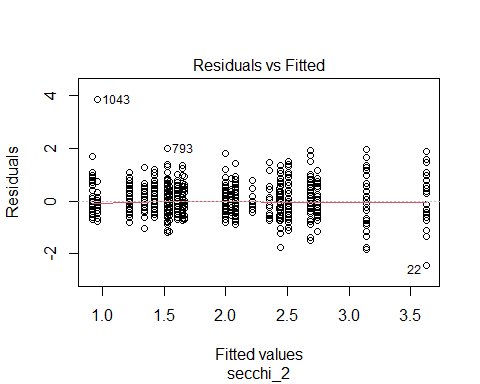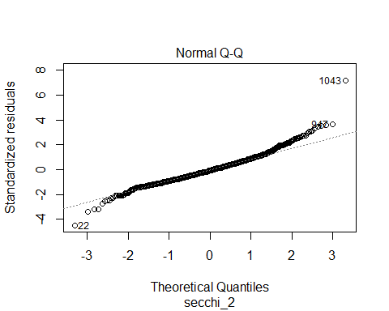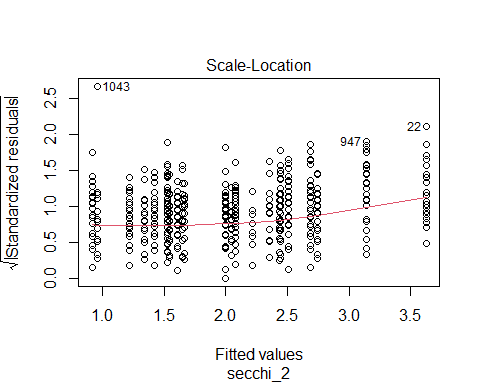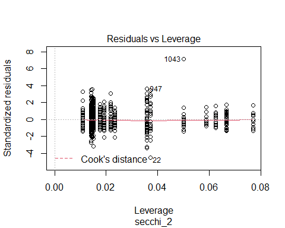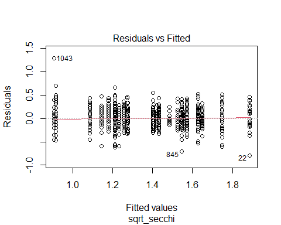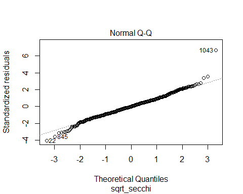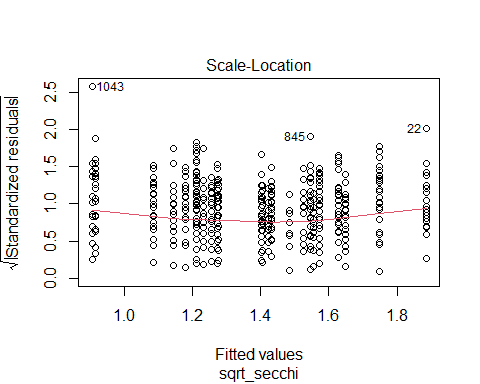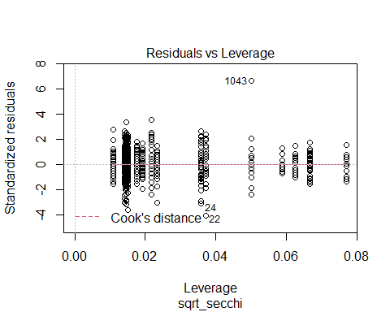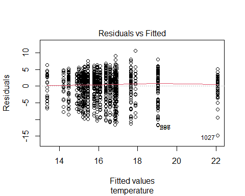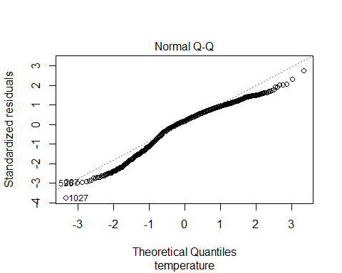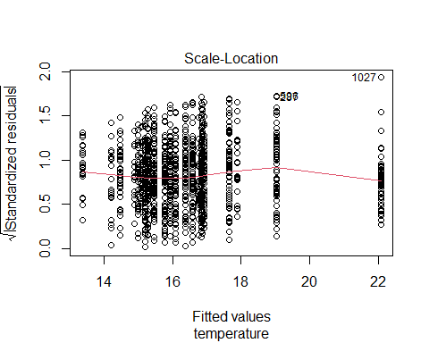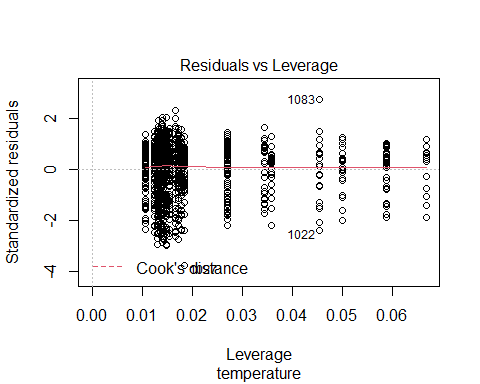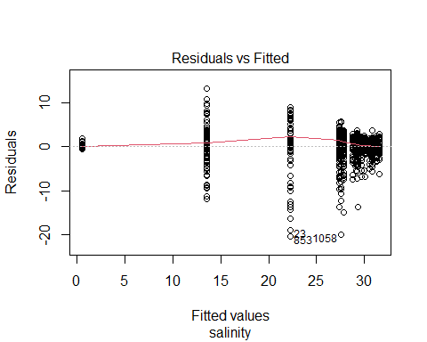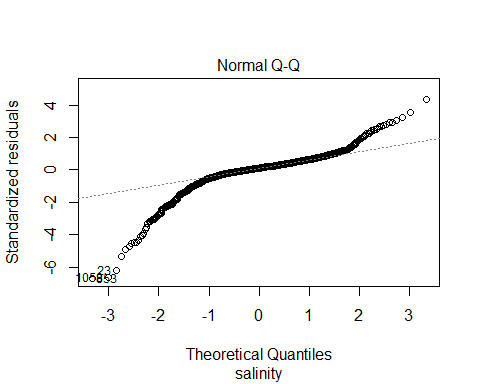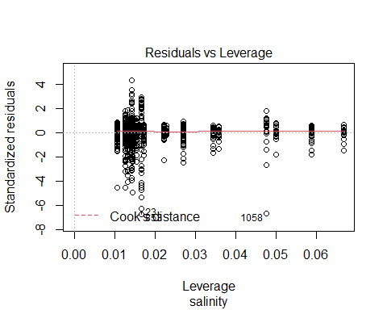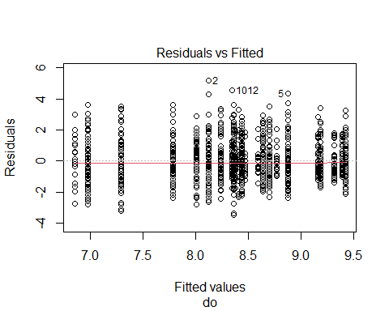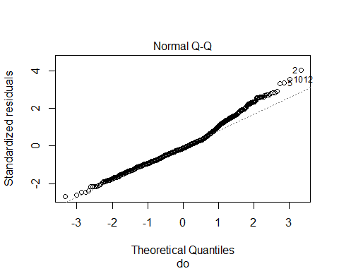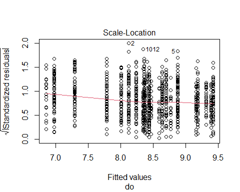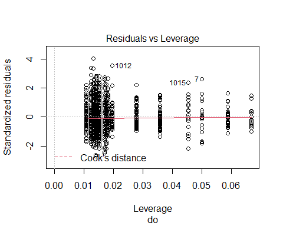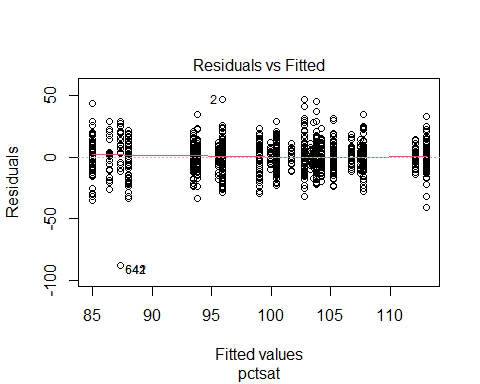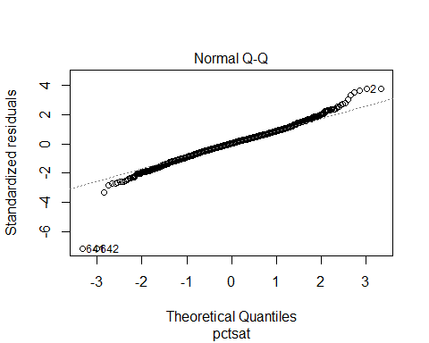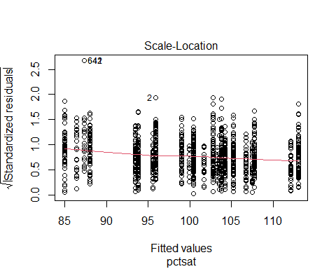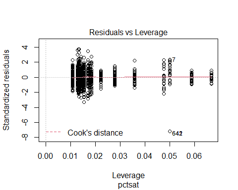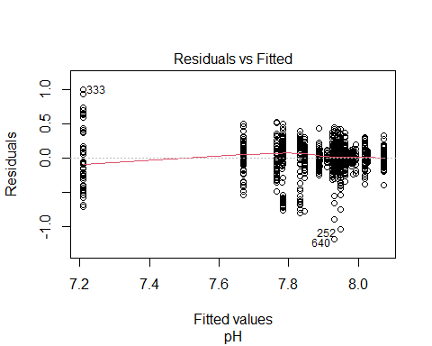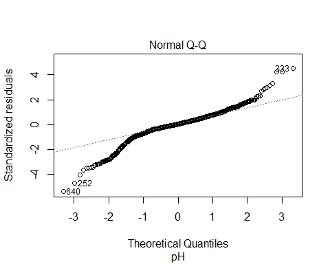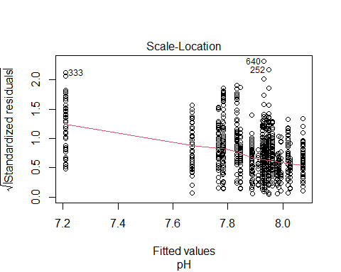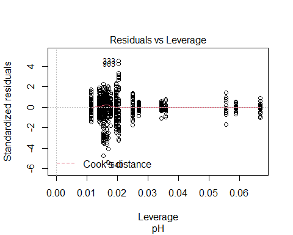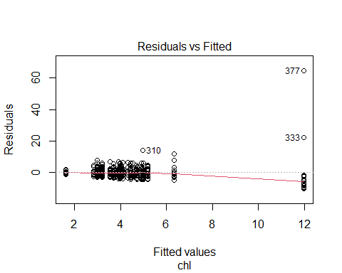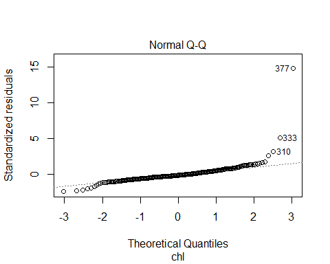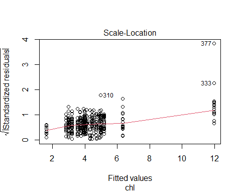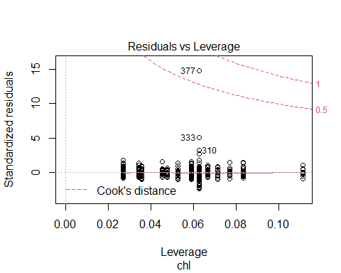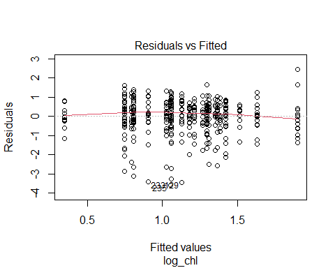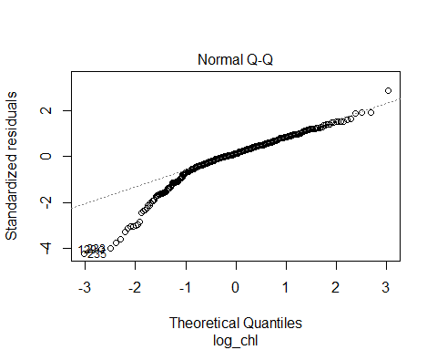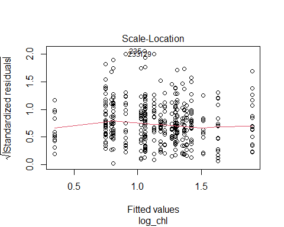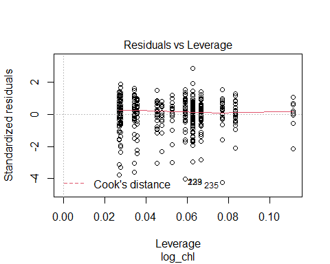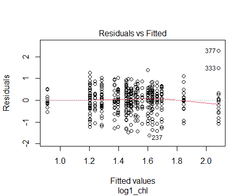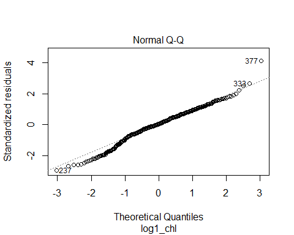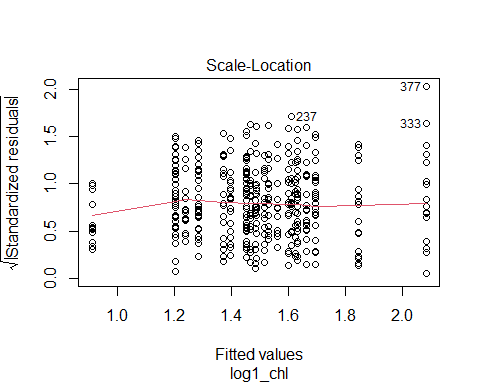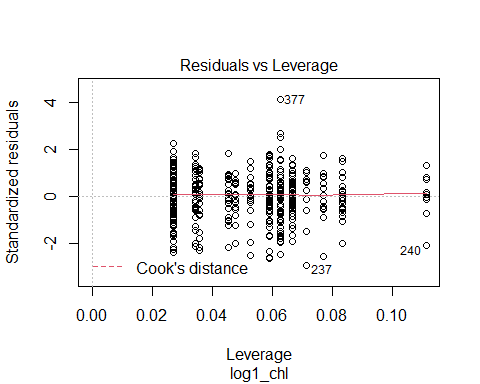

So…. \* Secchi has moderate heavy tails, with weak evidence of a
scale-location relationship. Square root of Secchi is not much better.
\* Temperature is left skewed.  
\* Salinity has VERY heavy tails, especially at the lower end.  
\* DO has slight skew, with a heavy upper tail. that is, it’s skewed
right.  
\* Percent Saturation is slightly heavy tailed, with weak evidence of
scale-location relationships.  
\* pH is heavy tailed and higher error at lower predicted pH (sites). \*
chlorophyll has a couple of outliers with moderate leverage. It’s
probably heavy-tailed too. We see the best model there is on the log
plus one transformed chlorophyll data

Chlorophyll is problematic pH and percent saturation also have a couple
of outliers, and the heavy skew for salinity would be problematic if we
were planning to analyze that by normal theory.

### Generate Predictions

We had problems doing this inside the nested tibble, because we don’t
have chlorophyll data for all parameters from all stations. In
particular, the site “KVL84” has no chlorophyll data. That required us
to create a function that explicitly created different prediction sets,
and saved them with the predictions.

Since we had to write a function anyway, we convert the predictions to a
tibble, and add naive (normal distribution) 95% confidence intervals.

#### Prediction Function

``` r
extract_predicts <- function (parm, df = nested_data) {
  # Pull the information for the selected parameter
  sel <- df %>%
    filter(parameter == parm)
  
  #Pull the related data from the nested tibble
  dat <- sel$data[[1]]
  test <- ! is.na(dat$value)
  dat <- dat[test,]
  
  # assemble the (possibly reduced) station list as a dataframe
  # Select the Site factor.  Note this comes with it's levels.
  slist <- tibble(station = factor(unique(dat$station),
                                   levels = levels(dat$station)))
  
  # Pull the model
  mod <- sel$lms[[1]]

  preds <- predict(mod, newdata = slist, se = TRUE) %>%
    as_tibble %>%
    mutate(station = slist$station) %>%
    mutate(sd = sd(dat$value)) %>%
    select(-df, -residual.scale) %>%
    mutate(lower.sd = fit - sd,
           upper.sd = fit + sd,
           lower.ci = fit - 1.96 * se.fit,
           upper.ci = fit + 1.96* se.fit)
  
  
  # add in a full suite of stations, so we have NAs where we have no
  # predictions.
  all_stations <- tibble(station = factor(levels(dat$station),
                                          levels = levels(dat$station)),
                         station_name =  factor(levels(dat$station_name),
                                                levels = levels(dat$station_name)))

 preds <- all_stations %>%
   left_join(preds, by = 'station')
  
  return(preds)
}
```

#### Add Predictions to the Nested Tibble

``` r
nested_data <- nested_data %>%
  mutate(lm_predicts= map(parameter, extract_predicts))
```

## Options for More Complex Models

### Hierarchical Models

We could in principal also adjust models for different sampling
histories (years and months) but there is likely little value to doing
so as the sampling histories are fairly uniform.

### Time Series Considerations

More seriously, these are time series. The periodicity of measurement is
wide, and data are incomplete, but we should consider interannual and
month to month variability, and whether there is any advantage to
modeling those variations.

#### Create Long Form Data

We create long-form data to facilitate faceted graphics.

``` r
long_data <- recent_data %>%
  select(-time, -sample_depth, 
         -secchi, - bottom_flag) %>%
  relocate(water_depth, .after = month) %>%
  pivot_longer(c(secchi_2:chl), names_to = 'parameter', values_to = 'value') %>%
  filter(! is.na(value))
```

#### Year to Year Plot

``` r
for (p in unique(long_data$parameter)) {
  plt <- long_data %>%
    filter(parameter == p) %>%
    ggplot(aes(x = year, y = value)) +
    geom_point(aes(color = month)) +
    ylab(p) +
    facet_wrap(~station) +
    theme_minimal() +
    theme(axis.text.x = element_text(angle = 90))
  print(plt)
}
```

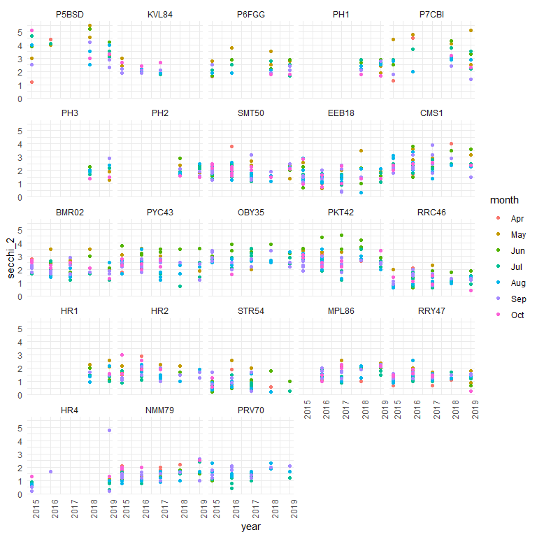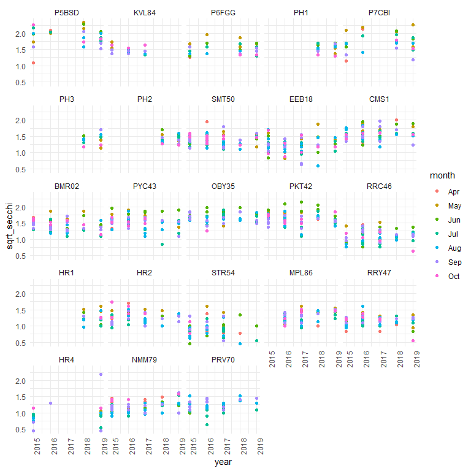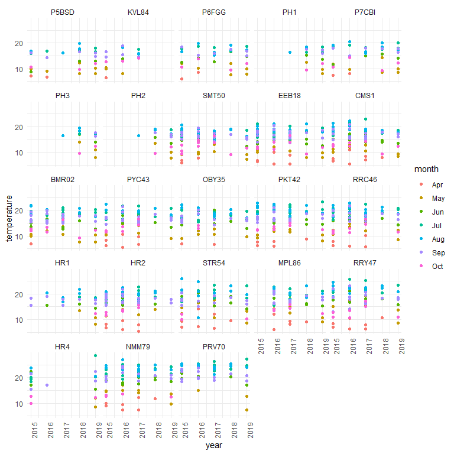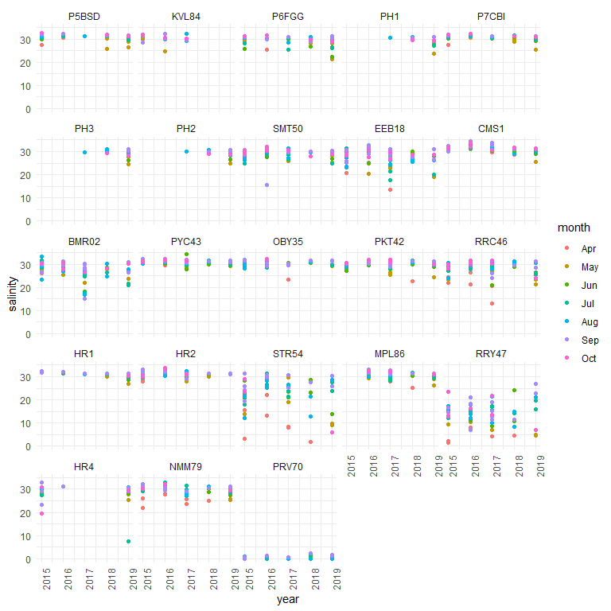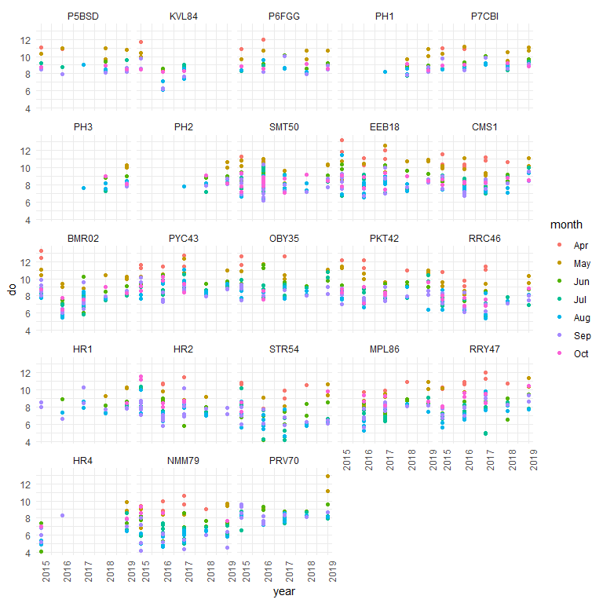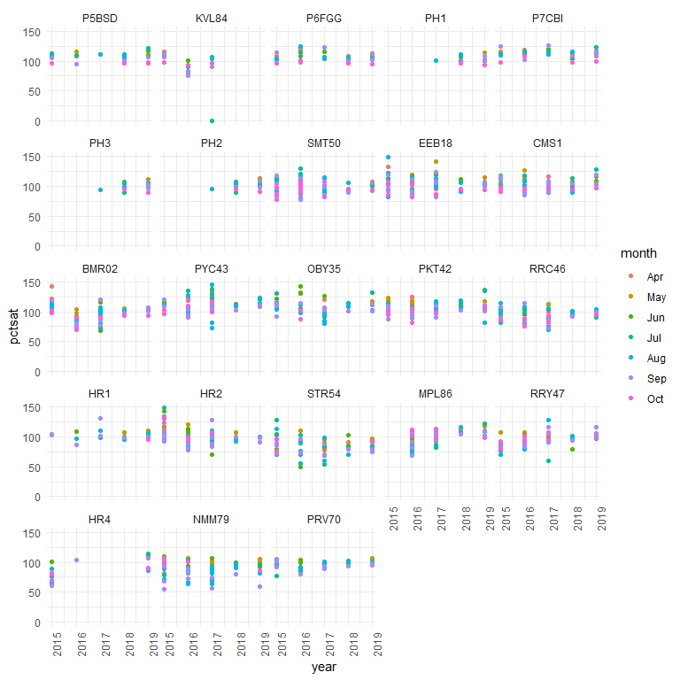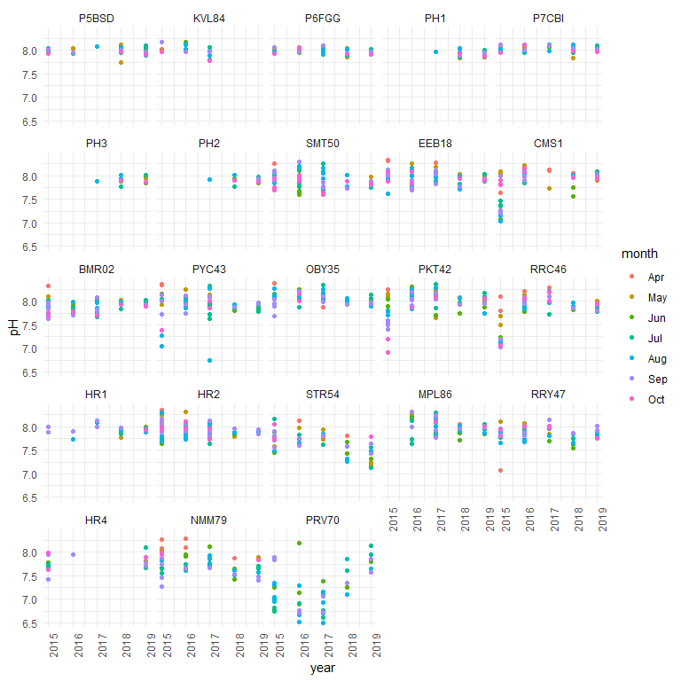

Note that ‘HR4’ only has data in 2015 and 2019.

It is not obvious that there are strong year to year consistent
variation.

#### Month to Month Plot

``` r
for (p in unique(long_data$parameter)) {
  plt <- long_data %>%
    filter(parameter == p) %>%
    ggplot(aes(x = month, y = value)) +
    geom_point(aes(color = year)) +
    ylab(p) +
    facet_wrap(~station) +
    theme_minimal() +
    theme(axis.text.x = element_text(angle = 90))
  print(plt)
}
```

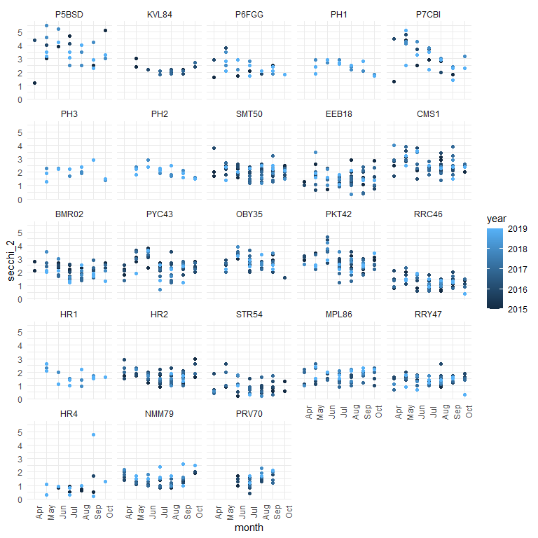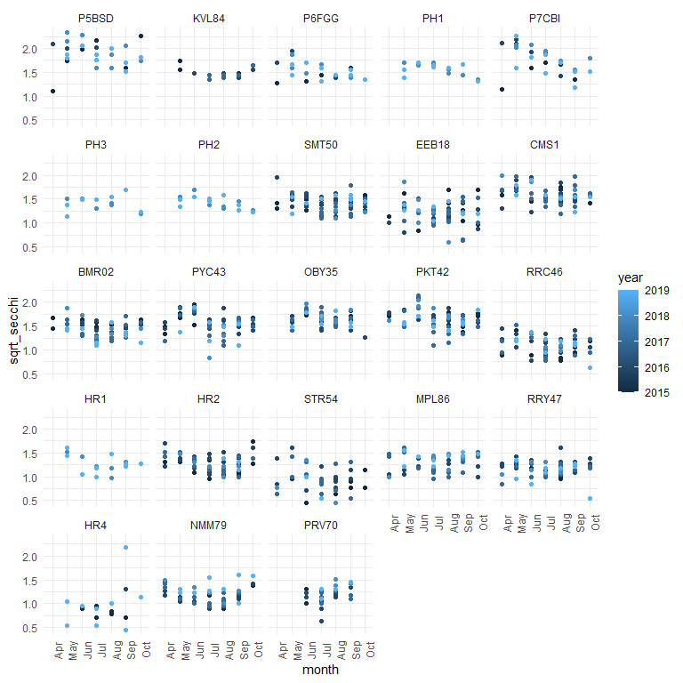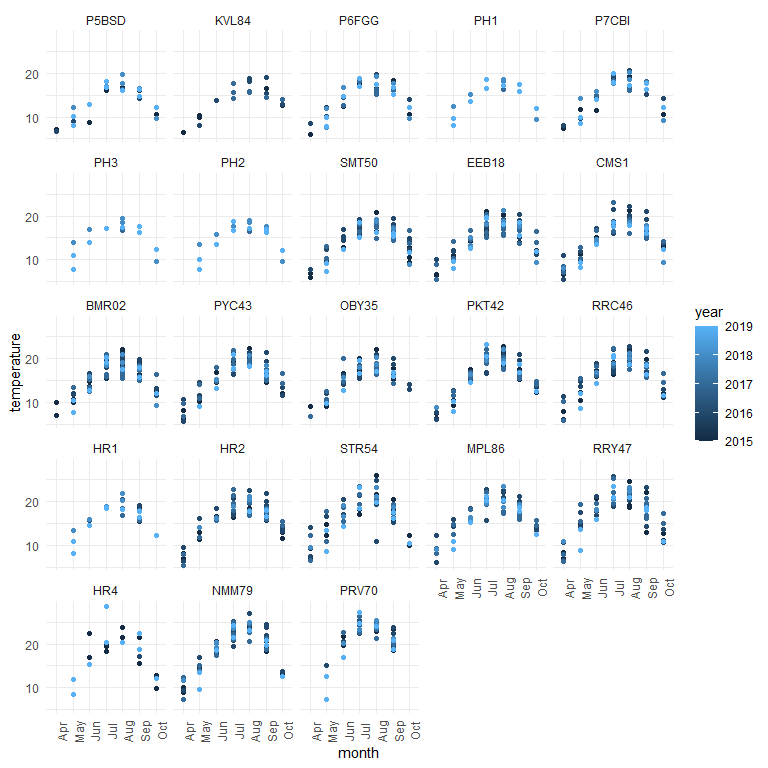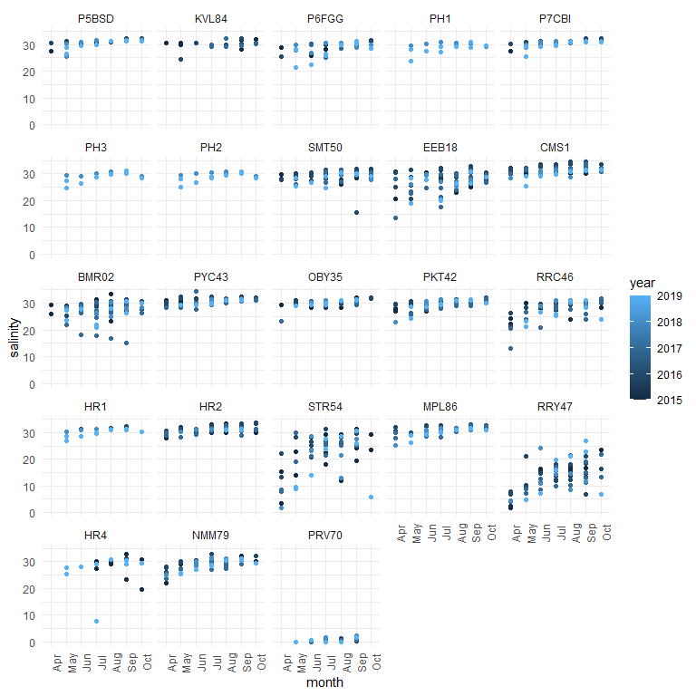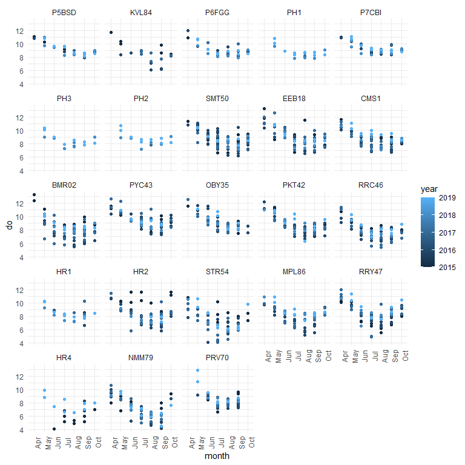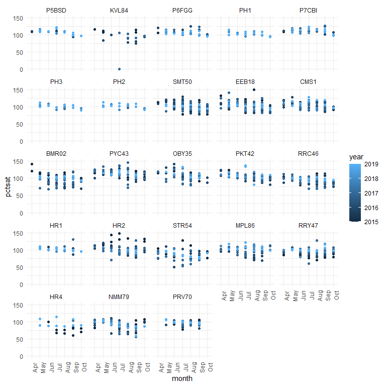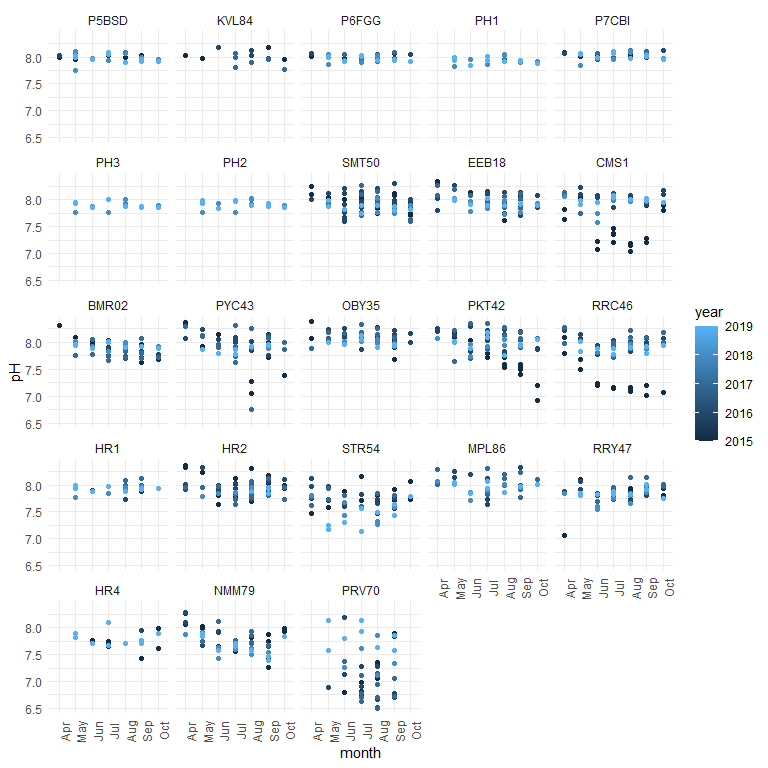

Note the relatively limited data for Chlorophyll.

Several Parameters show marked seasonal patterns. A few sites on a few
other parameters may show seasonal or year to year variation, but
fitting that variation would be pushing our luck, as we are implicitly
reviewing a large number of parameters over a large number of sites,
thus triggering an effective multiple comparisons problem.

We may be able to use the month by month relations to slightly reduce
standard errors in our models. They probably have little value in the
context of recent parameter estimation, but they may have significant
value in identifying long-term trends.

## Hierarchical Models

We fit a year to year random factor and seasonal (monthly) terms.

``` r
nested_data <- nested_data %>%
  mutate(lmers = map(data, function(df) gam(value ~ station + month + 
                                              s(year_f, bs = 're'), 
                                            data = df)))
```

### Review Model Results

Interestingly, year to year variation is statistically important for all
parameters.

#### Diagnostic Plots

``` r
for (p in nested_data$parameter) {
  gam.check(nested_data$lmers[nested_data$parameter == p][[1]],
       sub = p)
}
```


    #> 
    #> Method: GCV   Optimizer: magic
    #> Smoothing parameter selection converged after 4 iterations.
    #> The RMS GCV score gradient at convergence was 7.988947e-08 .
    #> The Hessian was positive definite.
    #> Model rank =  34 / 34 
    #> 
    #> Basis dimension (k) checking results. Low p-value (k-index<1) may
    #> indicate that k is too low, especially if edf is close to k'.
    #> 
    #>             k'  edf k-index p-value
    #> s(year_f) 5.00 3.27      NA      NA

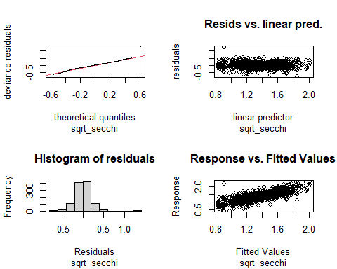

    #> 
    #> Method: GCV   Optimizer: magic
    #> Smoothing parameter selection converged after 4 iterations.
    #> The RMS GCV score gradient at convergence was 1.404362e-07 .
    #> The Hessian was positive definite.
    #> Model rank =  34 / 34 
    #> 
    #> Basis dimension (k) checking results. Low p-value (k-index<1) may
    #> indicate that k is too low, especially if edf is close to k'.
    #> 
    #>             k'  edf k-index p-value
    #> s(year_f) 5.00 3.09      NA      NA


    #> 
    #> Method: GCV   Optimizer: magic
    #> Smoothing parameter selection converged after 6 iterations.
    #> The RMS GCV score gradient at convergence was 2.406938e-06 .
    #> The Hessian was positive definite.
    #> Model rank =  34 / 34 
    #> 
    #> Basis dimension (k) checking results. Low p-value (k-index<1) may
    #> indicate that k is too low, especially if edf is close to k'.
    #> 
    #>             k'  edf k-index p-value
    #> s(year_f) 5.00 3.69      NA      NA

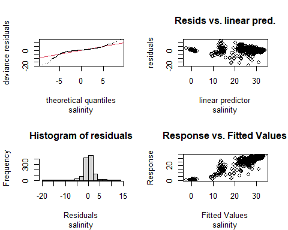

    #> 
    #> Method: GCV   Optimizer: magic
    #> Smoothing parameter selection converged after 7 iterations.
    #> The RMS GCV score gradient at convergence was 2.990289e-05 .
    #> The Hessian was positive definite.
    #> Model rank =  34 / 34 
    #> 
    #> Basis dimension (k) checking results. Low p-value (k-index<1) may
    #> indicate that k is too low, especially if edf is close to k'.
    #> 
    #>             k'  edf k-index p-value
    #> s(year_f) 5.00 3.79      NA      NA


    #> 
    #> Method: GCV   Optimizer: magic
    #> Smoothing parameter selection converged after 7 iterations.
    #> The RMS GCV score gradient at convergence was 5.595035e-06 .
    #> The Hessian was positive definite.
    #> Model rank =  34 / 34 
    #> 
    #> Basis dimension (k) checking results. Low p-value (k-index<1) may
    #> indicate that k is too low, especially if edf is close to k'.
    #> 
    #>             k'  edf k-index p-value
    #> s(year_f) 5.00 3.85      NA      NA

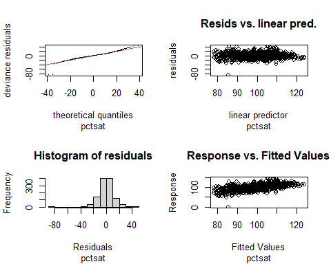

    #> 
    #> Method: GCV   Optimizer: magic
    #> Smoothing parameter selection converged after 6 iterations.
    #> The RMS GCV score gradient at convergence was 0.0005747645 .
    #> The Hessian was positive definite.
    #> Model rank =  34 / 34 
    #> 
    #> Basis dimension (k) checking results. Low p-value (k-index<1) may
    #> indicate that k is too low, especially if edf is close to k'.
    #> 
    #>             k'  edf k-index p-value
    #> s(year_f) 5.00 3.62      NA      NA


    #> 
    #> Method: GCV   Optimizer: magic
    #> Smoothing parameter selection converged after 6 iterations.
    #> The RMS GCV score gradient at convergence was 2.417341e-07 .
    #> The Hessian was positive definite.
    #> Model rank =  34 / 34 
    #> 
    #> Basis dimension (k) checking results. Low p-value (k-index<1) may
    #> indicate that k is too low, especially if edf is close to k'.
    #> 
    #>            k' edf k-index p-value
    #> s(year_f) 5.0 3.5      NA      NA

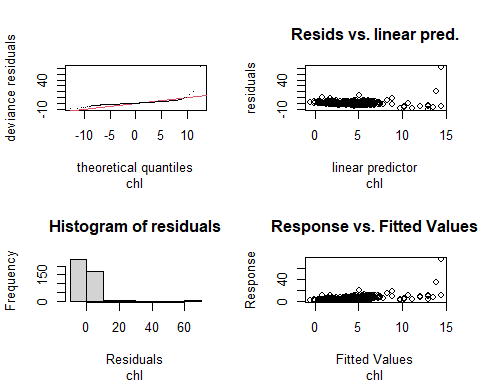

    #> 
    #> Method: GCV   Optimizer: magic
    #> Smoothing parameter selection converged after 4 iterations.
    #> The RMS GCV score gradient at convergence was 5.387926e-07 .
    #> The Hessian was positive definite.
    #> Model rank =  33 / 33 
    #> 
    #> Basis dimension (k) checking results. Low p-value (k-index<1) may
    #> indicate that k is too low, especially if edf is close to k'.
    #> 
    #>             k'  edf k-index p-value
    #> s(year_f) 5.00 1.62      NA      NA


    #> 
    #> Method: GCV   Optimizer: magic
    #> Smoothing parameter selection converged after 4 iterations.
    #> The RMS GCV score gradient at convergence was 2.061044e-06 .
    #> The Hessian was positive definite.
    #> Model rank =  33 / 33 
    #> 
    #> Basis dimension (k) checking results. Low p-value (k-index<1) may
    #> indicate that k is too low, especially if edf is close to k'.
    #> 
    #>             k'  edf k-index p-value
    #> s(year_f) 5.00 2.61      NA      NA

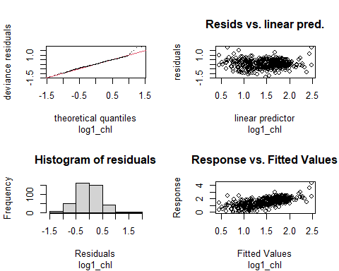

    #> 
    #> Method: GCV   Optimizer: magic
    #> Smoothing parameter selection converged after 4 iterations.
    #> The RMS GCV score gradient at convergence was 1.732709e-07 .
    #> The Hessian was positive definite.
    #> Model rank =  33 / 33 
    #> 
    #> Basis dimension (k) checking results. Low p-value (k-index<1) may
    #> indicate that k is too low, especially if edf is close to k'.
    #> 
    #>             k'  edf k-index p-value
    #> s(year_f) 5.00 2.88      NA      NA

Most of those look pretty good, with the exception of salinity, which
looks fairly awful, and pH, which is merely bad.

Square root of Secchi depth is marginally better than raw Secchi depth,
but the difference is small, and it complicates interpretation later.

Log 1 Chlorophyll is better than either untransformed chlorophyll or log
of chlorophyll.

#### Refit the CHlorophyll Model

We want the transformation in the model object, so we can use the tools
in `emmeans` to extract marginal means. We refit the chlorophyll model,
add it to the nested tibble, and delete the other two chlorophyll data
rows and the square root transformed Secchi depth row.

``` r
df <- nested_data %>%
  filter(parameter == 'chl') %>%
  pull(data)
df <- df[[1]]  # Extract the first item in the list....

mod <- gam(log1p(value) ~ station + month +  s(year_f, bs = 're'), data = df)
```

``` r
nested_data$lmers[nested_data$parameter == 'chl'] <- list(mod)

nested_data <- nested_data %>%
  filter(! parameter %in% c('log_chl', 'log1_chl', 'sqrt_secchi'))
```

#### ANOVAS

``` r
for (p in nested_data$parameter) {
  cat(p)
  print(anova(nested_data$lmers[nested_data$parameter == p][[1]]))
  cat('\n\n')
}
#> secchi_2
#> Family: gaussian 
#> Link function: identity 
#> 
#> Formula:
#> value ~ station + month + s(year_f, bs = "re")
#> 
#> Parametric Terms:
#>         df     F p-value
#> station 22 67.24  <2e-16
#> month    6 21.28  <2e-16
#> 
#> Approximate significance of smooth terms:
#>             edf Ref.df     F  p-value
#> s(year_f) 3.273  4.000 3.979 0.000709
#> 
#> 
#> temperature
#> Family: gaussian 
#> Link function: identity 
#> 
#> Formula:
#> value ~ station + month + s(year_f, bs = "re")
#> 
#> Parametric Terms:
#>         df      F p-value
#> station 22  35.58  <2e-16
#> month    6 721.23  <2e-16
#> 
#> Approximate significance of smooth terms:
#>            edf Ref.df     F p-value
#> s(year_f) 3.69   4.00 11.63  <2e-16
#> 
#> 
#> salinity
#> Family: gaussian 
#> Link function: identity 
#> 
#> Formula:
#> value ~ station + month + s(year_f, bs = "re")
#> 
#> Parametric Terms:
#>         df      F p-value
#> station 22 337.52  <2e-16
#> month    6  48.55  <2e-16
#> 
#> Approximate significance of smooth terms:
#>             edf Ref.df     F p-value
#> s(year_f) 3.786  4.000 22.85  <2e-16
#> 
#> 
#> do
#> Family: gaussian 
#> Link function: identity 
#> 
#> Formula:
#> value ~ station + month + s(year_f, bs = "re")
#> 
#> Parametric Terms:
#>         df      F p-value
#> station 22  34.09  <2e-16
#> month    6 232.24  <2e-16
#> 
#> Approximate significance of smooth terms:
#>             edf Ref.df     F p-value
#> s(year_f) 3.849  4.000 29.46  <2e-16
#> 
#> 
#> pctsat
#> Family: gaussian 
#> Link function: identity 
#> 
#> Formula:
#> value ~ station + month + s(year_f, bs = "re")
#> 
#> Parametric Terms:
#>         df     F p-value
#> station 22 22.45  <2e-16
#> month    6 19.25  <2e-16
#> 
#> Approximate significance of smooth terms:
#>             edf Ref.df     F p-value
#> s(year_f) 3.624  4.000 12.15  <2e-16
#> 
#> 
#> pH
#> Family: gaussian 
#> Link function: identity 
#> 
#> Formula:
#> value ~ station + month + s(year_f, bs = "re")
#> 
#> Parametric Terms:
#>         df     F  p-value
#> station 22 31.18  < 2e-16
#> month    6 12.12 3.39e-13
#> 
#> Approximate significance of smooth terms:
#>             edf Ref.df     F p-value
#> s(year_f) 3.495  4.000 11.18  <2e-16
#> 
#> 
#> chl
#> Family: gaussian 
#> Link function: identity 
#> 
#> Formula:
#> log1p(value) ~ station + month + s(year_f, bs = "re")
#> 
#> Parametric Terms:
#>         df      F  p-value
#> station 21  3.791 7.68e-08
#> month    6 30.956  < 2e-16
#> 
#> Approximate significance of smooth terms:
#>             edf Ref.df     F p-value
#> s(year_f) 2.884  4.000 3.202 0.00192
```

Note that the conclusions are that ALL parameters vary seasonally and by
location. Year to year variation is also important for all parameters,
which is perhaps less obvious. (Note that this model did NOT fit
interaction terms, (although they are likely to be important for some
parameters).

None of that is likely to come as a surprise. Much of the value here is
to confirm our intuition that that is the case, and provide mechanism
for

Again, despite high levels of statistical significance for these models,
the models are not terribly appropriate for either salinity or pH data.

### Generate Predictions

#### Prediction Function

``` r
extract_emms <- function (parm, df = nested_data) {
  # Pull the information for the selected parameter
  sel <- df %>%
    filter(parameter == parm)
  
  #Pull the related data from the nested tibble
  dat <- sel$data[[1]]
  test <- ! is.na(dat$value)
  dat <- dat[test,]
  
  # Pull the model
  mod <- sel$lmers[[1]]

  # This time, we want station marginal means, averaged across years and months
  # `emmeans()` pulls values direct from the model object, so we do not need to
  # provide a Station List, although we will still need to expand the 
  # list of stations
  
  preds <- emmeans(mod, 'station', type = 'response') %>%
    summary()
  
  # add in a full suite of stations, so we have NAs where we have no
  # predictions.
  all_stations <- tibble(station = factor(levels(dat$station),
                                          levels = levels(dat$station)),
                         station_name =  factor(levels(dat$station_name),
                                                levels = levels(dat$station_name)))

 preds <- all_stations %>%
   left_join(preds, by = 'station')
  
  return(preds)
}
```

#### Add Predictions to the Nested Tibble

``` r
nested_data <- nested_data %>%
  mutate(lmer_predicts= map(parameter, extract_emms))
```

#### Prediction Plots
