Analysis of Surface Data from Friends of Casco Bay Monitoring
================
Curtis C. Bohlen, Casco Bay Estuary Partnership
3/03/2021

-   [Introduction](#introduction)
-   [Load Libraries](#load-libraries)
-   [Load Data](#load-data)
    -   [Establish Folder Reference](#establish-folder-reference)
    -   [Primary Data](#primary-data)
        -   [Remove 2020 only data](#remove-2020-only-data)
    -   [Add Station Names](#add-station-names)
    -   [Address Secchi Censored
        Values](#address-secchi-censored-values)
    -   [Prevalence of Parameters by
        Year](#prevalence-of-parameters-by-year)
    -   [Transform the Secchi and Chlorophyll A
        Data](#transform-the-secchi-and-chlorophyll-a-data)
-   [Analysis of Trends](#analysis-of-trends)
    -   [Create Trend Data](#create-trend-data)
    -   [Construct Nested Tibble](#construct-nested-tibble)
-   [Overall Trend](#overall-trend)
-   [Nested Models](#nested-models)
    -   [GAM models](#gam-models)
        -   [Diagnostic Plots](#diagnostic-plots)
        -   [ANOVAs](#anovas)
-   [Create Slope Annotations](#create-slope-annotations)
-   [Extract Predictions for Statistically Significant
    Trends](#extract-predictions-for-statistically-significant-trends)


# Introduction

This Notebook analyzes FOCB’s “Surface” data. These data are pulled from
long term monitoring locations around the Bay.

These are sites visited regularly by FOCB staff, either by boat or on
land. The focus is on warm season sampling (April through October), with
roughly monthly samples. Earlier data from some land-based sites was
collected by volunteers.

This reflects only a small portion of FOCB’s monitoring program, but the
surface data provides consistent sampling history with the deepest
historical record.

# Load Libraries

``` r
library(MASS)     # Here for the `boxcox()` function
library(tidyverse)
#> -- Attaching packages --------------------------------------- tidyverse 1.3.0 --
#> v ggplot2 3.3.3     v purrr   0.3.4
#> v tibble  3.0.5     v dplyr   1.0.3
#> v tidyr   1.1.2     v stringr 1.4.0
#> v readr   1.4.0     v forcats 0.5.0
#> -- Conflicts ------------------------------------------ tidyverse_conflicts() --
#> x dplyr::filter() masks stats::filter()
#> x dplyr::lag()    masks stats::lag()
#> x dplyr::select() masks MASS::select()
library(readxl)
#library(readr)

library(mgcv)     # For `gam()` and `gamm()` models
#> Loading required package: nlme
#> 
#> Attaching package: 'nlme'
#> The following object is masked from 'package:dplyr':
#> 
#>     collapse
#> This is mgcv 1.8-33. For overview type 'help("mgcv-package")'.
#library(maxLik)
library(lme4)    # For mixed effectws models
#> Loading required package: Matrix
#> 
#> Attaching package: 'Matrix'
#> The following objects are masked from 'package:tidyr':
#> 
#>     expand, pack, unpack
#> 
#> Attaching package: 'lme4'
#> The following object is masked from 'package:nlme':
#> 
#>     lmList
#library(nlme)   # probably only needed if we need to model autocorrelation

library(emmeans)

library(GGally)
#> Registered S3 method overwritten by 'GGally':
#>   method from   
#>   +.gg   ggplot2
#> 
#> Attaching package: 'GGally'
#> The following object is masked from 'package:emmeans':
#> 
#>     pigs
#library(zoo)
#library(lubridate)  # here, for the make_datetime() function

#library(broom)

library(CBEPgraphics)
load_cbep_fonts()
theme_set(theme_cbep())
```

# Load Data

## Establish Folder Reference

``` r
sibfldnm <- 'Original_Data'
parent   <- dirname(getwd())
sibling  <- file.path(parent,sibfldnm)

dir.create(file.path(getwd(), 'figures'), showWarnings = FALSE)
```

## Primary Data

We specify column names because FOCB data has a row of names, a row of
units, then the data. This approach is simpler than reading names from
the first row and correcting them to be R syntactic names.

``` r
fn    <- 'FOCB Surface All Current Sites With BSV Data.xlsx'
fpath <- file.path(sibling,fn)

mynames <- c('station', 'dt', 'time', 'sample_depth',
             'secchi', 'water_depth','temperature', 'salinity',
             'do', 'pctsat', 'pH', 'chl', 
             'month', 'year', 'fdom', 'bga', 
             'turbidity', 'blank', 'clouds', 'wndspd',
             'winddir'
             ) 

the_data <- read_excel(fpath, skip=2, col_names = mynames) %>%
  mutate(month = factor(month, levels = 1:12, labels = month.abb))

rm(mynames)
```

### Remove 2020 only data

``` r
the_data <- the_data %>%
select(-c(fdom:winddir))
```

## Add Station Names

``` r
fn    <- 'FOCB Monitoring Sites.xlsx'
fpath <- file.path(sibling,fn)
loc_data <- read_excel(fpath) %>%
  select(Station_ID, Station_Name) %>%
  rename(station = Station_ID,
         station_name = Station_Name)

the_data <- the_data %>%
  left_join(loc_data, by = 'station') %>%
  relocate(station_name, .after = station) %>%
  
  relocate(year, .after = dt) %>%
  relocate(month, .after = year)
```

Our data contains two stations that are not associated with locations
that were included in our spatial data. We can see that because when we
`left_join()` by `station`, no `station_name` value is carried over.

``` r
l <- the_data %>%
  group_by(station) %>%
  summarize(missing = sum(is.na(station_name))) %>%
  filter(missing > 0) %>%
  pull(station)
l
#> [1] "CMS3"  "P6CBI"
```

If we look at those records, on is represented by only a single
observation, and the other only by data from 2020. Neither matter for
the current analysis. They will get filtered out when we select data to
describe recent conditions, and trends.

``` r
the_data %>%
  filter(station %in% l)
#> # A tibble: 7 x 15
#>   station station_name dt                   year month time               
#>   <chr>   <chr>        <dttm>              <dbl> <fct> <dttm>             
#> 1 P6CBI   <NA>         2006-09-13 00:00:00  2006 Sep   1899-12-31 11:40:00
#> 2 CMS3    <NA>         2020-06-17 00:00:00  2020 Jun   1899-12-31 11:22:54
#> 3 CMS3    <NA>         2020-07-15 00:00:00  2020 Jul   1899-12-31 11:08:08
#> 4 CMS3    <NA>         2020-07-30 00:00:00  2020 Jul   1899-12-31 11:39:33
#> 5 CMS3    <NA>         2020-08-19 00:00:00  2020 Aug   1899-12-31 11:36:38
#> 6 CMS3    <NA>         2020-09-17 00:00:00  2020 Sep   1899-12-31 11:52:14
#> 7 CMS3    <NA>         2020-10-05 00:00:00  2020 Oct   1899-12-31 11:23:21
#> # ... with 9 more variables: sample_depth <dbl>, secchi <chr>,
#> #   water_depth <dbl>, temperature <dbl>, salinity <dbl>, do <dbl>,
#> #   pctsat <dbl>, pH <dbl>, chl <dbl>
```

## Address Secchi Censored Values

``` r
the_data <- the_data %>%
  mutate(secchi_2 = if_else(secchi == "BSV", water_depth, as.numeric(secchi)),
         bottom_flag = secchi == "BSV") %>%
  relocate(secchi_2, .after = secchi) %>%
  relocate(bottom_flag, .after = secchi_2)
#> Warning: Problem with `mutate()` input `secchi_2`.
#> i NAs introduced by coercion
#> i Input `secchi_2` is `if_else(secchi == "BSV", water_depth, as.numeric(secchi))`.
```

## Prevalence of Parameters by Year

``` r
tmp <- the_data %>%
  select(-dt, -time, -month, -sample_depth, 
         -secchi, - bottom_flag) %>%
  relocate(water_depth, .after = year) %>%
  pivot_longer(c(secchi_2:chl), names_to = 'parameter', values_to = 'value') %>%
  filter(! is.na(value)) %>%
  group_by(parameter)

xtabs(~ year + parameter, data = tmp)
#>       parameter
#> year   chl  do pctsat  pH salinity secchi_2 temperature
#>   1993   0 112    111  74      112       98         113
#>   1994   0 178    174 136      177      168         182
#>   1995   0 192    191 150      197      177         198
#>   1996   4 216    216 126      223      198         223
#>   1997   0 123    122  99      122      115         123
#>   1998   0 113    113  87      114      105         114
#>   1999   0  95     95  79       99       92          99
#>   2000   0  95     94  74       96       89          96
#>   2001   9 175    172 170      175      170         177
#>   2002  24 143    143 140      163      153         162
#>   2003  27 180    179 175      181      178         183
#>   2004  17 173    173 174      187      181         187
#>   2005  30 247    247 239      248      219         248
#>   2006  30 229    228 226      231      204         231
#>   2007  20 246    246 251      254      226         254
#>   2008  90 297    297 294      303      269         303
#>   2009  54 272    270 274      276      241         278
#>   2010  41 282    275 279      281      262         288
#>   2011  36 283    277 280      279      261         286
#>   2012  42 249    248 245      250      241         251
#>   2013  21 247    245 236      247      245         249
#>   2014  27 285    284 280      290      267         291
#>   2015  25 267    262 266      271      255         277
#>   2016  25 305    298 257      303      290         310
#>   2017  40 285    282 217      273      240         285
#>   2018 137 137    137 137      137      131         137
#>   2019 186 186    186 186      186      172         186
#>   2020 151 151    151 151      151      132         151
rm(tmp)
```

So note that Chlorophyll data is available going back to 2001, but from
relatively few samples until 2018. We may want to limit Chlorophyll
Analysis to the long-term sites.

``` r
tmp <- the_data %>%
  select(station, year, chl) %>%
  filter(! is.na(chl)) %>%
  mutate(station = factor(station),
         station = fct_reorder(station, chl, length))
xtabs(~year + station, data = tmp)
#>       station
#> year   P6CBI CMS3 OBY35 PYC43 RRC46 MPL86 PH3 PKT42 CMS1 PH1 HR2 PH2 HR4 BMR02
#>   1996     0    0     0     0     0     0   0     0    0   0   2   0   0     0
#>   2001     0    0     0     0     0     0   0     0    0   0   0   0   0     0
#>   2002     0    0     0     0     0     0   0     0    0   0   0   0   0     0
#>   2003     0    0     0     0     0     0   0     0    0   0   0   0   0     0
#>   2004     0    0     0     0     0     0   0     0    0   0   0   0   0     0
#>   2005     0    0     0     0     0     0   0     0    0   0   0   0   0     0
#>   2006     1    0     0     0     0     0   0     0    0   0   0   0   0     0
#>   2007     0    0     0     0     0     0   0     0    0   0   0   0   0     0
#>   2008     0    0     0     0     0     0   0     0    0   0   0   0   0     0
#>   2009     0    0     0     0     0     0   0     0    0   0   0   0   2     0
#>   2010     0    0     0     0     0     0   0     0    0   0   0   0   3     0
#>   2011     0    0     0     0     0     0   0     0    0   0   0   0   2     0
#>   2012     0    0     0     0     0     0   0     0    0   0   0   0   3     0
#>   2013     0    0     0     0     0     0   0     0    0   0   0   0   0     0
#>   2014     0    0     0     0     0     0   0     0    0   0   4   0   0     0
#>   2015     0    0     0     0     0     0   0     0    0   0   2   0   0     0
#>   2016     0    0     0     0     0     0   0     0    0   0   4   0   0     0
#>   2017     0    0     0     0     0     0   1     0    0   1   4   1   0     5
#>   2018     0    0     5     5     5     7   6     7    8   7   6   7   0     7
#>   2019     0    0     7     7     9     9   8     9    9   9   3   9   9     9
#>   2020     0    6     6     6     6     7   8     7    7   7   0   8   7     6
#>       station
#> year   NMM79 RRY47 STR54 KVL84 HR1 EEB18 PRV70 SMT50 P5BSD P6FGG P7CBI
#>   1996     0     0     0     0   2     0     0     0     0     0     0
#>   2001     0     0     0     0   0     0     0     0     3     3     3
#>   2002     0     0     0     0   0     0     0     0     8     8     8
#>   2003     0     0     0     0   0     0     0     0     9     9     9
#>   2004     0     0     0     0   0     0     0     0     5     6     6
#>   2005     0     0     0     0   0     0     0     0    10    10    10
#>   2006     0     0     0     0   0     0     0     0     9    10    10
#>   2007     0     0     0     0   0     0     0     0     6     7     7
#>   2008     0     0     0    23   0     0    23    23     7     7     7
#>   2009     2     2     7     8   0     8     0     7     6     6     6
#>   2010     3     3     3     3   0     3     0     2     7     7     7
#>   2011     2     2     2     2   0     2     2     1     7     7     7
#>   2012     3     3     2     3   0     3     3     2     7     6     7
#>   2013     0     0     0     0   0     0     0     0     7     7     7
#>   2014     0     0     0     0   4     0     0     0     5     7     7
#>   2015     0     0     0     0   2     0     0     0     7     7     7
#>   2016     0     0     0     0   3     0     0     0     4     7     7
#>   2017     0     0     0     0   8     5     2     0     1     6     6
#>   2018     7     7     6     0   6     8     5     4     8     8     8
#>   2019     9     9     9     0   9     9     8     9     9     9     9
#>   2020     7     7     7     0   6     7     5     7     7     8     9
rm(tmp)
```

So frequent chlorophyll data is available since 2001 from three sites:

P5BSD P6FGG P7CBI

This raises the question of whether to filter stations for each
parameter separately. Given that the numbers of samples available over
time are similar for all other parameters, that is probably
notnecessary.

## Transform the Secchi and Chlorophyll A Data

We create a log plus one transformed version of the Chlorophyll data
here, to facilitate “parallel” construction of statistical models. We
end up dropping several of these alternatives transforms after we
examine model residuals.

``` r
the_data <- the_data %>%
  mutate(sqrt_secchi = sqrt(secchi_2),
         log_chl = log(chl),
         log1_chl = log1p(chl)) %>%
  mutate(log_chl = if_else(is.infinite(log_chl) | is.nan(log_chl),
                           NA_real_, log_chl)) %>%
  relocate(sqrt_secchi, .after = secchi_2) %>%
  relocate(log_chl, log1_chl, .after = chl)
#> Warning: Problem with `mutate()` input `log_chl`.
#> i NaNs produced
#> i Input `log_chl` is `log(chl)`.
```

# Analysis of Trends

Our goal here is to identify whether there are long-term trends in water
quality. Initially, it is not clear whether the question applies
site-by-site, regionally, or bay-wide,

We see less evidence here than in the Long Creek example of significant
year to year differences in condition. Accordingly, it is not yet clear
if we need hierarchical models that include a random term for the year
or not.

## Create Trend Data

First, we create a tibble containing information on years in which each
station was sampled.

``` r
years_data <- the_data %>%
  group_by(station, year) %>%
  summarize(yes = ! all(is.na(temperature)),
            .groups = 'drop_last') %>%
  summarize(years = sum(yes, na.rm = TRUE),
            recent_years =  sum(yes & year > 2014, na.rm = TRUE),
            .groups = 'drop')
```

Then we identify stations with at least 10 years of data, and at least
three years of data from the last five years, and use that list to
select data for trend analysis. Finally, we adjust the levels in the
`station` and `station_name` variables.

``` r
selected_stations <- years_data %>%
  filter(years> 9, recent_years >2) %>%
  pull(station)

trend_data <- the_data %>%
  filter(station %in% selected_stations) %>%
  mutate(station = fct_drop(station),
         station_name = fct_drop(station_name)) %>%
  mutate(station = fct_reorder(station, temperature, mean, na.rm = TRUE),
         station_name = fct_reorder(station_name, temperature, mean, na.rm = TRUE))
rm(selected_stations, years_data)
```

``` r
length(unique(trend_data$station))
#> [1] 17
```

We are reduced to only 17 stations with long-term records for trend
analysis. We noted above that we have limited chlorophyll data before
the last couple of years. We address that momentarily

## Construct Nested Tibble

``` r
units <- tibble(parameter = c('secchi_2', 'sqrt_secchi', 'temperature', 
                              'salinity', 'do',
                              'pctsat', 'pH', 
                              'chl', 'log_chl', 'log1_chl'),
                label = c("Secchi Depth", "Sqt Secchi", "Temperature",
                         "Salinity", "Dissolved Oxygen",
                         "Percent Saturation", "pH",
                         "Chlorophyll A", "Log Chlorophyll A", "Log Chlorophyll A plus 1"),
                units = c('m', '', paste0("\U00B0", "C"),
                          'PSU', 'mg/l',
                          '', '',
                          'mg/l', '', ''))

nested_data <- trend_data %>%
  select(-time, -sample_depth, 
         -secchi) %>%
  mutate(year_f = factor(year)) %>%
  relocate(water_depth, bottom_flag, .after = month) %>%
  pivot_longer(c(secchi_2:log1_chl), names_to = 'parameter', 
               values_to = 'value') %>%
  filter(! is.na(value)) %>%
  
  # Remove extra chlorophyll data so we focus on long-term stations
  filter(! (parameter == 'chl' &  
              (! station %in% c('P5BSD', 'P6FGG', 'P7CBI')))) %>%
  
  # change all `bottom_flag` values to FALSE except for secchi_2 df 
  # this allows selective coloring in later graphics
  mutate(bottom_flag = if_else(parameter != 'secchi_2', FALSE, bottom_flag)) %>%
  group_by(parameter) %>%
  nest() %>%
  left_join(units, by = 'parameter')
```

# Overall Trend

We treat stations as random exemplars of possible stations, and thus
rely on hierarchical models. We could run simple regressions based on
summary statistics of the trend data, but a nested model – for MOST of
these variables – will better address station by station uncertainty.

Our analysis of recent data showed significant year to year variation
across sites. it is not entirely clear whether a random year term is
needed or appropriate. We include it in our initial model explorations
to see if it better controls for heavy-tailed distributions.

# Nested Models

## GAM models

We use a GAM model with a random factor smoothing term. We could just as
well use `lmer()` or `lme()`. The GAM framework makes it easier to
evaluate smoothers for the year to year variation.

``` r
nested_data <- nested_data %>%
  mutate(lmers = map(data, function(df) gam(value ~ year + 
                                              month + 
                                              #s(year_f, bs = 're') +
                                              s(station, bs = 're'), 
                                            data = df)))
```

### Diagnostic Plots

``` r
for (p in nested_data$parameter) {
  gam.check(nested_data$lmers[nested_data$parameter == p][[1]],
       sub = p)
}
```


    #> 
    #> Method: GCV   Optimizer: magic
    #> Smoothing parameter selection converged after 11 iterations.
    #> The RMS GCV score gradient at convergence was 1.185041e-06 .
    #> The Hessian was positive definite.
    #> Model rank =  25 / 25 
    #> 
    #> Basis dimension (k) checking results. Low p-value (k-index<1) may
    #> indicate that k is too low, especially if edf is close to k'.
    #> 
    #>            k' edf k-index p-value
    #> s(station) 17  16      NA      NA


    #> 
    #> Method: GCV   Optimizer: magic
    #> Smoothing parameter selection converged after 10 iterations.
    #> The RMS GCV score gradient at convergence was 6.36454e-07 .
    #> The Hessian was positive definite.
    #> Model rank =  25 / 25 
    #> 
    #> Basis dimension (k) checking results. Low p-value (k-index<1) may
    #> indicate that k is too low, especially if edf is close to k'.
    #> 
    #>            k' edf k-index p-value
    #> s(station) 17  16      NA      NA


    #> 
    #> Method: GCV   Optimizer: magic
    #> Smoothing parameter selection converged after 10 iterations.
    #> The RMS GCV score gradient at convergence was 1.03424e-05 .
    #> The Hessian was positive definite.
    #> Model rank =  25 / 25 
    #> 
    #> Basis dimension (k) checking results. Low p-value (k-index<1) may
    #> indicate that k is too low, especially if edf is close to k'.
    #> 
    #>              k'  edf k-index p-value
    #> s(station) 17.0 15.9      NA      NA

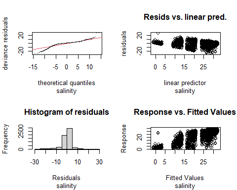

    #> 
    #> Method: GCV   Optimizer: magic
    #> Smoothing parameter selection converged after 12 iterations.
    #> The RMS GCV score gradient at convergence was 1.505316e-05 .
    #> The Hessian was positive definite.
    #> Model rank =  25 / 25 
    #> 
    #> Basis dimension (k) checking results. Low p-value (k-index<1) may
    #> indicate that k is too low, especially if edf is close to k'.
    #> 
    #>            k' edf k-index p-value
    #> s(station) 17  16      NA      NA

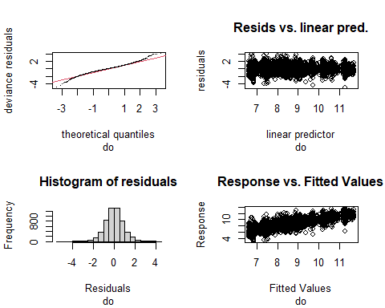

    #> 
    #> Method: GCV   Optimizer: magic
    #> Smoothing parameter selection converged after 10 iterations.
    #> The RMS GCV score gradient at convergence was 2.284111e-06 .
    #> The Hessian was positive definite.
    #> Model rank =  25 / 25 
    #> 
    #> Basis dimension (k) checking results. Low p-value (k-index<1) may
    #> indicate that k is too low, especially if edf is close to k'.
    #> 
    #>              k'  edf k-index p-value
    #> s(station) 17.0 15.9      NA      NA


    #> 
    #> Method: GCV   Optimizer: magic
    #> Smoothing parameter selection converged after 10 iterations.
    #> The RMS GCV score gradient at convergence was 0.0001669878 .
    #> The Hessian was positive definite.
    #> Model rank =  25 / 25 
    #> 
    #> Basis dimension (k) checking results. Low p-value (k-index<1) may
    #> indicate that k is too low, especially if edf is close to k'.
    #> 
    #>              k'  edf k-index p-value
    #> s(station) 17.0 15.9      NA      NA


    #> 
    #> Method: GCV   Optimizer: magic
    #> Smoothing parameter selection converged after 8 iterations.
    #> The RMS GCV score gradient at convergence was 7.474632e-07 .
    #> The Hessian was positive definite.
    #> Model rank =  25 / 25 
    #> 
    #> Basis dimension (k) checking results. Low p-value (k-index<1) may
    #> indicate that k is too low, especially if edf is close to k'.
    #> 
    #>              k'  edf k-index p-value
    #> s(station) 17.0 15.9      NA      NA

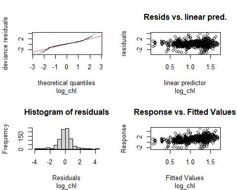

    #> 
    #> Method: GCV   Optimizer: magic
    #> Smoothing parameter selection converged after 5 iterations.
    #> The RMS GCV score gradient at convergence was 2.027026e-06 .
    #> The Hessian was positive definite.
    #> Model rank =  25 / 25 
    #> 
    #> Basis dimension (k) checking results. Low p-value (k-index<1) may
    #> indicate that k is too low, especially if edf is close to k'.
    #> 
    #>              k'  edf k-index p-value
    #> s(station) 17.0 11.7      NA      NA


    #> 
    #> Method: GCV   Optimizer: magic
    #> Smoothing parameter selection converged after 4 iterations.
    #> The RMS GCV score gradient at convergence was 2.35561e-05 .
    #> The Hessian was positive definite.
    #> Model rank =  25 / 25 
    #> 
    #> Basis dimension (k) checking results. Low p-value (k-index<1) may
    #> indicate that k is too low, especially if edf is close to k'.
    #> 
    #>              k'  edf k-index p-value
    #> s(station) 17.0 10.7      NA      NA


    #> 
    #> Method: GCV   Optimizer: magic
    #> Smoothing parameter selection converged after 10 iterations.
    #> The RMS GCV score gradient at convergence was 2.815052e-05 .
    #> The Hessian was positive definite.
    #> Model rank =  11 / 11 
    #> 
    #> Basis dimension (k) checking results. Low p-value (k-index<1) may
    #> indicate that k is too low, especially if edf is close to k'.
    #> 
    #>                  k'      edf k-index p-value
    #> s(station) 3.00e+00 9.21e-09      NA      NA

-   Secchi and the square root of secchi both have moderately heavy
    tails. The square root transform does slightly reduce skewness of
    the residuals, and reduces the tendency to heavy tails.
-   Salinity and pH show evidence of relatively poor models missing
    significant sources of variability (large gaps in predicted
    salinity. Slight indication that scale may depending on location and
    left skew for pH).
-   Basically every other parameter here has moderately heavy tails, but
    the regressions show few other pathologies.
-   In this setting, it is the log of chlorophyll A , not log of
    chlorophyll A plus one that provides the better distribution of
    model residuals. This contrasts with what performed better over the
    past five years.

(We did look at the station random factors, and they look OK for
everything except salinity, where we have a couple of sites strongly
influenced by freshwater.)

#### Refit the Chlorophyll Model

We want the transformation in the model object, so we can use the tools
in `emmeans` to extract marginal means. We refit the chlorophyll model,
add it to the nested tibble, and delete the other two chlorophyll data
rows and the square root transformed Secchi depth row.

``` r
df <- nested_data %>%
  filter(parameter == 'chl') %>%
  pull(data)
df <- df[[1]]  # Extract the first item in the list....

mod <- gam(log1p(value) ~ year + month + s(station, bs = 're'),  data = df)
```

``` r
nested_data$lmers[nested_data$parameter == 'chl'] <- list(mod)

nested_data <- nested_data %>%
  filter(! parameter %in% c('log_chl', 'log1_chl', 'sqrt_secchi'))
```

### ANOVAs

``` r
for (p in nested_data$parameter) {
  cat(p)
  print(anova(nested_data$lmers[nested_data$parameter == p][[1]]))
    cat('\n\n')
}
#> secchi_2
#> Family: gaussian 
#> Link function: identity 
#> 
#> Formula:
#> value ~ year + month + s(station, bs = "re")
#> 
#> Parametric Terms:
#>       df     F  p-value
#> year   1 55.55 1.06e-13
#> month  6 36.20  < 2e-16
#> 
#> Approximate significance of smooth terms:
#>              edf Ref.df     F p-value
#> s(station) 15.96  16.00 423.3  <2e-16
#> 
#> 
#> temperature
#> Family: gaussian 
#> Link function: identity 
#> 
#> Formula:
#> value ~ year + month + s(station, bs = "re")
#> 
#> Parametric Terms:
#>       df      F p-value
#> year   1  225.6  <2e-16
#> month  6 3214.6  <2e-16
#> 
#> Approximate significance of smooth terms:
#>             edf Ref.df     F p-value
#> s(station) 15.9   16.0 168.3  <2e-16
#> 
#> 
#> salinity
#> Family: gaussian 
#> Link function: identity 
#> 
#> Formula:
#> value ~ year + month + s(station, bs = "re")
#> 
#> Parametric Terms:
#>       df      F  p-value
#> year   1  12.19 0.000485
#> month  6 106.27  < 2e-16
#> 
#> Approximate significance of smooth terms:
#>              edf Ref.df    F p-value
#> s(station) 15.99  16.00 1065  <2e-16
#> 
#> 
#> do
#> Family: gaussian 
#> Link function: identity 
#> 
#> Formula:
#> value ~ year + month + s(station, bs = "re")
#> 
#> Parametric Terms:
#>       df       F p-value
#> year   1   1.134   0.287
#> month  6 992.928  <2e-16
#> 
#> Approximate significance of smooth terms:
#>              edf Ref.df     F p-value
#> s(station) 15.87  16.00 154.6  <2e-16
#> 
#> 
#> pctsat
#> Family: gaussian 
#> Link function: identity 
#> 
#> Formula:
#> value ~ year + month + s(station, bs = "re")
#> 
#> Parametric Terms:
#>       df     F  p-value
#> year   1 12.20 0.000483
#> month  6 72.72  < 2e-16
#> 
#> Approximate significance of smooth terms:
#>              edf Ref.df     F p-value
#> s(station) 15.86  16.00 133.8  <2e-16
#> 
#> 
#> pH
#> Family: gaussian 
#> Link function: identity 
#> 
#> Formula:
#> value ~ year + month + s(station, bs = "re")
#> 
#> Parametric Terms:
#>       df      F p-value
#> year   1  1.372   0.242
#> month  6 17.744  <2e-16
#> 
#> Approximate significance of smooth terms:
#>             edf Ref.df     F p-value
#> s(station) 15.9   16.0 150.4  <2e-16
#> 
#> 
#> chl
#> Family: gaussian 
#> Link function: identity 
#> 
#> Formula:
#> log1p(value) ~ year + month + s(station, bs = "re")
#> 
#> Parametric Terms:
#>       df     F p-value
#> year   1 4.990  0.0260
#> month  6 2.535  0.0202
#> 
#> Approximate significance of smooth terms:
#>                 edf   Ref.df F p-value
#> s(station) 1.61e-08 3.00e+00 0   0.398
```

-   We are testing ONLY for a linear trend in water quality parameters.
    We are NOT treating years as random factors in the model. We do not
    fit interaction terms, although theyare likely.

-   Dissolved oxygen, pH, and chlorophyll show no evidence of a trends
    over time. All the other parameters do. Interestingly, percent
    saturation DOES show a statistically detectable long-term trend even
    though DO does not.

-   The month factor and the station by station random factor are both
    significant for all parameters.

# Create Slope Annotations

It’s quite possible that some of these “significant” relationships are
small enough to have little meaning.

``` r
nested_data <- nested_data %>%
  mutate(slopes = map(lmers, function(lm) coef(lm)[[2]])) %>%
  mutate(ch_10yr = map(slopes, function(s) round(s * 10, 2))) %>%
  mutate(annot = map(ch_10yr, function(x) paste(x, units, '\nper decade'))) %>%
  mutate(annot = if_else(parameter %in% c('do', 'pH', 'chl'),
                               'No trend', annot[[1]]))
```

Even where statistically significant, the overall trends are quite
small.

# Extract Predictions for Statistically Significant Trends

We need to look at these relationships graphically. We can do that with
estimated marginal means. Note that these marginal means are averaged
across stations (a random factor) and months (a fixed factor).

Some of these models are probably not adequate, with high residuals.

It’s not clear how we should average across those levels…. Or should we
fix on a specific month? Show lines for each month?

filter(! parameter %in% c(‘do’, ‘pH’, ‘log\_chl’)) %&gt;%

``` r
nested_data <- nested_data %>%
  mutate(emms = map(lmers, 
                    function(mod) summary(emmeans(mod, c('year'),
                                                  at = list(year = 1993:2020),
                                                  type = 'response')))) %>%
  mutate(emms = if_else(parameter %in% c('do', 'pH', 'chl'),
                        list(NA), emms))
```

``` r
for (p in nested_data$parameter) {
  preds <- nested_data$emms[nested_data$parameter == p][[1]]
  if (! is.na(preds[[1]])) {
    print(plot(preds) + 
            xlab(p) +
            theme(axis.text.x = element_text(angle = 90, size = 9,
                                             vjust = 0.25,
                                             hjust = 1)) +
            coord_flip())
  }
}
#> Warning in if (!is.na(preds[[1]])) {: the condition has length > 1 and only the
#> first element will be used

#> Warning in if (!is.na(preds[[1]])) {: the condition has length > 1 and only the
#> first element will be used
```

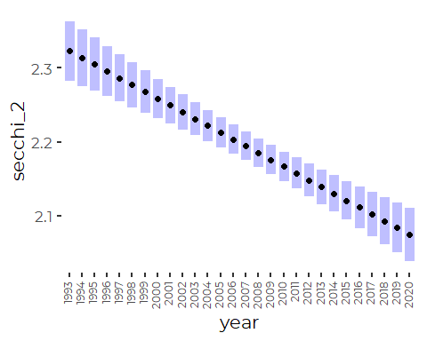

    #> Warning in if (!is.na(preds[[1]])) {: the condition has length > 1 and only the
    #> first element will be used

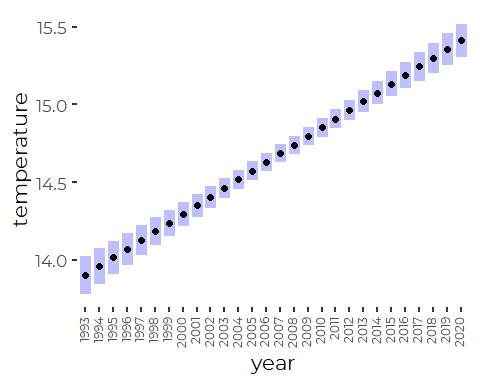

    #> Warning in if (!is.na(preds[[1]])) {: the condition has length > 1 and only the
    #> first element will be used

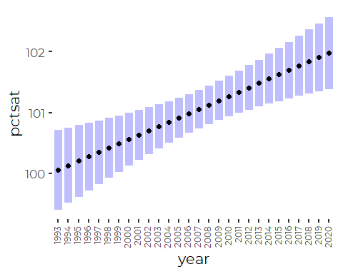

``` r
my_plot_fxn <- function(dat, preds, label, units, ann) {
  
  p <- ggplot(dat, aes(x = year)) +
    geom_jitter(aes(y = value), 
                width = 0.25, height = 0,
                color = cbep_colors()[1], alpha = 0.2) +
    geom_text(aes(x = 2022, y = 0.9 * max(dat$value)), 
             label = ann, hjust = 1)
  
  if (! is.na(preds[[1]])) {
    p <- p + 
      geom_ribbon(data = preds, mapping = aes(x = year, 
                                            ymin = lower.CL,
                                            ymax = upper.CL),
                fill = 'blue',
                alpha = 0.1) +
      geom_line(data = preds, mapping = aes(x = year, y = emmean),
              color = cbep_colors()[2], size  = 1) +
      ylab(paste0(label, ' (', units, ')'))
  }
   
  return(p)
}
```

When we add in the raw data, however, we can see how minor most of these
“significant” trends are when seen against bay-wide and season-wide
variability.

``` r
for (p in nested_data$parameter) {
  row <- nested_data[nested_data$parameter == p,] 
  d <- row$data[[1]]
  p <- row$emms[[1]]
  l <- row$label
  u <- row$units
  a <- row$annot
  
  print(my_plot_fxn(d,p,l,u,a))
}
#> Warning in if (!is.na(preds[[1]])) {: the condition has length > 1 and only the
#> first element will be used
#> Warning: Use of `dat$value` is discouraged. Use `value` instead.
#> Warning in if (!is.na(preds[[1]])) {: the condition has length > 1 and only the
#> first element will be used
```

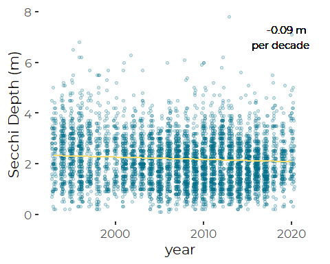

    #> Warning: Use of `dat$value` is discouraged. Use `value` instead.

    #> Warning: the condition has length > 1 and only the first element will be used

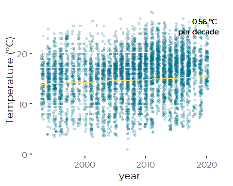

    #> Warning: Use of `dat$value` is discouraged. Use `value` instead.

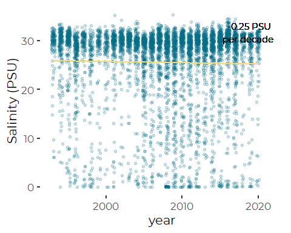

    #> Warning: Use of `dat$value` is discouraged. Use `value` instead.

    #> Warning: the condition has length > 1 and only the first element will be used

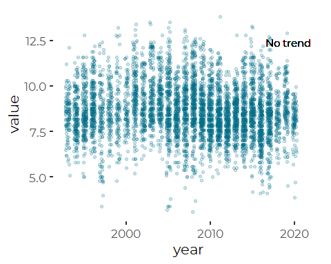

    #> Warning: Use of `dat$value` is discouraged. Use `value` instead.

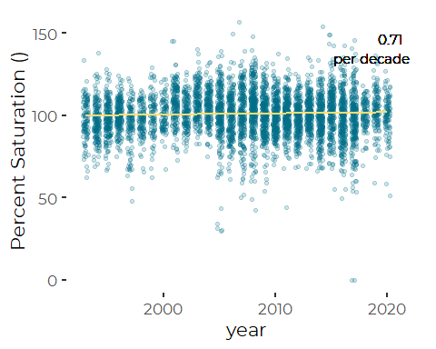

    #> Warning: Use of `dat$value` is discouraged. Use `value` instead.

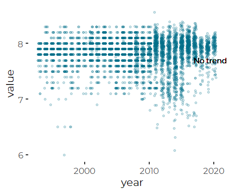

    #> Warning: Use of `dat$value` is discouraged. Use `value` instead.

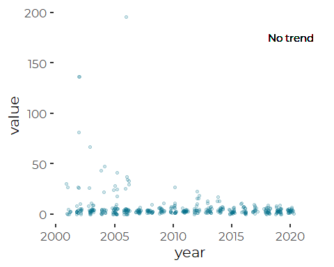
