Analysis of Water Quality Trends from Friends of Casco Bay Monitoring
================
Curtis C. Bohlen, Casco Bay Estuary Partnership
3/25/2021

-   [Introduction](#introduction)
-   [Load Libraries](#load-libraries)
-   [Load Data](#load-data)
    -   [Establish Folder Reference](#establish-folder-reference)
    -   [Primary Data](#primary-data)
        -   [Remove 2020 only data](#remove-2020-only-data)
    -   [Add Station Names](#add-station-names)
    -   [Add Day of Year Value](#add-day-of-year-value)
    -   [Address Secchi Censored
        Values](#address-secchi-censored-values)
    -   [Prevalence of Parameters by
        Year](#prevalence-of-parameters-by-year)
    -   [Transform the Secchi and Chlorophyll A
        Data](#transform-the-secchi-and-chlorophyll-a-data)
-   [Analysis of Trends](#analysis-of-trends)
    -   [Create Trend Data](#create-trend-data)
    -   [Chlorophyll Data Limited to Long-term Sites
        Only](#chlorophyll-data-limited-to-long-term-sites-only)
    -   [Construct Nested Tibble](#construct-nested-tibble)
-   [Overall Trend](#overall-trend)
-   [Hierarchical models](#hierarchical-models)
    -   [Diagnostic Plots](#diagnostic-plots)
    -   [Compare Hierarchical Models](#compare-hierarchical-models)
    -   [Intereaction Plots](#intereaction-plots)
-   [GAM models](#gam-models)
    -   [Discussion](#discussion)
-   [Impact of Unevean Sampling On Chlorophyll
    Models](#impact-of-unevean-sampling-on-chlorophyll-models)
-   [Clean Up `nested_data`](#clean-up-nested_data)
-   [Final Model Review](#final-model-review)
    -   [ANOVAs](#anovas)
    -   [Slopes](#slopes)
-   [Build Graphics](#build-graphics)
    -   [Create Annotations](#create-annotations)
-   [Extract Predictions for Statistically Significant
    Trends](#extract-predictions-for-statistically-significant-trends)
    -   [Create Predictions](#create-predictions)
        -   [Check results](#check-results)
        -   [Check Chlorophyll](#check-chlorophyll)
    -   [Create Transform Objects](#create-transform-objects)
    -   [Create Plotting Function](#create-plotting-function)
-   [Generate Graphics](#generate-graphics)


# Introduction

This Notebook analyzes FOCB’s “Surface” data. These data are pulled from
long term monitoring locations around the Bay.

These are sites visited regularly by FOCB staff, either by boat or on
land. The focus is on warm season sampling (April through October), with
roughly monthly samples. Earlier data from some land-based sites was
collected by volunteers.

This reflects only a small portion of FOCB’s monitoring program, but the
surface data provides consistent sampling history with the deepest
historical record.

# Load Libraries

``` r
library(tidyverse)
#> -- Attaching packages --------------------------------------- tidyverse 1.3.0 --
#> v ggplot2 3.3.3     v purrr   0.3.4
#> v tibble  3.0.5     v dplyr   1.0.3
#> v tidyr   1.1.2     v stringr 1.4.0
#> v readr   1.4.0     v forcats 0.5.0
#> -- Conflicts ------------------------------------------ tidyverse_conflicts() --
#> x dplyr::filter() masks stats::filter()
#> x dplyr::lag()    masks stats::lag()
library(readxl)

library(mgcv)     # For `gam()` and `gamm()` models
#> Loading required package: nlme
#> 
#> Attaching package: 'nlme'
#> The following object is masked from 'package:dplyr':
#> 
#>     collapse
#> This is mgcv 1.8-33. For overview type 'help("mgcv-package")'.
library(emmeans)

library(CBEPgraphics)
load_cbep_fonts()
theme_set(theme_cbep())
```

# Load Data

## Establish Folder Reference

``` r
sibfldnm <- 'Original_Data'
parent   <- dirname(getwd())
sibling  <- file.path(parent,sibfldnm)

dir.create(file.path(getwd(), 'figures'), showWarnings = FALSE)
```

## Primary Data

We specify column names because FOCB data has a row of names, a row of
units, then the data. This approach is simpler than reading names from
the first row and correcting them to be R syntactic names.

``` r
fn    <- 'FOCB Surface All Current Sites With BSV Data.xlsx'
fpath <- file.path(sibling,fn)

mynames <- c('station', 'dt', 'time', 'sample_depth',
             'secchi', 'water_depth','temperature', 'salinity',
             'do', 'pctsat', 'pH', 'chl', 
             'month', 'year', 'fdom', 'bga', 
             'turbidity', 'blank', 'clouds', 'wndspd',
             'winddir'
             ) 

the_data <- read_excel(fpath, skip=2, col_names = mynames) %>%
  mutate(month = factor(month, levels = 1:12, labels = month.abb))

rm(mynames)
```

### Remove 2020 only data

``` r
the_data <- the_data %>%
select(-c(fdom:winddir))
```

## Add Station Names

``` r
fn    <- 'FOCB Monitoring Sites.xlsx'
fpath <- file.path(sibling,fn)
loc_data <- read_excel(fpath) %>%
  select(Station_ID, Station_Name) %>%
  rename(station = Station_ID,
         station_name = Station_Name)

the_data <- the_data %>%
  left_join(loc_data, by = 'station') %>%
  relocate(station_name, .after = station) %>%
  
  relocate(year, .after = dt) %>%
  relocate(month, .after = year)
```

Our data contains two stations that are not associated with locations
that were included in our spatial data. We can see that because when we
`left_join()` by `station`, no `station_name` is carried over.

``` r
l <- the_data %>%
  group_by(station) %>%
  summarize(missing = sum(is.na(station_name))) %>%
  filter(missing > 0) %>%
  pull(station)
l
#> [1] "CMS3"  "P6CBI"
```

If we look at those records, one is represented by only a single
observation, and the other only by data from 2020. Neither matter for
the current analysis. They will get filtered out when we select data to
describe recent conditions, and trends.

``` r
the_data %>%
  filter(station %in% l)
#> # A tibble: 7 x 15
#>   station station_name dt                   year month time               
#>   <chr>   <chr>        <dttm>              <dbl> <fct> <dttm>             
#> 1 P6CBI   <NA>         2006-09-13 00:00:00  2006 Sep   1899-12-31 11:40:00
#> 2 CMS3    <NA>         2020-06-17 00:00:00  2020 Jun   1899-12-31 11:22:54
#> 3 CMS3    <NA>         2020-07-15 00:00:00  2020 Jul   1899-12-31 11:08:08
#> 4 CMS3    <NA>         2020-07-30 00:00:00  2020 Jul   1899-12-31 11:39:33
#> 5 CMS3    <NA>         2020-08-19 00:00:00  2020 Aug   1899-12-31 11:36:38
#> 6 CMS3    <NA>         2020-09-17 00:00:00  2020 Sep   1899-12-31 11:52:14
#> 7 CMS3    <NA>         2020-10-05 00:00:00  2020 Oct   1899-12-31 11:23:21
#> # ... with 9 more variables: sample_depth <dbl>, secchi <chr>,
#> #   water_depth <dbl>, temperature <dbl>, salinity <dbl>, do <dbl>,
#> #   pctsat <dbl>, pH <dbl>, chl <dbl>
```

## Add Day of Year Value

``` r
the_data <- the_data %>%
  mutate(doy = as.numeric(format(dt, '%j'))) %>%
  relocate(doy, .after = dt)
```

## Address Secchi Censored Values

``` r
the_data <- the_data %>%
  mutate(secchi_2 = if_else(secchi == "BSV", water_depth, as.numeric(secchi)),
         bottom_flag = secchi == "BSV") %>%
  relocate(secchi_2, .after = secchi) %>%
  relocate(bottom_flag, .after = secchi_2)
#> Warning: Problem with `mutate()` input `secchi_2`.
#> i NAs introduced by coercion
#> i Input `secchi_2` is `if_else(secchi == "BSV", water_depth, as.numeric(secchi))`.
```

## Prevalence of Parameters by Year

``` r
tmp <- the_data %>%
  select(-dt, -time, -month, -sample_depth, 
         -secchi, - bottom_flag) %>%
  relocate(water_depth, .after = year) %>%
  pivot_longer(c(secchi_2:chl), names_to = 'parameter', values_to = 'value') %>%
  filter(! is.na(value)) %>%
  group_by(parameter)

xtabs(~ year + parameter, data = tmp)
#>       parameter
#> year   chl  do pctsat  pH salinity secchi_2 temperature
#>   1993   0 112    111  74      112       98         113
#>   1994   0 178    174 136      177      168         182
#>   1995   0 192    191 150      197      177         198
#>   1996   4 216    216 126      223      198         223
#>   1997   0 123    122  99      122      115         123
#>   1998   0 113    113  87      114      105         114
#>   1999   0  95     95  79       99       92          99
#>   2000   0  95     94  74       96       89          96
#>   2001   9 175    172 170      175      170         177
#>   2002  24 143    143 140      163      153         162
#>   2003  27 180    179 175      181      178         183
#>   2004  17 173    173 174      187      181         187
#>   2005  30 247    247 239      248      219         248
#>   2006  30 229    228 226      231      204         231
#>   2007  20 246    246 251      254      226         254
#>   2008  90 297    297 294      303      269         303
#>   2009  54 272    270 274      276      241         278
#>   2010  41 282    275 279      281      262         288
#>   2011  36 283    277 280      279      261         286
#>   2012  42 249    248 245      250      241         251
#>   2013  21 247    245 236      247      245         249
#>   2014  27 285    284 280      290      267         291
#>   2015  25 267    262 266      271      255         277
#>   2016  25 305    298 257      303      290         310
#>   2017  40 285    282 217      273      240         285
#>   2018 137 137    137 137      137      131         137
#>   2019 186 186    186 186      186      172         186
#>   2020 151 151    151 151      151      132         151
rm(tmp)
```

So note that Chlorophyll data is available going back to 2001, but from
relatively few samples until 2018. We may want to limit Chlorophyll
Analysis to the long-term sites.

``` r
tmp <- the_data %>%
  select(station, year, chl) %>%
  filter(! is.na(chl)) %>%
  mutate(station = factor(station),
         station = fct_reorder(station, chl, length))
xtabs(~year + station, data = tmp)
#>       station
#> year   P6CBI CMS3 OBY35 PYC43 RRC46 MPL86 PH3 PKT42 CMS1 PH1 HR2 PH2 HR4 BMR02
#>   1996     0    0     0     0     0     0   0     0    0   0   2   0   0     0
#>   2001     0    0     0     0     0     0   0     0    0   0   0   0   0     0
#>   2002     0    0     0     0     0     0   0     0    0   0   0   0   0     0
#>   2003     0    0     0     0     0     0   0     0    0   0   0   0   0     0
#>   2004     0    0     0     0     0     0   0     0    0   0   0   0   0     0
#>   2005     0    0     0     0     0     0   0     0    0   0   0   0   0     0
#>   2006     1    0     0     0     0     0   0     0    0   0   0   0   0     0
#>   2007     0    0     0     0     0     0   0     0    0   0   0   0   0     0
#>   2008     0    0     0     0     0     0   0     0    0   0   0   0   0     0
#>   2009     0    0     0     0     0     0   0     0    0   0   0   0   2     0
#>   2010     0    0     0     0     0     0   0     0    0   0   0   0   3     0
#>   2011     0    0     0     0     0     0   0     0    0   0   0   0   2     0
#>   2012     0    0     0     0     0     0   0     0    0   0   0   0   3     0
#>   2013     0    0     0     0     0     0   0     0    0   0   0   0   0     0
#>   2014     0    0     0     0     0     0   0     0    0   0   4   0   0     0
#>   2015     0    0     0     0     0     0   0     0    0   0   2   0   0     0
#>   2016     0    0     0     0     0     0   0     0    0   0   4   0   0     0
#>   2017     0    0     0     0     0     0   1     0    0   1   4   1   0     5
#>   2018     0    0     5     5     5     7   6     7    8   7   6   7   0     7
#>   2019     0    0     7     7     9     9   8     9    9   9   3   9   9     9
#>   2020     0    6     6     6     6     7   8     7    7   7   0   8   7     6
#>       station
#> year   NMM79 RRY47 STR54 KVL84 HR1 EEB18 PRV70 SMT50 P5BSD P6FGG P7CBI
#>   1996     0     0     0     0   2     0     0     0     0     0     0
#>   2001     0     0     0     0   0     0     0     0     3     3     3
#>   2002     0     0     0     0   0     0     0     0     8     8     8
#>   2003     0     0     0     0   0     0     0     0     9     9     9
#>   2004     0     0     0     0   0     0     0     0     5     6     6
#>   2005     0     0     0     0   0     0     0     0    10    10    10
#>   2006     0     0     0     0   0     0     0     0     9    10    10
#>   2007     0     0     0     0   0     0     0     0     6     7     7
#>   2008     0     0     0    23   0     0    23    23     7     7     7
#>   2009     2     2     7     8   0     8     0     7     6     6     6
#>   2010     3     3     3     3   0     3     0     2     7     7     7
#>   2011     2     2     2     2   0     2     2     1     7     7     7
#>   2012     3     3     2     3   0     3     3     2     7     6     7
#>   2013     0     0     0     0   0     0     0     0     7     7     7
#>   2014     0     0     0     0   4     0     0     0     5     7     7
#>   2015     0     0     0     0   2     0     0     0     7     7     7
#>   2016     0     0     0     0   3     0     0     0     4     7     7
#>   2017     0     0     0     0   8     5     2     0     1     6     6
#>   2018     7     7     6     0   6     8     5     4     8     8     8
#>   2019     9     9     9     0   9     9     8     9     9     9     9
#>   2020     7     7     7     0   6     7     5     7     7     8     9
rm(tmp)
```

So frequent chlorophyll data is available since 2001 from three sites:

P5BSD P6FGG P7CBI

## Transform the Secchi and Chlorophyll A Data

We create a square root transform of the Secchi data, and both log() and
log(X + 1) transformed version of the Chlorophyll data here. That allows
us to conduct analyses of transformed and untransformed data in
parallel.

The choice of transform for chlorophyll has significant import, as it
determines whether chlorophyll is considered to have a significant
long-term trend or not. This confusing situation is driven by fifteen
nominal “zero” values in the data from early in the data record. These
records have fairly high leverage and the way they are handled
determines the nominal “significance” of a long-term decline in
chlorophyll values.

We examined a number of different ways to handle those records
(replacing them with arbitrary non-zero values, using various
transforms) and the bottom line is that choice of methods determines
significance of the long-term trend.

See `Surface_Analysis_Chlorophyll_Trends.Rmd` for details of different
transforms. In sum, log() transform drops the zero values, and shows a
significant decline in chlorophyll. log(x+1) transform retains all data
points and also shows a significant trend, but log(X + 0.5) and log(X +
0.25) transforms (which each give more weight to those nominal “zero”
values) do not.

``` r
the_data <- the_data %>%
  mutate(sqrt_secchi = sqrt(secchi_2),
         log_chl = log(chl),
         log1_chl = log1p(chl)) %>%
  mutate(log_chl = if_else(is.infinite(log_chl) | is.nan(log_chl),
                           NA_real_, log_chl)) %>%
  relocate(sqrt_secchi, .after = secchi_2) %>%
  relocate(log_chl, log1_chl, .after = chl)
#> Warning: Problem with `mutate()` input `log_chl`.
#> i NaNs produced
#> i Input `log_chl` is `log(chl)`.
```

# Analysis of Trends

Our goal here is to identify whether there are long-term trends in water
quality. Initially, it is not clear whether the question applies
site-by-site, regionally, or bay-wide,

We see less evidence here than in the Long Creek example of significant
year to year differences in condition. Accordingly, it is not yet clear
if we need hierarchical models that include a random term for the year
or not.

## Create Trend Data

First, we create a tibble containing information on years in which each
station was sampled.

``` r
years_data <- the_data %>%
  group_by(station, year) %>%
  summarize(yes = ! all(is.na(temperature)),
            .groups = 'drop_last') %>%
  summarize(years = sum(yes, na.rm = TRUE),
            recent_years =  sum(yes & year > 2014, na.rm = TRUE),
            .groups = 'drop')
```

Then we identify stations with at least 10 years of data, and at least
three years of data from the last five years, and use that list to
select data for trend analysis. Finally, we adjust the levels in the
`station` and `station_name` variables.

``` r
selected_stations <- years_data %>%
  filter(years> 9, recent_years >2) %>%
  pull(station)

trend_data <- the_data %>%
  filter(station %in% selected_stations) %>%
  mutate(station = fct_drop(station),
         station_name = fct_drop(station_name)) %>%
  mutate(station = fct_reorder(station, temperature, mean, na.rm = TRUE),
         station_name = fct_reorder(station_name, temperature, mean, na.rm = TRUE))
rm(selected_stations, years_data)
```

``` r
length(unique(trend_data$station))
#> [1] 17
```

We are reduced to only 17 stations with long-term records for trend
analysis. We noted above that we have limited chlorophyll data before
the last couple of years. We address that momentarily

## Chlorophyll Data Limited to Long-term Sites Only

Coverage of chlorophyll data is sparse prior to 2007, and uneven at most
stations since. We create more limited (transformed) chlorophyll data
sets, focusing only on the three sites for which we have long-term data.

``` r
trend_data <- trend_data %>%
  mutate(log_chl_2 = if_else(station %in% c('P5BSD', 'P6FGG', 'P7CBI'),
                                   log_chl, NA_real_)) %>%
  mutate(log1_chl_2 = if_else(station %in% c('P5BSD', 'P6FGG', 'P7CBI'),
                                   log1_chl, NA_real_)) %>%
  relocate(log_chl_2, log1_chl_2, .after = log1_chl)
```

## Construct Nested Tibble

``` r
units <- tibble(parameter = c('secchi_2', 'sqrt_secchi', 'temperature', 
                              'salinity', 'do',
                              'pctsat', 'pH', 
                              'chl', 'log_chl', 
                              'log_chl_2', 'log1_chl', 
                              'log1_chl_2'),
                label = c("Secchi Depth", "Sqrt Secchi Depth", "Temperature",
                         "Salinity", "Dissolved Oxygen",
                         "Percent Saturation", "pH",
                         "Chlorophyll A", "Log(Chlorophyll A)", 
                         "Log(Chlorophyll A)", "Log(Chlorophyll A plus 1)", 
                         "Log( Chlorophyll A plus 1)"),
                units = c('m', 'm', paste0("\U00B0", "C"),
                          'PSU', 'mg/l',
                          '', '',
                          'mg/l', 'mg/l', 
                          'mg/l', 'mg/l',
                          'mg/l'))

nested_data <- trend_data %>%
  select(-time, -sample_depth, 
         -secchi) %>%
  mutate(year_f = factor(year)) %>%
  select(-water_depth) %>%
  relocate(bottom_flag, .after = month) %>%
  
  pivot_longer(c(secchi_2:log1_chl_2), names_to = 'parameter', 
               values_to = 'value') %>%
  filter(! is.na(value)) %>%
  
  # This allows us to ensure the order of the rows in the nested tibble
  mutate(parameter = factor(parameter,
                            levels = c('secchi_2', 'sqrt_secchi', 'temperature',
                                       'salinity', 'do',
                                       'pctsat', 'pH',
                                       'chl', 'log_chl',
                                       'log_chl_2', 'log1_chl', 'log1_chl_2'))) %>%

  # change all `bottom_flag` values to FALSE except for secchi_2 df 
  # this allows selective coloring in later graphics
  mutate(bottom_flag = if_else(parameter != 'secchi_2', FALSE, bottom_flag)) %>%
  group_by(parameter) %>%
  nest() %>%
  arrange(parameter) %>%
  left_join(units, by = 'parameter')
```

# Overall Trend

We treat stations as random exemplars of possible stations, and thus
rely on hierarchical models. We could run simple regressions based on
summary statistics of the trend data, but a nested model – for MOST of
these variables – will better address station by station uncertainty.

Our analysis of recent data showed significant year to year variation
across sites. it is not entirely clear whether a random year term is
needed or appropriate. We include it in our initial model explorations
to see if it better controls for heavy-tailed distributions.

# Hierarchical models

We use a GAM model with a random factor smoothing term. We could just as
well use `lmer()` or `lme()`. The GAM framework makes it easier to
evaluate smoothers for the year to year variation. We restrict ourselves
to linear trends by year, but explore several ways of modeling
seasonality, including a polynomial model by day of the year, a simple
model my month, and an interaction model by month.

The primary purpose of modeling seasonality here is to remove data
variability, but it introduces complexity because the long-term trends
are expected to vary by season.

``` r
nested_data <- nested_data %>%
  mutate(lmers = map(data, function(df) gam(value ~ year + 
                                              month + 
                                              #s(year_f, bs = 're') +
                                              s(station, bs = 're'), 
                                            data = df))) %>%
  mutate(lmers_2 = map(data, function(df) gam(value ~ year + 
                                              month + year:month +
                                              #s(year_f, bs = 're') +
                                              s(station, bs = 're'), 
                                            data = df)))  #%>%
  # mutate(polys = map(data, function(df) gam(value ~ year + poly(doy,3) +
  #                                             s(station, bs = 're'), 
  #                                           data = df)))
```

## Diagnostic Plots

We focus on the simpler model. Others should be similar or slightly
better.

``` r
for (p in nested_data$parameter) {
  cat('\n')
  cat(p)
  cat('\n')
  gam.check(nested_data$lmers[nested_data$parameter == p][[1]],
       sub = p)
}
#> 
#> secchi_2
```

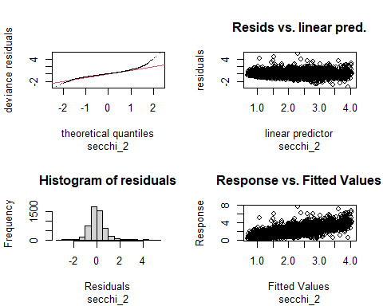

    #> 
    #> Method: GCV   Optimizer: magic
    #> Smoothing parameter selection converged after 11 iterations.
    #> The RMS GCV score gradient at convergence was 1.185041e-06 .
    #> The Hessian was positive definite.
    #> Model rank =  25 / 25 
    #> 
    #> Basis dimension (k) checking results. Low p-value (k-index<1) may
    #> indicate that k is too low, especially if edf is close to k'.
    #> 
    #>            k' edf k-index p-value
    #> s(station) 17  16      NA      NA
    #> 
    #> sqrt_secchi

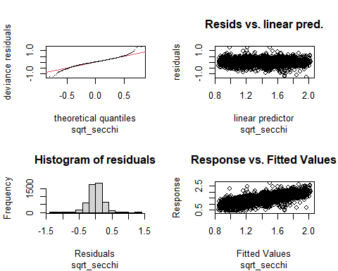

    #> 
    #> Method: GCV   Optimizer: magic
    #> Smoothing parameter selection converged after 10 iterations.
    #> The RMS GCV score gradient at convergence was 6.36454e-07 .
    #> The Hessian was positive definite.
    #> Model rank =  25 / 25 
    #> 
    #> Basis dimension (k) checking results. Low p-value (k-index<1) may
    #> indicate that k is too low, especially if edf is close to k'.
    #> 
    #>            k' edf k-index p-value
    #> s(station) 17  16      NA      NA
    #> 
    #> temperature

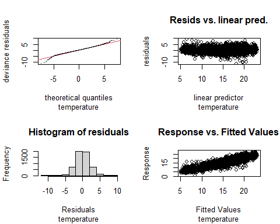

    #> 
    #> Method: GCV   Optimizer: magic
    #> Smoothing parameter selection converged after 10 iterations.
    #> The RMS GCV score gradient at convergence was 1.03424e-05 .
    #> The Hessian was positive definite.
    #> Model rank =  25 / 25 
    #> 
    #> Basis dimension (k) checking results. Low p-value (k-index<1) may
    #> indicate that k is too low, especially if edf is close to k'.
    #> 
    #>              k'  edf k-index p-value
    #> s(station) 17.0 15.9      NA      NA
    #> 
    #> salinity


    #> 
    #> Method: GCV   Optimizer: magic
    #> Smoothing parameter selection converged after 12 iterations.
    #> The RMS GCV score gradient at convergence was 1.505316e-05 .
    #> The Hessian was positive definite.
    #> Model rank =  25 / 25 
    #> 
    #> Basis dimension (k) checking results. Low p-value (k-index<1) may
    #> indicate that k is too low, especially if edf is close to k'.
    #> 
    #>            k' edf k-index p-value
    #> s(station) 17  16      NA      NA
    #> 
    #> do


    #> 
    #> Method: GCV   Optimizer: magic
    #> Smoothing parameter selection converged after 10 iterations.
    #> The RMS GCV score gradient at convergence was 2.284111e-06 .
    #> The Hessian was positive definite.
    #> Model rank =  25 / 25 
    #> 
    #> Basis dimension (k) checking results. Low p-value (k-index<1) may
    #> indicate that k is too low, especially if edf is close to k'.
    #> 
    #>              k'  edf k-index p-value
    #> s(station) 17.0 15.9      NA      NA
    #> 
    #> pctsat

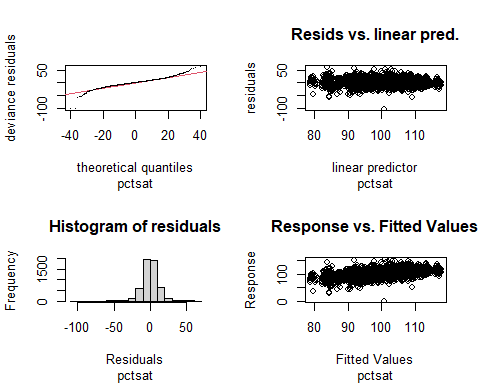

    #> 
    #> Method: GCV   Optimizer: magic
    #> Smoothing parameter selection converged after 10 iterations.
    #> The RMS GCV score gradient at convergence was 0.0001669878 .
    #> The Hessian was positive definite.
    #> Model rank =  25 / 25 
    #> 
    #> Basis dimension (k) checking results. Low p-value (k-index<1) may
    #> indicate that k is too low, especially if edf is close to k'.
    #> 
    #>              k'  edf k-index p-value
    #> s(station) 17.0 15.9      NA      NA
    #> 
    #> pH

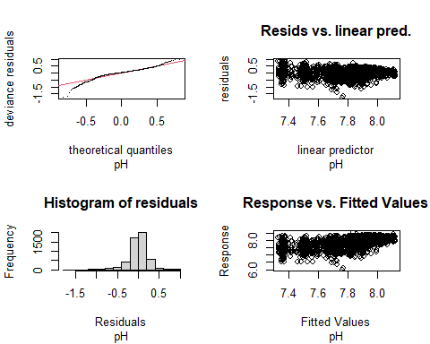

    #> 
    #> Method: GCV   Optimizer: magic
    #> Smoothing parameter selection converged after 8 iterations.
    #> The RMS GCV score gradient at convergence was 7.474632e-07 .
    #> The Hessian was positive definite.
    #> Model rank =  25 / 25 
    #> 
    #> Basis dimension (k) checking results. Low p-value (k-index<1) may
    #> indicate that k is too low, especially if edf is close to k'.
    #> 
    #>              k'  edf k-index p-value
    #> s(station) 17.0 15.9      NA      NA
    #> 
    #> chl

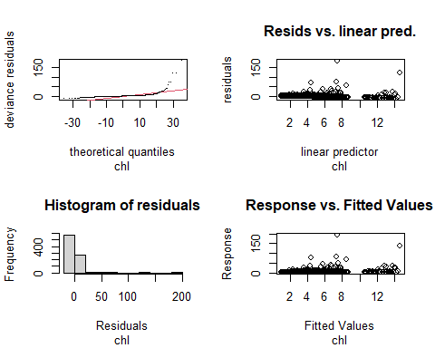

    #> 
    #> Method: GCV   Optimizer: magic
    #> Smoothing parameter selection converged after 5 iterations.
    #> The RMS GCV score gradient at convergence was 0.0001035701 .
    #> The Hessian was positive definite.
    #> Model rank =  25 / 25 
    #> 
    #> Basis dimension (k) checking results. Low p-value (k-index<1) may
    #> indicate that k is too low, especially if edf is close to k'.
    #> 
    #>               k'   edf k-index p-value
    #> s(station) 17.00  2.74      NA      NA
    #> 
    #> log_chl


    #> 
    #> Method: GCV   Optimizer: magic
    #> Smoothing parameter selection converged after 5 iterations.
    #> The RMS GCV score gradient at convergence was 2.027026e-06 .
    #> The Hessian was positive definite.
    #> Model rank =  25 / 25 
    #> 
    #> Basis dimension (k) checking results. Low p-value (k-index<1) may
    #> indicate that k is too low, especially if edf is close to k'.
    #> 
    #>              k'  edf k-index p-value
    #> s(station) 17.0 11.7      NA      NA
    #> 
    #> log_chl_2

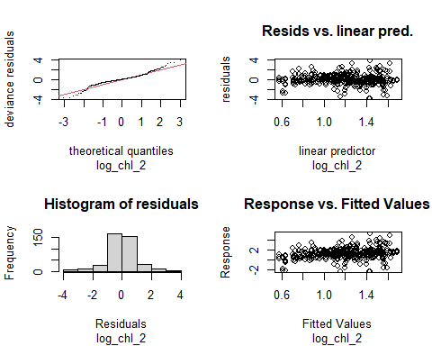

    #> 
    #> Method: GCV   Optimizer: magic
    #> Smoothing parameter selection converged after 9 iterations.
    #> The RMS GCV score gradient at convergence was 2.976352e-07 .
    #> The Hessian was positive definite.
    #> Model rank =  11 / 11 
    #> 
    #> Basis dimension (k) checking results. Low p-value (k-index<1) may
    #> indicate that k is too low, especially if edf is close to k'.
    #> 
    #>                  k'      edf k-index p-value
    #> s(station) 3.00e+00 4.48e-09      NA      NA
    #> 
    #> log1_chl

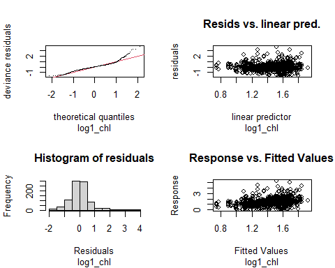

    #> 
    #> Method: GCV   Optimizer: magic
    #> Smoothing parameter selection converged after 4 iterations.
    #> The RMS GCV score gradient at convergence was 2.35561e-05 .
    #> The Hessian was positive definite.
    #> Model rank =  25 / 25 
    #> 
    #> Basis dimension (k) checking results. Low p-value (k-index<1) may
    #> indicate that k is too low, especially if edf is close to k'.
    #> 
    #>              k'  edf k-index p-value
    #> s(station) 17.0 10.7      NA      NA
    #> 
    #> log1_chl_2

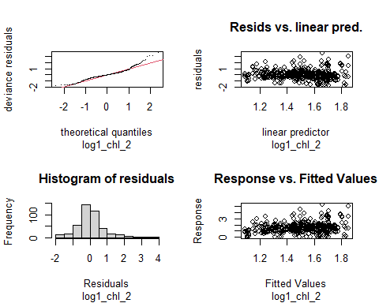

    #> 
    #> Method: GCV   Optimizer: magic
    #> Smoothing parameter selection converged after 9 iterations.
    #> The RMS GCV score gradient at convergence was 2.263978e-07 .
    #> The Hessian was positive definite.
    #> Model rank =  11 / 11 
    #> 
    #> Basis dimension (k) checking results. Low p-value (k-index<1) may
    #> indicate that k is too low, especially if edf is close to k'.
    #> 
    #>                  k'      edf k-index p-value
    #> s(station) 3.00e+00 1.61e-08      NA      NA

-   Secchi and the square root of secchi both have moderately heavy
    tails. The square root transform does slightly reduce skewness of
    the residuals, and reduces the tendency to heavy tails.  
-   Salinity shows evidence of a poor model missing significant sources
    of variability (large gaps in predicted salinity).  
-   pH also shows slight evidence of a problematic model, with higher
    errors at lower pH. That may reflect the influence of freshwater
    inflow on both variability and average pH, and so may reflect
    reality.  
-   Basically every other parameter here has moderately heavy tails, but
    the regressions show few other pathologies.  
-   In this setting, it is the log of chlorophyll A , not log of
    chlorophyll A plus one that provides the better distribution of
    model residuals. This contrasts with what performed better looking
    at data collected only over the past five years. However, some
    chlorophyll observations have a nominal value of zero, and at least
    one has a (very slightly) negative value. We either need to handle
    those observations as censored values (with no reported detection
    limit), or use the log(x + 1) transform anyway.

(We did look at the station random factors, and they look OK for
everything except salinity, where we have a couple of sites strongly
influenced by freshwater.)

## Compare Hierarchical Models

``` r
nested_data <- nested_data %>%
  mutate(compare = list(anova(# polys[[1]], 
                              lmers[[1]], lmers_2[[1]], test = 'LRT')))

names(nested_data$compare) <- nested_data$parameter
nested_data$compare
#> $secchi_2
#> Analysis of Deviance Table
#> 
#> Model 1: value ~ year + month + s(station, bs = "re")
#> Model 2: value ~ year + month + year:month + s(station, bs = "re")
#>   Resid. Df Resid. Dev Df Deviance  Pr(>Chi)    
#> 1      5150     2005.2                          
#> 2      5144     1992.1  6   13.048 7.711e-06 ***
#> ---
#> Signif. codes:  0 '***' 0.001 '**' 0.01 '*' 0.05 '.' 0.1 ' ' 1
#> 
#> $sqrt_secchi
#> Analysis of Deviance Table
#> 
#> Model 1: value ~ year + month + s(station, bs = "re")
#> Model 2: value ~ year + month + year:month + s(station, bs = "re")
#>   Resid. Df Resid. Dev Df Deviance  Pr(>Chi)    
#> 1      5150     245.38                          
#> 2      5144     243.77  6   1.6146 6.514e-06 ***
#> ---
#> Signif. codes:  0 '***' 0.001 '**' 0.01 '*' 0.05 '.' 0.1 ' ' 1
#> 
#> $temperature
#> Analysis of Deviance Table
#> 
#> Model 1: value ~ year + month + s(station, bs = "re")
#> Model 2: value ~ year + month + year:month + s(station, bs = "re")
#>   Resid. Df Resid. Dev Df Deviance  Pr(>Chi)    
#> 1      5620      22359                          
#> 2      5614      22265  6   94.555 0.0005583 ***
#> ---
#> Signif. codes:  0 '***' 0.001 '**' 0.01 '*' 0.05 '.' 0.1 ' ' 1
#> 
#> $salinity
#> Analysis of Deviance Table
#> 
#> Model 1: value ~ year + month + s(station, bs = "re")
#> Model 2: value ~ year + month + year:month + s(station, bs = "re")
#>   Resid. Df Resid. Dev Df Deviance Pr(>Chi)  
#> 1      5565      81961                       
#> 2      5559      81721  6   239.74  0.01219 *
#> ---
#> Signif. codes:  0 '***' 0.001 '**' 0.01 '*' 0.05 '.' 0.1 ' ' 1
#> 
#> $do
#> Analysis of Deviance Table
#> 
#> Model 1: value ~ year + month + s(station, bs = "re")
#> Model 2: value ~ year + month + year:month + s(station, bs = "re")
#>   Resid. Df Resid. Dev Df Deviance Pr(>Chi)
#> 1      5502     4401.2                     
#> 2      5496     4394.4  6   6.8085   0.2027
#> 
#> $pctsat
#> Analysis of Deviance Table
#> 
#> Model 1: value ~ year + month + s(station, bs = "re")
#> Model 2: value ~ year + month + year:month + s(station, bs = "re")
#>   Resid. Df Resid. Dev Df Deviance Pr(>Chi)
#> 1      5457     630711                     
#> 2      5451     629541  6   1169.9   0.1193
#> 
#> $pH
#> Analysis of Deviance Table
#> 
#> Model 1: value ~ year + month + s(station, bs = "re")
#> Model 2: value ~ year + month + year:month + s(station, bs = "re")
#>   Resid. Df Resid. Dev Df Deviance  Pr(>Chi)    
#> 1      5067     250.36                          
#> 2      5061     248.45  6   1.9087 7.552e-07 ***
#> ---
#> Signif. codes:  0 '***' 0.001 '**' 0.01 '*' 0.05 '.' 0.1 ' ' 1
#> 
#> $chl
#> Analysis of Deviance Table
#> 
#> Model 1: value ~ year + month + s(station, bs = "re")
#> Model 2: value ~ year + month + year:month + s(station, bs = "re")
#>   Resid. Df Resid. Dev     Df Deviance  Pr(>Chi)    
#> 1    855.15     102309                              
#> 2    848.79      95862 6.3605   6446.3 2.547e-10 ***
#> ---
#> Signif. codes:  0 '***' 0.001 '**' 0.01 '*' 0.05 '.' 0.1 ' ' 1
#> 
#> $log_chl
#> Analysis of Deviance Table
#> 
#> Model 1: value ~ year + month + s(station, bs = "re")
#> Model 2: value ~ year + month + year:month + s(station, bs = "re")
#>   Resid. Df Resid. Dev     Df Deviance Pr(>Chi)    
#> 1    828.34     634.29                             
#> 2    822.22     594.20 6.1257   40.084 3.97e-10 ***
#> ---
#> Signif. codes:  0 '***' 0.001 '**' 0.01 '*' 0.05 '.' 0.1 ' ' 1
#> 
#> $log_chl_2
#> Analysis of Deviance Table
#> 
#> Model 1: value ~ year + month + s(station, bs = "re")
#> Model 2: value ~ year + month + year:month + s(station, bs = "re")
#>   Resid. Df Resid. Dev Df Deviance  Pr(>Chi)    
#> 1       401     405.90                          
#> 2       395     382.58  6   23.323 0.0005047 ***
#> ---
#> Signif. codes:  0 '***' 0.001 '**' 0.01 '*' 0.05 '.' 0.1 ' ' 1
#> 
#> $log1_chl
#> Analysis of Deviance Table
#> 
#> Model 1: value ~ year + month + s(station, bs = "re")
#> Model 2: value ~ year + month + year:month + s(station, bs = "re")
#>   Resid. Df Resid. Dev     Df Deviance Pr(>Chi)    
#> 1    845.95     364.34                             
#> 2    839.71     340.15 6.2425   24.191 6.24e-11 ***
#> ---
#> Signif. codes:  0 '***' 0.001 '**' 0.01 '*' 0.05 '.' 0.1 ' ' 1
#> 
#> $log1_chl_2
#> Analysis of Deviance Table
#> 
#> Model 1: value ~ year + month + s(station, bs = "re")
#> Model 2: value ~ year + month + year:month + s(station, bs = "re")
#>   Resid. Df Resid. Dev     Df Deviance  Pr(>Chi)    
#> 1    416.00     257.17                              
#> 2    409.77     240.05 6.2339   17.118 6.804e-05 ***
#> ---
#> Signif. codes:  0 '***' 0.001 '**' 0.01 '*' 0.05 '.' 0.1 ' ' 1
```

The interaction model is a better fit almost always. The exceptions are
dissolved oxygen and percent saturation.

That poses significant challenges for presentation in State of the Bay.
Given the high level of variability in the data, we can’t present
multiple trend lines in a single plot. So the question is, how do we
present the complexity of seasonal changes without overwhelming our
readers?

## Intereaction Plots

We need to look dig into these patterns with interaction plots and
decide how to simplify our findings for State of Casco Bay.

``` r
nested_data <- nested_data %>%
  mutate(emmi = map(lmers_2, function(mod) emmip(mod, month ~ year, 
                                                  at = list(year = 1993:2020)))) %>%
  mutate(emmi = list(emmi[[1]] + ggtitle(parameter)))
```

``` r
print(nested_data$emmi)
#> [[1]]
```

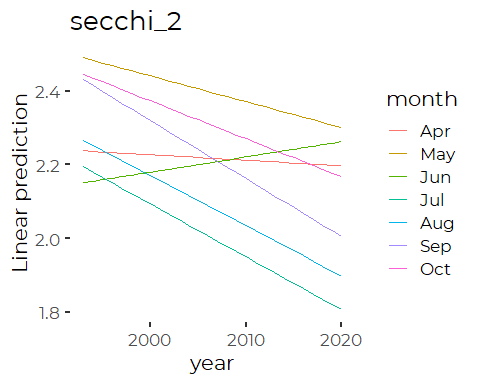

    #> 
    #> [[2]]

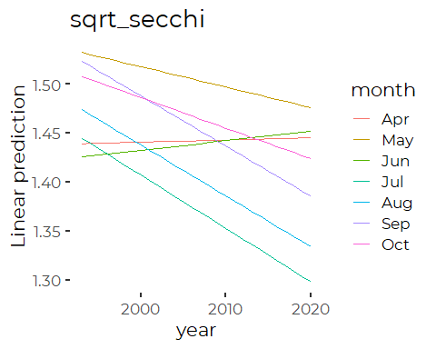

    #> 
    #> [[3]]

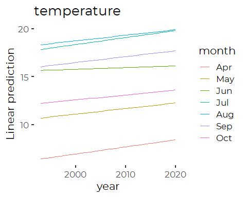

    #> 
    #> [[4]]

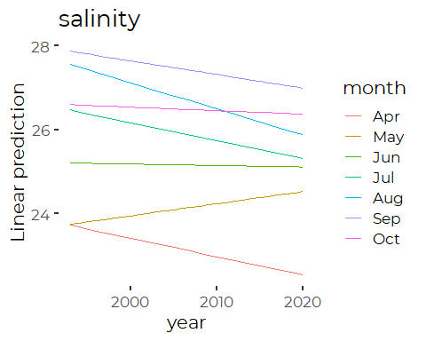

    #> 
    #> [[5]]

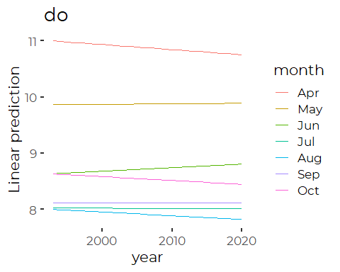

    #> 
    #> [[6]]


    #> 
    #> [[7]]

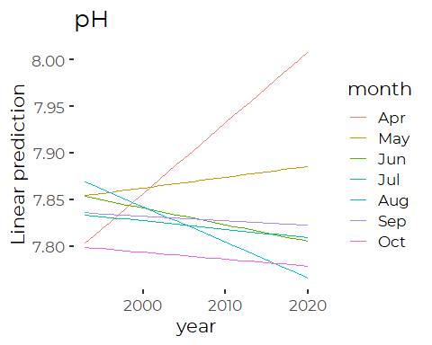

    #> 
    #> [[8]]

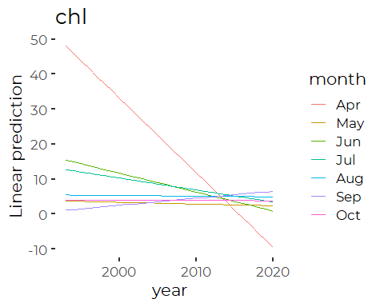

    #> 
    #> [[9]]

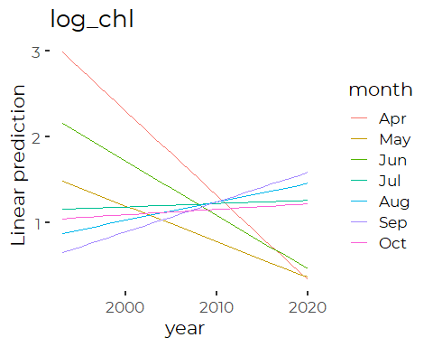

    #> 
    #> [[10]]

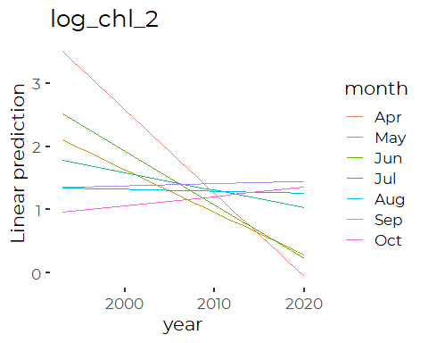

    #> 
    #> [[11]]

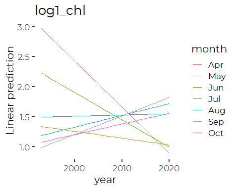

    #> 
    #> [[12]]

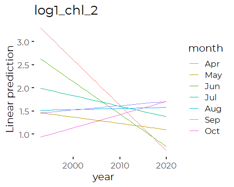

For most of those, there is one month, often April, that behaves
differently. Generally, April, May, and June sometimes do things
differently. Chlorophyll is an exception, where there appears to be a
summer-long seasonal pattern to the changes.

# GAM models

We may be better off examining GAM models by day of year. The
interaction term may help identify patterns without being distracted by
the month designations,

We fit the models with simple tensor smoothing terms. Using interaction
tensor terms showed that the interaction term was significant in all
cases. But the results are hard to interpret. Her we show only a fairly
low dimension GAM tensor interaction fit, to figure out what is going on
seasonally.

``` r
nested_data <- nested_data %>%
  mutate(gams = map(data, function(df) gam(value ~ te(year, doy, k = 4) +
                                              s(station, bs = 're'), 
                                            data = df)))
```

``` r
for (p in nested_data$parameter) {
  plot(nested_data$gams[nested_data$parameter == p][[1]])
  title(sub = p)
}
```

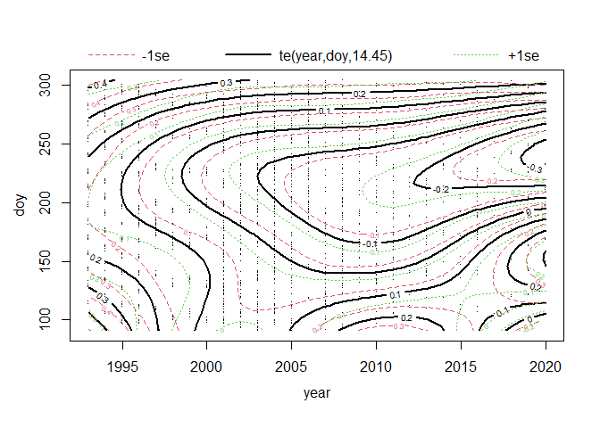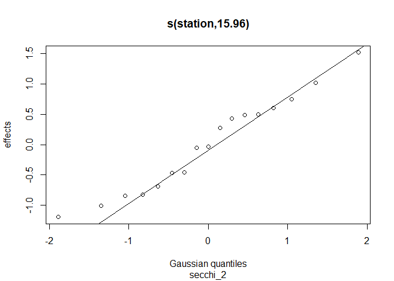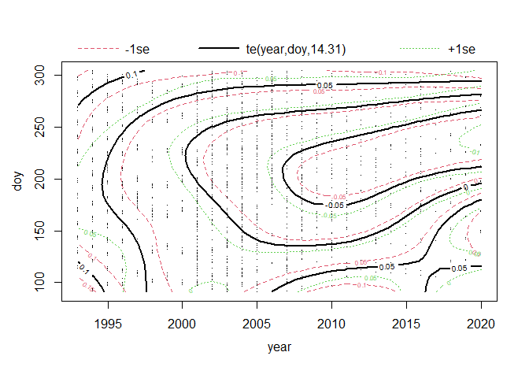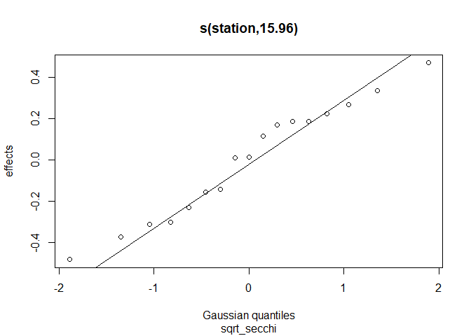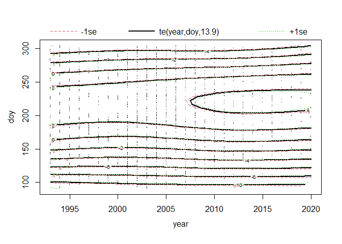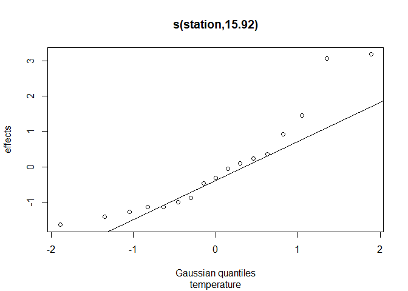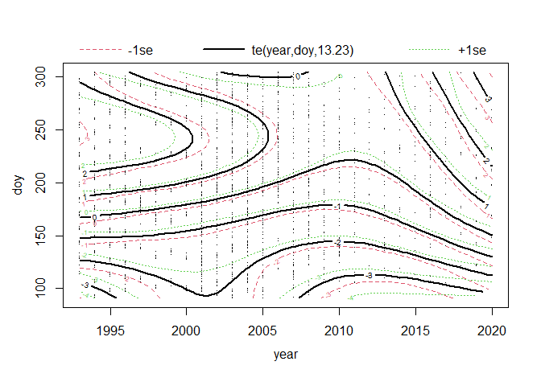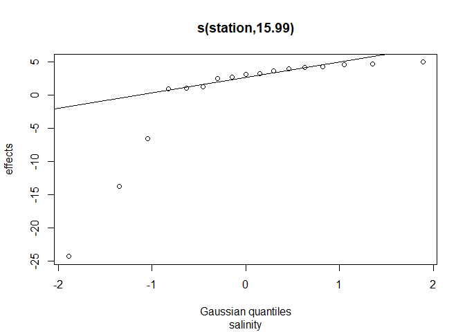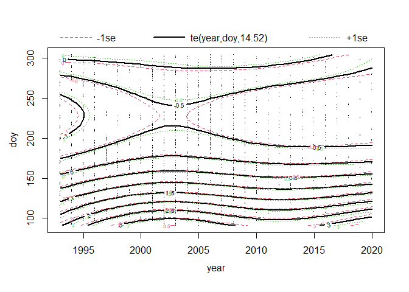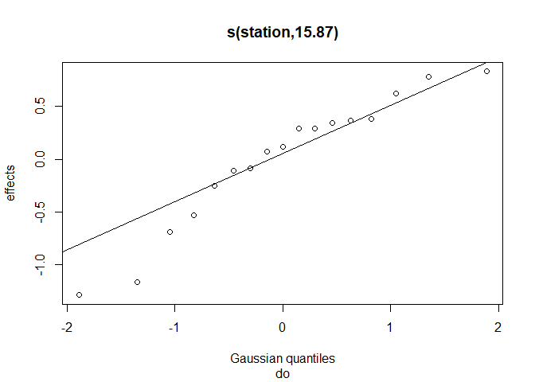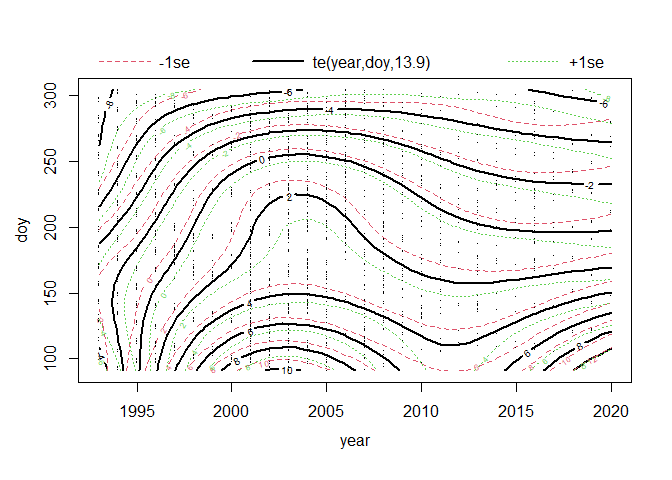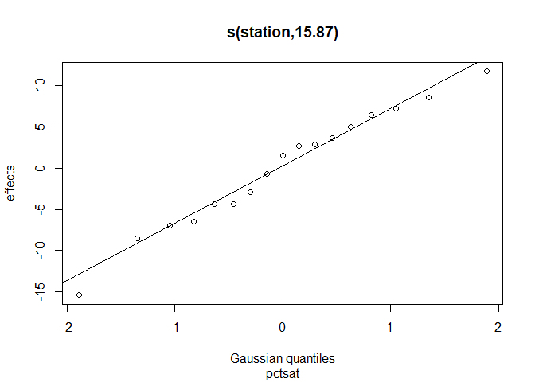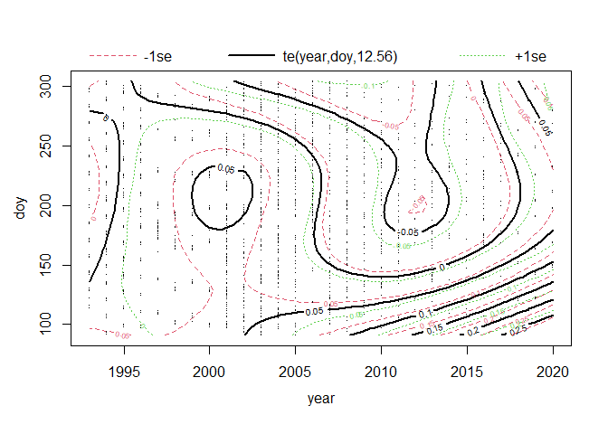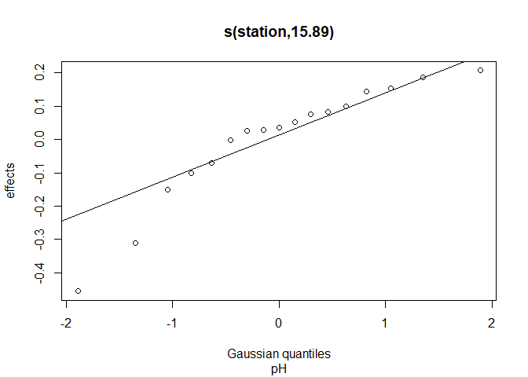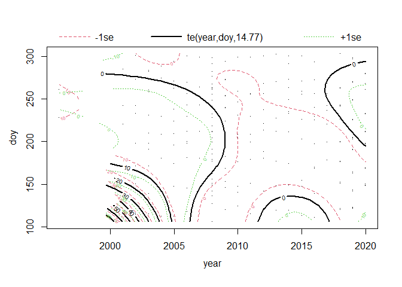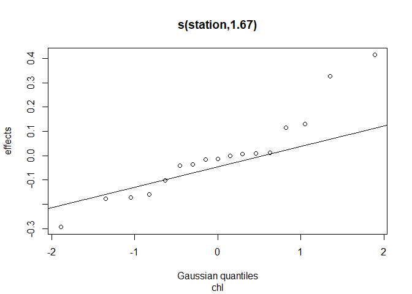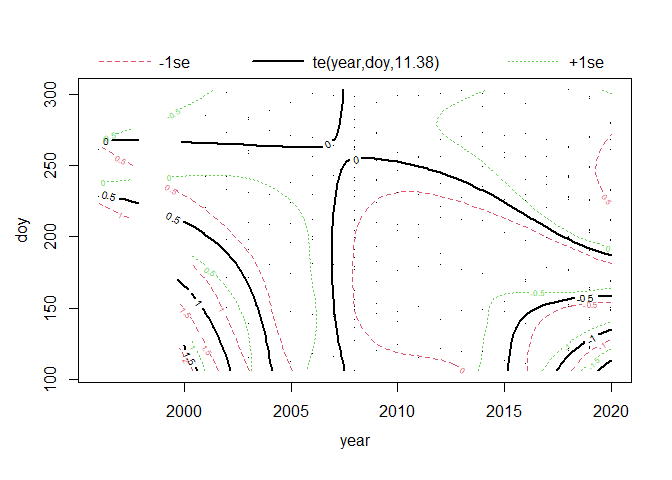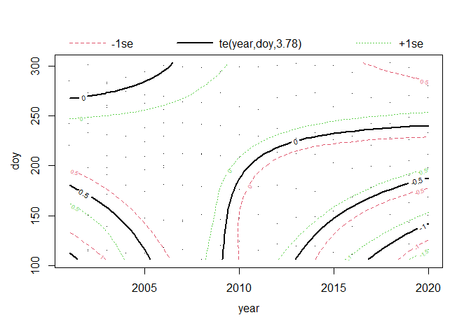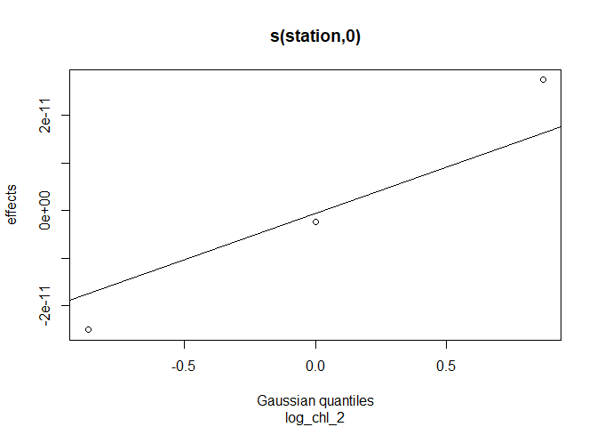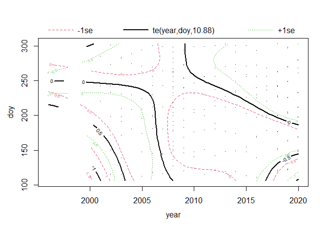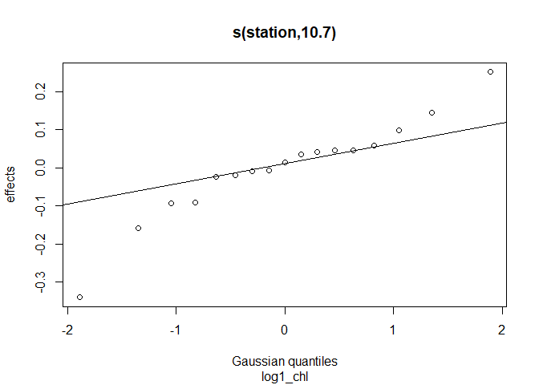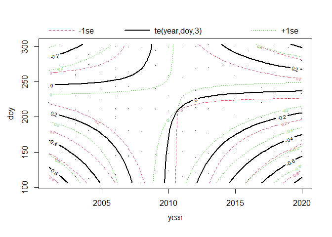

-   Secchi Depth in mid summer has gotten slightly worse, with maybe a
    slight improvement in the spring. No change in fall.

-   Temperature shows no meaningful interaction, and no clear trend in
    this model.

-   Salinity shows slightly lower salinity in spring, and higher
    salinity in the fall.

-   Dissolved oxygen shows no strong long-term trend.

-   Percent Saturation shows a complex pattern, with evidence for higher
    percent saturation in recent years, with a change in the early
    2000s.

-   pH shows increasing pH in spring in recent years, but the big change
    is that the difference between spring and summer has increased in
    recent years. That change may reflect adoption of electrochemical pH
    meters in or around 2012.

-   Chlorophyll shows a fairly steady decline in spring, with little
    change in summer and fall. That general result is fairly robust, but
    its strength varies by model.

## Discussion

The Day of Year GAM models are informative, smoothing out some of the
weirdness of the month-based models. But they almost certainly overfit
our data. Given the large scatter in our data, and the relatively small
magnitude of the slope terms, we can fit patterns that are of no
practical importance.

There was, however, a theme here – springs have been somewhat different
in recent years. Higher Secchi, lower salinity, higher pH, lower
chlorophyll.

That suggests we might analyze separate seasonal trends.

# Impact of Uneven Sampling On Chlorophyll Models

We focus here on the the impact of whether we look at all chlorophyll
data or only data from the three long-term chlorophyll sites. We look at
the log(x+1) models, but a similar effect occurs with our other models.
Data restricted to long-term sites shows trends, while if we look all
available data the long-term trend vanishes.

See `Surface_Analysis_Chlorophyll_Trends.Rmd` for additional details
looking at issues with chlorophyll models.

``` r
nested_data$parameter[11]
#> [1] "log1_chl"
mod <- nested_data$lmers[11][[1]]
summary(mod)
#> 
#> Family: gaussian 
#> Link function: identity 
#> 
#> Formula:
#> value ~ year + month + s(station, bs = "re")
#> 
#> Parametric coefficients:
#>              Estimate Std. Error t value Pr(>|t|)    
#> (Intercept) -2.531988   8.777522  -0.288 0.773063    
#> year         0.002095   0.004361   0.481 0.630986    
#> monthMay    -0.584160   0.116568  -5.011 6.58e-07 ***
#> monthJun    -0.415539   0.116323  -3.572 0.000374 ***
#> monthJul    -0.152078   0.110831  -1.372 0.170375    
#> monthAug    -0.107020   0.111073  -0.964 0.335566    
#> monthSep    -0.081409   0.111421  -0.731 0.465195    
#> monthOct    -0.263226   0.119472  -2.203 0.027845 *  
#> ---
#> Signif. codes:  0 '***' 0.001 '**' 0.01 '*' 0.05 '.' 0.1 ' ' 1
#> 
#> Approximate significance of smooth terms:
#>              edf Ref.df     F  p-value    
#> s(station) 10.74     16 2.477 2.72e-06 ***
#> ---
#> Signif. codes:  0 '***' 0.001 '**' 0.01 '*' 0.05 '.' 0.1 ' ' 1
#> 
#> R-sq.(adj) =  0.104   Deviance explained = 12.2%
#> GCV = 0.43848  Scale est. = 0.42901   n = 868
```

``` r
nested_data$parameter[12]
#> [1] "log1_chl_2"
mod <- nested_data$lmers[12][[1]]
summary(mod)
#> 
#> Family: gaussian 
#> Link function: identity 
#> 
#> Formula:
#> value ~ year + month + s(station, bs = "re")
#> 
#> Parametric coefficients:
#>              Estimate Std. Error t value Pr(>|t|)   
#> (Intercept) 31.728692  13.420458   2.364  0.01853 * 
#> year        -0.014924   0.006681  -2.234  0.02603 * 
#> monthMay    -0.493815   0.160605  -3.075  0.00225 **
#> monthJun    -0.355541   0.164962  -2.155  0.03171 * 
#> monthJul    -0.129825   0.153570  -0.845  0.39838   
#> monthAug    -0.169140   0.152372  -1.110  0.26762   
#> monthSep    -0.097084   0.157826  -0.615  0.53880   
#> monthOct    -0.293545   0.161950  -1.813  0.07062 . 
#> ---
#> Signif. codes:  0 '***' 0.001 '**' 0.01 '*' 0.05 '.' 0.1 ' ' 1
#> 
#> Approximate significance of smooth terms:
#>                 edf Ref.df F p-value
#> s(station) 1.61e-08      3 0   0.398
#> 
#> R-sq.(adj) =  0.035   Deviance explained =  5.1%
#> GCV = 0.63007  Scale est. = 0.61818   n = 424
```

So it makes a difference which data series we use. The restricted data
looking only at three long-term station produces a significant trend,
while the trend is not judged significant if we include data from other
stations.

That fails to build great confidence in these models, so we dig further.

# Clean Up `nested_data`

We need to make sure we have only our final models and data in the
nested data frame.

1.  We drop investigation models that we will not use in our
    presentations

2.  We delete unused chlorophyll data and models and rebuild our
    preferred chlorophyll model.

3.  While we are at it, we delete the square root transformed Secchi
    depth row.

``` r
nested_data <- nested_data %>%
  select(-lmers_2, -compare, -emmi, -gams)
```

For the chlorophyll model, we want to focus on the `log(x+1)` model. We
want to place that model with data that is limited to the three
long-term stations only. We recalculate the model, so the transform
specification is included in the model in a way that `emmeans` will
recognize.

We also want a version of our model that incorporates the data transform
into the model object, not the data, to facilitate plotting. We do that
by replacing the ‘chl’ data and model in the nested tibble.

``` r
dat <- nested_data %>%
  filter(parameter == 'chl') %>%
  pull(data)               # Returns a list
dat <- dat[[1]]  # Extract the first item....  df is now a data frame
dat <- dat %>%
  filter(! is.na(value)) %>%
  filter(station %in% c('P5BSD', 'P6FGG', 'P7CBI'))
```

`emmeans` recognizes the log(value + 1) transform, but it does not
recognize the equivalent log1p() transform.

``` r
new_mod <- gam(log(value + 1) ~ year + 
                 month + 
                 s(station, bs = 're'), 
               data = dat)

nested_data$lmers[nested_data$parameter == 'chl'] <- list(new_mod)
nested_data$data[nested_data$parameter == 'chl']  <- list(dat)
```

``` r
nested_data <- nested_data %>%
  filter(! parameter %in% c('log_chl', 'log_chl_2', 'log1_chl', 'log1_chl_2', 
                            'sqrt_secchi'))
```

# Final Model Review

## ANOVAs

``` r
for (p in nested_data$parameter) {
  cat(p)
  print(anova(nested_data$lmers[nested_data$parameter == p][[1]]))
    cat('\n\n')
}
#> secchi_2
#> Family: gaussian 
#> Link function: identity 
#> 
#> Formula:
#> value ~ year + month + s(station, bs = "re")
#> 
#> Parametric Terms:
#>       df     F  p-value
#> year   1 55.55 1.06e-13
#> month  6 36.20  < 2e-16
#> 
#> Approximate significance of smooth terms:
#>              edf Ref.df     F p-value
#> s(station) 15.96  16.00 423.3  <2e-16
#> 
#> 
#> temperature
#> Family: gaussian 
#> Link function: identity 
#> 
#> Formula:
#> value ~ year + month + s(station, bs = "re")
#> 
#> Parametric Terms:
#>       df      F p-value
#> year   1  225.6  <2e-16
#> month  6 3214.6  <2e-16
#> 
#> Approximate significance of smooth terms:
#>             edf Ref.df     F p-value
#> s(station) 15.9   16.0 168.3  <2e-16
#> 
#> 
#> salinity
#> Family: gaussian 
#> Link function: identity 
#> 
#> Formula:
#> value ~ year + month + s(station, bs = "re")
#> 
#> Parametric Terms:
#>       df      F  p-value
#> year   1  12.19 0.000485
#> month  6 106.27  < 2e-16
#> 
#> Approximate significance of smooth terms:
#>              edf Ref.df    F p-value
#> s(station) 15.99  16.00 1065  <2e-16
#> 
#> 
#> do
#> Family: gaussian 
#> Link function: identity 
#> 
#> Formula:
#> value ~ year + month + s(station, bs = "re")
#> 
#> Parametric Terms:
#>       df       F p-value
#> year   1   1.134   0.287
#> month  6 992.928  <2e-16
#> 
#> Approximate significance of smooth terms:
#>              edf Ref.df     F p-value
#> s(station) 15.87  16.00 154.6  <2e-16
#> 
#> 
#> pctsat
#> Family: gaussian 
#> Link function: identity 
#> 
#> Formula:
#> value ~ year + month + s(station, bs = "re")
#> 
#> Parametric Terms:
#>       df     F  p-value
#> year   1 12.20 0.000483
#> month  6 72.72  < 2e-16
#> 
#> Approximate significance of smooth terms:
#>              edf Ref.df     F p-value
#> s(station) 15.86  16.00 133.8  <2e-16
#> 
#> 
#> pH
#> Family: gaussian 
#> Link function: identity 
#> 
#> Formula:
#> value ~ year + month + s(station, bs = "re")
#> 
#> Parametric Terms:
#>       df      F p-value
#> year   1  1.372   0.242
#> month  6 17.744  <2e-16
#> 
#> Approximate significance of smooth terms:
#>             edf Ref.df     F p-value
#> s(station) 15.9   16.0 150.4  <2e-16
#> 
#> 
#> chl
#> Family: gaussian 
#> Link function: identity 
#> 
#> Formula:
#> log(value + 1) ~ year + month + s(station, bs = "re")
#> 
#> Parametric Terms:
#>       df     F p-value
#> year   1 4.990  0.0260
#> month  6 2.535  0.0202
#> 
#> Approximate significance of smooth terms:
#>                 edf   Ref.df F p-value
#> s(station) 1.61e-08 3.00e+00 0   0.398
```

-   We are testing ONLY for a linear trend in water quality parameters.
    We are NOT treating years as random factors in the model. We do not
    fit interaction terms, although they are important for several of
    these models, as shown above.

-   Dissolved oxygen and pH show limited evidence of a trend over time.
    What trends we found for pH were confounded with seasonal patterns.
    Interestingly, percent saturation DOES show a statistically
    detectable long-term trend even though DO does not.

-   The month factor and the station by station random factor are both
    significant for almost all parameters.

## Slopes

``` r
nested_data <- nested_data %>%
 mutate(slopes = map(lmers, function(mod) coef(mod)[[2]]))
cbind(nested_data$parameter, nested_data$slopes)
#>      [,1]          [,2]         
#> [1,] "secchi_2"    -0.009212962 
#> [2,] "temperature" 0.05582258   
#> [3,] "salinity"    -0.0251167   
#> [4,] "do"          -0.001791498 
#> [5,] "pctsat"      0.07094398   
#> [6,] "pH"          -0.0005351544
#> [7,] "chl"         -0.01492378
```

# Build Graphics

## Create Annotations

It’s quite possible that some of these “significant” relationships are
small enough to have little meaning. We need to pull out slopes to
include in the graphics.

``` r
nested_data <- nested_data %>%
  mutate(ch_10yr = map(slopes, function(s) round(s * 10, 3))) %>%
  mutate(annot = map(ch_10yr, function(x) paste(x, units, 'per decade'))) %>%
  mutate(annot = paste(if_else(slopes > 0, '+', ''), annot)) %>%
  mutate(annot = if_else(parameter %in% c('do', 'pH'),
                               'No trend', annot[[1]])) %>%
  mutate(annot = if_else(parameter == 'chl',
                         'Likely reduction\n(three stations)',
                         annot))
```

# Extract Predictions for Statistically Significant Trends

We need to look at these relationships graphically. We can do that with
estimated marginal means. Note that these marginal means are averaged
across stations (a random factor) and months (a fixed factor).

Because we transformed the Secchi depth value, we need to include
transforms here so all parameters are treated equally.

## Create Predictions

``` r
nested_data <- nested_data %>%
  mutate(preds = map(lmers, function(mod) summary(emmeans (mod, 'year', 
                                                   at = list(year = 1993:2020), 
                                                   type = 'response')))) %>%
  mutate(preds = if_else(! parameter %in% c('do', 'pH'),
                          preds,
                          list(NA)))
```

### Check results

Note that for the transformed models, the returned point estimate is
“emmean”

``` r
nested_data$preds[[1]]
#>  year emmean      SE   df lower.CL upper.CL
#>  1993   2.32 0.02057 5150     2.28     2.36
#>  1994   2.31 0.01950 5150     2.28     2.35
#>  1995   2.30 0.01844 5150     2.27     2.34
#>  1996   2.30 0.01741 5150     2.26     2.33
#>  1997   2.29 0.01640 5150     2.25     2.32
#>  1998   2.28 0.01543 5150     2.25     2.31
#>  1999   2.27 0.01450 5150     2.24     2.30
#>  2000   2.26 0.01362 5150     2.23     2.29
#>  2001   2.25 0.01280 5150     2.22     2.27
#>  2002   2.24 0.01205 5150     2.22     2.26
#>  2003   2.23 0.01138 5150     2.21     2.25
#>  2004   2.22 0.01081 5150     2.20     2.24
#>  2005   2.21 0.01037 5150     2.19     2.23
#>  2006   2.20 0.01005 5150     2.18     2.22
#>  2007   2.19 0.00988 5150     2.17     2.21
#>  2008   2.19 0.00986 5150     2.17     2.20
#>  2009   2.18 0.01000 5150     2.16     2.20
#>  2010   2.17 0.01028 5150     2.15     2.19
#>  2011   2.16 0.01070 5150     2.14     2.18
#>  2012   2.15 0.01125 5150     2.13     2.17
#>  2013   2.14 0.01189 5150     2.12     2.16
#>  2014   2.13 0.01263 5150     2.11     2.15
#>  2015   2.12 0.01343 5150     2.09     2.15
#>  2016   2.11 0.01430 5150     2.08     2.14
#>  2017   2.10 0.01522 5150     2.07     2.13
#>  2018   2.09 0.01619 5150     2.06     2.12
#>  2019   2.08 0.01718 5150     2.05     2.12
#>  2020   2.07 0.01821 5150     2.04     2.11
#> 
#> Results are averaged over the levels of: month, station 
#> Confidence level used: 0.95
```

### Check Chlorophyll

The point estimate is “response”

``` r
nested_data$preds[[7]]
#>  year response    SE  df lower.CL upper.CL
#>  1993     4.85 0.719 416     3.59     6.45
#>  1994     4.76 0.672 416     3.58     6.25
#>  1995     4.67 0.627 416     3.57     6.05
#>  1996     4.59 0.583 416     3.55     5.86
#>  1997     4.51 0.540 416     3.54     5.68
#>  1998     4.43 0.499 416     3.53     5.50
#>  1999     4.35 0.460 416     3.51     5.33
#>  2000     4.27 0.422 416     3.50     5.16
#>  2001     4.19 0.386 416     3.48     5.00
#>  2002     4.11 0.351 416     3.47     4.85
#>  2003     4.04 0.319 416     3.45     4.70
#>  2004     3.96 0.289 416     3.42     4.56
#>  2005     3.89 0.261 416     3.40     4.43
#>  2006     3.82 0.236 416     3.37     4.30
#>  2007     3.74 0.215 416     3.34     4.19
#>  2008     3.67 0.198 416     3.30     4.08
#>  2009     3.60 0.185 416     3.25     3.98
#>  2010     3.54 0.177 416     3.20     3.90
#>  2011     3.47 0.175 416     3.14     3.83
#>  2012     3.40 0.177 416     3.07     3.77
#>  2013     3.34 0.184 416     2.99     3.71
#>  2014     3.27 0.195 416     2.91     3.67
#>  2015     3.21 0.208 416     2.82     3.64
#>  2016     3.15 0.223 416     2.73     3.61
#>  2017     3.09 0.239 416     2.64     3.58
#>  2018     3.03 0.256 416     2.55     3.56
#>  2019     2.97 0.274 416     2.46     3.54
#>  2020     2.91 0.292 416     2.37     3.52
#> 
#> Results are averaged over the levels of: month, station 
#> Confidence level used: 0.95 
#> Intervals are back-transformed from the log(mu + 1) scale
```

#### Correct Chlorphyll

The chlorophyll data from the three long-term sites began in 2001. We do
not want to show predictions before that time.

``` r
pp <- nested_data %>%
  filter(parameter == 'chl') %>%
  pull(preds)
pp <- pp[[1]]
pp <- pp %>%
  filter(year > 2000)

nested_data$preds[nested_data$parameter=='chl'] <- list(pp)
```

## Create Transform Objects

This allows us to automate plotting the chlorophyll data on a
transformed y axis.

``` r
trans_list <- list(secchi_2 = 'identity',
                   temperature = 'identity',
                   salinity = 'identity',
                   do = 'identity',
                   pctsat = 'identity',
                   pH = 'identity',
                   chl = 'log1p')
nested_data$transf <- trans_list
```

## Create Plotting Function

``` r
my_plot_fxn <- function(dat, preds, label = '', units = '', 
                        ann = '', transf = 'identity') {
  
  p <- ggplot(dat, aes(x = year)) +
    geom_jitter(aes(y = value), 
                width = 0.25, height = 0,
                color = cbep_colors()[1], alpha = 0.2) +
    annotate(geom = 'text', x = 2015, y = 0.9 * max(dat$value), 
             label = ann, hjust = .5) +
    xlim(1993,2020) +
    ylab(paste0(label,
                if_else(nchar(units)> 0, ' (', ' '),
                units, 
                if_else(nchar(units)> 0,')', ''))) +
    xlab('')
  
  # here we deal with the different naming convention of emmeans 
  # `type = 'response' for back-transforming values
  if (! is.na(preds[[1]])) {
    pr <- preds
    if('response' %in% names(pr)) {
        pr <- pr %>% rename(emmean = response)
      }

    p <- p + 
      geom_ribbon(data = pr, mapping = aes(x = year, 
                                            ymin = lower.CL,
                                            ymax = upper.CL),
                fill = 'blue',
                alpha = 0.15) +
      geom_line(data = pr, mapping = aes(x = year, y = emmean),
              color = cbep_colors()[2], size  = 1) +
      scale_y_continuous(trans = transf)
  }
  return(p)
}
```

# Generate Graphics

When we add in the raw data, however, we can see how minor most of these
“significant” trends are when seen against bay-wide and season-wide
variability.

``` r
for (p in nested_data$parameter) {
  row <- nested_data[nested_data$parameter == p,] 
  d <- row$data[[1]]
  p <- row$preds[[1]]
  l <- row$label
  u <- row$units
  a <- row$annot
  t <- row$transf
  print(my_plot_fxn(d,p,l,u,a, t))
}
#> Warning in if (!is.na(preds[[1]])) {: the condition has length > 1 and only the
#> first element will be used
#> Warning: Removed 104 rows containing missing values (geom_point).
#> Warning in if (!is.na(preds[[1]])) {: the condition has length > 1 and only the
#> first element will be used
```

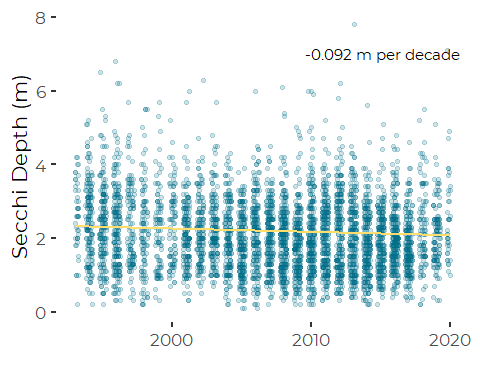

    #> Warning: Removed 108 rows containing missing values (geom_point).

    #> Warning: the condition has length > 1 and only the first element will be used

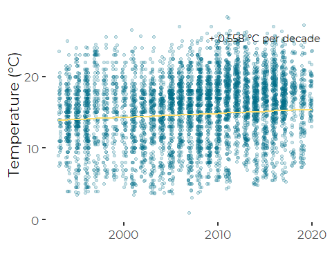

    #> Warning: Removed 99 rows containing missing values (geom_point).

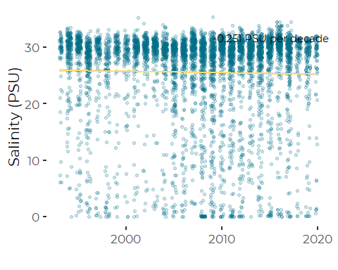

    #> Warning: Removed 104 rows containing missing values (geom_point).

    #> Warning: the condition has length > 1 and only the first element will be used

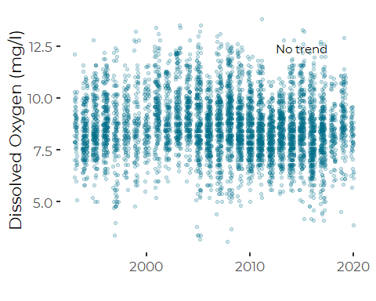

    #> Warning: Removed 100 rows containing missing values (geom_point).

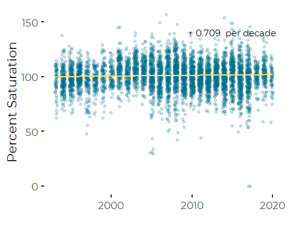

    #> Warning: Removed 79 rows containing missing values (geom_point).

    #> Warning: the condition has length > 1 and only the first element will be used


    #> Warning: Removed 14 rows containing missing values (geom_point).

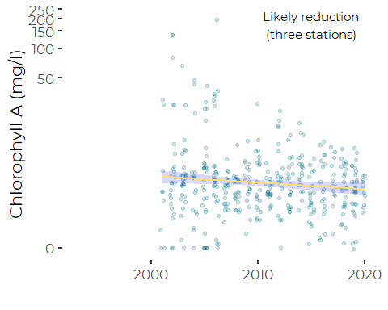

``` r
row <- nested_data[nested_data$parameter == 'chl',]
  d <- row$data[[1]]
  p <- row$preds[[1]]
  l <- row$label
  u <- row$units
  a <- row$annot
  t <- row$transf
plt <- my_plot_fxn(d,p,l,u,a, t)
#> Warning in if (!is.na(preds[[1]])) {: the condition has length > 1 and only the
#> first element will be used
plt +
  scale_y_continuous(trans = row$transf, breaks = c(0,1,  5, 10, 50, 100, 200))
#> Scale for 'y' is already present. Adding another scale for 'y', which will
#> replace the existing scale.
#> Warning: Removed 13 rows containing missing values (geom_point).
```

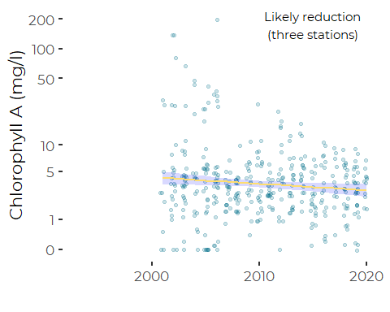
