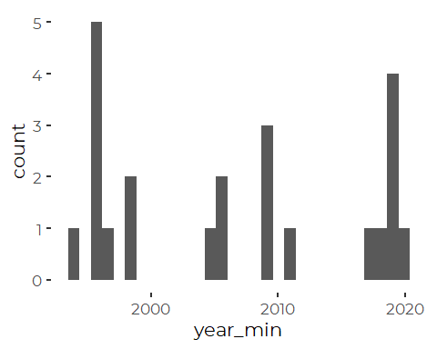
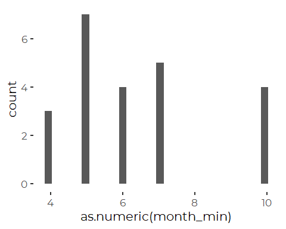
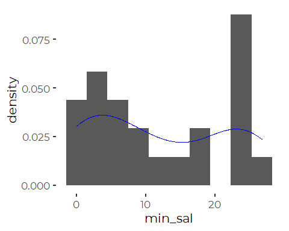
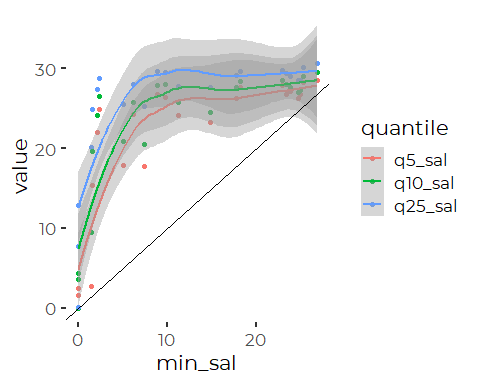
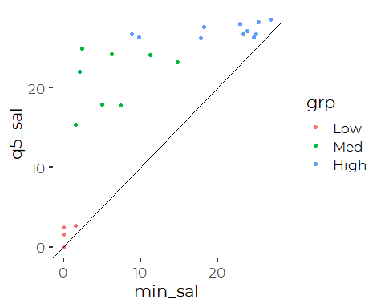
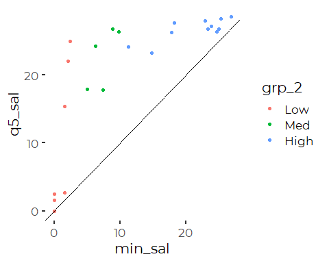
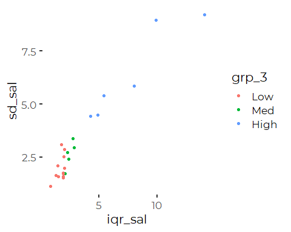

Analysis of Surface Salinity Data from Friends of Casco Bay Monitoring
================
Curtis C. Bohlen, Casco Bay Estuary Partnership
3/03/2021

-   [Introduction](#introduction)
-   [Load Libraries](#load-libraries)
-   [Load Data](#load-data)
    -   [Establish Folder Reference](#establish-folder-reference)
    -   [Primary Data](#primary-data)
        -   [Remove Extraneous
            Parameters](#remove-extraneous-parameters)
    -   [Add Station Names](#add-station-names)
-   [Recent Conditions](#recent-conditions)
    -   [Create Recent Data](#create-recent-data)
    -   [Calculate Station Statistics](#calculate-station-statistics)
-   [When Do Salinity Minimums Occur?](#when-do-salinity-minimums-occur)
-   [Distribution of Minimum
    Salinities](#distribution-of-minimum-salinities)
-   [Minimums and Quantiles](#minimums-and-quantiles)
-   [Grouping Options](#grouping-options)
    -   [By 5% Quantiles](#by-5-quantiles)
-   [By Minimums](#by-minimums)
    -   [By Variability](#by-variability)
-   [Separation by Minimums Picks up
    Variabililty](#separation-by-minimums-picks-up-variabililty)
    -   [Export data for GIS](#export-data-for-gis)


# Introduction

This Notebook analyzes FOCB’s “Surface” data. These data are pulled from
long term monitoring locations around the Bay.

We focus here specifically on salinity data. We use this to examine the
degree to which different parts of the Bay are influenced by freshwater
inflows. This analysis was motivated by prior observations that minimum
salinity at most monitoring stations around the Bay show rare low
salinity events. This provides a sense of the degree to which different
portions of the bay show estuary characteristics.

We look at minimum and low quantile salinity from the recent monitoring
record.

# Load Libraries

``` r
library(MASS)     # Here for the `boxcox()` function
library(tidyverse)
#> -- Attaching packages --------------------------------------- tidyverse 1.3.0 --
#> v ggplot2 3.3.3     v purrr   0.3.4
#> v tibble  3.0.5     v dplyr   1.0.3
#> v tidyr   1.1.2     v stringr 1.4.0
#> v readr   1.4.0     v forcats 0.5.0
#> -- Conflicts ------------------------------------------ tidyverse_conflicts() --
#> x dplyr::filter() masks stats::filter()
#> x dplyr::lag()    masks stats::lag()
#> x dplyr::select() masks MASS::select()
library(readxl)
#library(readr)

library(mgcv)     # For `gam()` and `gamm()` models
#> Loading required package: nlme
#> 
#> Attaching package: 'nlme'
#> The following object is masked from 'package:dplyr':
#> 
#>     collapse
#> This is mgcv 1.8-33. For overview type 'help("mgcv-package")'.
#library(maxLik)
library(lme4)    # For mixed effectws models
#> Loading required package: Matrix
#> 
#> Attaching package: 'Matrix'
#> The following objects are masked from 'package:tidyr':
#> 
#>     expand, pack, unpack
#> 
#> Attaching package: 'lme4'
#> The following object is masked from 'package:nlme':
#> 
#>     lmList
#library(nlme)   # probably only needed if we need to model autocorrelation

library(emmeans)

library(GGally)
#> Registered S3 method overwritten by 'GGally':
#>   method from   
#>   +.gg   ggplot2
#> 
#> Attaching package: 'GGally'
#> The following object is masked from 'package:emmeans':
#> 
#>     pigs
#library(zoo)
#library(lubridate)  # here, for the make_datetime() function

#library(broom)

library(CBEPgraphics)
load_cbep_fonts()
theme_set(theme_cbep())
```

# Load Data

## Establish Folder Reference

``` r
sibfldnm <- 'Original_Data'
parent   <- dirname(getwd())
sibling  <- file.path(parent,sibfldnm)

#dir.create(file.path(getwd(), 'figures'), showWarnings = FALSE)
```

## Primary Data

We specify column names because FOCB data has a row of names, a row of
units, then the data. This approach is simpler than reading names from
the first row and correcting them to be R syntactic names.

``` r
fn    <- 'FOCB Surface All Current Sites With BSV Data.xlsx'
fpath <- file.path(sibling,fn)

mynames <- c('station', 'dt', 'time', 'sample_depth',
             'secchi', 'water_depth','temperature', 'salinity',
             'do', 'pctsat', 'pH', 'chl', 
             'month', 'year', 'fdom', 'bga', 
             'turbidity', 'blank', 'clouds', 'wndspd',
             'winddir'
             ) 

the_data <- read_excel(fpath, skip=2, col_names = mynames) %>%
  mutate(month = factor(month, levels = 1:12, labels = month.abb),
         doy = as.numeric(format(dt, '%j'))) %>%
  relocate(year, month, doy, .after = dt)
rm(mynames)
```

### Remove Extraneous Parameters

``` r
the_data <- the_data %>%
select(-c(do:winddir)) %>%
  select(-sample_depth)
```

## Add Station Names

``` r
fn    <- 'FOCB Monitoring Sites.xlsx'
fpath <- file.path(sibling,fn)
loc_data <- read_excel(fpath) %>%
  select(Station_ID, Station_Name) %>%
  rename(station = Station_ID,
         station_name = Station_Name)

the_data <- the_data %>%
  left_join(loc_data, by = 'station') %>%
  relocate(station_name, .after = station)
```

# Recent Conditions

In 2015, we presented marginal means and standard errors for sixteen
different regions of the Bay. This time, we have fewer monitoring
stations, and present results for each monitoring location individually.

As in 2015, we organize results by mean or median temperature, as
offshore sites or sites strongly influenced by offshore waters do not
get as warm in summer months as inshore sites.

## Create Recent Data

We filter to the last five FULL years of data, 2015 through 2019.

``` r
recent_data <- the_data %>%
  filter(year > 2014 & year < 2020) %>%
  mutate(station = fct_reorder(station, temperature, mean, na.rm = TRUE),
         station_name = fct_reorder(station_name, temperature, mean, na.rm = TRUE))
```

The data contains two stations that wer4e added only recently.

``` r
l <- the_data %>%
  group_by(station) %>%
  summarize(missing = sum(is.na(station_name))) %>%
  filter(missing > 0) %>%
  pull(station)
l
#> [1] "CMS3"  "P6CBI"
```

If we look at those records, on is represented by only a single
observation, and the other only by data from 2020. Neither matter for
the current analysis. They will get filtered out when we select data to
describe recent conditions, and trends.

``` r
the_data <- the_data %>%
  filter(! station %in% l)
```

## Calculate Station Statistics

``` r
sal_data <- the_data %>%
  filter(! is.na(salinity)) %>%
  group_by(station) %>%
  summarize(station_name = first(station_name),
            month_min = month[which.min(salinity)],
            year_min = year[which.min(salinity)],
            
            n_sal = n(),
            
            min_sal = min(salinity),
            q5_sal = quantile(salinity, 0.05),
            q10_sal = quantile(salinity, 0.1),
            q25_sal = quantile(salinity, 0.25),
            
            iqr_sal = IQR(salinity),
            sd_sal = sd(salinity),
            .groups = 'drop')
```

# When Do Salinity Minimums Occur?

Surprisingly, the extremes do not always co-occur.

``` r
ggplot(sal_data, aes(x = year_min)) +
  geom_histogram()
#> `stat_bin()` using `bins = 30`. Pick better value with `binwidth`.
```



``` r
ggplot(sal_data, aes(x = as.numeric(month_min))) +
  geom_histogram()
#> `stat_bin()` using `bins = 30`. Pick better value with `binwidth`.
```



# Distribution of Minimum Salinities

``` r
ggplot(sal_data, aes(x = min_sal, y = ..density..)) +
  geom_histogram(bins = 10) +
  geom_density(color = 'blue')
```


There is a clear bimodal pattern between sites with a low salinity
minimum and sites with a high salinity minimums, but a fair number of
points in between as well.

# Minimums and Quantiles

``` r
sal_data %>%
  pivot_longer(q5_sal:q25_sal, names_to= 'quantile', values_to = 'value') %>%
  mutate(quantile = factor(quantile, 
                           levels = c('q5_sal', 'q10_sal', 'q25_sal'))) %>%
ggplot(aes(x = min_sal, y = value, color = quantile)) +
  geom_point() +
  geom_smooth() +
  geom_abline(slope = 1, intercept = 0)
#> `geom_smooth()` using method = 'loess' and formula 'y ~ x'
```



What that tends to show is that very low salinity events are very
uncommon. The quantiles are probably better summaries of conditions.

One could split these into groups, based on q5\_sal and q10\_sal.

``` r
sum(sal_data$q5_sal < 10)
#> [1] 4
sum(sal_data$q5_sal >= 10 & sal_data$q5_sal < 25 )
#> [1] 8
sum(sal_data$q5_sal >= 25)
#> [1] 11
```

# Grouping Options

## By 5% Quantiles

``` r
sal_data<- sal_data %>%
  mutate(grp = cut(sal_data$q5_sal, c(-1,10,25, 40)),
         grp = factor(grp, labels = c('Low', 'Med', 'High')))
```

``` r
ggplot(sal_data, aes(x = min_sal, y = q5_sal, color = grp)) +
  geom_point() +
  geom_abline(slope = 1, intercept = 0)
```



# By Minimums

An alternative cut would be to cut by minimum salinity under about 10
ppt.

``` r
sal_data<- sal_data %>%
  mutate(grp_2= cut(sal_data$min_sal, c(-1, 5, 10, 40)),
         grp_2 = factor(grp_2, labels = c('Low', 'Med', 'High')))
```

``` r
ggplot(sal_data, aes(x = min_sal, y = q5_sal, color = grp_2)) +
  geom_point() +
  geom_abline(slope = 1, intercept = 0)
```



## By Variability

``` r
sal_data<- sal_data %>%
  mutate(grp_3= cut(sal_data$iqr_sal, c(0, 2, 4, 40)),
         grp_3 = factor(grp_3, labels = c('Low', 'Med', 'High')))

ggplot(sal_data, aes(x = iqr_sal, y = sd_sal, color = grp_3)) +
  geom_point()
```



# Separation by Minimums Picks up Variabililty

``` r
ggplot(sal_data, aes(x = iqr_sal, y = sd_sal, color = grp)) +
  geom_point()
```


The low salinity sites are high variability, while the high salinity
sites are low variability. (The one exception is the mouth of the
Presumpscot River).

## Export data for GIS

``` r
sibfldnm <- 'Derived_Data'
parent   <- dirname(getwd())
sibling  <- file.path(parent,sibfldnm)

sal_data <- sal_data %>%
  select(- month_min, -year_min, -q10_sal, -q25_sal, - sd_sal, - grp_2, -grp_3)
```

``` r
write_csv(sal_data, file.path(sibling, 'low_salinity.csv'))
```
