Analysis of Seasonal Water Quality Trends from Friends of Casco Bay Data
================
Curtis C. Bohlen, Casco Bay Estuary Partnership
3/25/2021

-   [Introduction](#introduction)
-   [Load Libraries](#load-libraries)
-   [Load Data](#load-data)
    -   [Establish Folder Reference](#establish-folder-reference)
    -   [Primary Data](#primary-data)
        -   [Remove 2020 only data](#remove-2020-only-data)
        -   [Add Seasonal Factors](#add-seasonal-factors)
        -   [Address Secchi Censored
            Values](#address-secchi-censored-values)
        -   [Limit Chlorophyll to Three Long-Term
            Stations](#limit-chlorophyll-to-three-long-term-stations)
        -   [Transform the Chlorophyll A
            Data](#transform-the-chlorophyll-a-data)
-   [Create Trend Data](#create-trend-data)
-   [Construct Nested Tibble](#construct-nested-tibble)
-   [Modeling](#modeling)
    -   [Models](#models)
        -   [Compare Five Models](#compare-five-models)
-   [Working with the Selected Model](#working-with-the-selected-model)
    -   [Diagnostic Plots](#diagnostic-plots)
        -   [ANOVAs](#anovas-1)
        -   [Plot Marginal Means](#plot-marginal-means)
        -   [Seasonal Slopes](#seasonal-slopes)
-   [Graphics](#graphics)
    -   [Simply overplot data](#simply-overplot-data)
        -   [Plots](#plots)
        -   [Fix the Chlorophyll Models and
            Graphic](#fix-the-chlorophyll-models-and-graphic)


# Introduction

This Notebook analyzes FOCB’s “Surface” data. These data are pulled from
long term monitoring locations around the Bay.

These are sites visited regularly by FOCB staff, either by boat or on
land. The focus is on warm season sampling (April through October), with
roughly monthly samples. Earlier data from some land-based sites was
collected by volunteers.

This notebook builds on other analyses, which looked for overall trends
in water quality, by looking for “seasonal” trends. We look for these by
defining seasonal variables and fitting linear interaction models

We produce an “Early vs Late” factor and a three point factor for for
Spring, Summer, and Fall, based on the month of sampling. However, the
three season model is almost always better, so we fully develop analyses
only for that version.

# Load Libraries

``` r
library(tidyverse)
#> -- Attaching packages --------------------------------------- tidyverse 1.3.0 --
#> v ggplot2 3.3.3     v purrr   0.3.4
#> v tibble  3.0.5     v dplyr   1.0.3
#> v tidyr   1.1.2     v stringr 1.4.0
#> v readr   1.4.0     v forcats 0.5.0
#> -- Conflicts ------------------------------------------ tidyverse_conflicts() --
#> x dplyr::filter() masks stats::filter()
#> x dplyr::lag()    masks stats::lag()
library(readxl)

library(mgcv)     # For `gam()` and `gamm()` models
#> Loading required package: nlme
#> 
#> Attaching package: 'nlme'
#> The following object is masked from 'package:dplyr':
#> 
#>     collapse
#> This is mgcv 1.8-33. For overview type 'help("mgcv-package")'.
library(lmerTest)     # for `lmer()`
#> Warning: package 'lmerTest' was built under R version 4.0.4
#> Loading required package: lme4
#> Loading required package: Matrix
#> 
#> Attaching package: 'Matrix'
#> The following objects are masked from 'package:tidyr':
#> 
#>     expand, pack, unpack
#> 
#> Attaching package: 'lme4'
#> The following object is masked from 'package:nlme':
#> 
#>     lmList
#> 
#> Attaching package: 'lmerTest'
#> The following object is masked from 'package:lme4':
#> 
#>     lmer
#> The following object is masked from 'package:stats':
#> 
#>     step
library(emmeans)

library(CBEPgraphics)
load_cbep_fonts()
theme_set(theme_cbep())
```

# Load Data

## Establish Folder Reference

``` r
sibfldnm <- 'Original_Data'
parent   <- dirname(getwd())
sibling  <- file.path(parent,sibfldnm)

dir.create(file.path(getwd(), 'figures'), showWarnings = FALSE)
```

## Primary Data

We specify column names because FOCB data has a row of names, a row of
units, then the data. This approach is simpler than reading names from
the first row and correcting them to be R syntactic names.

``` r
fn    <- 'FOCB Surface All Current Sites With BSV Data.xlsx'
fpath <- file.path(sibling,fn)

mynames <- c('station', 'dt', 'time', 'sample_depth',
             'secchi', 'water_depth','temperature', 'salinity',
             'do', 'pctsat', 'pH', 'chl', 
             'month', 'year', 'fdom', 'bga', 
             'turbidity', 'blank', 'clouds', 'wndspd',
             'winddir'
             ) 

the_data <- read_excel(fpath, skip=2, col_names = mynames) %>%
  mutate(month = factor(month, levels = 1:12, labels = month.abb)) %>%
  relocate(month, .after = dt)

rm(mynames)
```

### Remove 2020 only data

``` r
the_data <- the_data %>%
select(-c(fdom:winddir))
```

### Add Seasonal Factors

``` r
the_data <- the_data %>%
  mutate(season_2 = fct_collapse(month, 
                                 Early = c('Apr', 'May', 'Jun'),
                                 Late =  c('Jul', 'Aug', 'Sep', 'Oct')),
         season_3 =  fct_collapse(month, 
                                 Spring = c('Apr', 'May'), 
                                 Summer = c('Jun','Jul', 'Aug'),
                                 Fall   =  c('Sep', 'Oct'))) %>%
  relocate(season_2, season_3, .after = month)
```

### Address Secchi Censored Values

``` r
the_data <- the_data %>%
  mutate(secchi_2 = if_else(secchi == "BSV", water_depth, as.numeric(secchi)),
         bottom_flag = secchi == "BSV") %>%
  relocate(secchi_2, .after = secchi) %>%
  relocate(bottom_flag, .after = secchi_2)
#> Warning: Problem with `mutate()` input `secchi_2`.
#> i NAs introduced by coercion
#> i Input `secchi_2` is `if_else(secchi == "BSV", water_depth, as.numeric(secchi))`.
```

### Limit Chlorophyll to Three Long-Term Stations

``` r
the_data <- the_data %>%
  mutate(chl = if_else(station %in% c('P5BSD', 'P6FGG', 'P7CBI'),
                                   chl, NA_real_))
```

### Transform the Chlorophyll A Data

We create log(X + 1) transformed version of the Chlorophyll data. That
allows us to conduct analyses of transformed and untransformed data in
parallel.

The choice of transform for chlorophyll has significant import, as it
determines whether chlorophyll is considered to have a significant
long-term trend or not. This confusing situation is driven by fifteen
nominal “zero” values in the data from early in the data record. See
`Surface_Analysis_Chlorophyll_Trends.Rmd` for details.

``` r
the_data <- the_data %>%
  mutate(log1_chl = log1p(chl)) %>%
  relocate(log1_chl, .after = chl)
```

# Create Trend Data

First, we create a tibble containing information on years in which each
station was sampled.

``` r
years_data <- the_data %>%
  group_by(station, year) %>%
  summarize(yes = ! all(is.na(temperature)),
            .groups = 'drop_last') %>%
  summarize(years = sum(yes, na.rm = TRUE),
            recent_years =  sum(yes & year > 2014, na.rm = TRUE),
            .groups = 'drop')
```

Then we identify stations with at least 10 years of data, and at least
three years of data from the last five years, and use that list to
select data for trend analysis. Finally, we adjust the levels in the
`station` and `station_name` variables.

``` r
selected_stations <- years_data %>%
  filter(years> 9, recent_years >2) %>%
  pull(station)

trend_data <- the_data %>%
  filter(station %in% selected_stations) %>%
  mutate(station = fct_drop(station)) %>%
  mutate(station = fct_reorder(station, temperature, mean, na.rm = TRUE))
rm(selected_stations, years_data)
```

``` r
length(unique(trend_data$station))
#> [1] 17
```

We are reduced to only 17 stations with long-term records for trend
analysis. We noted above that we have limited chlorophyll data before
the last couple of years. We address that momentarily

# Construct Nested Tibble

``` r
units <- tibble(parameter = c('secchi_2', 'temperature', 
                              'salinity', 'do',
                              'pctsat', 'pH', 
                              'chl', 'log1_chl'),
                label = c("Secchi Depth", "Temperature",
                         "Salinity", "Dissolved Oxygen",
                         "Percent Saturation", "pH",
                         "Chlorophyll A", "Log(Chlorophyll A plus 1)"),
                units = c('m', paste0("\U00B0", "C"),
                          'PSU', 'mg/l',
                          '', '',
                          'mg/l', 'mg/l'))

nested_data <- trend_data %>%
  select(-time, -sample_depth, 
         -secchi, -water_depth) %>%
  mutate(year_f = factor(year)) %>%
  relocate(bottom_flag, .after = season_3) %>%
  
  pivot_longer(c(secchi_2:log1_chl), names_to = 'parameter', 
               values_to = 'value') %>%
  filter(! is.na(value)) %>%
  
  # This allows us to ensure the order of the rows in the nested tibble
  mutate(parameter = factor(parameter,
                            levels = c('secchi_2', 'temperature',
                                       'salinity', 'do',
                                       'pctsat', 'pH',
                                       'chl', 'log1_chl'))) %>%

  # change all `bottom_flag` values to FALSE except for secchi_2 df 
  # this allows selective coloring in later graphics
  mutate(bottom_flag = if_else(parameter != 'secchi_2', 
                               NA, 
                               bottom_flag)) %>%
  group_by(parameter) %>%
  nest() %>%
  arrange(parameter) %>%
  left_join(units, by = 'parameter')
```

# Modeling

We treat stations as random exemplars of possible stations, and thus
rely on hierarchical models.

We mostly use GAM models with a random factor smoothing term. We
restrict ourselves to linear trends by year, but explore interactions by
month and season. These seasonal models were motivated by two
dimensional tensor smooth GAM models developed in
“Surface\_Analysis\_Trends.Rmd”.

## Models

We develop two “Season” and two “Month” models. The Month models
generally perform better, but they are difficult to summarize compactly
for State of Casco Bay audiences.

``` r
nested_data <- nested_data %>%
  mutate(lmers = map(data, function(df) gam(value ~ year + month + 
                                              s(station, bs = 're'), 
                                            data = df))) %>%
  mutate(lmers_2 = map(data, function(df) gam(value ~ year *  month + 
                                              s(station, bs = 're'), 
                                            data = df))) %>%
  mutate(lmer_3_seas = map(data, function(df) gam(value ~ year + season_3 + 
                                              s(station, bs = 're'), 
                                            data = df))) %>%
  mutate(lmer_3_seas_2 = map(data, function(df) gam(value ~ year * season_3 + 
                                              s(station, bs = 're'), 
                                            data = df))) %>%
  mutate(lmer_mixed = map(data, function(df) gam(value ~ year + month + 
                                                   year:season_3 + 
                                              s(station, bs = 're'), 
                                            data = df)))
  

  names(nested_data$lmers) <- nested_data$parameter
  names(nested_data$lmers_2) <- nested_data$parameter
  names(nested_data$lmer_3_seas) <- nested_data$parameter
  names(nested_data$lmer_3_seas_2) <- nested_data$parameter
  names(nested_data$lmer_mixed) <- nested_data$parameter
```

### Compare Five Models

#### AIC

``` r
aic_list <- list()
for (p in nested_data$parameter) {
  row <-  nested_data[nested_data$parameter == p,]
  aic <- c( AIC(row$lmer_3_seas[[1]]),
            AIC(row$lmer_3_seas_2[[1]]),
            AIC(row$lmers[[1]]),
            AIC(row$lmer_mixed[[1]]),
            AIC(row$lmers_2[[1]]))
 aic_list[p] <- list(round(aic,1))
}
aic_arr <- do.call(rbind, aic_list)
colnames(aic_arr) <- c('Seasons', 'Seasons w Interaction', 'Months', 
                       'Months w Seasons','Months w Interaction')
knitr::kable(aic_arr,)
```

|             | Seasons | Seasons w Interaction |  Months | Months w Seasons | Months w Interaction |
|:------------|--------:|----------------------:|--------:|-----------------:|---------------------:|
| secchi\_2   |  9901.2 |                9896.6 |  9828.6 |           9826.2 |               9806.8 |
| temperature | 26900.5 |               26898.7 | 23836.6 |          23838.5 |              23824.7 |
| salinity    | 31018.6 |               31018.8 | 30919.8 |          30919.4 |              30915.4 |
| do          | 15250.4 |               15254.3 | 14474.2 |          14477.8 |              14477.7 |
| pctsat      | 41676.0 |               41675.3 | 41614.5 |          41615.6 |              41616.4 |
| pH          |  -825.4 |                -845.1 |  -838.3 |           -858.9 |               -865.2 |
| chl         |  3500.4 |                3495.8 |  3498.6 |           3496.7 |               3483.5 |
| log1\_chl   |  1015.3 |                1004.6 |  1009.3 |           1001.8 |                992.3 |

#### ANOVAs

``` r
for (p in nested_data$parameter) {
  row <-  nested_data[nested_data$parameter == p,]
  ava <- anova(row$lmer_3_seas[[1]], row$lmer_3_seas_2[[1]], row$lmers[[1]], 
               row$lmer_mixed[[1]], row$lmers_2[[1]], test = 'LRT')
  cat('\n\n')
  cat(p, '\n')
  print(ava)
}
#> 
#> 
#> secchi_2 
#> Analysis of Deviance Table
#> 
#> Model 1: value ~ year + season_3 + s(station, bs = "re")
#> Model 2: value ~ year * season_3 + s(station, bs = "re")
#> Model 3: value ~ year + month + s(station, bs = "re")
#> Model 4: value ~ year + month + year:season_3 + s(station, bs = "re")
#> Model 5: value ~ year * month + s(station, bs = "re")
#>   Resid. Df Resid. Dev Df Deviance  Pr(>Chi)    
#> 1      5154     2036.7                          
#> 2      5152     2033.3  2   3.4011   0.01239 *  
#> 3      5150     2005.2  2  28.0969 < 2.2e-16 ***
#> 4      5148     2002.7  2   2.4816   0.04060 *  
#> 5      5144     1992.1  4  10.5666 1.741e-05 ***
#> ---
#> Signif. codes:  0 '***' 0.001 '**' 0.01 '*' 0.05 '.' 0.1 ' ' 1
#> 
#> 
#> temperature 
#> Analysis of Deviance Table
#> 
#> Model 1: value ~ year + season_3 + s(station, bs = "re")
#> Model 2: value ~ year * season_3 + s(station, bs = "re")
#> Model 3: value ~ year + month + s(station, bs = "re")
#> Model 4: value ~ year + month + year:season_3 + s(station, bs = "re")
#> Model 5: value ~ year * month + s(station, bs = "re")
#>   Resid. Df Resid. Dev     Df Deviance  Pr(>Chi)    
#> 1      5624      38534                              
#> 2      5622      38495 2.0000     39.4 0.0070040 ** 
#> 3      5620      22359 2.0011  16135.3 < 2.2e-16 ***
#> 4      5618      22351 2.0000      8.1 0.3600009    
#> 5      5614      22265 4.0000     86.5 0.0002198 ***
#> ---
#> Signif. codes:  0 '***' 0.001 '**' 0.01 '*' 0.05 '.' 0.1 ' ' 1
#> 
#> 
#> salinity 
#> Analysis of Deviance Table
#> 
#> Model 1: value ~ year + season_3 + s(station, bs = "re")
#> Model 2: value ~ year * season_3 + s(station, bs = "re")
#> Model 3: value ~ year + month + s(station, bs = "re")
#> Model 4: value ~ year + month + year:season_3 + s(station, bs = "re")
#> Model 5: value ~ year * month + s(station, bs = "re")
#>   Resid. Df Resid. Dev Df Deviance Pr(>Chi)    
#> 1      5569      83543                         
#> 2      5567      83486  2    56.68  0.14546    
#> 3      5565      81961  2  1525.30  < 2e-16 ***
#> 4      5563      81897  2    64.06  0.11316    
#> 5      5559      81721  4   175.67  0.01773 *  
#> ---
#> Signif. codes:  0 '***' 0.001 '**' 0.01 '*' 0.05 '.' 0.1 ' ' 1
#> 
#> 
#> do 
#> Analysis of Deviance Table
#> 
#> Model 1: value ~ year + season_3 + s(station, bs = "re")
#> Model 2: value ~ year * season_3 + s(station, bs = "re")
#> Model 3: value ~ year + month + s(station, bs = "re")
#> Model 4: value ~ year + month + year:season_3 + s(station, bs = "re")
#> Model 5: value ~ year * month + s(station, bs = "re")
#>   Resid. Df Resid. Dev     Df Deviance Pr(>Chi)    
#> 1      5506     5072.3                             
#> 2      5504     5072.2 2.0000     0.13  0.92228    
#> 3      5502     4401.2 2.0004   670.97  < 2e-16 ***
#> 4      5500     4400.8 2.0000     0.37  0.79125    
#> 5      5496     4394.4 4.0000     6.43  0.08987 .  
#> ---
#> Signif. codes:  0 '***' 0.001 '**' 0.01 '*' 0.05 '.' 0.1 ' ' 1
#> 
#> 
#> pctsat 
#> Analysis of Deviance Table
#> 
#> Model 1: value ~ year + season_3 + s(station, bs = "re")
#> Model 2: value ~ year * season_3 + s(station, bs = "re")
#> Model 3: value ~ year + month + s(station, bs = "re")
#> Model 4: value ~ year + month + year:season_3 + s(station, bs = "re")
#> Model 5: value ~ year * month + s(station, bs = "re")
#>   Resid. Df Resid. Dev     Df Deviance  Pr(>Chi)    
#> 1      5461     638750                              
#> 2      5459     638203 2.0000    547.2   0.09358 .  
#> 3      5457     630711 2.0001   7492.2 8.183e-15 ***
#> 4      5455     630368 2.0000    343.1   0.22640    
#> 5      5451     629541 4.0000    826.8   0.12771    
#> ---
#> Signif. codes:  0 '***' 0.001 '**' 0.01 '*' 0.05 '.' 0.1 ' ' 1
#> 
#> 
#> pH 
#> Analysis of Deviance Table
#> 
#> Model 1: value ~ year + season_3 + s(station, bs = "re")
#> Model 2: value ~ year * season_3 + s(station, bs = "re")
#> Model 3: value ~ year + month + s(station, bs = "re")
#> Model 4: value ~ year + month + year:season_3 + s(station, bs = "re")
#> Model 5: value ~ year * month + s(station, bs = "re")
#>   Resid. Df Resid. Dev Df Deviance  Pr(>Chi)    
#> 1      5071     251.39                          
#> 2      5069     250.22  2  1.17086 6.620e-06 ***
#> 3      5067     250.36  2 -0.13998              
#> 4      5065     249.16  2  1.20696 4.583e-06 ***
#> 5      5061     248.45  4  0.70175  0.006411 ** 
#> ---
#> Signif. codes:  0 '***' 0.001 '**' 0.01 '*' 0.05 '.' 0.1 ' ' 1
#> 
#> 
#> chl 
#> Analysis of Deviance Table
#> 
#> Model 1: value ~ year + season_3 + s(station, bs = "re")
#> Model 2: value ~ year * season_3 + s(station, bs = "re")
#> Model 3: value ~ year + month + s(station, bs = "re")
#> Model 4: value ~ year + month + year:season_3 + s(station, bs = "re")
#> Model 5: value ~ year * month + s(station, bs = "re")
#>   Resid. Df Resid. Dev Df Deviance  Pr(>Chi)    
#> 1       420      93330                          
#> 2       418      91453  2   1877.3 0.0111276 *  
#> 3       416      91203  2    249.2 0.5503409    
#> 4       414      89936  2   1267.1 0.0480121 *  
#> 5       410      85552  4   4384.8 0.0003147 ***
#> ---
#> Signif. codes:  0 '***' 0.001 '**' 0.01 '*' 0.05 '.' 0.1 ' ' 1
#> 
#> 
#> log1_chl 
#> Analysis of Deviance Table
#> 
#> Model 1: value ~ year + season_3 + s(station, bs = "re")
#> Model 2: value ~ year * season_3 + s(station, bs = "re")
#> Model 3: value ~ year + month + s(station, bs = "re")
#> Model 4: value ~ year + month + year:season_3 + s(station, bs = "re")
#> Model 5: value ~ year * month + s(station, bs = "re")
#>   Resid. Df Resid. Dev     Df Deviance  Pr(>Chi)    
#> 1    420.00     265.84                              
#> 2    418.00     256.80 2.0000   9.0477 0.0004419 ***
#> 3    416.00     257.17 2.0000  -0.3691              
#> 4    414.00     250.33 2.0000   6.8328 0.0029278 ** 
#> 5    409.77     240.05 4.2339  10.2851 0.0018606 ** 
#> ---
#> Signif. codes:  0 '***' 0.001 '**' 0.01 '*' 0.05 '.' 0.1 ' ' 1
```

Generally speaking, the month models are stronger than the season
models, and the interaction models are stronger than the non-interaction
models.

For State of Casco Bay, however, the month by month models are
problematic to depict for a non-technical audience.

So the choice of models comes down to a trade-off between model
performance and clarity fo the State of Casco Bay audience. We need the
interaction-based models, at least for some parameters.

**Full Model** Too complicated to depict clearly. Eight independent
slopes are a lot to manage.

**Model with Seasonal Slopes, Adjusted by Month** Works well, but lacks
elegance, since it fits intercepts by one grouping and slopes by
another.

**Season Based Model** Does not perform as well statistically, but is
easy to visualize and explain. This is a useful intermediate between
non-interaction models, two season models, and the full model.

# Working with the Selected Model

## Diagnostic Plots

``` r
for (p in nested_data$parameter) {
  cat('\n')
  cat(p)
  cat('\n')
  gam.check(nested_data$lmer_3_seas_2[nested_data$parameter == p][[1]],
       sub = p)
}
#> 
#> secchi_2
```

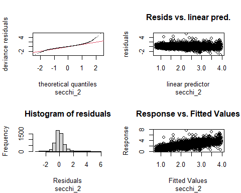

    #> 
    #> Method: GCV   Optimizer: magic
    #> Smoothing parameter selection converged after 11 iterations.
    #> The RMS GCV score gradient at convergence was 1.18504e-06 .
    #> The Hessian was positive definite.
    #> Model rank =  23 / 23 
    #> 
    #> Basis dimension (k) checking results. Low p-value (k-index<1) may
    #> indicate that k is too low, especially if edf is close to k'.
    #> 
    #>            k' edf k-index p-value
    #> s(station) 17  16      NA      NA
    #> 
    #> temperature

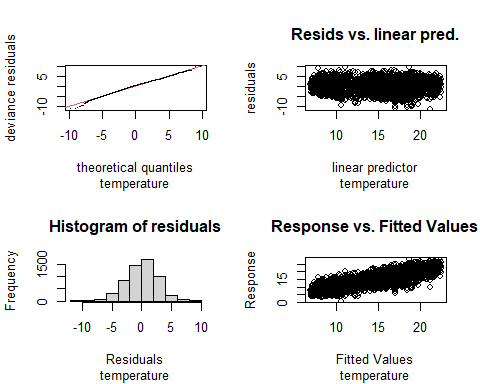

    #> 
    #> Method: GCV   Optimizer: magic
    #> Smoothing parameter selection converged after 10 iterations.
    #> The RMS GCV score gradient at convergence was 2.751498e-06 .
    #> The Hessian was positive definite.
    #> Model rank =  23 / 23 
    #> 
    #> Basis dimension (k) checking results. Low p-value (k-index<1) may
    #> indicate that k is too low, especially if edf is close to k'.
    #> 
    #>              k'  edf k-index p-value
    #> s(station) 17.0 15.8      NA      NA
    #> 
    #> salinity

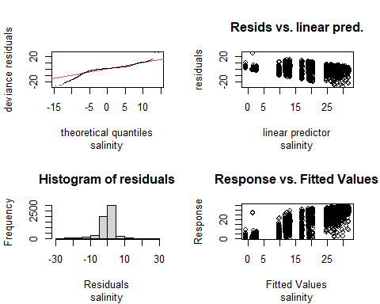

    #> 
    #> Method: GCV   Optimizer: magic
    #> Smoothing parameter selection converged after 12 iterations.
    #> The RMS GCV score gradient at convergence was 1.472192e-05 .
    #> The Hessian was positive definite.
    #> Model rank =  23 / 23 
    #> 
    #> Basis dimension (k) checking results. Low p-value (k-index<1) may
    #> indicate that k is too low, especially if edf is close to k'.
    #> 
    #>            k' edf k-index p-value
    #> s(station) 17  16      NA      NA
    #> 
    #> do

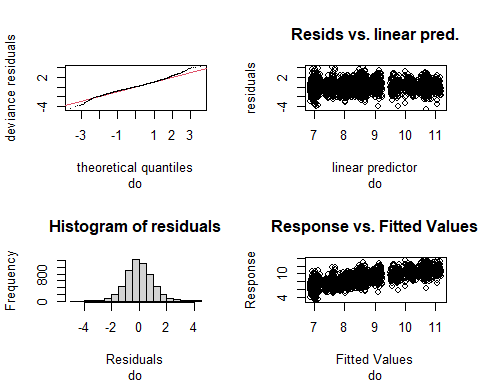

    #> 
    #> Method: GCV   Optimizer: magic
    #> Smoothing parameter selection converged after 10 iterations.
    #> The RMS GCV score gradient at convergence was 1.753593e-06 .
    #> The Hessian was positive definite.
    #> Model rank =  23 / 23 
    #> 
    #> Basis dimension (k) checking results. Low p-value (k-index<1) may
    #> indicate that k is too low, especially if edf is close to k'.
    #> 
    #>              k'  edf k-index p-value
    #> s(station) 17.0 15.8      NA      NA
    #> 
    #> pctsat

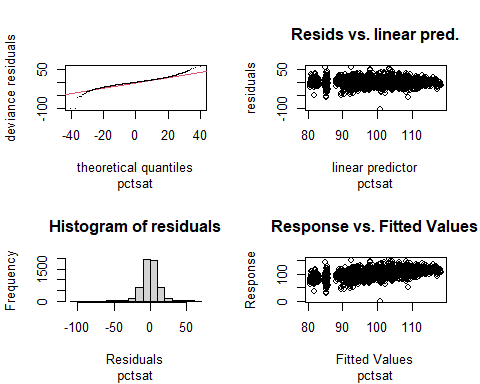

    #> 
    #> Method: GCV   Optimizer: magic
    #> Smoothing parameter selection converged after 10 iterations.
    #> The RMS GCV score gradient at convergence was 0.0001581392 .
    #> The Hessian was positive definite.
    #> Model rank =  23 / 23 
    #> 
    #> Basis dimension (k) checking results. Low p-value (k-index<1) may
    #> indicate that k is too low, especially if edf is close to k'.
    #> 
    #>              k'  edf k-index p-value
    #> s(station) 17.0 15.9      NA      NA
    #> 
    #> pH

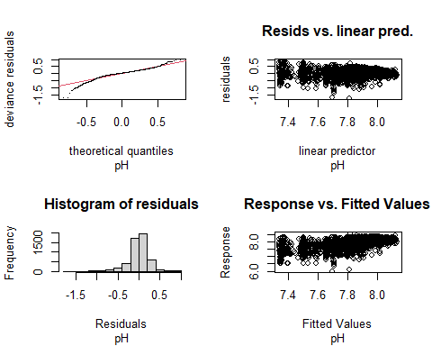

    #> 
    #> Method: GCV   Optimizer: magic
    #> Smoothing parameter selection converged after 8 iterations.
    #> The RMS GCV score gradient at convergence was 7.755405e-07 .
    #> The Hessian was positive definite.
    #> Model rank =  23 / 23 
    #> 
    #> Basis dimension (k) checking results. Low p-value (k-index<1) may
    #> indicate that k is too low, especially if edf is close to k'.
    #> 
    #>              k'  edf k-index p-value
    #> s(station) 17.0 15.9      NA      NA
    #> 
    #> chl

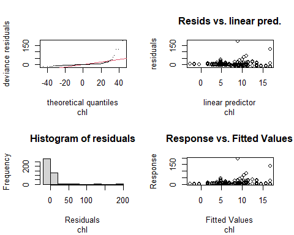

    #> 
    #> Method: GCV   Optimizer: magic
    #> Smoothing parameter selection converged after 10 iterations.
    #> The RMS GCV score gradient at convergence was 2.739048e-05 .
    #> The Hessian was positive definite.
    #> Model rank =  9 / 9 
    #> 
    #> Basis dimension (k) checking results. Low p-value (k-index<1) may
    #> indicate that k is too low, especially if edf is close to k'.
    #> 
    #>                  k'      edf k-index p-value
    #> s(station) 3.00e+00 7.08e-09      NA      NA
    #> 
    #> log1_chl

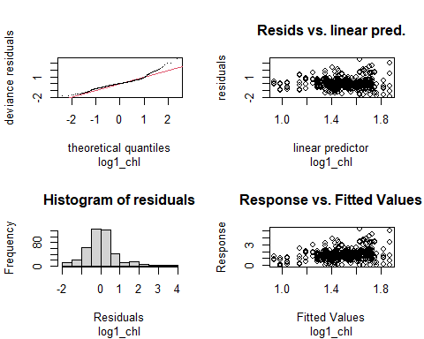

    #> 
    #> Method: GCV   Optimizer: magic
    #> Smoothing parameter selection converged after 9 iterations.
    #> The RMS GCV score gradient at convergence was 2.20435e-07 .
    #> The Hessian was positive definite.
    #> Model rank =  9 / 9 
    #> 
    #> Basis dimension (k) checking results. Low p-value (k-index<1) may
    #> indicate that k is too low, especially if edf is close to k'.
    #> 
    #>                  k'      edf k-index p-value
    #> s(station) 3.00e+00 1.48e-08      NA      NA

We have the same pathologies in these models as before. All errors are
distributed somewhat heavy tailed, and some are also skewed. Sample
sizes are large, so normal approximations are likely good, but we should
not take nominal p values too seriously.

### ANOVAs

``` r
nested_data <- nested_data %>%
  mutate(anova_3 = map(lmer_3_seas_2, function(mod) anova(mod)))

for ( p in nested_data$parameter) {
  cat('\n\n', p, '\n')
  print(nested_data$anova_3[nested_data$parameter == p][[1]])
}
#> 
#> 
#>  secchi_2 
#> 
#> Family: gaussian 
#> Link function: identity 
#> 
#> Formula:
#> value ~ year * season_3 + s(station, bs = "re")
#> 
#> Parametric Terms:
#>               df     F p-value
#> year           1 2.488  0.1148
#> season_3       2 4.297  0.0137
#> year:season_3  2 4.321  0.0133
#> 
#> Approximate significance of smooth terms:
#>              edf Ref.df     F p-value
#> s(station) 15.96  16.00 419.4  <2e-16
#> 
#> 
#>  temperature 
#> 
#> Family: gaussian 
#> Link function: identity 
#> 
#> Formula:
#> value ~ year * season_3 + s(station, bs = "re")
#> 
#> Parametric Terms:
#>               df      F  p-value
#> year           1 56.013 8.31e-14
#> season_3       2  3.211   0.0404
#> year:season_3  2  2.878   0.0563
#> 
#> Approximate significance of smooth terms:
#>              edf Ref.df     F p-value
#> s(station) 15.84  16.00 103.4  <2e-16
#> 
#> 
#>  salinity 
#> 
#> Family: gaussian 
#> Link function: identity 
#> 
#> Formula:
#> value ~ year * season_3 + s(station, bs = "re")
#> 
#> Parametric Terms:
#>               df     F p-value
#> year           1 0.049   0.826
#> season_3       2 1.988   0.137
#> year:season_3  2 1.898   0.150
#> 
#> Approximate significance of smooth terms:
#>              edf Ref.df    F p-value
#> s(station) 15.99  16.00 1042  <2e-16
#> 
#> 
#>  do 
#> 
#> Family: gaussian 
#> Link function: identity 
#> 
#> Formula:
#> value ~ year * season_3 + s(station, bs = "re")
#> 
#> Parametric Terms:
#>               df     F p-value
#> year           1 2.849  0.0915
#> season_3       2 0.136  0.8730
#> year:season_3  2 0.072  0.9302
#> 
#> Approximate significance of smooth terms:
#>              edf Ref.df     F p-value
#> s(station) 15.85  16.00 135.7  <2e-16
#> 
#> 
#>  pctsat 
#> 
#> Family: gaussian 
#> Link function: identity 
#> 
#> Formula:
#> value ~ year * season_3 + s(station, bs = "re")
#> 
#> Parametric Terms:
#>               df     F p-value
#> year           1 9.647 0.00191
#> season_3       2 2.299 0.10041
#> year:season_3  2 2.346 0.09589
#> 
#> Approximate significance of smooth terms:
#>              edf Ref.df     F p-value
#> s(station) 15.86  16.00 130.9  <2e-16
#> 
#> 
#>  pH 
#> 
#> Family: gaussian 
#> Link function: identity 
#> 
#> Formula:
#> value ~ year * season_3 + s(station, bs = "re")
#> 
#> Parametric Terms:
#>               df     F  p-value
#> year           1 12.21  0.00048
#> season_3       2 11.77 7.93e-06
#> year:season_3  2 11.91 6.92e-06
#> 
#> Approximate significance of smooth terms:
#>             edf Ref.df     F p-value
#> s(station) 15.9   16.0 149.7  <2e-16
#> 
#> 
#>  chl 
#> 
#> Family: gaussian 
#> Link function: identity 
#> 
#> Formula:
#> value ~ year * season_3 + s(station, bs = "re")
#> 
#> Parametric Terms:
#>               df      F  p-value
#> year           1 15.000 0.000125
#> season_3       2  4.302 0.014145
#> year:season_3  2  4.290 0.014311
#> 
#> Approximate significance of smooth terms:
#>                  edf    Ref.df F p-value
#> s(station) 7.083e-09 3.000e+00 0   0.392
#> 
#> 
#>  log1_chl 
#> 
#> Family: gaussian 
#> Link function: identity 
#> 
#> Formula:
#> value ~ year * season_3 + s(station, bs = "re")
#> 
#> Parametric Terms:
#>               df      F  p-value
#> year           1 12.416 0.000473
#> season_3       2  7.355 0.000726
#> year:season_3  2  7.364 0.000720
#> 
#> Approximate significance of smooth terms:
#>                  edf    Ref.df F p-value
#> s(station) 1.484e-08 2.000e+00 0     0.4
```

### Plot Marginal Means

These means are all marginal to the identity of the stations. It’s worth
noting that differences in slope that jump out in these graphics often
vanish into relative insignificance when plotted against the source
data. Also, some “statistically significant” differences in seasonal
slopes are pretty small, on pretty small slopes, and thus are probably
not worth interpreting.

``` r
nested_data <- nested_data %>%
  mutate(emmi_3 = map(lmer_3_seas_2, function(mod) emmip(mod, season_3 ~ year, 
                                                        at = list(year = 1993:2020),
                                                       plotit = FALSE)))
```

``` r
for (p in nested_data$parameter) {
  preds <- nested_data[nested_data$parameter == p,]$emmi_3[[1]]
 
  plt <-  preds %>%
    mutate(UCL = yvar + 1.96 * SE,
           LCL = yvar - 1.96 * SE) %>%
    ggplot(aes(x = xvar, y = yvar, color = tvar)) +
    geom_line() +
    geom_ribbon(aes(ymin = LCL, ymax = UCL, fill = tvar), color = NA, alpha = 0.15) +
    ylab(p) +
    labs(color = '')
  print(plt)
}
```

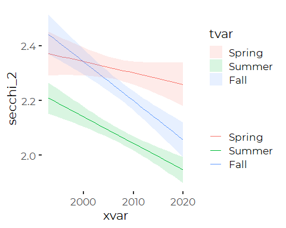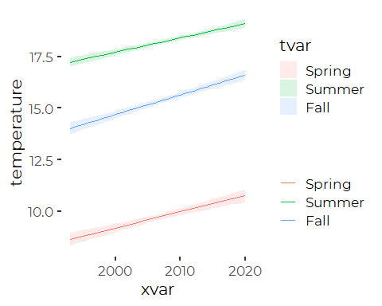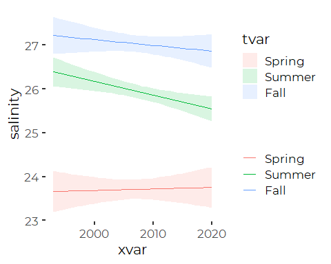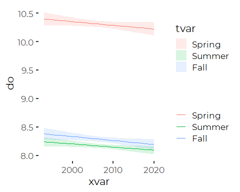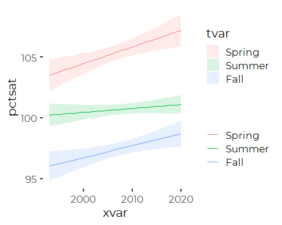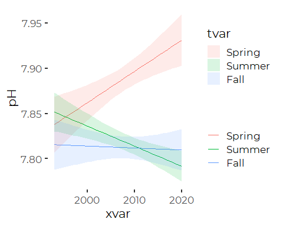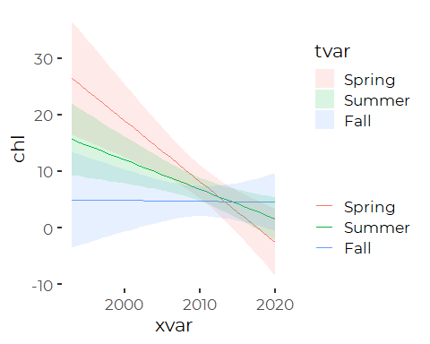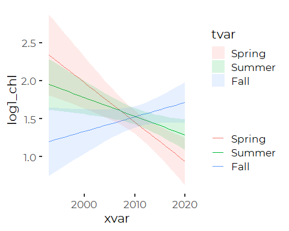

-   Secchi shows significant differences in seasonal trends.
-   Temperatures also show significant interaction (a surprise!)
-   Salinity shows no significant trends or interactions.
-   DO shows no significant trends or interactions.
-   Pct Saturation shows a significant trend, but no significant
    interactions.
-   pH shows significant trend, with interactions
-   Chloride shows strong seasonal patterns.

### Seasonal Slopes

``` r
nested_data <- nested_data %>%
  mutate(slopes = map(lmer_3_seas_2,
                      function(mod) summary(emtrends(mod, 
                                                     ~ season_3, 
                                                     var = "year")))) %>%
  mutate(slopes_compare = map(lmer_3_seas_2,  function(mod) emtrends(mod, 
                                                     pairwise ~ season_3, 
                                                     var = "year")$contrasts))
names(nested_data$slopes) <- nested_data$parameter
nested_data$slopes
#> $secchi_2
#>  season_3 year.trend      SE   df lower.CL upper.CL
#>  Spring     -0.00417 0.00264 5152 -0.00934  0.00101
#>  Summer     -0.00974 0.00171 5152 -0.01308 -0.00639
#>  Fall       -0.01426 0.00225 5152 -0.01867 -0.00984
#> 
#> Results are averaged over the levels of: station 
#> Confidence level used: 0.95 
#> 
#> $temperature
#>  season_3 year.trend      SE   df lower.CL upper.CL
#>  Spring       0.0778 0.01039 5622   0.0574   0.0981
#>  Summer       0.0691 0.00677 5622   0.0559   0.0824
#>  Fall         0.0957 0.00888 5622   0.0782   0.1131
#> 
#> Results are averaged over the levels of: station 
#> Confidence level used: 0.95 
#> 
#> $salinity
#>  season_3 year.trend     SE   df lower.CL upper.CL
#>  Spring       0.0034 0.0155 5567  -0.0269   0.0337
#>  Summer      -0.0311 0.0101 5567  -0.0508  -0.0114
#>  Fall        -0.0131 0.0133 5567  -0.0391   0.0129
#> 
#> Results are averaged over the levels of: station 
#> Confidence level used: 0.95 
#> 
#> $do
#>  season_3 year.trend      SE   df lower.CL  upper.CL
#>  Spring     -0.00653 0.00387 5504  -0.0141  0.001054
#>  Summer     -0.00547 0.00250 5504  -0.0104 -0.000557
#>  Fall       -0.00694 0.00328 5504  -0.0134 -0.000513
#> 
#> Results are averaged over the levels of: station 
#> Confidence level used: 0.95 
#> 
#> $pctsat
#>  season_3 year.trend     SE   df lower.CL upper.CL
#>  Spring       0.1357 0.0437 5459   0.0501   0.2214
#>  Summer       0.0319 0.0283 5459  -0.0235   0.0874
#>  Fall         0.0982 0.0372 5459   0.0252   0.1711
#> 
#> Results are averaged over the levels of: station 
#> Confidence level used: 0.95 
#> 
#> $pH
#>  season_3 year.trend       SE   df lower.CL  upper.CL
#>  Spring     0.003457 0.000989 5069  0.00152  0.005397
#>  Summer    -0.002217 0.000629 5069 -0.00345 -0.000983
#>  Fall      -0.000223 0.000840 5069 -0.00187  0.001424
#> 
#> Results are averaged over the levels of: station 
#> Confidence level used: 0.95 
#> 
#> $chl
#>  season_3 year.trend    SE  df lower.CL upper.CL
#>  Spring      -1.0755 0.278 418   -1.621   -0.530
#>  Summer      -0.5194 0.173 418   -0.860   -0.178
#>  Fall        -0.0155 0.234 418   -0.476    0.445
#> 
#> Results are averaged over the levels of: station 
#> Confidence level used: 0.95 
#> 
#> $log1_chl
#>  season_3 year.trend      SE  df lower.CL upper.CL
#>  Spring      -0.0518 0.01471 418 -0.08077 -0.02293
#>  Summer      -0.0245 0.00919 418 -0.04261 -0.00648
#>  Fall         0.0191 0.01241 418 -0.00531  0.04347
#> 
#> Results are averaged over the levels of: station 
#> Confidence level used: 0.95
```

``` r
names(nested_data$slopes_compare) <- nested_data$parameter
nested_data$slopes_compare
#> $secchi_2
#>  contrast        estimate      SE   df t.ratio p.value
#>  Spring - Summer  0.00557 0.00311 5152 1.788   0.1735 
#>  Spring - Fall    0.01009 0.00344 5152 2.937   0.0093 
#>  Summer - Fall    0.00452 0.00278 5152 1.626   0.2346 
#> 
#> Results are averaged over the levels of: station 
#> P value adjustment: tukey method for comparing a family of 3 estimates 
#> 
#> $temperature
#>  contrast        estimate     SE   df t.ratio p.value
#>  Spring - Summer  0.00863 0.0123 5622  0.700  0.7636 
#>  Spring - Fall   -0.01789 0.0136 5622 -1.317  0.3859 
#>  Summer - Fall   -0.02652 0.0111 5622 -2.397  0.0437 
#> 
#> Results are averaged over the levels of: station 
#> P value adjustment: tukey method for comparing a family of 3 estimates 
#> 
#> $salinity
#>  contrast        estimate     SE   df t.ratio p.value
#>  Spring - Summer   0.0345 0.0183 5567  1.882  0.1438 
#>  Spring - Fall     0.0165 0.0202 5567  0.815  0.6934 
#>  Summer - Fall    -0.0180 0.0165 5567 -1.092  0.5188 
#> 
#> Results are averaged over the levels of: station 
#> P value adjustment: tukey method for comparing a family of 3 estimates 
#> 
#> $do
#>  contrast         estimate      SE   df t.ratio p.value
#>  Spring - Summer -0.001061 0.00458 5504 -0.232  0.9708 
#>  Spring - Fall    0.000415 0.00504 5504  0.082  0.9963 
#>  Summer - Fall    0.001476 0.00409 5504  0.361  0.9307 
#> 
#> Results are averaged over the levels of: station 
#> P value adjustment: tukey method for comparing a family of 3 estimates 
#> 
#> $pctsat
#>  contrast        estimate     SE   df t.ratio p.value
#>  Spring - Summer   0.1038 0.0517 5459  2.006  0.1109 
#>  Spring - Fall     0.0376 0.0570 5459  0.659  0.7874 
#>  Summer - Fall    -0.0662 0.0463 5459 -1.430  0.3256 
#> 
#> Results are averaged over the levels of: station 
#> P value adjustment: tukey method for comparing a family of 3 estimates 
#> 
#> $pH
#>  contrast        estimate      SE   df t.ratio p.value
#>  Spring - Summer  0.00567 0.00117 5069  4.867  <.0001 
#>  Spring - Fall    0.00368 0.00129 5069  2.854  0.0121 
#>  Summer - Fall   -0.00199 0.00104 5069 -1.914  0.1349 
#> 
#> Results are averaged over the levels of: station 
#> P value adjustment: tukey method for comparing a family of 3 estimates 
#> 
#> $chl
#>  contrast        estimate    SE  df t.ratio p.value
#>  Spring - Summer   -0.556 0.327 418 -1.698  0.2070 
#>  Spring - Fall     -1.060 0.363 418 -2.918  0.0104 
#>  Summer - Fall     -0.504 0.291 418 -1.729  0.1955 
#> 
#> Results are averaged over the levels of: station 
#> P value adjustment: tukey method for comparing a family of 3 estimates 
#> 
#> $log1_chl
#>  contrast        estimate     SE  df t.ratio p.value
#>  Spring - Summer  -0.0273 0.0173 418 -1.574  0.2581 
#>  Spring - Fall    -0.0709 0.0192 418 -3.685  0.0008 
#>  Summer - Fall    -0.0436 0.0154 418 -2.825  0.0137 
#> 
#> Results are averaged over the levels of: station 
#> P value adjustment: tukey method for comparing a family of 3 estimates
```

-   secchi: Spring declines less than fall.
-   temperature: Summer increases less than fall
-   salinity: No differences
-   do: No differences
-   pctsat: No differences
-   pH Spring pH increased, both summer and fall decreased
-   chl Spring declined faster than fall.
-   log1\_chl Spring declined faster than summer or fall.

# Graphics

## Simply overplot data

### Plots

We could construct this as a function, but the for loop is a bit faster
to develop.

``` r
for (p in nested_data$parameter) {
  row <- nested_data[nested_data$parameter == p,]
  dat <- row$data[[1]]
  preds <- row$emmi_3[[1]]
  label <- row$label
  units <- row$units
  
  preds <-  preds %>%
    mutate(UCL = yvar + 1.96 * SE,
           LCL = yvar - 1.96 * SE)
  
  plt <-    ggplot() +
    geom_jitter(mapping = aes(year, value, color = season_3), data = dat, 
                alpha = 0.1, width = 0.25) +
    
    geom_line(mapping = aes(x = xvar, y = yvar, color = tvar), data = preds,
              size = 1) +
    #geom_ribbon(aes(x = xvar, ymin = LCL, ymax = UCL, fill = tvar), data = preds,
    #            color = NA, alpha = 0.15) +
    
    guides(fill = 'none') +
    scale_color_manual(values = cbep_colors2()[c(1,2,4)],
                       name = '',
                guide = guide_legend(override.aes = list(alpha = 1))) +
    scale_fill_manual(values = cbep_colors2()[c(1,2,4)]) +
    
    theme_cbep(base_size = 14) +
    theme(legend.position = 'bottom',
          axis.title.y = element_text(size = 12),
          axis.line = element_line(color = 'gray85')) +

    ylab(paste0(label, 
                if_else(nchar(units) > 0, ' (',''),
                units,
                if_else(nchar(units) > 0, ')',''))) +
    xlab('') +
    labs(color = '')
  print(plt)
}
```

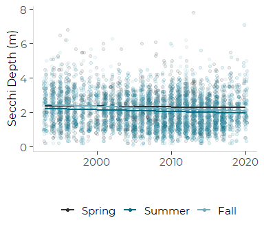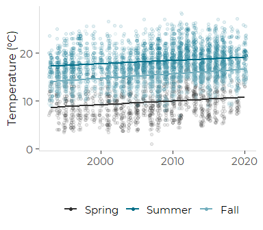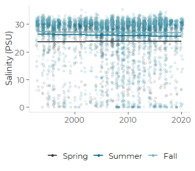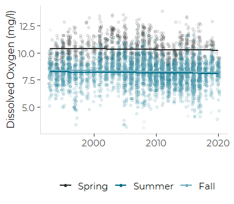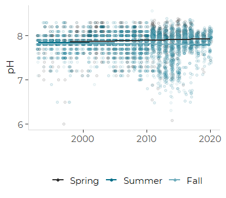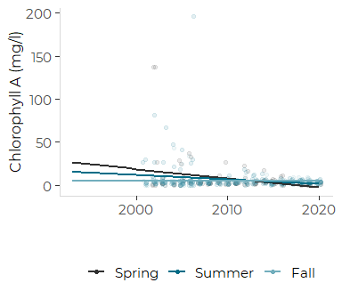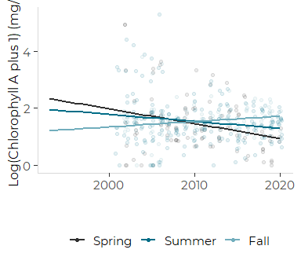

### Fix the Chlorophyll Models and Graphic

We need to plot the chlorophyll data on a transformed axis, which takes
several steps.

1.  Refit the model, including the transformation in the model  
2.  Extract marginal trends from the revised model with
    `type == "response"`  
3.  Redraw the plot, with an added transformation on the Y axis, while
    controlling the locations of the breaks.

``` r
dat <- nested_data %>%
  filter(parameter == 'chl') %>%
  pull(data)                # Returns a list
dat <- dat[[1]]             # Extract the first item....  df is now a data frame
anyNA(dat$value)
#> [1] FALSE
```

`emmeans` recognizes the log(value + 1) transform, but it does not
recognize the equivalent log1p() transform.

``` r
new_mod_2 <- gam(log(value + 1) ~ year * season_2 + 
                  s(station, bs = 're'), 
                data = dat)
new_mod_3 <- gam(log(value + 1) ~ year * season_3 + 
                  s(station, bs = 're'), 
                data = dat)

pred <- emmip(new_mod_3, season_3 ~ year, 
             at = list(year = 1993:2020), type = 'response',
             plotit = FALSE) %>%
  filter(year > 2000)
```

We copy results into the nested tibble. We omit two values where the
results on the back-transformed scale are less reliable.

``` r
nested_data$lmer_2_seas[nested_data$parameter == 'chl'] <- list(new_mod_2)
#> Warning: Unknown or uninitialised column: `lmer_2_seas`.
nested_data$lmer_3_seas_2[nested_data$parameter == 'chl'] <- list(new_mod_3)
nested_data$compare[nested_data$parameter == 'chl'] <- list(NA)
#> Warning: Unknown or uninitialised column: `compare`.
nested_data$anova_3[nested_data$parameter == 'chl'] <- list(anova(new_mod_3))
nested_data$emmi_3[nested_data$parameter == 'chl'] <- list(pred)
nested_data$slopes[nested_data$parameter == 'chl'] <- list(NA)
nested_data$slopes_compare[nested_data$parameter == 'chl'] <- list(NA)
```

#### Updated Chlorophyll Plot

The primary change in the code here is addition of
`scale_y_continuous(trans = 'log1p')`. Unlike emmeans, ggplot recognizes
the transform. We also have to explicitly control the x axis to match
the other plots.

``` r
row <- nested_data[nested_data$parameter == 'chl',]
  dat <- row$data[[1]]
  preds <- row$emmi_3[[1]]
  label <- row$label
  units <- row$units
  
  preds <-  preds %>%
    mutate(UCL = yvar + 1.96 * SE,
           LCL = yvar - 1.96 * SE)
  
  plt <-  ggplot() +
    geom_jitter(mapping = aes(year, value, color = season_3), data = dat, 
                alpha = 0.1, width = 0.25) +
    
    geom_line(mapping = aes(x = xvar, y = yvar, color = tvar), data = preds,
              size = 1) +
    #geom_ribbon(aes(x = xvar, ymin = LCL, ymax = UCL, fill = tvar), data = preds,
    #            color = NA, alpha = 0.15) +
    
    guides(fill = 'none') +
    scale_color_manual(values = cbep_colors2()[c(1,2,4)],
                       name = '',
                guide = guide_legend(override.aes = list(alpha = 1))) +
    scale_fill_manual(values = cbep_colors2()[c(1,2,4)]) +
    
    theme_cbep(base_size = 14) +
    theme(legend.position = 'bottom',
          axis.title.y = element_text(size = 12),
          axis.line = element_line(color = 'gray85')) +

    ylab(paste0(label, 
                if_else(nchar(units) > 0, ' (',''),
                units,
                if_else(nchar(units) > 0, ')',''))) +
    xlab('') +
    labs(color = '') +
    xlim(1993, 2020) +
    scale_y_continuous(trans = 'log1p', breaks = c(0,1,  5, 10, 50, 100, 200))
  print(plt)
#> Warning: Removed 14 rows containing missing values (geom_point).
```

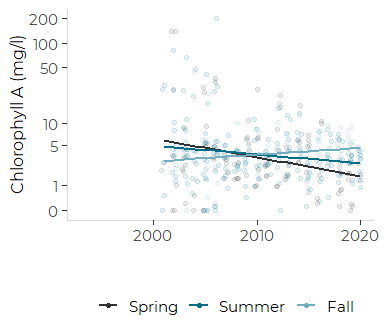
