Review of Surface Data From FOCB
================
Curtis C. Bohlen, Casco Bay Estuary Partnership
2/18/2021

-   [Introduction](#introduction)
-   [Load Libraries](#load-libraries)
-   [Load Data](#load-data)
    -   [Establish Folder Reference](#establish-folder-reference)
    -   [Primary Data](#primary-data)
        -   [Remove Data Only Availalbe In
            2020](#remove-data-only-availalbe-in-2020)
    -   [Add Station Names](#add-station-names)
    -   [Address Censored Secchi
        Values](#address-censored-secchi-values)
    -   [Create Recent Data](#create-recent-data)
    -   [Create Trend Data](#create-trend-data)
-   [Cross Tabs](#cross-tabs)
    -   [Prevalence of Stations by
        Year](#prevalence-of-stations-by-year)
    -   [Prevalence of Parameters by
        Year](#prevalence-of-parameters-by-year)
-   [Evaluation of Distributions](#evaluation-of-distributions)
    -   [Comment](#comment)
    -   [Pairs Plot](#pairs-plot)
    -   [QQ Plots of Untransformed and Log-Transformed
        Data](#qq-plots-of-untransformed-and-log-transformed-data)
    -   [Box Cox Transformations](#box-cox-transformations)
-   [Secchi Depth Models](#secchi-depth-models)


# Introduction

This Notebook reviews contents of the data received from FOCB’s
“’Citizen Stewards”Surface" data.

This reflects only a small portion of FOCB’s monitoring activity.

Other analyses in this SoCB GitHub repositories look in more detail
at:  
1. “Historical”Citizen Steward" Data from nearly thirty years of
monitoring.  
2. Continuing sampling conducted at a smaller number of locations by
FOCB staff.

Analyses in OTHER GitHub archived look into the following:  
3. Coastal acidification-related data collection at this same site.  
4. Nutrient-related data, especially data on ambient nitrogen
concentrations in and around Portland harbor.

# Load Libraries

``` r
library(MASS)     # Here for the `boxcox()` function
library(tidyverse)
#> -- Attaching packages --------------------------------------- tidyverse 1.3.0 --
#> v ggplot2 3.3.3     v purrr   0.3.4
#> v tibble  3.0.5     v dplyr   1.0.3
#> v tidyr   1.1.2     v stringr 1.4.0
#> v readr   1.4.0     v forcats 0.5.0
#> -- Conflicts ------------------------------------------ tidyverse_conflicts() --
#> x dplyr::filter() masks stats::filter()
#> x dplyr::lag()    masks stats::lag()
#> x dplyr::select() masks MASS::select()
library(readxl)

library(GGally)
#> Registered S3 method overwritten by 'GGally':
#>   method from   
#>   +.gg   ggplot2

library(CBEPgraphics)
load_cbep_fonts()
theme_set(theme_cbep())
```

# Load Data

## Establish Folder Reference

``` r
sibfldnm <- 'Original_Data'
parent   <- dirname(getwd())
sibling  <- file.path(parent,sibfldnm)

dir.create(file.path(getwd(), 'figures'), showWarnings = FALSE)
```

## Primary Data

We specify column names because FOCB data has a row of names, a row of
units, then the data. This approach is simpler than reading names from
the first row and correcting them to be R syntactic names.

``` r
fn    <- 'FOCB Surface All Current Sites With BSV Data.xlsx'
fpath <- file.path(sibling,fn)

mynames <- c('station', 'dt', 'time', 'sample_depth',
             'secchi', 'water_depth','temperature', 'salinity',
             'do', 'pctsat', 'pH', 'chl', 
             'month', 'year', 'fdom', 'bga', 
             'turbidity', 'blank', 'clouds', 'wndspd',
             'winddir'
             )

the_data <- read_excel(fpath, skip=2, col_names = mynames)
rm(mynames)
```

### Remove Data Only Availalbe In 2020

``` r
the_data <- the_data %>%
select(-c(fdom:winddir))
```

## Add Station Names

``` r
fn    <- 'FOCB Monitoring Sites.xlsx'
fpath <- file.path(sibling,fn)
loc_data <- read_excel(fpath) %>%
  select(Station_ID, Station_Name) %>%
  rename(station = Station_ID)

the_data <- the_data %>%
  left_join(loc_data, by = 'station') %>%
  rename(station_name = Station_Name) %>%
  relocate(station_name, .after = station) %>%
  relocate(year, .after = dt) %>%
  relocate(month, .after = year)
```

## Address Censored Secchi Values

``` r
the_data <- the_data %>%
  mutate(secchi_2 = if_else(secchi == "BSV", water_depth, as.numeric(secchi)),
         bottom_flag = secchi == "BSV") %>%
  relocate(secchi_2, .after = secchi) %>%
  relocate(bottom_flag, .after = secchi_2)
#> Warning: Problem with `mutate()` input `secchi_2`.
#> i NAs introduced by coercion
#> i Input `secchi_2` is `if_else(secchi == "BSV", water_depth, as.numeric(secchi))`.
```

## Create Recent Data

We filter to the last five FULL years of data, 2015 through 2019.

``` r
recent_data <- the_data %>%
  filter(year > 2014 & year < 2020) %>%
  mutate(station = factor(station))
```

## Create Trend Data

First, we create a tibble containing information on years in which each
station was sampled.

``` r
years_data <- the_data %>%
  group_by(station, year) %>%
  summarize(yes = ! all(is.na(temperature)),
            .groups = 'drop_last') %>%
  summarize(years = sum(yes, na.rm = TRUE),
            recent_years =  sum(yes & year > 2014, na.rm = TRUE),
            .groups = 'drop')
  
```

Then we identify stations with at least 10 years of data, and at least
three years of data from the last five years, and use that list to
select data for trend analysis.

``` r
selected_stations <- years_data %>%
  filter(years> 9, recent_years >2) %>%
  pull(station)

trend_data <- the_data %>%
  filter(station %in% selected_stations)
rm(selected_stations, years_data)
```

Two of the Stations are not in the locations data. They are: “CMS2” and
“P6CBI”. “P6CBI” was only sampled one year, in 2006. CMS3 is a new site
in 2020, so does not play a role in a retrospective analysis.

# Cross Tabs

## Prevalence of Stations by Year

``` r
xtabs(~ station + year, data = the_data)
#>        year
#> station 1993 1994 1995 1996 1997 1998 1999 2000 2001 2002 2003 2004 2005 2006
#>   BMR02    0   13   15   14    6    7    5    7    5    8    7   10    7    7
#>   CMS1     0    0    0    0    0    0    0    0    0    0    0    0    0    0
#>   CMS3     0    0    0    0    0    0    0    0    0    0    0    0    0    0
#>   EEB18   11   13   12   14    6    5    4    4    7    7    7    7   19   19
#>   HR1      0    0    0    2    0    0    0    0    0    0    0    0    0    0
#>   HR2     12   13   16   18    7    7    7    6    5    6   12    6   21   16
#>   HR4      0    0    0    0    0    0    0    0    0    0    0    0    0    0
#>   KVL84    0    0    0    0    0    0    0    0    0    0    0    0    0    0
#>   MPL86    0    0    0    0    0    0    0    0    0    0    0    0    0    0
#>   NMM79    0    0    1   17   28   11   11   10   14    8    7    7   16   19
#>   OBY35    0   13   15   12    7    7    7    7    7    8    7    7   20   20
#>   P5BSD   12   13   15   18    7    8    7    7    7    8    9    8   10   10
#>   P6CBI    0    0    0    0    0    0    0    0    0    0    0    0    0    1
#>   P6FGG   12   13   15   17    7    8    7    7    7    8    9    8   10   10
#>   P7CBI   12   13   15   17    7    8    7    7    7    8    9    8   10   10
#>   PH1      0    0    0    0    0    0    0    0    0    0    0    0    0    0
#>   PH2      0    0    0    0    0    0    0    0    0    0    0    0    0    0
#>   PH3      0    0    0    0    0    0    0    0    0    0    0    0    0    0
#>   PKT42   14   16   11   13    6    7    7    6    6    8    7    2    4    0
#>   PRV70    0    0   11    6    7    9    7    3    8    5    7    8    0    0
#>   PYC43    0   13   14   13    7    7    4    7    7    7    6    6   18   20
#>   RRC46   13   16   19   18    7    9    7    8    7    7    9    7   18    4
#>   RRY47    0   14   15   15    7    6    7    7    7    6    7    7   18   19
#>   SMT50   13   17   12   14    7    8    5    4   78   62   75   89   59   59
#>   STR54   14   15   12   15    7    7    7    7    7    7    6    7   18   18
#>        year
#> station 2007 2008 2009 2010 2011 2012 2013 2014 2015 2016 2017 2018 2019 2020
#>   BMR02    5   11    5   14   12   11    6   18   20   17   22    7    9    6
#>   CMS1     0    0   14   19   20   20   20   20   20   20   18    8    9    7
#>   CMS3     0    0    0    0    0    0    0    0    0    0    0    0    0    6
#>   EEB18   18   20   28   21   19    4   20   17   20   19   24    8    9    7
#>   HR1      0    0    0    0    0    0    0    4    2    3    8    6    9    6
#>   HR2     18   19   20   19   20   17   16   24   22   24   22    6    3    0
#>   HR4      0    0    2    3    2    3    0   15   12    1    0    0    9    7
#>   KVL84   20   41   23   16   10    5    6   13    6    7    7    0    0    0
#>   MPL86    0    0    0    0    0    0    0    0    0   20   22    7    9    7
#>   NMM79   20   17   21   22   20   23   19   20   16   18   17    7    9    7
#>   OBY35   20   19   20   14   18   19   16   19   15   14   15    5    7    6
#>   P5BSD    6    7    6    7    7    7    7    5    7    4    1    8    9    7
#>   P6CBI    0    0    0    0    0    0    0    0    0    0    0    0    0    0
#>   P6FGG    7    7    6    7    7    6    7    7    7    7    6    8    9    8
#>   P7CBI    7    7    6    7    7    7    7    7    7    7    6    8    9    9
#>   PH1      0    0    0    0    0    0    0    0    0    0    1    7    9    7
#>   PH2      0    0    0    0    0    0    0    0    0    0    1    7    9    8
#>   PH3      0    0    0    0    0    0    0    0    0    0    1    6    8    8
#>   PKT42   17    0    0    0   20   19   18   19   18   20   18    7    9    7
#>   PRV70    0   23   15   13   14    9    1    5   14   15   12    5    8    5
#>   PYC43   20   18   12   20   15   17   18   17   15   20   20    5    7    6
#>   RRC46   18   18   18   16   17   16   18   18   18   20   18    5    9    6
#>   RRY47   18   18   21   22   22   23   17   17   18   19   18    7    9    7
#>   SMT50   48   60   46   51   40   28   43   27   22   42   16    4    9    7
#>   STR54   13   18   17   18   16   17   10   19   18   13   14    6    9    7
```

## Prevalence of Parameters by Year

``` r
tmp <- the_data %>%
  select(-dt, -time, -month, -sample_depth, 
         -secchi, - bottom_flag) %>%
  relocate(water_depth, .after = year) %>%
  pivot_longer(c(secchi_2:chl), names_to = 'parameter', values_to = 'value') %>%
  filter(! is.na(value)) %>%
  group_by(parameter)

xtabs(~ year + parameter, data = tmp)
#>       parameter
#> year   chl  do pctsat  pH salinity secchi_2 temperature
#>   1993   0 112    111  74      112       98         113
#>   1994   0 178    174 136      177      168         182
#>   1995   0 192    191 150      197      177         198
#>   1996   4 216    216 126      223      198         223
#>   1997   0 123    122  99      122      115         123
#>   1998   0 113    113  87      114      105         114
#>   1999   0  95     95  79       99       92          99
#>   2000   0  95     94  74       96       89          96
#>   2001   9 175    172 170      175      170         177
#>   2002  24 143    143 140      163      153         162
#>   2003  27 180    179 175      181      178         183
#>   2004  17 173    173 174      187      181         187
#>   2005  30 247    247 239      248      219         248
#>   2006  30 229    228 226      231      204         231
#>   2007  20 246    246 251      254      226         254
#>   2008  90 297    297 294      303      269         303
#>   2009  54 272    270 274      276      241         278
#>   2010  41 282    275 279      281      262         288
#>   2011  36 283    277 280      279      261         286
#>   2012  42 249    248 245      250      241         251
#>   2013  21 247    245 236      247      245         249
#>   2014  27 285    284 280      290      267         291
#>   2015  25 267    262 266      271      255         277
#>   2016  25 305    298 257      303      290         310
#>   2017  40 285    282 217      273      240         285
#>   2018 137 137    137 137      137      131         137
#>   2019 186 186    186 186      186      172         186
#>   2020 151 151    151 151      151      132         151
rm(tmp)
```

So note that Chlorophyll data is available going back to 2001, but from
relatively few samples until 2018

# Evaluation of Distributions

## Comment

We take a look at distributions of the data to help guide analyses. But
it should be remembered that in this setting, viewing histograms and qq
plots may be misleading, as they are based not on model residuals, but
raw observations.

Some parameters, such as salinity, have very different distributions
among different sites, creating skewed overall distributions based on
well understood phenomena. It is possible to have skewed distributions
without ending up with skewed residuals.

## Pairs Plot

``` r
the_data %>%
  select(c(-station, -station_name, 
           - dt, -time, 
           -sample_depth, 
           -secchi,  -bottom_flag,
           -month, - year)) %>%
  ggpairs(progress = FALSE)
#> Warning: Removed 515 rows containing non-finite values (stat_density).
#> Warning in ggally_statistic(data = data, mapping = mapping, na.rm = na.rm, :
#> Removed 563 rows containing missing values
#> Warning in ggally_statistic(data = data, mapping = mapping, na.rm = na.rm, :
#> Removed 525 rows containing missing values
#> Warning in ggally_statistic(data = data, mapping = mapping, na.rm = na.rm, :
#> Removed 580 rows containing missing values
#> Warning in ggally_statistic(data = data, mapping = mapping, na.rm = na.rm, :
#> Removed 638 rows containing missing values
#> Warning in ggally_statistic(data = data, mapping = mapping, na.rm = na.rm, :
#> Removed 682 rows containing missing values
#> Warning in ggally_statistic(data = data, mapping = mapping, na.rm = na.rm, :
#> Removed 1069 rows containing missing values
#> Warning in ggally_statistic(data = data, mapping = mapping, na.rm = na.rm, :
#> Removed 4986 rows containing missing values
#> Warning: Removed 563 rows containing missing values (geom_point).
#> Warning: Removed 519 rows containing non-finite values (stat_density).
#> Warning in ggally_statistic(data = data, mapping = mapping, na.rm = na.rm, :
#> Removed 528 rows containing missing values
#> Warning in ggally_statistic(data = data, mapping = mapping, na.rm = na.rm, :
#> Removed 582 rows containing missing values
#> Warning in ggally_statistic(data = data, mapping = mapping, na.rm = na.rm, :
#> Removed 641 rows containing missing values
#> Warning in ggally_statistic(data = data, mapping = mapping, na.rm = na.rm, :
#> Removed 683 rows containing missing values
#> Warning in ggally_statistic(data = data, mapping = mapping, na.rm = na.rm, :
#> Removed 1074 rows containing missing values
#> Warning in ggally_statistic(data = data, mapping = mapping, na.rm = na.rm, :
#> Removed 4971 rows containing missing values
#> Warning: Removed 525 rows containing missing values (geom_point).
#> Warning: Removed 528 rows containing missing values (geom_point).
#> Warning: Removed 12 rows containing non-finite values (stat_density).
#> Warning in ggally_statistic(data = data, mapping = mapping, na.rm = na.rm, :
#> Removed 72 rows containing missing values
#> Warning in ggally_statistic(data = data, mapping = mapping, na.rm = na.rm, :
#> Removed 136 rows containing missing values
#> Warning in ggally_statistic(data = data, mapping = mapping, na.rm = na.rm, :
#> Removed 180 rows containing missing values
#> Warning in ggally_statistic(data = data, mapping = mapping, na.rm = na.rm, :
#> Removed 594 rows containing missing values
#> Warning in ggally_statistic(data = data, mapping = mapping, na.rm = na.rm, :
#> Removed 4858 rows containing missing values
#> Warning: Removed 580 rows containing missing values (geom_point).
#> Warning: Removed 582 rows containing missing values (geom_point).
#> Warning: Removed 72 rows containing missing values (geom_point).
#> Warning: Removed 68 rows containing non-finite values (stat_density).
#> Warning in ggally_statistic(data = data, mapping = mapping, na.rm = na.rm, :
#> Removed 189 rows containing missing values
#> Warning in ggally_statistic(data = data, mapping = mapping, na.rm = na.rm, :
#> Removed 192 rows containing missing values
#> Warning in ggally_statistic(data = data, mapping = mapping, na.rm = na.rm, :
#> Removed 634 rows containing missing values
#> Warning in ggally_statistic(data = data, mapping = mapping, na.rm = na.rm, :
#> Removed 4858 rows containing missing values
#> Warning: Removed 638 rows containing missing values (geom_point).
#> Warning: Removed 641 rows containing missing values (geom_point).
#> Warning: Removed 136 rows containing missing values (geom_point).
#> Warning: Removed 189 rows containing missing values (geom_point).
#> Warning: Removed 131 rows containing non-finite values (stat_density).
#> Warning in ggally_statistic(data = data, mapping = mapping, na.rm = na.rm, :
#> Removed 178 rows containing missing values
#> Warning in ggally_statistic(data = data, mapping = mapping, na.rm = na.rm, :
#> Removed 681 rows containing missing values
#> Warning in ggally_statistic(data = data, mapping = mapping, na.rm = na.rm, :
#> Removed 4861 rows containing missing values
#> Warning: Removed 682 rows containing missing values (geom_point).
#> Warning: Removed 683 rows containing missing values (geom_point).
#> Warning: Removed 180 rows containing missing values (geom_point).
#> Warning: Removed 192 rows containing missing values (geom_point).
#> Warning: Removed 178 rows containing missing values (geom_point).
#> Warning: Removed 178 rows containing non-finite values (stat_density).
#> Warning in ggally_statistic(data = data, mapping = mapping, na.rm = na.rm, :
#> Removed 709 rows containing missing values
#> Warning in ggally_statistic(data = data, mapping = mapping, na.rm = na.rm, :
#> Removed 4861 rows containing missing values
#> Warning: Removed 1069 rows containing missing values (geom_point).
#> Warning: Removed 1074 rows containing missing values (geom_point).
#> Warning: Removed 594 rows containing missing values (geom_point).
#> Warning: Removed 634 rows containing missing values (geom_point).
#> Warning: Removed 681 rows containing missing values (geom_point).
#> Warning: Removed 709 rows containing missing values (geom_point).
#> Warning: Removed 592 rows containing non-finite values (stat_density).
#> Warning in ggally_statistic(data = data, mapping = mapping, na.rm = na.rm, :
#> Removed 4880 rows containing missing values
#> Warning: Removed 4986 rows containing missing values (geom_point).
#> Warning: Removed 4971 rows containing missing values (geom_point).
#> Warning: Removed 4858 rows containing missing values (geom_point).

#> Warning: Removed 4858 rows containing missing values (geom_point).
#> Warning: Removed 4861 rows containing missing values (geom_point).

#> Warning: Removed 4861 rows containing missing values (geom_point).
#> Warning: Removed 4880 rows containing missing values (geom_point).
#> Warning: Removed 4858 rows containing non-finite values (stat_density).
```

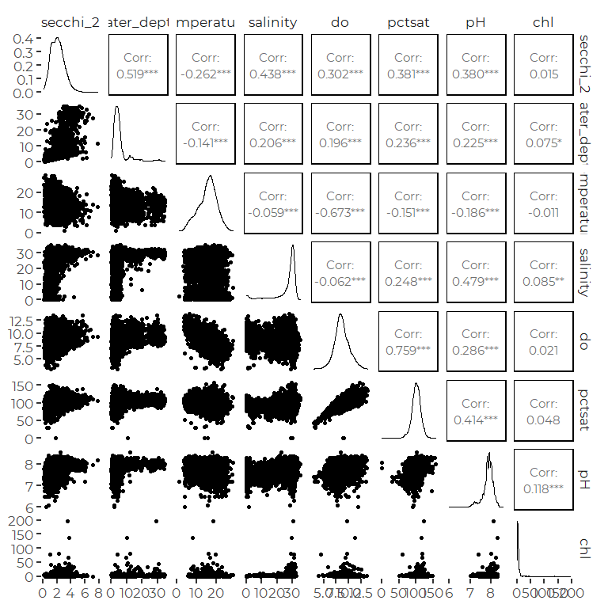

Most of those variables are decently distributed for normal
distribution-based models, although often with heavy tails.

Pairwise relationships are mostly reflections of the complex marine
environment. That is, low salinity happens inshore, where it is shallow,
and water clarity and dissolved oxygen both tend to be low.

Water depth, salinity, and chlorophyll have significant problems with
outliers. Some of those extremes are related to specific Stations (e.g.,
deep water; low salinity).

The log transform over transforms many of these parameters. It appears
to make little difference for dissolved oxygen or pct saturation, and
clearly helps with chlorophyll.

## QQ Plots of Untransformed and Log-Transformed Data

``` r
oldpar <-  par(mfrow = c(1,2))

for (p in c('secchi_2', 'temperature', 'salinity',
           'do', 'pctsat', 'pH', 'chl') ) {

qqnorm(the_data[[p]], main = p)
qqline(the_data[[p]])

l <- the_data[[p]]
l <- l[l>0]
l <- log(l)

qqnorm(l, main = paste('log of', p))
qqline(l)
}
```

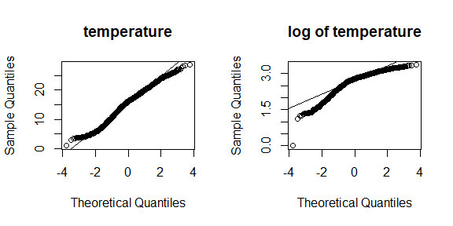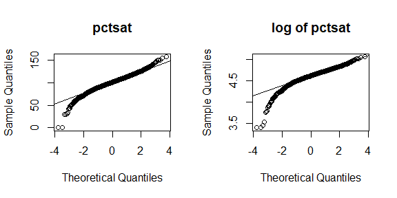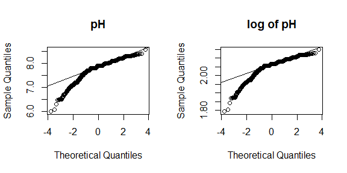

``` r
par(oldpar)
  
  
```

All parameters show deviations from normality.

-   Secchi depth is skewed right, with a long upper tail towards clear
    water. A log transform is too strong a transformation, and over
    corrects, skewing left.

-   Temperature is heavy-tailed, which is not entirely surprising given
    data collected over the course of the warm season April through
    October.

-   Salinity is highly skewed, with a smallish number of very low
    salinity observations. Some are tied to specific locations in river
    mouths. Based on prior analyses, some are probably tied to low
    salinity events that extend lower salinity conditions out into much
    of the Bay.

-   Dissolved Oxygen is close to normally distributed, with slightly
    heavy tails.

-   Percent Saturation has significantly heavier tails.

-   pH has a long lower tail. Low pH events occur, rarely, and they are
    lower than expected based on a normal distribution.

-   Chlorophyll A is heavily skewed, with a small number of quite
    extreme high values. The log transform improves matters, but the
    resulting distribution still has quite heavy tails. The heavy tailed
    distribution suggests careful work may need to look at extreme value
    distributions, like a Pareto distribution, but that is impractical
    for the type of models envisioned here.

The only parameter for which the distribution is made clearly more
suitable for least squares modeling is chlorophyll A.

## Box Cox Transformations

The Box Cox transformation is based on looking at residuals from a
linear model. in this setting, the “default” linear model includes time
of year and monitoring Station

The box-cox transformations are of the form:
$$\\frac{Y ^{\\lambda} - 1}{\\lambda}$$

But often Box Cox analysis is used to evaluate whether a power transform
might be approximately appropriate.

``` r
for (p in c('secchi_2', 'temperature', 'salinity',
           'do', 'pctsat', 'pH', 'chl') ) {
  tmp <- the_data[the_data[[p]] > 0,]
the_lm <- lm(tmp[[p]] ~  tmp$station + tmp$month)

bc = boxcox(the_lm, lambda = seq(-0.5,2, 0.1), ylab = paste('loglik of', p))
}
```

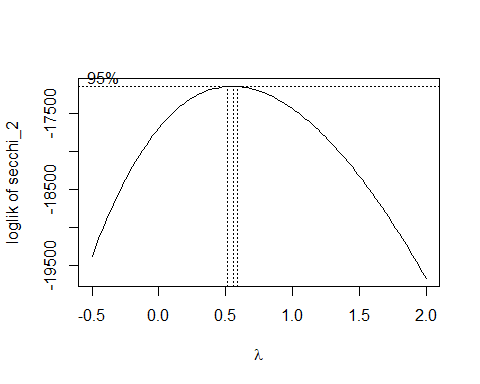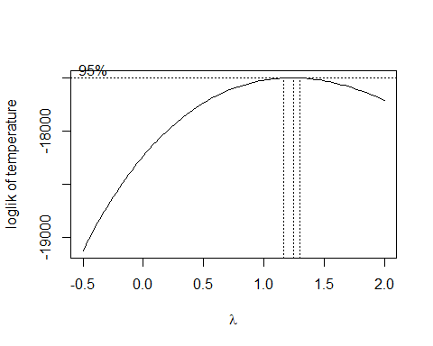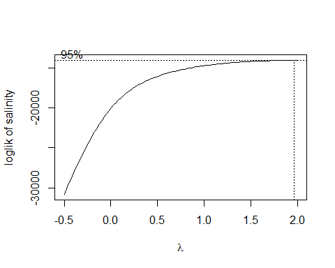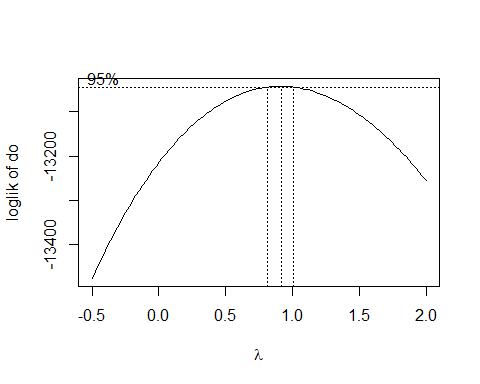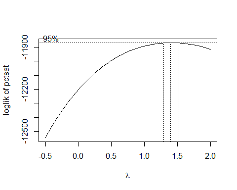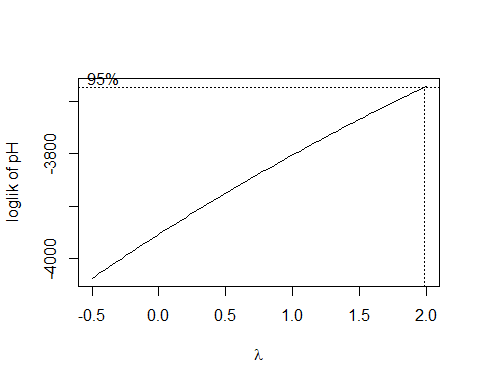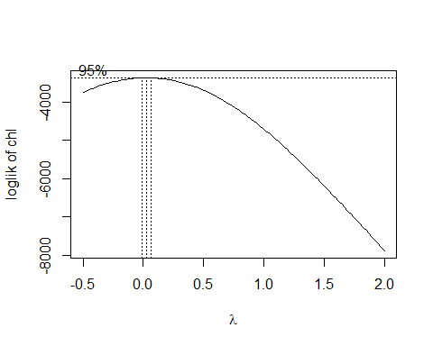

``` r
rm(tmp)
```

-   Secchi might be variance-stabilized somewhat by a square root
    transform. There is no obvious scientific justification for a square
    root transform in this setting.

-   Chlorophyll A might be helped by a log transform.

-   None of the other parameters appear likely to be much helped by
    response transformations, at least not without getting fairly ad
    hoc. While a Box Cox transformation with Lambda == 1.25 may make
    statistical sense, for dissolved oxygen, it does not relate to any
    obvious physical interpretation. The value here is largely to remind
    us that for heavy-tailed distributions, power transformations can be
    variance stabilizing.

From an aesthetic data analysis point of view, power transformations
appear unnecessary in the State of the Bay context, as we do not want to
rely closely on model assumption, and p values derived from them. Our
sample sizes are generally large enough so that normal confidence
intervals are likely to perform fairly well. But we probably need to
interpret results with humility, and check results with robust methods.

``` r
recent_data %>%
  select(c(-station, -station_name, - dt, -year, -month, -time,
           -sample_depth, -secchi)) %>%
  cor(method = 'spearman', use = 'pairwise')
#>               secchi_2 bottom_flag water_depth temperature    salinity
#> secchi_2     1.0000000 -0.17912733   0.5126478 -0.29922111  0.28918670
#> bottom_flag -0.1791273  1.00000000  -0.4241806 -0.11470485 -0.07473030
#> water_depth  0.5126478 -0.42418064   1.0000000 -0.11471924  0.21879390
#> temperature -0.2992211 -0.11470485  -0.1147192  1.00000000  0.00206206
#> salinity     0.2891867 -0.07473030   0.2187939  0.00206206  1.00000000
#> do           0.3891427  0.07179424   0.2003532 -0.57051036 -0.07661304
#> pctsat       0.4196322  0.02266875   0.2461491 -0.16978637  0.18921244
#> pH           0.2816446  0.02504537   0.1286167 -0.27304459  0.23844855
#> chl         -0.2578283 -0.03680420  -0.1236501  0.34002306  0.26610685
#>                      do      pctsat          pH         chl
#> secchi_2     0.38914273  0.41963216  0.28164460 -0.25782826
#> bottom_flag  0.07179424  0.02266875  0.02504537 -0.03680420
#> water_depth  0.20035319  0.24614909  0.12861670 -0.12365011
#> temperature -0.57051036 -0.16978637 -0.27304459  0.34002306
#> salinity    -0.07661304  0.18921244  0.23844855  0.26610685
#> do           1.00000000  0.80343400  0.35851916 -0.35938025
#> pctsat       0.80343400  1.00000000  0.39765584 -0.13171547
#> pH           0.35851916  0.39765584  1.00000000  0.07754955
#> chl         -0.35938025 -0.13171547  0.07754955  1.00000000
```

# Secchi Depth Models

``` r
ggplot(recent_data, aes(water_depth, secchi_2)) +
  geom_point(aes(color = water_depth - secchi_2 < 0.1)) +
  geom_abline(slope = 1, intercept = 0, color = 'blue') +
  xlim(0,10)
#> Warning: Removed 260 rows containing missing values (geom_point).
```

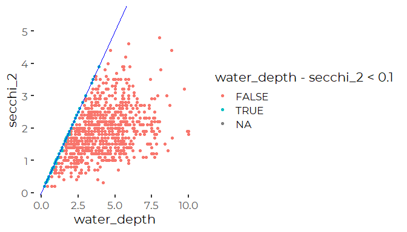

We confirmed with Mike Doan, of Friends of Casco Bay that the “BSV”
values in the raw Secchi data means “Bottom Still Visible”. It indicates
that the Secchi disk was on the bottom at the time of sampling. We
explore the implications of this in a separate notebook,
“Secchi\_Censored\_Analysis.Rmd” The bottom line is that the (right)
censored Secchi data biases Secchi results meaningfully only at the most
highly censored sites.

| Station               | Station Code |
|-----------------------|--------------|
| East End Beach        | EEB18        |
| Upper Harraseeket     | HR4          |
| Falmouth Town Landing | PYC43        |
| Upper Fore River      | STR54        |
