Graphic Summaries of of General Water Quality (Sonde) Data From FOCB
================
Curtis C. Bohlen, Casco Bay Estuary Partnership
2/18/2021

-   [Introduction](#introduction)
-   [Load Libraries](#load-libraries)
-   [Load Data](#load-data)
    -   [Establish Folder Reference](#establish-folder-reference)
    -   [Load The Data](#load-the-data)
        -   [Primary Data](#primary-data)
    -   [Transformed Chlorophyll Data](#transformed-chlorophyll-data)
    -   [Create Long Form Data](#create-long-form-data)
    -   [Create Daily Data Summaries](#create-daily-data-summaries)
-   [Exploratory Graphics](#exploratory-graphics)
-   [Summary Statistics](#summary-statistics)
    -   [Monthly Summary Statistics](#monthly-summary-statistics)
-   [Base Graphics](#base-graphics)
    -   [Construct Three Plotting
        Function](#construct-three-plotting-function)
        -   [Plot Versus Time](#plot-versus-time)
        -   [Season Profile or
            Climatology](#season-profile-or-climatology)
        -   [Cross Plots](#cross-plots)
        -   [Function to Add Medians by Color
            Groups](#function-to-add-medians-by-color-groups)
    -   [Values by Time](#values-by-time)
        -   [Chlorophyll A](#chlorophyll-a)
        -   [Joint (Facetted) Plot](#joint-facetted-plot)
    -   [Seasonal Profiles](#seasonal-profiles)
        -   [Dissolved Oxygen](#dissolved-oxygen)
        -   [Percent Saturation](#percent-saturation)
        -   [Temperature](#temperature)
        -   [Salinity](#salinity)
        -   [Chlorophyll A](#chlorophyll-a-1)
        -   [Joint Plot](#joint-plot)
    -   [Cross-Plots](#cross-plots-1)
        -   [Dissolved Oxygen and
            PCO<sub>2</sub>](#dissolved-oxygen-and-pco2)
        -   [Dissolved Oxygen and
            Temperature](#dissolved-oxygen-and-temperature)
        -   [Dissolved Oxygen and
            Chlorophyll](#dissolved-oxygen-and-chlorophyll)


# Introduction

This Notebook provides graphic summaries of data from Friends of Casco
Bay’s “CMS1” monitoring location, on Cousins Island, in Casco Bay,
Maine. We focus here on analysis of primary sonde data on temperature,
dissolved oxygen, salinity, and chlorophyll A.

This reflects only a small portion of FOCB’s monitoring activity.

Other analyses in this SoCB GitHub repositories look in more detail
at:  
1. “Historical”Citizen Steward" Data from nearly thirty years of
monitoring.  
2. Continuing sampling conducted at a smaller number of locations by
FOCB staff.

Analyses in OTHER GitHub archived look into the following:  
3. Coastal acidification-related data collection at this same site.  
4. Nutrient-related data, especially data on ambient nitrogen
concentrations in and around portland harbor.

# Load Libraries

``` r
library(tidyverse)
#> Warning: package 'tidyverse' was built under R version 4.0.5
#> -- Attaching packages --------------------------------------- tidyverse 1.3.1 --
#> v ggplot2 3.3.3     v purrr   0.3.4
#> v tibble  3.1.2     v dplyr   1.0.6
#> v tidyr   1.1.3     v stringr 1.4.0
#> v readr   1.4.0     v forcats 0.5.1
#> Warning: package 'tidyr' was built under R version 4.0.5
#> Warning: package 'dplyr' was built under R version 4.0.5
#> Warning: package 'forcats' was built under R version 4.0.5
#> -- Conflicts ------------------------------------------ tidyverse_conflicts() --
#> x dplyr::filter() masks stats::filter()
#> x dplyr::lag()    masks stats::lag()
library(readxl)

library(GGally)
#> Warning: package 'GGally' was built under R version 4.0.5
#> Registered S3 method overwritten by 'GGally':
#>   method from   
#>   +.gg   ggplot2
library(lubridate)  # here, for the make_datetime() function
#> Warning: package 'lubridate' was built under R version 4.0.5
#> 
#> Attaching package: 'lubridate'
#> The following objects are masked from 'package:base':
#> 
#>     date, intersect, setdiff, union

library(colorspace)  #for scale_color_continuous_diverging(palette = 'Cork'...) possibly others, 
#> Warning: package 'colorspace' was built under R version 4.0.5

library(CBEPgraphics)
load_cbep_fonts()
theme_set(theme_cbep())
```

# Load Data

## Establish Folder Reference

``` r
sibfldnm <- 'Original_Data'
parent   <- dirname(getwd())
sibling  <- file.path(parent,sibfldnm)

dir.create(file.path(getwd(), 'figures'), showWarnings = FALSE)
```

## Load The Data

We need to skip the second row here, which is inconvenient largely
because the default “guess” of data contents for each column is based on
the contents of that first row of data.

A solution in an answer to this stack overflow questions
<https://stackoverflow.com/questions/51673418/how-to-skip-the-second-row-using-readxl>)
suggests reading in the first row only to generate names, then skip the
row of names and the row of units, and read the “REAL” data. Note that
we round the timestamp on the data to the nearest hour.

In earlier work, I found some inconsistencies in how daylight savings
time was dealt with.

For some reason, excel is not reading in the dates and times correctly.
I have to reconstruct the time from components. I am not certain of the
timezone setting to read these files in correctly.

### Primary Data

``` r
fn    <- 'CMS1 Data through 2019.xlsx'
fpath <- file.path(sibling,fn)

mynames <- read_excel(fpath, sheet = 'Sheet1', n_max = 1, col_names = FALSE)
#> New names:
#> * `` -> ...1
#> * `` -> ...2
#> * `` -> ...3
#> * `` -> ...4
#> * `` -> ...5
#> * ...
mynames <- unname(unlist(mynames[1,]))  # flatten and simplify
mynames[2] <- 'datetime'               # 
mynames[4] <- 'depth'                   # Address non-standard names
mynames[8] <- 'pctsat'
mynames[18] <- 'omega_a'
mynames <- tolower(mynames)             # convert all to lower case

the_data <- read_excel(fpath, skip=2, col_names = FALSE)
#> New names:
#> * `` -> ...1
#> * `` -> ...2
#> * `` -> ...3
#> * `` -> ...4
#> * `` -> ...5
#> * ...
names(the_data) <- mynames
rm(mynames)
```

We create an independent time stamp based on recorded year, month, day,
etc. to directly address ambiguities of how dates and times are imported
with daylight savings time, etc. The parameter `tz = "America/New_York"`
creates a time stamp that is tied to local time. The time stamp under
the hood is a numerical value, but with this timezone specification, the
text form accounts for local daylight savings time.

``` r
the_data <- the_data %>%
  select(-count)  %>%       # datetime and time contain the same data
  mutate(dt = make_datetime(year, month, day, hour, 0, tz = "America/New_York")) %>%
  relocate(c(ta, dic, omega_a) , .after = "pco2") %>%
  mutate(thedate  = as.Date(dt),
         doy      = as.numeric(format(dt, format = '%j')),
         # tstamp   = paste0(year, '/', sprintf("%02d", month), '/',
         #                   sprintf("%02d", day), ' ', sprintf("%02d", hour)),
         Month = factor(month, labels = month.abb)) %>%
  arrange(dt)                # Force data are in chronological order
```

## Transformed Chlorophyll Data

For our data based on FOCB’s surface water (grab sample) data, we
presented analyses not of raw chlorophyll data, but analysis of log
(Chlorophyll + 1) data. The transformed values better correspond to
assumptions of normality used is statistical analyses. We provide a
transformed version here so that we can produce graphics that are
visually consistent in terms of presentation.

``` r
the_data <- the_data %>%
  mutate(chl_log1 = log1p(chl)) %>%
  relocate(chl_log1, .after = chl)
```

## Create Long Form Data

``` r
long_data <- the_data %>%
  pivot_longer(cols= depth:omega_a, names_to='Parameter', values_to = 'Value') %>%
  mutate(Parameter = factor(Parameter,
                            levels = c('depth',
                                       'temperature',
                                       'salinity',
                                       'do',
                                       'pctsat',
                                       'chl',
                                       'chl_log1',
                                       'ph',
                                       'pco2',
                                       'ta',
                                       'dic',
                                       'omega_a')))
```

## Create Daily Data Summaries

``` r
daily_data <- the_data %>%
  select(-hour, -year, -month, -day, -doy) %>%         # Will recalculate these 
  group_by(thedate) %>%
  summarise_at(c("temperature", "salinity", "do", "pctsat", "chl", "chl_log1", 
                 "ph", "pco2", "ta", "dic", 'omega_a'),
               c(avg    = function(x) mean(x, na.rm=TRUE),
                 med    = function(x) median(x, na.rm=TRUE),
                 rng    = function(x) {suppressWarnings(max(x, na.rm=TRUE) -
                                                        min(x, na.rm=TRUE))},
                iqr  = function(x) IQR(x, na.rm=TRUE),
                p80r = function(x) {as.numeric(quantile(x, 0.90, na.rm=TRUE) -
                                               quantile(x, 0.10, na.rm=TRUE))}
                )) %>%
  # We recalculate time metrics (has to be outside of `summarise_at()`)
  mutate(year = as.numeric(format(thedate, format = '%Y')),
         month  = as.numeric(format(thedate, format = '%m')),
         day   = as.numeric(format(thedate, format = '%d')),
         doy  = as.numeric(format(thedate, format = '%j')),
         Month = factor(month, levels=1:12, labels = month.abb)
         )
```

# Exploratory Graphics

[Back to top](#)

``` r
the_data %>% 
  ggpairs(c(4,6,7), progress=FALSE)
```

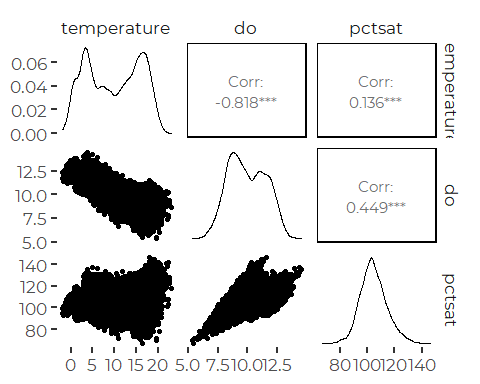

``` r
the_data %>% 
  ggpairs(c(4,5, 8, 11), progress=FALSE)
```

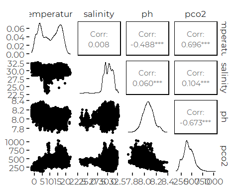

``` r
the_data %>% 
  ggpairs(c(4, 5, 6, 9), progress=FALSE)
```

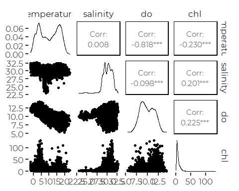

What jumps out:  
\* the negative association between temperature and DO.  
\* Most of the negative association between DO and temperature vanishes
when looking at percent saturation.  
\* Temperature show strong bimodal distribution, presumably because of
winter and summer temperature regimes.  
\* DO shows weak bimodal structure, but percent saturation does not.  
\* pH data is negatively correlated with pCO<sub>2</sub> and
temperature.  
There is little data at low salinity, but most of it is also low
chlorophyll.

``` r
the_data %>% 
  ggpairs(c(4, 6, 8, 11), progress=FALSE)
```

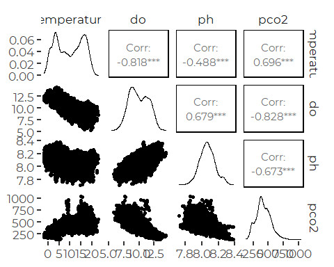
\* Mutual temperature dependence of DO and pCO<sub>2</sub> means those
two variables are correlated.

-   Negative pH to PCO<sub>2</sub> relationships are fairly robust.

``` r
the_data %>% ggpairs(c(8, 11:14), progress=FALSE)
```

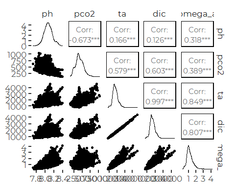
\* Total alkalinity and dissolved inorganic carbon are nearly measuring
the same thing – no surprise in sea water. \* The omega values are tied
to those DIC / TA values, more than to either pH or pCO<sub>2</sub>.

# Summary Statistics

[Back to top](#)

``` r
result <- long_data %>%
  group_by(Parameter) %>%
  summarize(Minimum = min(Value, na.rm=TRUE),
            Median   = median(Value, na.rm=TRUE),
            Mean     = mean(Value, na.rm=TRUE),
            Maximum  = max(Value, na.rm=TRUE),
            SD       = sd(Value, na.rm=TRUE),
            Sample  = sum(! is.na(Value))) %>%
  mutate(parm = Parameter,
         Parameter = c('Depth',
                      'Temperature',
                      'Salinity',
                      'DO (mg/l)',
                      'Percent Saturation',
                      'Chlorophyll-a',
                      'log(Chlorophyll-a + 1)',
                      'pH (NMS)',
                      'pCO2',
                      'Total Alkalinity',
                      'Dissolved Inorganic Carbon',
                      'Omega Aragonite'
                      )) %>%
  relocate(parm)
```

``` r
knitr::kable(result %>% select(-parm), 
             digits = c(1,1,2,1,3,2,2,2,2,2,2))
```

| Parameter                  | Minimum |  Median |   Mean |  Maximum |     SD | Sample |
|:---------------------------|--------:|--------:|-------:|---------:|-------:|-------:|
| Depth                      |     0.1 |    2.70 |    2.7 |    5.129 |   1.06 |  29647 |
| Temperature                |    -2.0 |    9.96 |    9.8 |   23.000 |   6.16 |  29898 |
| Salinity                   |    23.0 |   30.23 |   30.2 |   32.760 |   1.07 |  29424 |
| DO (mg/l)                  |     5.4 |    9.82 |    9.9 |   14.439 |   1.55 |  29325 |
| Percent Saturation         |    67.2 |  103.80 |  104.5 |  146.200 |   9.64 |  29325 |
| Chlorophyll-a              |    -0.2 |    5.21 |    7.5 |  130.760 |   7.66 |  29556 |
| log(Chlorophyll-a + 1)     |    -0.3 |    1.83 |    1.9 |    4.881 |   0.67 |  29556 |
| pH (NMS)                   |     7.7 |    8.06 |    8.1 |    8.380 |   0.09 |  29330 |
| pCO2                       |   132.3 |  406.12 |  416.6 | 1037.794 | 121.33 |  19438 |
| Total Alkalinity           |   779.2 | 1724.40 | 1761.7 | 4598.056 | 338.26 |  19438 |
| Dissolved Inorganic Carbon |   756.2 | 1622.72 | 1657.2 | 4382.728 | 314.28 |  19438 |
| Omega Aragonite            |     0.2 |    1.11 |    1.2 |    4.146 |   0.42 |  19437 |

``` r
write.csv(result, 'summarystats_FOCB.csv')
```

## Monthly Summary Statistics

This is means **across** years. This is NOT the same as an estimated
monthly average, adjusted for year to year variation, imbalances in time
of day data was collected, etc. For that, we would need to estimate
marginal means from a GAMM. We do not pursue that idea in this notebook.

``` r
monthly_tbl <- the_data %>%
  select(datetime, year, Month, temperature, salinity,
         do, pctsat, chl, chl_log1, ph, pco2, dic, ta, omega_a) %>%

  pivot_longer(temperature:omega_a, names_to = 'parameter',
               values_to = 'value') %>%
  group_by(Month, parameter) %>%
  summarise(
    avg    = round(mean(value, na.rm = TRUE), 2),
    median = round(median(value, na.rm = TRUE), 2),
    sd     = round(sd(value, na.rm = TRUE), 3),
    count  = sum(!is.na(value))
  ) %>%
  pivot_longer(cols = c('avg', 'median', 'sd', 'count'),
               names_to = 'label') %>%
  pivot_wider(id_cols = c(parameter, label), names_from=Month) 
#> `summarise()` has grouped output by 'Month'. You can override using the `.groups` argument.
knitr::kable(monthly_tbl)
```

| parameter   | label  |      Jan |      Feb |      Mar |      Apr |      May |      Jun |      Jul |      Aug |      Sep |      Oct |      Nov |      Dec |
|:------------|:-------|---------:|---------:|---------:|---------:|---------:|---------:|---------:|---------:|---------:|---------:|---------:|---------:|
| chl         | avg    |   11.720 |    7.240 |   12.450 |    8.650 |    3.380 |    3.800 |    5.270 |    6.870 |    7.830 |    7.120 |    5.760 |    9.630 |
| chl         | median |   12.410 |    5.900 |    7.930 |    4.260 |    2.540 |    3.320 |    4.420 |    5.650 |    5.580 |    6.060 |    4.340 |    6.930 |
| chl         | sd     |    6.001 |    5.696 |   14.761 |   10.516 |    3.009 |    2.651 |    3.888 |    5.322 |    7.118 |    4.101 |    4.657 |    9.473 |
| chl         | count  | 2231.000 | 2016.000 | 2221.000 | 2159.000 | 2166.000 | 2157.000 | 2503.000 | 2942.000 | 2802.000 | 2975.000 | 2420.000 | 2964.000 |
| chl\_log1   | avg    |    2.420 |    1.930 |    2.190 |    1.900 |    1.340 |    1.430 |    1.690 |    1.920 |    1.970 |    1.980 |    1.740 |    2.100 |
| chl\_log1   | median |    2.600 |    1.930 |    2.190 |    1.660 |    1.260 |    1.460 |    1.690 |    1.890 |    1.880 |    1.950 |    1.670 |    2.070 |
| chl\_log1   | sd     |    0.535 |    0.582 |    0.883 |    0.787 |    0.491 |    0.530 |    0.542 |    0.524 |    0.619 |    0.463 |    0.578 |    0.707 |
| chl\_log1   | count  | 2231.000 | 2016.000 | 2221.000 | 2159.000 | 2166.000 | 2157.000 | 2503.000 | 2942.000 | 2802.000 | 2975.000 | 2420.000 | 2964.000 |
| dic         | avg    | 1363.440 | 1634.580 | 1583.830 | 1413.800 | 1412.660 | 1656.080 | 1835.760 | 1805.300 | 1806.390 | 1838.370 | 1626.610 | 1644.730 |
| dic         | median | 1323.440 | 1489.890 | 1524.520 | 1367.040 | 1433.490 | 1560.790 | 1804.770 | 1733.690 | 1768.190 | 1760.560 | 1650.090 | 1593.310 |
| dic         | sd     |  129.538 |  332.598 |  288.255 |  217.334 |  326.648 |  303.766 |  329.593 |  329.514 |  234.891 |  266.370 |  206.802 |  235.815 |
| dic         | count  |  835.000 | 1349.000 | 1734.000 |  784.000 | 1878.000 | 1644.000 | 1607.000 | 1383.000 | 1672.000 | 2240.000 | 2093.000 | 2219.000 |
| do          | avg    |   11.850 |   12.070 |   11.780 |   11.360 |   10.470 |    9.430 |    8.970 |    8.700 |    8.210 |    8.330 |    9.280 |   10.690 |
| do          | median |   11.790 |   12.110 |   11.830 |   11.340 |   10.500 |    9.450 |    8.980 |    8.730 |    8.190 |    8.350 |    9.300 |   10.660 |
| do          | sd     |    0.637 |    0.678 |    0.634 |    0.697 |    0.654 |    0.740 |    0.780 |    0.871 |    0.836 |    0.624 |    0.603 |    0.726 |
| do          | count  | 2231.000 | 1803.000 | 2214.000 | 2160.000 | 2070.000 | 2157.000 | 2504.000 | 2947.000 | 2879.000 | 2975.000 | 2421.000 | 2964.000 |
| omega\_a    | avg    |    0.800 |    1.080 |    1.070 |    0.780 |    0.900 |    1.310 |    1.560 |    1.680 |    1.470 |    1.380 |    0.980 |    1.010 |
| omega\_a    | median |    0.770 |    0.950 |    1.050 |    0.730 |    0.930 |    1.200 |    1.530 |    1.580 |    1.430 |    1.330 |    0.980 |    1.000 |
| omega\_a    | sd     |    0.125 |    0.329 |    0.301 |    0.273 |    0.311 |    0.432 |    0.418 |    0.571 |    0.307 |    0.281 |    0.210 |    0.175 |
| omega\_a    | count  |  835.000 | 1349.000 | 1734.000 |  784.000 | 1878.000 | 1644.000 | 1607.000 | 1383.000 | 1671.000 | 2240.000 | 2093.000 | 2219.000 |
| pco2        | avg    |  259.060 |  280.980 |  295.270 |  367.300 |  388.870 |  419.280 |  526.920 |  510.860 |  536.110 |  504.170 |  443.230 |  350.200 |
| pco2        | median |  243.690 |  276.880 |  318.740 |  377.970 |  379.810 |  415.040 |  519.830 |  489.220 |  526.720 |  503.480 |  456.470 |  343.900 |
| pco2        | sd     |   48.090 |   40.591 |   86.212 |   66.990 |   65.465 |   56.097 |  114.771 |   99.523 |   80.479 |  101.772 |   80.309 |   71.731 |
| pco2        | count  |  835.000 | 1349.000 | 1734.000 |  784.000 | 1878.000 | 1644.000 | 1607.000 | 1383.000 | 1672.000 | 2240.000 | 2093.000 | 2219.000 |
| pctsat      | avg    |  103.410 |  105.610 |  106.390 |  109.720 |  110.570 |  108.090 |  111.680 |  110.120 |  100.850 |   96.000 |   95.940 |  100.030 |
| pctsat      | median |  102.900 |  104.800 |  105.060 |  109.500 |  110.300 |  108.000 |  111.400 |  110.580 |  100.900 |   95.500 |   95.600 |   99.800 |
| pctsat      | sd     |    4.308 |    5.503 |    6.363 |    7.572 |    6.448 |    8.730 |   10.924 |   11.342 |   10.235 |    7.321 |    4.947 |    5.155 |
| pctsat      | count  | 2231.000 | 1803.000 | 2214.000 | 2160.000 | 2070.000 | 2157.000 | 2504.000 | 2947.000 | 2879.000 | 2975.000 | 2421.000 | 2964.000 |
| ph          | avg    |    8.130 |    8.150 |    8.180 |    8.110 |    8.020 |    8.040 |    8.020 |    8.030 |    8.010 |    8.030 |    8.020 |    8.100 |
| ph          | median |    8.140 |    8.150 |    8.210 |    8.140 |    8.040 |    8.040 |    8.030 |    8.040 |    8.010 |    8.030 |    8.020 |    8.100 |
| ph          | sd     |    0.048 |    0.064 |    0.107 |    0.127 |    0.083 |    0.070 |    0.076 |    0.080 |    0.061 |    0.060 |    0.062 |    0.050 |
| ph          | count  | 2231.000 | 1803.000 | 2211.000 | 2160.000 | 2166.000 | 2158.000 | 2503.000 | 2859.000 | 2879.000 | 2975.000 | 2421.000 | 2964.000 |
| salinity    | avg    |   30.590 |   30.620 |   30.280 |   29.140 |   29.030 |   29.310 |   30.230 |   30.470 |   30.570 |   30.700 |   30.260 |   30.420 |
| salinity    | median |   30.510 |   30.700 |   30.300 |   29.430 |   29.220 |   29.260 |   30.230 |   30.690 |   31.030 |   31.030 |   30.090 |   30.510 |
| salinity    | sd     |    1.087 |    0.744 |    0.593 |    1.474 |    0.820 |    0.665 |    0.795 |    0.773 |    1.033 |    0.997 |    0.859 |    0.817 |
| salinity    | count  | 2231.000 | 1803.000 | 2214.000 | 2160.000 | 2166.000 | 2158.000 | 2504.000 | 2949.000 | 2879.000 | 2975.000 | 2421.000 | 2964.000 |
| ta          | avg    | 1442.630 | 1736.080 | 1684.390 | 1482.140 | 1493.200 | 1770.900 | 1967.590 | 1949.070 | 1931.590 | 1955.830 | 1710.370 | 1735.860 |
| ta          | median | 1400.800 | 1580.180 | 1641.520 | 1440.980 | 1521.410 | 1668.390 | 1929.810 | 1878.940 | 1893.070 | 1867.270 | 1718.220 | 1685.160 |
| ta          | sd     |  136.069 |  354.654 |  296.920 |  236.103 |  347.163 |  332.984 |  349.714 |  364.081 |  250.715 |  278.484 |  214.782 |  242.058 |
| ta          | count  |  835.000 | 1349.000 | 1734.000 |  784.000 | 1878.000 | 1644.000 | 1607.000 | 1383.000 | 1672.000 | 2240.000 | 2093.000 | 2219.000 |
| temperature | avg    |    1.380 |    1.330 |    2.600 |    5.830 |    9.840 |   13.430 |   17.100 |   17.940 |   16.550 |   13.340 |    8.160 |    4.080 |
| temperature | median |    1.300 |    1.100 |    2.740 |    5.560 |    9.830 |   13.400 |   17.030 |   17.910 |   16.450 |   13.550 |    7.950 |    3.940 |
| temperature | sd     |    1.466 |    1.236 |    1.183 |    1.499 |    1.504 |    1.544 |    1.560 |    1.350 |    1.297 |    1.552 |    2.078 |    1.553 |
| temperature | count  | 2231.000 | 1803.000 | 2214.000 | 2160.000 | 2166.000 | 2158.000 | 2504.000 | 2949.000 | 2879.000 | 2975.000 | 2884.000 | 2975.000 |

``` r
write_csv(monthly_tbl, 'Monthly_summaries_OA_FOCB.csv')
```

# Base Graphics

[Back to top](#)

## Construct Three Plotting Function

We construct three functions that create a consistent graphic style for
presentation.

1.  The first generates a plot showing value against time over the whole
    period of record.

2.  The second shows a “Seasonal Profile” or Climatology.

3.  The third plots one measured variable against another, with a third
    possibly coded via color.

We tried all the `scale_color_viridis_c()` color scales, and the default
‘viridis’ scale is best. `viridis` ranges from purple through green to
yellow. A reasonable alternative is the ‘cividis’ palette, which ranges
from dark blue through gray to yellow.

The other viridis palettes will look dreadful with our existing colors.
We considered using `scale_color_gradient()` to brew our own color
palette, but chose not to, as the viridis palette is close enough to our
colors while being slightly distinctive.

### Plot Versus Time

``` r
full_profile <- function(dat, parm, dt = 'dt', color = 'temperature', 
                           label = NA, color_label = '',
                           guide = NA, h_adjust = 0.25,
                           alpha = 0.25, size = 0.5,
                           add_smooth = FALSE, with_se = FALSE) {

  # These are ugly argument checks, since they don't provide nice error messages.
  stopifnot(is.data.frame(dat))
  stopifnot(is.na(label) || (is.character(label) && length(label) == 1))
  stopifnot(is.na(guide) || (is.numeric(guide)   && length(guide) == 1))
  
  # Convert passed parameters to strings, if they are not passed as strings.
  parm <- enquo(parm)
  dt <- enquo(dt)
  color <- enquo(color)
  
  parmname <- rlang::as_name(parm)
  dtname  <- rlang::as_name(dt)
  colorname <- rlang::as_name(color)
  
  # Check that these are data names from the data frame
  stopifnot(parmname %in% names(dat))
  stopifnot(dtname %in% names(dat))  
  stopifnot(colorname %in% names(dat))  

  
  # Create the variables we will actually pas to ggplot
  x   <- dat[[dtname]]
  y   <- dat[[parmname]]
  col <- dat[[colorname]]
  
  
  plt <- ggplot(dat, aes(x, y)) +
    geom_point(aes(color = col), alpha = alpha, size = size) +
    xlab('') +
    ylab(parmname) +

    guides(colour = guide_legend(override.aes = list(alpha = 1, size = 2),
                                 byrow = TRUE)) +
    
    theme_cbep(base_size = 12) +
    theme(legend.position =  'bottom',
          legend.title = element_text(size = 10))
  
  if(add_smooth) {
         plt <- plt + geom_smooth(method = 'gam', 
                                  formula = y ~ s(x, bs = "cc"),
                                  se = with_se,
                                  color = cbep_colors()[1])
  }
  
  if (is.factor(col)) {
    plt <- plt +
        scale_color_viridis_d(name = color_label, option = 'viridis')

  }
  else {
    plt <- plt +
        scale_color_viridis_c(name = color_label, option = 'viridis')
  }
  
  if(! is.na(guide)) {
         #lab = if_else(is.na(label), parmname, gsub('\\s*\\([^\\)]+\\)','', label))
         plt <- plt + geom_hline(aes(yintercept = guide), 
                                 lty = 'dotted', color = 'gray15') # 
                      # annotate('text', x=min(x), y=(1 + h_adjust) *(guide), 
                      #          label=  round(guide,2),
                      #                       hjust = 0, size=3 )
         }
  
  if(! is.na(label)) {
         plt <- plt + ylab(label)
         }

  return(plt)
}
```

### Season Profile or Climatology

This uses our standard `CBEP_colors()`, but reordered. This corresponds
to ordering in the OA chapter

``` r
season_profile <- function(dat, parm, doy = 'doy', year = "year", 
                           label = NA, guide = NA, h_adjust = 0.05,
                           alpha = 0.25, size = 0.5,
                           add_smooth = FALSE, with_se = FALSE) {

  # These are ugly argument checks, since they don't provide nice error messages.
  stopifnot(is.data.frame(dat))
  stopifnot(is.na(label) || (is.character(label) && length(label) == 1))
  stopifnot(is.na(guide) || (is.numeric(guide)   && length(guide) == 1))
  
  # Flexible labeling for months of the year
  monthlengths <-  c(31,28,31, 30,31,30,31,31,30,31,30,31)
  cutpoints    <- c(0, cumsum(monthlengths)[1:12])
  monthlabs    <- c(month.abb,'')
  
  # Convert passed parameters to strings, if they are not passed as strings.
  parm <- enquo(parm)
  doy <- enquo(doy)
  year <- enquo(year)
  
  parmname <- rlang::as_name(parm)
  doyname  <- rlang::as_name(doy)
  yearname <- rlang::as_name(year)
  stopifnot(parmname %in% names(dat))
  stopifnot(doyname %in% names(dat))  
  stopifnot(yearname %in% names(dat))  

  x   <- dat[[doyname]]
  y   <- dat[[parmname]]
  col <- dat[[yearname]]
  
  plt <- ggplot(dat, aes(x, y)) +
    geom_point(aes(color = factor(col)), alpha = alpha, size = size) +
    xlab('') +
    ylab(parmname) +
    
    scale_color_manual(values=cbep_colors()[c(3,2,5,4,6)], name='Year') +
    scale_x_continuous(breaks = cutpoints, labels = monthlabs) +
    guides(colour = guide_legend(override.aes = list(alpha = 1, size = 2))) +
    
    theme_cbep(base_size = 12) +
    theme(axis.text.x=element_text(angle=90, vjust = 1.5)) +
    theme(legend.position =  'bottom',
          legend.title = element_text(size = 10))
  
  
  
  if(add_smooth) {
         plt <- plt + geom_smooth(method = 'gam', 
                                  formula = y ~ s(x, bs = "cc"),
                                  se = with_se,
                                  color = cbep_colors()[1])
         }
  
  if(! is.na(guide)) {
         lab = if_else(is.na(label), parmname, gsub('\\s*\\([^\\)]+\\)','', label))
         plt <- plt + geom_hline(aes(yintercept = guide), 
                                 lty = 'dotted', color = 'gray15') +
                      annotate('text', x=0, y=(1 + h_adjust) *(guide), 
                               label= paste(lab, '=', guide),
                                            hjust = 0, size=3)
         }
  
  if(! is.na(label)) {
         plt <- plt + ylab(label)
         }

  return(plt)
}
```

### Cross Plots

``` r
cross_plot <- function(dat, x_parm, y_parm, color_parm = "Month",
                            x_label = NA, y_label = NA, color_label = '',
                            alpha = 0.25,
                            size = 0.5,
                            add_smooth = FALSE,
                            with_se = FALSE) {

  # These are ugly argument checks, since they don't provide nice error messages.
  stopifnot(is.data.frame(dat))
  stopifnot(is.na(x_label) || (is.character(x_label) && length(x_label) == 1))
  stopifnot(is.na(y_label) || (is.character(y_label) && length(y_label) == 1))
  
  # Convert passed parameters to strings, if they are not passed as strings.
  x_parm <- enquo(x_parm) # Read this in evaluated
  y_parm <- enquo(y_parm)
  color_parm <- enquo(color_parm)
  
  x_parmname <-  rlang::as_name(x_parm)
  y_parmname <-  rlang::as_name(y_parm)
  colorname  <-  rlang::as_name(color_parm)
  stopifnot(x_parmname %in% names(dat))
  stopifnot(y_parmname %in% names(dat)) 
  stopifnot(colorname %in% names(dat)) 

  y  <- dat[[y_parmname]]
  x  <- dat[[x_parmname]]
  color <- dat[[colorname]]
  
  plt <- ggplot(dat, aes(x, y)) +
    geom_point(aes(color = color), alpha = alpha, size = size) +
    xlab('') +
    ylab(y_parmname) +

    
    theme_cbep(base_size = 12) +
    theme(legend.position =  'bottom',
          legend.title = element_text(size = 10)) +
    
    guides(color = guide_legend(override.aes = list(alpha = 1, size = 2),
                                 byrow = TRUE)) +
  
  if(add_smooth) {
         plt <- plt + geom_smooth(method = 'gam', 
                                  formula = y ~ s(x),
                                  se = with_se,
                                  color = cbep_colors()[1])
         }
  
  if (is.factor(color)) {
    plt <- plt +
        scale_color_viridis_d(name = color_label, option = 'viridis')
  }
  else {
    plt <- plt +
        scale_color_viridis_c(name = color_label, option = 'viridis')
  }

  if(! is.na(x_label)) {
         plt <- plt + xlab(x_label)
  } 
  
  if(! is.na(y_label)) {
         plt <- plt + ylab(y_label)
  }
  return(plt)
}
```

### Function to Add Medians by Color Groups

This function is intended principally to add summary points and lines to
cross plots – usually by month to emphasize seasonal patterns.

``` r
add_sum <- function(p, dat, x_parm, y_parm, color_parm = "Month", 
                    color_label = '', with_line = TRUE) {
  # These are ugly argument checks, since they don't provide nice error messages.
  stopifnot(is.data.frame(dat))
  
  # Convert passed parameters to strings, if they are not passed as strings.
  x_parm <- enquo(x_parm) # Read this in evaluated
  y_parm <- enquo(y_parm)
  color_parm <- enquo(color_parm)
  
  x_parmname <-  rlang::as_name(x_parm)
  y_parmname <-  rlang::as_name(y_parm)
  colorname  <-  rlang::as_name(color_parm)
  
  stopifnot(x_parmname %in% names(dat))
  stopifnot(y_parmname %in% names(dat)) 
  stopifnot(colorname %in% names(dat)) 

  df <- tibble(x     = dat[[x_parmname]],
               y     = dat[[y_parmname]],
               color = dat[[colorname]]) %>%
    group_by(color) %>%
    summarize(x = median(x, na.rm = TRUE),
              y = median(y, na.rm = TRUE)) %>%
    mutate(color = factor (color, levels = levels(color)))
  
  pp <- p
  
  if(with_line) {
    pp <- pp + geom_path(data = df, mapping = aes(x = x, y = y), size = 1,
              color = 'gray20')
  } 
  
  add <- pp + geom_point(data = df, mapping = aes(x = x, y = y, fill = color),
                        shape = 22, size = 3) +
          scale_fill_viridis_d(name = color_label, option = 'viridis')
    
  return(add)
}
```

## Values by Time

[Back to top](#)

### Chlorophyll A

``` r
plt <- full_profile(the_data, chl, dt = 'dt', color = 'Month', 
             label = 'Chlorophyll A (mg/l)', 
             guide = quantile(the_data$chl, .9, na.rm = TRUE))
plt
#> Warning: Removed 681 rows containing missing values (geom_point).
```


#### Transformed Version

``` r
plt <- full_profile(the_data, chl_log1, dt = 'dt', color = 'Month', 
             label = 'Chlorophyll A (mg/l)', 
             guide = quantile(the_data$chl_log1, .9, na.rm = TRUE))
plt +
  scale_y_continuous(trans = 'log1p')
#> Warning: Removed 681 rows containing missing values (geom_point).
```


### Joint (Facetted) Plot

#### Guide Functions to Transform Chlorophyll Axis

``` r
prefered_breaks =  c(0, 1, 5, 10, 50, 100)

my_breaks_fxn <- function(lims) {
  #browser()
  if(max(lims) < 10) {
    # Then we're looking at our transformed Chl data
  a <- prefered_breaks
    return(log(a +1))
  }
  else {
    return(labeling::extended(lims[[1]], lims[[2]], 5))
  }
}

# We are cheating a bit here by plotting transformed data, but providing 
# labels that are back transformed.  That work is conducted by the 
# labeling function.
my_label_fxn <- function(brks) {
  #browser()
  # frequently, brks is passed with NA in place of one or more 
  # of the candidate brks, even after I pass a vector of breaks.
  # In particular, "pretty" breaks outside the range of the data
  # are dropped and replaced with NA.
  a <- prefered_breaks
  b <- round(log(a+1), 3)
  real_breaks = round(brks[! is.na(brks)], 3)
  if (all(real_breaks %in% b)) {
    # then we have our transformed Chl data
    return(a)
  }
  else {
    return(brks)
  }
}
```

#### Plot

``` r
facet.labs <-         c("Temperature (°C)", 'Salinity (PSU)', 'Dissolved Oxygen (mg/l)', 
                        'Chlorophyll A (mg/l)')
names(facet.labs) <-  c("temperature", 'salinity', 'do', 'chl_log1')


long_data %>%
  filter(Parameter %in% c("temperature", 'salinity', 'do', 'chl_log1')) %>%
  mutate(Parameter = factor(Parameter, 
                            levels =  c("temperature", 'salinity', 'do', 'chl_log1'))) %>%
  full_profile(parm = Value, dt = 'dt', color = 'hour', alpha = 1,
               label = '', color_label = 'Hour of the Day') +
  #geom_hline(data = href, mapping = aes(yintercept = val),
  #           lty = 'dotted', color = 'gray15') +
  
  
  scale_y_continuous (breaks = my_breaks_fxn, labels = my_label_fxn) +
   # scale_color_viridis_c(name = 'Time of Day',
   #                       option = 'viridis', 
   #                       breaks = c(0,3,6,9,12,15,18,21,24)) +
  
  scale_color_continuous_diverging(palette = 'Cork', 
                                   mid = 12,
                                   breaks = c(0,3,6, 9, 12,15,18, 21),
                                   name = 'Hour of the Day') +
  
  facet_wrap(~ Parameter, nrow = 2, scales = 'free_y',
             labeller = labeller(Parameter = facet.labs) )
#> Scale for 'colour' is already present. Adding another scale for 'colour',
#> which will replace the existing scale.
#> Warning: Removed 2745 rows containing missing values (geom_point).
```

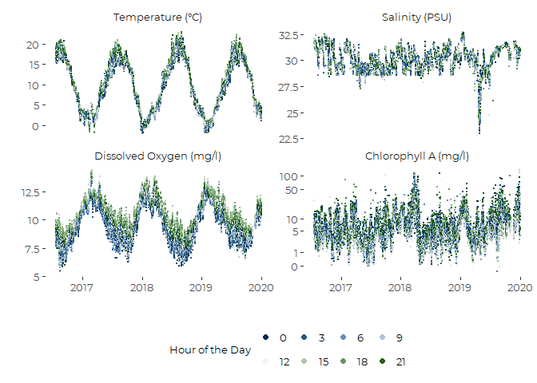

``` r

 ggsave('figures/cms_history.pdf', device = cairo_pdf, 
        width = 7, height = 5)
#> Warning: Removed 2745 rows containing missing values (geom_point).
```

## Seasonal Profiles

[Back to top](#)  
These graphs combine data from multiple years to generate a picture of
seasonal conditions across multiple years. Since data coverage is
inconsistent year to year, data for some times of year are derived from
just one or two years, which could bias the results.

### Dissolved Oxygen

Maine’s Marine Water Quality standards are expressed in terms of percent
saturation, not absolute concentrations

``` r
season_profile(the_data, do, alpha = 0.25,
               label = "Dissolved Oxygen (mg/l)", 
               add_smooth = TRUE)
#> Warning: Removed 912 rows containing non-finite values (stat_smooth).
#> Warning: Removed 912 rows containing missing values (geom_point).
```


### Percent Saturation

Maine’s Marine Water Quality standards are expressed in terms of percent
saturation. Class SA and Class SB waters must achieve 85% saturation,
while class SC waters must achieve 70% saturation

``` r
season_profile(the_data, pctsat, alpha = 0.25,
               label = "Percent Saturation", 
               guide = 85,
               add_smooth = TRUE, with_se = FALSE,
               h_adjust = 0.025)
#> Warning: Removed 912 rows containing non-finite values (stat_smooth).
#> Warning: Removed 912 rows containing missing values (geom_point).
```

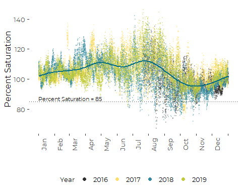

### Temperature

``` r
season_profile(the_data, temperature, doy, alpha = 0.25,
               label = "Temperature (°C)",
               add_smooth = TRUE, 
              with_se = FALSE,
               h_adjust = 0.025)
#> Warning: Removed 339 rows containing non-finite values (stat_smooth).
#> Warning: Removed 339 rows containing missing values (geom_point).
```


### Salinity

``` r
season_profile(the_data, salinity, doy, alpha = 0.25,
               label = "Salinity (PSU)",
               add_smooth = TRUE, 
               with_se = FALSE) +
  scale_y_continuous(limits = c(20, 35))
#> Warning: Removed 813 rows containing non-finite values (stat_smooth).
#> Warning: Removed 813 rows containing missing values (geom_point).
```


### Chlorophyll A

``` r
season_profile(the_data, chl_log1, doy, alpha = 0.5,
               size = .5,
               label = "Chlorophyll A (mg/l)",
               add_smooth = TRUE, 
               with_se = FALSE) +
  scale_y_continuous(trans = 'log1p')
#> Warning: Removed 681 rows containing non-finite values (stat_smooth).
#> Warning: Removed 681 rows containing missing values (geom_point).
```

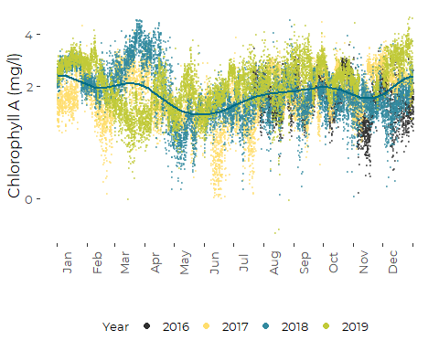

### Joint Plot

``` r
facet.labs <-         c("Temperature (°C)", 'Salinity (PSU)', 'Dissolved Oxygen (mg/l)', 
                        'Chlorophyll A (mg/l)')
names(facet.labs) <-  c("temperature", 'salinity', 'do', 'chl_log1')


long_data %>%
  filter(Parameter %in% c("temperature", 'salinity', 'do', 'chl_log1')) %>%
  mutate(Parameter = factor(Parameter, 
                            levels =  c("temperature", 'salinity', 'do', 'chl_log1'))) %>%
  
  season_profile(Value, doy = 'doy',
                size = .5, alpha = 0.25,
                label = '',
                add_smooth = FALSE, 
                 with_se = FALSE) +

  
  scale_y_continuous (breaks = my_breaks_fxn, labels = my_label_fxn) +
  
  facet_wrap(~ Parameter, nrow = 2, scales = 'free_y',
             labeller = labeller(Parameter = facet.labs) )
#> Warning: Removed 2745 rows containing missing values (geom_point).
```

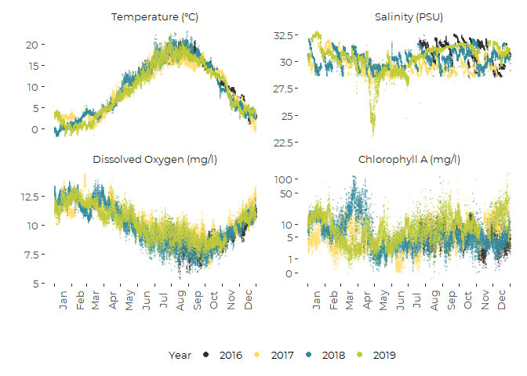

``` r
  
 ggsave('figures/cms_climatology.pdf', device = cairo_pdf, 
        width = 7, height = 5)
#> Warning: Removed 2745 rows containing missing values (geom_point).
```

## Cross-Plots

[Back to top](#)

### Dissolved Oxygen and PCO<sub>2</sub>

``` r
plt <- cross_plot(the_data, do, pco2, color_parm = "Month",
                            x_label = "Dissolved Oxygen (mg/l)", 
                            y_label = "pCO2 (uAtm)",
                            alpha = 0.1,
                            size = 0.5,
                            add_smooth = FALSE,
                            with_se = FALSE)
plt <- plt + 
  ylab(expression (pCO[2]~(mu*Atm)))+
  guides(color = guide_legend(override.aes = list(alpha = 1, size = 3),
                              byrow = TRUE,  nrow = 2))
plt
#> Warning: Removed 10896 rows containing missing values (geom_point).
```


``` rcross_plot_do_co2_sum
add_sum (plt, the_data, do, pco2, with_line = TRUE)
```

### Dissolved Oxygen and Temperature

``` r
plt <- cross_plot(the_data, temperature, do, color_parm = "Month",
                            y_label = "Dissolved Oxygen (mg/l)", 
                            x_label = "Temperature (°C)",
                            alpha = 0.1,
                            size = 0.5,
                            add_smooth = FALSE,
                            with_se = FALSE)

add_sum (plt, the_data, temperature, do, with_line = TRUE) +
    guides(color = guide_legend(override.aes = list(alpha = 1, size = 3),
                              byrow = TRUE,  nrow = 2))
#> Warning: Removed 912 rows containing missing values (geom_point).
```

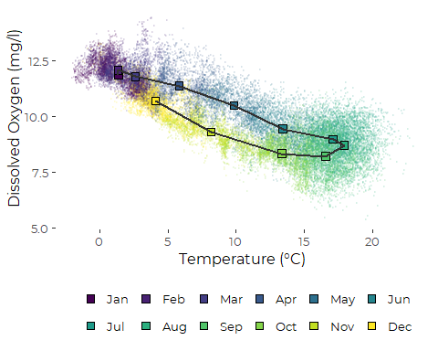

``` r
ggsave('figures/cms_do_temp.pdf', device = cairo_pdf, 
        width = 5, height = 4)
#> Warning: Removed 912 rows containing missing values (geom_point).
```

``` r
plt <- cross_plot(the_data, temperature, do, color_parm = "Month",
                            y_label = "Dissolved Oxygen (mg/l)", 
                            x_label = "Temperature (°C)",
                            alpha = 0.1,
                            size = 0.5,
                            add_smooth = FALSE,
                            with_se = FALSE) +
  guides(color = guide_legend(override.aes = list(alpha = 1, size = 3),
                              byrow = TRUE,  nrow = 2))
plt
#> Warning: Removed 912 rows containing missing values (geom_point).
```

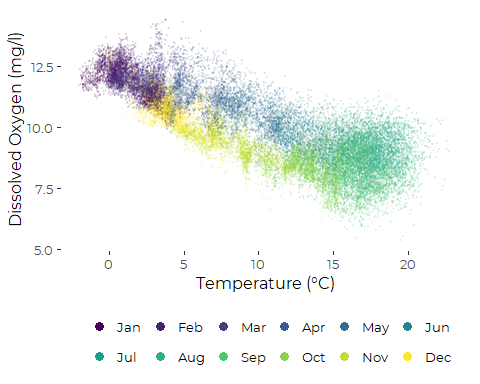

``` r
ggsave('figures/cms_do_temp_2.pdf', device = cairo_pdf, 
        width = 5, height = 4)
#> Warning: Removed 912 rows containing missing values (geom_point).
```

#### Compare Daily Data

``` r
plt <- cross_plot(daily_data, temperature_med, do_med, color_parm = "Month",
                            y_label = "Dissolved Oxygen (mg/l)", 
                            x_label = "Temperature (°C)",
                            alpha = 1,
                            size = 01,
                            add_smooth = FALSE,
                            with_se = FALSE)

add_sum (plt, daily_data, temperature_med, do_med, with_line = TRUE) +
    guides(color = guide_legend(override.aes = list(alpha = 1, size = 3),
                              byrow = TRUE,  nrow = 2))
#> Warning: Removed 27 rows containing missing values (geom_point).
```

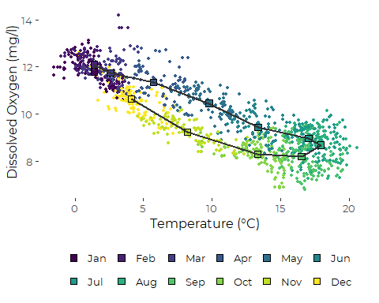

### Dissolved Oxygen and Chlorophyll

``` r
plt <- cross_plot(the_data, do, chl_log1, color_parm = "Month",
                            x_label = "Dissolved Oxygen (mg/l)", 
                            y_label = "Chlorophyll A (mg/l)",
                            alpha = 0.1,
                            size = 0.5,
                            add_smooth = FALSE,
                            with_se = FALSE)

  add_sum (plt, the_data, do, chl_log1, with_line = TRUE) +
  scale_y_continuous(trans = 'log1p') +
      guides(color = guide_legend(override.aes = list(alpha = 1, size = 3),
                              byrow = TRUE,  nrow = 2))
#> Warning: Removed 1004 rows containing missing values (geom_point).
```

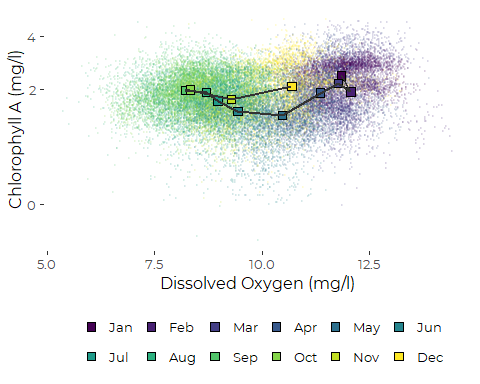

#### Compare Daily Data

``` r
plt <- cross_plot(daily_data, do_med, chl_log1_med, color_parm = "Month",
                            x_label = "Dissolved Oxygen (mg/l)", 
                            y_label = "Chlorophyll A (mg/l)",
                            alpha = .5,
                            size = 1,
                            add_smooth = FALSE,
                            with_se = FALSE) +
  scale_y_continuous(trans = 'log1p')

add_sum(plt, daily_data, do_med, chl_log1_med, with_line = TRUE) +
    guides(color = guide_legend(override.aes = list(alpha = 1, size = 3),
                              byrow = TRUE,  nrow = 2))
#> Warning: Removed 28 rows containing missing values (geom_point).
```

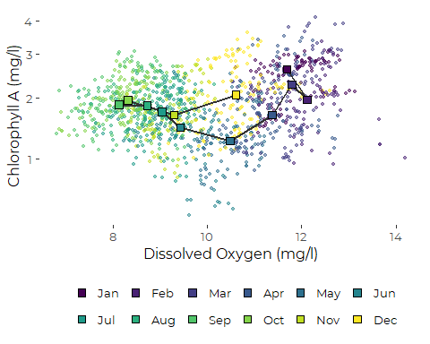
[Back to top](#)
