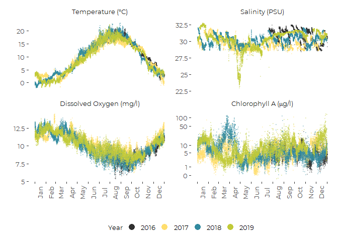

Graphic Summaries of of General Water Quality (Sonde) Data From FOCB
================
Curtis C. Bohlen, Casco Bay Estuary Partnership
2/18/2021

-   [Introduction](#introduction)
-   [Load Libraries](#load-libraries)
-   [Load Data](#load-data)
    -   [Establish Folder Reference](#establish-folder-reference)
    -   [Load The Data](#load-the-data)
        -   [Primary Data](#primary-data)
    -   [Transformed Chlorophyll Data](#transformed-chlorophyll-data)
    -   [Create Long Form Data](#create-long-form-data)
    -   [Create Daily Data Summaries](#create-daily-data-summaries)
        -   [Joint Plot](#joint-plot)


# Introduction

This Notebook provides graphic summaries of data from Friends of Casco
Bay’s “CMS1” monitoring location, on Cousins Island, in Casco Bay,
Maine. We focus here on analysis of primary sonde data on temperature,
dissolved oxygen, salinity, and chlorophyll A.

This notebook includes code only for developing the final revisions of
graphics for the final draft layout of the State of Casco Bay chapter on
bay water quality.

# Load Libraries

``` r
library(tidyverse)
#> Warning: package 'tidyverse' was built under R version 4.0.5
#> -- Attaching packages --------------------------------------- tidyverse 1.3.1 --
#> v ggplot2 3.3.5     v purrr   0.3.4
#> v tibble  3.1.4     v dplyr   1.0.7
#> v tidyr   1.1.3     v stringr 1.4.0
#> v readr   2.0.1     v forcats 0.5.1
#> Warning: package 'ggplot2' was built under R version 4.0.5
#> Warning: package 'tibble' was built under R version 4.0.5
#> Warning: package 'tidyr' was built under R version 4.0.5
#> Warning: package 'readr' was built under R version 4.0.5
#> Warning: package 'dplyr' was built under R version 4.0.5
#> Warning: package 'forcats' was built under R version 4.0.5
#> -- Conflicts ------------------------------------------ tidyverse_conflicts() --
#> x dplyr::filter() masks stats::filter()
#> x dplyr::lag()    masks stats::lag()
library(readxl)

library(lubridate)  # here, for the make_datetime() function
#> Warning: package 'lubridate' was built under R version 4.0.5
#> 
#> Attaching package: 'lubridate'
#> The following objects are masked from 'package:base':
#> 
#>     date, intersect, setdiff, union
library(CBEPgraphics)
load_cbep_fonts()
theme_set(theme_cbep())
```

# Load Data

## Establish Folder Reference

``` r
sibfldnm <- 'Original_Data'
parent   <- dirname(getwd())
sibling  <- file.path(parent,sibfldnm)

dir.create(file.path(getwd(), 'figures'), showWarnings = FALSE)
```

## Load The Data

We need to skip the second row here, which is inconvenient largely
because the default “guess” of data contents for each column is based on
the contents of that first row of data.

A solution in an answer to this stack overflow questions
<https://stackoverflow.com/questions/51673418/how-to-skip-the-second-row-using-readxl>)
suggests reading in the first row only to generate names, then skip the
row of names and the row of units, and read the “REAL” data. Note that
we round the timestamp on the data to the nearest hour.

In earlier work, I found some inconsistencies in how daylight savings
time was dealt with.

For some reason, excel is not reading in the dates and times correctly.
I have to reconstruct the time from components. I am not certain of the
timezone setting to read these files in correctly.

### Primary Data

``` r
fn    <- 'CMS1 Data through 2019.xlsx'
fpath <- file.path(sibling,fn)

mynames <- read_excel(fpath, sheet = 'Sheet1', n_max = 1, col_names = FALSE)
#> New names:
#> * `` -> ...1
#> * `` -> ...2
#> * `` -> ...3
#> * `` -> ...4
#> * `` -> ...5
#> * ...
mynames <- unname(unlist(mynames[1,]))  # flatten and simplify
mynames[2] <- 'datetime'               # 
mynames[4] <- 'depth'                   # Address non-standard names
mynames[8] <- 'pctsat'
mynames[18] <- 'omega_a'
mynames <- tolower(mynames)             # convert all to lower case

the_data <- read_excel(fpath, skip=2, col_names = FALSE)
#> New names:
#> * `` -> ...1
#> * `` -> ...2
#> * `` -> ...3
#> * `` -> ...4
#> * `` -> ...5
#> * ...
names(the_data) <- mynames
rm(mynames)
```

We create an independent time stamp based on recorded year, month, day,
etc. to directly address ambiguities of how dates and times are imported
with daylight savings time, etc. The parameter `tz = "America/New_York"`
creates a time stamp that is tied to local time. The time stamp under
the hood is a numerical value, but with this timezone specification, the
text form accounts for local daylight savings time.

``` r
the_data <- the_data %>%
  select(-count)  %>%       # datetime and time contain the same data
  mutate(dt = make_datetime(year, month, day, hour, 0, tz = "America/New_York")) %>%
  relocate(c(ta, dic, omega_a) , .after = "pco2") %>%
  mutate(thedate  = as.Date(dt),
         doy      = as.numeric(format(dt, format = '%j')),
         # tstamp   = paste0(year, '/', sprintf("%02d", month), '/',
         #                   sprintf("%02d", day), ' ', sprintf("%02d", hour)),
         Month = factor(month, labels = month.abb)) %>%
  arrange(dt)                # Force data are in chronological order
```

## Transformed Chlorophyll Data

For our data based on FOCB’s surface water (grab sample) data, we
presented analyses not of raw chlorophyll data, but analysis of log
(Chlorophyll + 1) data. The transformed values better correspond to
assumptions of normality used is statistical analyses. We provide a
transformed version here so that we can produce graphics that are
visually consistent in terms of presentation.

``` r
the_data <- the_data %>%
  mutate(chl_log1 = log1p(chl)) %>%
  relocate(chl_log1, .after = chl)
```

## Create Long Form Data

``` r
long_data <- the_data %>%
  pivot_longer(cols= depth:omega_a, names_to='Parameter', values_to = 'Value') %>%
  mutate(Parameter = factor(Parameter,
                            levels = c('depth',
                                       'temperature',
                                       'salinity',
                                       'do',
                                       'pctsat',
                                       'chl',
                                       'chl_log1',
                                       'ph',
                                       'pco2',
                                       'ta',
                                       'dic',
                                       'omega_a')))
```

## Create Daily Data Summaries

``` r
daily_data <- the_data %>%
  select(-hour, -year, -month, -day, -doy) %>%         # Will recalculate these 
  group_by(thedate) %>%
  summarise_at(c("temperature", "salinity", "do", "pctsat", "chl", "chl_log1", 
                 "ph", "pco2", "ta", "dic", 'omega_a'),
               c(avg    = function(x) mean(x, na.rm=TRUE),
                 med    = function(x) median(x, na.rm=TRUE),
                 rng    = function(x) {suppressWarnings(max(x, na.rm=TRUE) -
                                                        min(x, na.rm=TRUE))},
                iqr  = function(x) IQR(x, na.rm=TRUE),
                p80r = function(x) {as.numeric(quantile(x, 0.90, na.rm=TRUE) -
                                               quantile(x, 0.10, na.rm=TRUE))}
                )) %>%
  # We recalculate time metrics (has to be outside of `summarise_at()`)
  mutate(year = as.numeric(format(thedate, format = '%Y')),
         month  = as.numeric(format(thedate, format = '%m')),
         day   = as.numeric(format(thedate, format = '%d')),
         doy  = as.numeric(format(thedate, format = '%j')),
         Month = factor(month, levels=1:12, labels = month.abb)
         )
```

#### Transform Chlorophyll Axis

``` r
prefered_breaks =  c(0, 1, 5, 10, 50, 100)

my_breaks_fxn <- function(lims) {
  #browser()
  if(max(lims) < 10) {
    # Then we're looking at our transformed Chl data
  a <- prefered_breaks
    return(log(a +1))
  }
  else {
    return(labeling::extended(lims[[1]], lims[[2]], 5))
  }
}

# We are cheating a bit here by plotting transformed data, but providing 
# labels that are back transformed.  That work is conducted by the 
# labeling function.
my_label_fxn <- function(brks) {
  #browser()
  # frequently, brks is passed with NA in place of one or more 
  # of the candidate brks, even after I pass a vector of breaks.
  # In particular, "pretty" breaks outside the range of the data
  # are dropped and replaced with NA.
  a <- prefered_breaks
  b <- round(log(a+1), 3)
  real_breaks = round(brks[! is.na(brks)], 3)
  if (all(real_breaks %in% b)) {
    # then we have our transformed Chl data
    return(a)
  }
  else {
    return(brks)
  }
}
```

### Joint Plot

``` r
# Flexible labeling for months of the year
monthlengths <-  c(31,28,31, 30,31,30,31,31,30,31,30,31)
cutpoints    <- c(0, cumsum(monthlengths)[1:12])
monthlabs    <- c(month.abb,'')

plt <-  long_data %>%
  filter(Parameter %in% c("temperature", 'salinity', 'do', 'chl_log1')) %>%
  mutate(Parameter = factor(Parameter, 
                            levels =  c("temperature", 'salinity', 'do', 'chl_log1'))) %>%
  mutate(Parameter4 = factor(Parameter, 
                             levels =  c("temperature", 'salinity', 'do', 'chl_log1'),
                             labels = c(expression("Temperature (" * degree * "C)"), 
                                        expression('Salinity' ~ '(PSU)'), 
                                        expression('Dissolved' ~ 'Oxygen' ~ '(mg/l)'),
                                        expression('Chlorophyll A (' * mu * 'g/l)')))) %>%
  
  ggplot(aes(doy, Value)) +
  geom_point(aes(color = factor(year)), alpha = 0.25, size = 0.5) +
  xlab('') +
  ylab('') +
  
  scale_color_manual(values=cbep_colors()[c(3,2,5,4,6)], name='Year') +
  scale_x_continuous(breaks = cutpoints, labels = monthlabs) +
  scale_y_continuous (breaks = my_breaks_fxn, labels = my_label_fxn) +
  
  theme_cbep(base_size = 12) +
  theme(axis.text.x=element_text(angle=90, vjust = 1.5)) +
  theme(legend.position =  'bottom',
        legend.title = element_text(size = 10)) +
  
  facet_wrap(~ Parameter4, nrow = 2, scales = 'free_y',
             labeller = label_parsed) +
  guides(color = guide_legend(override.aes = list(alpha = 1, size = 4)))
plt
#> Warning: Removed 2745 rows containing missing values (geom_point).
```



``` r
ggsave('figures/cms_climatology_revised.pdf', device = cairo_pdf, 
        width = 7, height = 5)
#> Warning: Removed 2745 rows containing missing values (geom_point).
```
