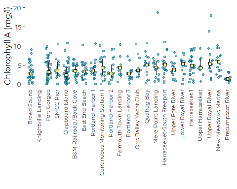
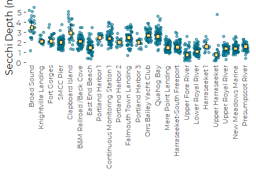
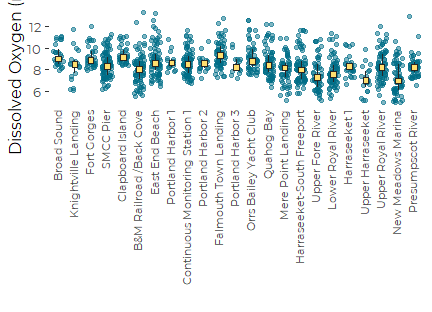
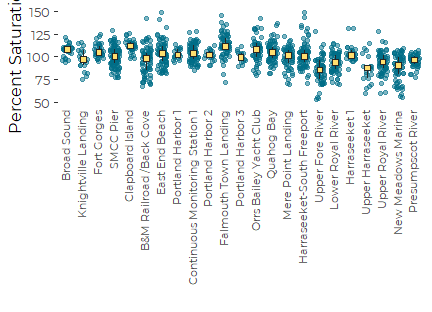
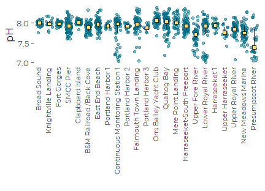
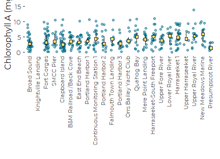
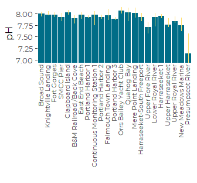
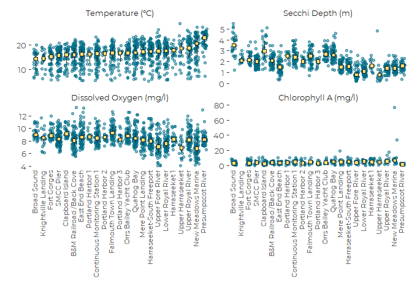
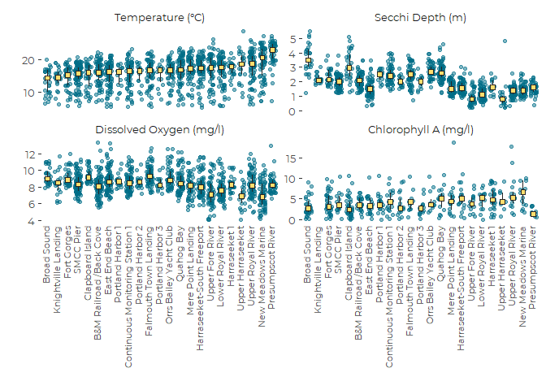
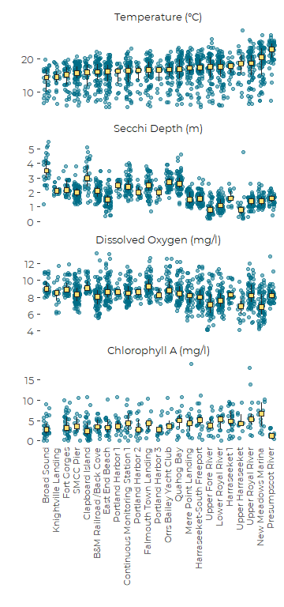

Graphics for Surface Data from Casco Bay Monitoring
================
Curtis C. Bohlen, Casco Bay Estuary Partnership
3/03/2021

-   [Introduction](#introduction)
-   [Load Libraries](#load-libraries)
-   [Load Data](#load-data)
    -   [Establish Folder Reference](#establish-folder-reference)
    -   [Primary Data](#primary-data)
        -   [Remove 2020 only data](#remove-2020-only-data)
    -   [Add Station Names](#add-station-names)
    -   [Address Secchi Censored
        Values](#address-secchi-censored-values)
    -   [Create Recent Data](#create-recent-data)
    -   [Create Trend Data](#create-trend-data)
-   [Recent Conditions](#recent-conditions)
    -   [Create Nested Tibble](#create-nested-tibble)
-   [Standardize Plotting with
    Functions](#standardize-plotting-with-functions)
    -   [Jitter Plot](#jitter-plot)
    -   [Violin Chart](#violin-chart)
    -   [Bar Plot](#bar-plot)
-   [All Draft Plots](#all-draft-plots)
    -   [Automating Labels and Limits](#automating-labels-and-limits)
    -   [All Jitter Plots](#all-jitter-plots)
    -   [All Violin Plots](#all-violin-plots)
    -   [All Bar Plots](#all-bar-plots)
-   [Faceted Graphics](#faceted-graphics)
    -   [Define Labels and Units](#define-labels-and-units)
    -   [New Facet Labels](#new-facet-labels)
    -   [Reorganize and Select Data](#reorganize-and-select-data)
    -   [Jitter Plot](#jitter-plot-1)
        -   [Initial Draft](#initial-draft)
        -   [Revised Draft](#revised-draft)
    -   [Violin Chart](#violin-chart-1)
    -   [Bar Chart](#bar-chart)


# Introduction

This Notebook analyzes Secchi depth data received from FOCB’s “Surface”
data. These data are pulled from long term monitoring locations around
the Bay. This reflects only a small portion of FOCB’s monitoring
program, but it is the program with the deepest historical record.

Secchi Depth data provides a good estimate of water clarity, but the
data can be biased by inability to observe Secchi depths when the water
is shallower than where the Secchi disk disappears in the water column.
Is is important to realize that a Secchi disk on the bottom is NOT the
same as a lack of data - -after all, you know the water was at least
clear enough to see the disk that far down.

# Load Libraries

``` r
library(tidyverse)
#> -- Attaching packages --------------------------------------- tidyverse 1.3.0 --
#> v ggplot2 3.3.3     v purrr   0.3.4
#> v tibble  3.0.5     v dplyr   1.0.3
#> v tidyr   1.1.2     v stringr 1.4.0
#> v readr   1.4.0     v forcats 0.5.0
#> -- Conflicts ------------------------------------------ tidyverse_conflicts() --
#> x dplyr::filter() masks stats::filter()
#> x dplyr::lag()    masks stats::lag()
library(readxl)
#library(readr)

#library(mgcv)
#library(maxLik)

library(GGally)
#> Registered S3 method overwritten by 'GGally':
#>   method from   
#>   +.gg   ggplot2
#library(zoo)
#library(lubridate)  # here, for the make_datetime() function

library(broom)

library(CBEPgraphics)
load_cbep_fonts()
theme_set(theme_cbep())
```

# Load Data

## Establish Folder Reference

``` r
sibfldnm <- 'Original_Data'
parent   <- dirname(getwd())
sibling  <- file.path(parent,sibfldnm)

dir.create(file.path(getwd(), 'figures'), showWarnings = FALSE)
```

## Primary Data

We specify column names because FOCB data has a row of names, a row of
units, then the data. This approach is simpler than reading names from
the first row and correcting them to be R syntactic names.

``` r
fn    <- 'FOCB Surface All Current Sites With BSV Data.xlsx'
fpath <- file.path(sibling,fn)

mynames <- c('station', 'dt', 'time', 'sample_depth',
             'secchi', 'water_depth','temperature', 'salinity',
             'do', 'pctsat', 'pH', 'chl', 
             'month', 'year', 'fdom', 'bga', 
             'turbidity', 'blank', 'clouds', 'wndspd',
             'winddir'
             )

the_data <- read_excel(fpath, skip=2, col_names = mynames)
rm(mynames)
```

### Remove 2020 only data

``` r
the_data <- the_data %>%
select(-c(fdom:winddir))
```

## Add Station Names

``` r
fn    <- 'FOCB Monitoring Sites.xlsx'
fpath <- file.path(sibling,fn)
loc_data <- read_excel(fpath) %>%
  select(Station_ID, Station_Name) %>%
  rename(station = Station_ID,
         station_name = Station_Name)

the_data <- the_data %>%
  left_join(loc_data, by = 'station') %>%
  relocate(station_name, .after = station) %>%
  
  relocate(year, .after = dt) %>%
  relocate(month, .after = year)
```

Our data contains two stations that are not associated with locations
that were included in our spatial data. We can see that because when we
`left_join()` by `station`, no `station_name` value is carried over.

``` r
l <- the_data %>%
  group_by(station) %>%
  summarize(missing = sum(is.na(station_name))) %>%
  filter(missing > 0) %>%
  pull(station)
l
#> [1] "CMS3"  "P6CBI"
```

If we look at those records, on is represented by only a single
observation, and the other only by data from 2020. Neither matter for
the current analysis. They will get filtered out when we select data to
describe recent conditions, and trends.

``` r
the_data %>%
  filter(station %in% l)
#> # A tibble: 7 x 15
#>   station station_name dt                   year month time               
#>   <chr>   <chr>        <dttm>              <dbl> <dbl> <dttm>             
#> 1 P6CBI   <NA>         2006-09-13 00:00:00  2006     9 1899-12-31 11:40:00
#> 2 CMS3    <NA>         2020-06-17 00:00:00  2020     6 1899-12-31 11:22:54
#> 3 CMS3    <NA>         2020-07-15 00:00:00  2020     7 1899-12-31 11:08:08
#> 4 CMS3    <NA>         2020-07-30 00:00:00  2020     7 1899-12-31 11:39:33
#> 5 CMS3    <NA>         2020-08-19 00:00:00  2020     8 1899-12-31 11:36:38
#> 6 CMS3    <NA>         2020-09-17 00:00:00  2020     9 1899-12-31 11:52:14
#> 7 CMS3    <NA>         2020-10-05 00:00:00  2020    10 1899-12-31 11:23:21
#> # ... with 9 more variables: sample_depth <dbl>, secchi <chr>,
#> #   water_depth <dbl>, temperature <dbl>, salinity <dbl>, do <dbl>,
#> #   pctsat <dbl>, pH <dbl>, chl <dbl>
```

## Address Secchi Censored Values

``` r
the_data <- the_data %>%
  mutate(secchi_2 = if_else(secchi == "BSV", water_depth, as.numeric(secchi)),
         bottom_flag = secchi == "BSV") %>%
  relocate(secchi_2, .after = secchi) %>%
  relocate(bottom_flag, .after = secchi_2)
#> Warning: Problem with `mutate()` input `secchi_2`.
#> i NAs introduced by coercion
#> i Input `secchi_2` is `if_else(secchi == "BSV", water_depth, as.numeric(secchi))`.
```

## Create Recent Data

We filter to the last five FULL years of data, 2015 through 2019.

``` r
recent_data <- the_data %>%
  filter(year > 2014 & year < 2020) %>%
  mutate(station = fct_reorder(station, temperature, median, na.rm = TRUE),
         station_name = fct_reorder(station_name, temperature, median, na.rm = TRUE))
```

## Create Trend Data

First, we create a tibble containing information on years in which each
station was sampled.

``` r
years_data <- the_data %>%
  group_by(station, year) %>%
  summarize(yes = ! all(is.na(temperature)),
            .groups = 'drop_last') %>%
  summarize(years = sum(yes, na.rm = TRUE),
            recent_years =  sum(yes & year > 2014, na.rm = TRUE),
            .groups = 'drop')
  
```

Then we identify stations with at least 10 years of data, and at least
three years of data from the last five years, and use that list to
select data for trend analysis. Finally, we adjust the levels in the
`station` and `station_name` variables.

``` r
selected_stations <- years_data %>%
  filter(years> 9, recent_years >2) %>%
  pull(station)

trend_data <- the_data %>%
  filter(station %in% selected_stations) %>%
  mutate(station = fct_drop(station),
         station_name = fct_drop(station_name)) %>%
  mutate(station = fct_reorder(station, temperature, median, na.rm = TRUE),
         station_name = fct_reorder(station_name, temperature, median, na.rm = TRUE))
rm(selected_stations, years_data)
```

We are reduced to only 17 stations with long-term records for trend
analysis.

# Recent Conditions

In 2015, we presented marginal means and standard errors for sixteen
different regions of the Bay. This time, we have fewer monitoring
stations, and can present results for each monitoring location
individually.

It is convenient to run models to generate predictions and standard
errors. For simple models, this is not strictly necessary, as one can
use various `ggplot` summary functions with `stat_summary()` or
`geom_pointrange()` to do much the same thing. The logic here can be
generalized to more complex models and various marginal (adjusted)
means.

## Create Nested Tibble

To run parallel analyses on nested tibbles, we will need to reorganize
the data so that we can analyze along parameters. We add a list of
labels and measurement units to simplify later labeling of plots.

``` r
units <- tibble(parameter = c('secchi_2', 'temperature', 
                              'salinity', 'do',
                              'pctsat', 'pH', 
                              'chl'),
                label = c("Secchi Depth", "Temperature",
                         "Salinity", "Dissolved Oxygen",
                         "Percent Saturation", "pH",
                         "Chlorophyll A"),
                units = c('m', paste0("\U00B0", "C"),
                          'PSU', 'mg/l',
                          '', '',
                          'mg/l'))


nested_data <- recent_data %>%
  select(-dt, -year, -time, -sample_depth, 
         -secchi, - bottom_flag) %>%
  relocate(water_depth, .after = month) %>%
  pivot_longer(c(secchi_2:chl), names_to = 'parameter', values_to = 'value') %>%
  filter(! is.na(value)) %>%
  group_by(parameter) %>%
  nest() %>%
  left_join(units, by = 'parameter')
```

# Standardize Plotting with Functions

We generate functions for consistent plot layout, to simplify managing a
large potential collection of plots.

Our functions are not completely encapsulated, as they assumes existence
of `station`, `station_name`, and `value` fields in the source
dataframe.

## Jitter Plot

This function shows raw data plus median and interquartile range. It is
easy to alter this to show means and 95% bootstrap confidence intervals,
using the `mean_cl_boot()` function.

Since this function relies on the data (not predictions), we need to
force it to plot nothing for any station for which data is missing. We
do that by using `left_join()` to add complete lists of all possible
`station` and `station_name` values.

``` r
jitter_plot <- function(.data, .label, .units = '', .min = NA, .max = NA) {
  
  # Units and Labels
  yaxislabs = paste0(.label, if_else((! is.na(.units) & ! nchar(.units) == 0),
                                       paste0(' (', .units, ')'), ''))
  # Data preparation
  dat <- .data 
  # the station data still holds all possible levels.
  # Levels ordered by mean temp, as created above.
  all_stations <-  tibble(station = factor(levels(dat$station),
                                           levels = levels(dat$station)),
                          station_name = factor(levels(dat$station_name),
                                                levels = levels(dat$station_name)))
  dat <- dat %>%
    select(-station_name)  # added back in in a moment; avoids confusion
  
  # Start with the list of stations, and join the data to that. 
  # Than ensures we get a row with NAs for stations where we have no data.
  # That ensures we get a blank slot in the graphic.
  dat <- all_stations %>%
    left_join(dat, by = 'station')

  # The lot
  p <- ggplot(dat, aes(station_name, value)) +
    geom_jitter(width = 0.3, height = 0, color = cbep_colors()[1], alpha = 0.5) +
    stat_summary(fun.data = function(.x) median_hilow(.x, conf.int = .5),
                 fill = cbep_colors()[2], color = "gray15",
                 size = .4, shape = 22) +
    xlab('') +
    ylab(yaxislabs) +
    theme_cbep(base_size = 12) +
    theme(axis.text.x = element_text(angle = 90,
                                     size = 8,
                                     hjust = 1,
                                     vjust = 0.25),
          axis.ticks.length.x = unit(0, 'cm'))
  
  if(! is.na(.min) | ! is.na(.max)) {
    p <- p + scale_y_continuous(limits = c(.min, .max))
  }
  return(p)
}
```

``` r
tmp <- nested_data %>%
  filter(parameter =='chl')
         
dat <- tmp$data[[1]]

p <- jitter_plot(dat, tmp$label, tmp$units, .max = 20)
print(p)
#> Warning: Removed 3 rows containing non-finite values (stat_summary).
#> Warning: Removed 3 rows containing missing values (geom_point).
```



## Violin Chart

This plot also shows medians and the interquartile range. It does not
use the models and predictions.

``` r
violin_plot <- function(.data, .label, .units, .min = NA, .max = NA) {
  
  # Units and Labels
  yaxislabs = paste0(.label, if_else((! is.na(.units) & ! nchar(.units) == 0),
                                       paste0(' (', .units, ')'), ''))
  
 # Data preparation
  dat <- .data 
  # the station data still holds all possible levels.
  # Levels ordered by mean temp, as created above.
  all_stations <-  tibble(station = factor(levels(dat$station),
                                           levels = levels(dat$station)),
                          station_name = factor(levels(dat$station_name),
                                                levels = levels(dat$station_name)))
  dat <- dat %>%
    select(-station_name)
  
  dat <- all_stations %>%
    left_join(dat, by = 'station')

  p <- ggplot(dat, aes(station_name, value)) +
    geom_violin(width = 2, scale = "count", fill = cbep_colors()[6]) +
    stat_summary(fun.data = function(.x) median_hilow(.x, conf.int = .5),
                 fill = cbep_colors()[2], color = "gray15",
                 size = .4, shape = 22) +
    xlab('') +
    ylab(yaxislabs) +
    theme_cbep(base_size = 12) +
    theme(axis.text.x = element_text(angle = 90,
                                     size = 8,
                                     hjust = 1,
                                     vjust = 0.25),
          axis.ticks.length.x = unit(0, 'cm'))
  
  if(! is.na(.min) | ! is.na(.max)) {
    p <- p + scale_y_continuous(limits = c(.min, .max))
  }
  return(p)
}
```

``` r
tmp <- nested_data %>%
  filter(parameter =='chl')
dat <- tmp$data[[1]]

p <- violin_plot(dat, tmp$label, tmp$units, .min = 0, .max = 20)
print(p)
#> Warning: Removed 4 rows containing non-finite values (stat_ydensity).
#> Warning: Removed 4 rows containing non-finite values (stat_summary).
#> Warning: position_dodge requires non-overlapping x intervals
```


That is visually more confusing than the jitter plot. It is better when
the graphic is widened somewhat, allowing the violins to spread out
more.

## Bar Plot

This bar plot is also based on the underlying data

``` r
bar_plot <- function(.data, .label, .units, .min = NA, .max = NA) {
  # Units and Labels
  yaxislabs = paste0(.label, if_else((! is.na(.units) & ! nchar(.units) == 0),
                                       paste0(' (', .units, ')'), ''))
  
 # Data preparation
  dat <- .data 
  # the station data still holds all possible levels.
  # Levels ordered by mean temp, as created above.
  all_stations <-  tibble(station = factor(levels(dat$station),
                                           levels = levels(dat$station)),
                          station_name = factor(levels(dat$station_name),
                                                levels = levels(dat$station_name)))
  
  dat <- dat %>%
    select(-station_name)
  
  dat <- all_stations %>%
    left_join(dat, by = 'station')
  
  p <- ggplot(dat, aes(x = station_name, y = value)) +
    stat_summary(fun = median, na.rm = TRUE,
                 geom = 'bar',
                 fill = cbep_colors()[1]) +
    stat_summary(fun.data = function(.x) median_hilow(.x, conf.int= 0.5), 
                 geom = 'linerange', 
                 color = cbep_colors()[2]) + 
    xlab('') +
    ylab(yaxislabs) +
    theme_cbep(base_size = 12) +
    theme(axis.text.x = element_text(angle = 90,
                                     size = 8,
                                     hjust = 1,
                                     vjust = 0.25),
          axis.ticks.length.x = unit(0, 'cm'))
  
  
  if(! is.na(.min) | ! is.na(.max)) {
      p <- p + coord_cartesian(ylim = c(.min, .max))
    }
  return(p)
}
```

``` r
p <- bar_plot(dat, tmp$label, tmp$units)
print(p)
#> Warning: Removed 1 rows containing non-finite values (stat_summary).
```


# All Draft Plots

## Automating Labels and Limits

``` r
my_lims <- tribble( ~parameter, ~minim, ~maxim,
                   "secchi_2",     NA, NA,
                   "temperature",   5, NA,
                   "salinity",      10, NA,
                   "do" ,           5, NA,
                   "pctsat",         50, NA,  
                   "pH",            7, NA,       
                   "chl",           0,15)
```

## All Jitter Plots

``` r
for (p in nested_data$parameter) {
  sel <- nested_data %>%
    filter(parameter == p)
  dat <- sel$data[[1]]
  label <- sel$label[[1]]
  units <- sel$units[[1]]

  the_min <- my_lims %>%
    filter(parameter == p) %>%
    pull(minim)
  the_max <- my_lims %>%
    filter(parameter == p) %>%
    pull(maxim)
  
 print(jitter_plot(dat, label, units, the_min, the_max))
}
```



    #> Warning: Removed 70 rows containing non-finite values (stat_summary).
    #> Warning: Removed 70 rows containing missing values (geom_point).


    #> Warning: Removed 14 rows containing non-finite values (stat_summary).
    #> Warning: Removed 14 rows containing missing values (geom_point).



    #> Warning: Removed 3 rows containing non-finite values (stat_summary).
    #> Warning: Removed 3 rows containing missing values (geom_point).



    #> Warning: Removed 22 rows containing non-finite values (stat_summary).
    #> Warning: Removed 22 rows containing missing values (geom_point).



    #> Warning: Removed 6 rows containing non-finite values (stat_summary).
    #> Warning: Removed 6 rows containing missing values (geom_point).



## All Violin Plots

``` r
for (p in nested_data$parameter) {
  sel <- nested_data %>%
    filter(parameter == p)
  dat <- sel$data[[1]]
  label = sel$label[[1]]
  units = sel$units[[1]]

  the_min <- my_lims %>%
    filter(parameter == p) %>%
    pull(minim)
  the_max <- my_lims %>%
    filter(parameter == p) %>%
    pull(maxim)
  
 print(violin_plot(dat, label, units, the_min, the_max))
}
#> Warning: position_dodge requires non-overlapping x intervals
```


    #> Warning: position_dodge requires non-overlapping x intervals


    #> Warning: Removed 70 rows containing non-finite values (stat_ydensity).
    #> Warning: Removed 70 rows containing non-finite values (stat_summary).
    #> Warning: position_dodge requires non-overlapping x intervals


    #> Warning: Removed 14 rows containing non-finite values (stat_ydensity).
    #> Warning: Removed 14 rows containing non-finite values (stat_summary).
    #> Warning: position_dodge requires non-overlapping x intervals


    #> Warning: Removed 3 rows containing non-finite values (stat_ydensity).
    #> Warning: Removed 3 rows containing non-finite values (stat_summary).
    #> Warning: position_dodge requires non-overlapping x intervals


    #> Warning: Removed 22 rows containing non-finite values (stat_ydensity).
    #> Warning: Removed 22 rows containing non-finite values (stat_summary).
    #> Warning: position_dodge requires non-overlapping x intervals


    #> Warning: Removed 6 rows containing non-finite values (stat_ydensity).
    #> Warning: Removed 6 rows containing non-finite values (stat_summary).
    #> Warning: position_dodge requires non-overlapping x intervals


## All Bar Plots

``` r
for (p in nested_data$parameter) {
  sel <- nested_data %>%
    filter(parameter == p)
  dat <- sel$data[[1]]
  label = sel$label[[1]]
  units = sel$units[[1]]

  the_min <- my_lims %>%
    filter(parameter == p) %>%
    pull(minim)
  the_max <- my_lims %>%
    filter(parameter == p) %>%
    pull(maxim)
  
 print(bar_plot(dat, label, units, the_min, the_max))
}
```



    #> Warning: Removed 1 rows containing non-finite values (stat_summary).


# Faceted Graphics

It would be nice to wrap those graphics up in a faceted format,
principally to simplify axis labels.

## Define Labels and Units

We need a single dataframe containing all the data, and a convenient way
to label things correctly.

``` r
units <- tibble(parameter = c('secchi_2', 'temperature', 
                              'salinity', 'do',
                              'pctsat', 'pH', 
                              'chl'),
                label = c("Secchi Depth", "Temperature",
                         "Salinity", "Dissolved Oxygen",
                         "Percent Saturation", "pH",
                         "Chlorophyll A"),
                units = c('m', paste0("\U00B0", "C"),
                          'PSU', 'mg/l',
                          '', '',
                          'mg/l'))
```

## New Facet Labels

``` r
labs <- paste0(units$label, 
                           if_else((! is.na(units$units) & 
                                      ! nchar(units$units) == 0),
                                       paste0(' (', units$units, ')'), ''))
names(labs) <- units$parameter
```

## Reorganize and Select Data

``` r
list_df <- nested_data$data
names(list_df) <-  nested_data$parameter

data_all <- bind_rows(list_df, .id = 'Parameter')

data_sel <- data_all %>%
  filter(Parameter %in% c('temperature', 'secchi_2', 'do', 
                          'chl')) %>%
  mutate(Parameter = factor(Parameter,
                            levels = c('temperature', 'secchi_2', 'do', 
                                       'chl')))
```

## Jitter Plot

### Initial Draft

``` r
 p <- ggplot(data_sel, aes(x = station_name, y = value)) +
    geom_jitter(width = 0.3, height = 0, color = cbep_colors()[1], alpha = 0.5) +
    stat_summary(fun.data = function(.x) median_hilow(.x, conf.int = .5),
                 fill = cbep_colors()[2], color = "gray15",
                 size = .4, shape = 22) +
    xlab('') +
    ylab('') +
    theme_cbep(base_size = 12) +
    theme(axis.text.x = element_text(angle = 90,
                                     size = 8,
                                     hjust = 1,
                                     vjust = 0.25),
          axis.ticks.length.x = unit(0, 'cm'))
```

``` r
p + facet_wrap(~Parameter, 
               scale = 'free_y',
               labeller = labeller(Parameter = labs))
```



### Revised Draft

A little Googling suggests there is no easy way to adjust the Y axis
limits in a facet display.

We have a couple of unpalatable options. Probably the best is to
pre-calculate the median and interquartile range, then trim the data,
and replot.

#### Reorganize and Select Data - Again

##### Limit data to selected parameters

``` r
reduced_df <- nested_data %>%
  filter(parameter %in% c('temperature', 'secchi_2', 'do', 
                          'chl'))
```

##### Caclulate Summaries

We need to calculate our selected summaries of location and scale, here
the median and interquartile ranges. We calculate them based on the full
data, not based on the reduced data points we will actually plot.

``` r
summrys <- data_sel %>%
group_by(Parameter, station) %>%
summarize(station_name = first(station_name),
          summry = median_hilow(value, conf.int = 0.5),
          .groups = 'drop') %>%
  mutate(y = summry$y,
         ymin = summry$ymin,
         ymax = summry$ymax) %>%
  select (-summry)
```

We now delete all points with a chlorophyll value over 20.

``` r
data_sel_2 <- data_sel %>%
  filter ( ! (Parameter == 'chl' & value > 20) )
```

#### Revised Plots

``` r
p <- ggplot(data_sel_2, aes(x = station_name, y = value)) +
  geom_jitter(width = 0.3, height = 0, color = cbep_colors()[1], alpha = 0.5) +
 
  
  geom_pointrange(mapping= aes(y = y, ymin = ymin, ymax = ymax),
                  data = summrys,
                  fill = cbep_colors()[2], color = "gray15",
                  size = .4, shape = 22) +
  
  xlab('') +
  ylab('') +
  theme_cbep(base_size = 12) +
  theme(axis.text.x = element_text(angle = 90,
                                     size = 8,
                                     hjust = 1,
                                     vjust = 0.25),
          axis.ticks.length.x = unit(0, 'cm'))
```

``` r
p + facet_wrap(~Parameter, 
               scale = 'free_y',
               labeller = labeller(Parameter = labs))
```



``` r
ggsave('figures/surface_4_wide_jitter.pdf', device = cairo_pdf, width = 7, height = 5)
```

``` r
p + facet_wrap(~Parameter, 
               scale = 'free_y',
               nrow = 4,
               labeller = labeller(Parameter = labs))
```



``` r
ggsave('figures/surface_4_long_jitter.pdf', device = cairo_pdf, width = 3.5, height = 8)
```

## Violin Chart

The inability to control the Y axis is again problematic, but we now
have a viable solution.

``` r
 p <- ggplot(data_sel_2, aes(station_name, value)) +
    geom_violin(width = 2, scale = "count", fill = cbep_colors()[6]) +
    geom_pointrange(mapping= aes(y = y, ymin = ymin, ymax = ymax),
                  data = summrys,
                  fill = cbep_colors()[2], color = "gray15",
                  size = .4, shape = 22) +
    xlab('') +
    ylab('') +
    theme_cbep(base_size = 12) +
    theme(axis.text.x = element_text(angle = 90,
                                     size = 8,
                                     hjust = 1,
                                     vjust = 0.25),
          axis.ticks.length.x = unit(0, 'cm'))
```

``` r
p + facet_wrap(~Parameter, 
               scale = 'free_y',
               labeller = labeller(Parameter = labs))
#> Warning: position_dodge requires non-overlapping x intervals

#> Warning: position_dodge requires non-overlapping x intervals

#> Warning: position_dodge requires non-overlapping x intervals

#> Warning: position_dodge requires non-overlapping x intervals
```


``` r
ggsave('figures/surface_4_wide_violin.pdf', device = cairo_pdf, width = 7, height = 5)
#> Warning: position_dodge requires non-overlapping x intervals

#> Warning: position_dodge requires non-overlapping x intervals

#> Warning: position_dodge requires non-overlapping x intervals

#> Warning: position_dodge requires non-overlapping x intervals
```

``` r
p + facet_wrap(~Parameter, 
               scale = 'free_y',
               nrow = 4,
               labeller = labeller(Parameter = labs))
#> Warning: position_dodge requires non-overlapping x intervals

#> Warning: position_dodge requires non-overlapping x intervals

#> Warning: position_dodge requires non-overlapping x intervals

#> Warning: position_dodge requires non-overlapping x intervals
```


``` r
ggsave('figures/surface_4_long_violin.pdf', device = cairo_pdf, width = 3.5, height = 8)
#> Warning: position_dodge requires non-overlapping x intervals

#> Warning: position_dodge requires non-overlapping x intervals

#> Warning: position_dodge requires non-overlapping x intervals

#> Warning: position_dodge requires non-overlapping x intervals
```

## Bar Chart

Here the situation is a bit easier, as we do not have to plot the
extreme outliers, and only show medians and the interquartile range.

``` r
p <- ggplot(data_sel, aes(x = station_name, y = value)) +
    stat_summary(fun = median, na.rm = TRUE,
                 geom = 'bar',
                 fill = cbep_colors()[1]) +
    stat_summary(fun.data = function(.x) median_hilow(.x, conf.int= 0.5), 
                 geom = 'linerange', 
                 color = cbep_colors()[2]) + 
    xlab('') +
    ylab('') +
   
    theme_cbep(base_size = 12) +
    theme(axis.text.x = element_text(angle = 90,
                                     size = 8,
                                     hjust = 1,
                                     vjust = 0.25),
          axis.ticks.length.x = unit(0, 'cm'))
```

``` r
p + facet_wrap(~Parameter, 
               scale = 'free_y',
               labeller = labeller(Parameter = labs))
```


``` r
ggsave('figures/surface_4_wide_bar.pdf', device = cairo_pdf, width = 7, height = 5)
```

``` r
p + facet_wrap(~Parameter, 
               scale = 'free_y',
               nrow = 4,
               labeller = labeller(Parameter = labs))
```


``` r
ggsave('figures/surface_4_long_bar.pdf', device = cairo_pdf, width = 3.5, height = 8)
```
