Graphics for Surface Data from Casco Bay Monitoring - Version 2
================
Curtis C. Bohlen, Casco Bay Estuary Partnership
3/03/2021

-   [Introduction](#introduction)
-   [Load Libraries](#load-libraries)
-   [Load Data](#load-data)
    -   [Establish Folder Reference](#establish-folder-reference)
    -   [Primary Data](#primary-data)
        -   [Remove 2020 only data](#remove-2020-only-data)
    -   [Add Station Names](#add-station-names)
    -   [Address Secchi Censored
        Values](#address-secchi-censored-values)
    -   [Create Recent Data](#create-recent-data)
-   [Recent Conditions](#recent-conditions)
    -   [Create Nested Tibble](#create-nested-tibble)
-   [Standardize Plotting with
    Functions](#standardize-plotting-with-functions)
    -   [Jitter Plot](#jitter-plot)
    -   [Violin Plot](#violin-plot)
-   [All Draft Plots](#all-draft-plots)
    -   [Automating Limits](#automating-limits)
    -   [All Jitter Plots](#all-jitter-plots)
    -   [All Violin Plots](#all-violin-plots)
-   [Faceted Graphics](#faceted-graphics)
    -   [Define Labels and Units](#define-labels-and-units)
    -   [New Facet Labels](#new-facet-labels)
    -   [Reorganize and Select Data](#reorganize-and-select-data)
    -   [Draft Jitter Plot](#draft-jitter-plot)
        -   [Fixing the Chlorophyll Y
            Axis](#fixing-the-chlorophyll-y-axis)
    -   [Revised Jitter Plot](#revised-jitter-plot)
    -   [Violin Chart](#violin-chart)
    -   [Bar Chart](#bar-chart)
-   [Alternates to the Facet Bar
    Chart](#alternates-to-the-facet-bar-chart)
    -   [Revised Bar Chart Function](#revised-bar-chart-function)
    -   [Automating Limits](#automating-limits-1)
    -   [All Bar Plots](#all-bar-plots)
-   [Temperature / DO Graph](#temperature-do-graph)


# Introduction

This Notebook analyzes FOCB’s “Surface” data. These data are pulled from
long term monitoring locations around the Bay. Data, as suggested by the
name of the data subset, is collected at the surface of the water.
(Other data, from depth, are also available, but not evaluated here.)

These are sites visited regularly by FOCB staff, either by boat or on
land. The focus is on warm season sampling (April through October), with
roughly monthly samples. Earlier data from some land-based sites was
collected by volunteers.

This notebook focuses on developing graphics for the “State of Casco
Bay” report, not on detailed statistical analyses. The central challenge
is that we are trying to find ways to summarize seven water quality
variables, measured at twenty three locations, in a compact and easy to
follow format.

This Version makes several changes from the base Surface graphics
notebook.  
First, is simplifies and standardizes Station names. Second, it facet
graphics for six variables and it adds a temperature by dissolved oxygen
graphic. We also explore ways to integrate transformed chlorophyll axes
into facet plots or other multi-plot layouts.

# Load Libraries

``` r
library(tidyverse)
#> -- Attaching packages --------------------------------------- tidyverse 1.3.0 --
#> v ggplot2 3.3.3     v purrr   0.3.4
#> v tibble  3.0.5     v dplyr   1.0.3
#> v tidyr   1.1.2     v stringr 1.4.0
#> v readr   1.4.0     v forcats 0.5.0
#> -- Conflicts ------------------------------------------ tidyverse_conflicts() --
#> x dplyr::filter() masks stats::filter()
#> x dplyr::lag()    masks stats::lag()
library(readxl)

# library(gridExtra)   # One option for multi-plot layouts

library(CBEPgraphics)
load_cbep_fonts()
theme_set(theme_cbep())
```

# Load Data

## Establish Folder Reference

``` r
sibfldnm <- 'Original_Data'
parent   <- dirname(getwd())
sibling  <- file.path(parent,sibfldnm)

dir.create(file.path(getwd(), 'figures'), showWarnings = FALSE)
```

## Primary Data

We specify column names because FOCB data has a row of names, a row of
units, then the data. This approach is simpler than reading names from
the first row and correcting them to be R syntactic names.

``` r
fn    <- 'FOCB Surface All Current Sites With BSV Data.xlsx'
fpath <- file.path(sibling,fn)

mynames <- c('station', 'dt', 'time', 'sample_depth',
             'secchi', 'water_depth','temperature', 'salinity',
             'do', 'pctsat', 'pH', 'chl', 
             'month', 'year', 'fdom', 'bga', 
             'turbidity', 'blank', 'clouds', 'wndspd',
             'winddir'
             )

the_data <- read_excel(fpath, skip=2, col_names = mynames)
rm(mynames)
```

### Remove 2020 only data

``` r
the_data <- the_data %>%
select(-c(fdom:winddir))
```

## Add Station Names

``` r
sibfldnm <- 'Derived_Data'
parent   <- dirname(getwd())
sibling  <- file.path(parent,sibfldnm)

fn    <- 'FOCB Monitoring Sites SHORT NAMES.xlsx'
fpath <- file.path(sibling,fn)
loc_data <- read_excel(fpath) %>%
  select(Station_ID, Alt_Name) %>%
  rename(station = Station_ID,
         station_name = Alt_Name)

the_data <- the_data %>%
  left_join(loc_data, by = 'station') %>%
  relocate(station_name, .after = station) %>%
  
  relocate(year, .after = dt) %>%
  relocate(month, .after = year)
rm(loc_data)
```

Our data contains two stations that are not associated with locations
that were included in our spatial data. Neither matter for the current
analysis. They will get filtered out when we select data to describe
recent conditions.

## Address Secchi Censored Values

Note we do NOT use maximum likelihood estimators of censored Secchi
depth, as censored values are relatively rare, and do not affect median
values, which are our focus here. The key goal is to include
observations with Secchi Depth on the bottom, and include information on
when the Secchi Depth may be biased.

``` r
the_data <- the_data %>%
  mutate(secchi_2 = if_else(secchi == "BSV", water_depth, as.numeric(secchi)),
         bottom_flag = secchi == "BSV") %>%
  relocate(secchi_2, .after = secchi) %>%
  relocate(bottom_flag, .after = sample_depth)  # we want an ID column
#> Warning: Problem with `mutate()` input `secchi_2`.
#> i NAs introduced by coercion
#> i Input `secchi_2` is `if_else(secchi == "BSV", water_depth, as.numeric(secchi))`.
```

Warnings are caused because some entries in Secchi that could not be
converted to numeric values. However, the warnings appear to have all
been triggered by existing NAs, not problems importing numeric values.
(Not shown.)

## Create Recent Data

We filter to the last five FULL years of data, 2015 through 2019, and
add a transformed chlorophyll value, to facilitate plotting.

``` r
recent_data <- the_data %>%
  filter(year > 2014 & year < 2020) %>%
  mutate(station = fct_reorder(station, temperature, median, na.rm = TRUE),
         station_name = fct_reorder(station_name, 
                                    temperature, median, na.rm = TRUE)) %>%
  mutate(chl_log1p = log1p(chl))
rm(the_data)
```

# Recent Conditions

In 2015, we presented marginal means and standard errors for sixteen
different regions of the Bay. This time, we have fewer monitoring
stations, and choose to present results for each monitoring location
individually.

It is convenient to run models to generate predictions and standard
errors. For simple models, this is not strictly necessary, as one can
use various `ggplot` summary functions with `stat_summary()` or
`geom_pointrange()` to do much the same thing. The logic used here can
be generalized to more complex models and various marginal (adjusted)
means.

## Create Nested Tibble

To run parallel analyses on nested tibbles, we will need to reorganize
the data so that we can analyze along parameters. We add a list of
labels and measurement units to simplify later labeling of plots.

``` r
units <- tibble(parameter = c('secchi_2', 'temperature', 
                              'salinity', 'do',
                              'pctsat', 'pH', 
                              'chl', 'chl_log1p'),
                label = c("Secchi Depth", "Temperature",
                         "Salinity", "Dissolved Oxygen",
                         "Percent Saturation", "pH",
                         "Chlorophyll A", "Chlorophyll A"),
                units = c('m', paste0("\U00B0", "C"),
                          'PSU', 'mg/l',
                          '', '',
                          'mg/l', 'mg/l'))

nested_data <- recent_data %>%
  select(-dt, -year, -time, -sample_depth, 
         -secchi) %>%
  relocate(water_depth, .after = month) %>%
  pivot_longer(c(secchi_2:chl_log1p), 
               names_to = 'parameter', 
               values_to = 'value') %>%
  mutate(bottom_flag = if_else(parameter=='secchi_2', bottom_flag, FALSE)) %>%
  filter(! is.na(value)) %>%
  group_by(parameter) %>%
  nest() %>%
  left_join(units, by = 'parameter')
```

# Standardize Plotting with Functions

We generate functions for consistent plot layout, to simplify managing a
large collection of plots.

Our functions are not completely encapsulated, as they assumes existence
of `station`, `station_name`, `value`, and `bottom_flag` fields in the
source data frame.

## Jitter Plot

This function shows raw data plus median and interquartile range. It is
easy to alter this to show means and 95% bootstrap confidence intervals,
using the `mean_cl_boot()` function.

Since this function relies on the data (not predictions), we need to
force it to plot nothing for any station for which data is missing. We
do that by using `left_join()` to add complete lists of all possible
`station` and `station_name` values.

``` r
jitter_plot <- function(.data, .label, .units = '', .min = NA, .max = NA) {
  
  # Units and Labels
  yaxislabs = paste0(.label, if_else((! is.na(.units) & ! nchar(.units) == 0),
                                       paste0(' (', .units, ')'), ''))
  # Data preparation
  dat <- .data 
  # the station data still holds all possible levels.
  # Levels ordered by mean temp, as created above.
  all_stations <-  tibble(station = factor(levels(dat$station),
                                           levels = levels(dat$station)),
                          station_name = factor(levels(dat$station_name),
                                                levels = levels(dat$station_name)))
  dat <- dat %>%
    select(-station_name)  # added back in in a moment; avoids confusion
  
  # Start with the list of stations, and join the data to that. 
  # Than ensures we get a row with NAs for stations where we have no data.
  # That ensures we get a blank slot in the graphic.
  dat <- all_stations %>%
    left_join(dat, by = 'station')

  # The lot
  p <- ggplot(dat, aes(station_name, value)) +
    geom_jitter(width = 0.3, height = 0, color = cbep_colors()[1], 
                alpha = 0.15) +
    stat_summary(fun.data = function(.x) median_hilow(.x, conf.int = .5),
               fill = cbep_colors()[3], color = "black",
                 size = .4, shape = 22) +
    xlab('') +
    ylab(yaxislabs) +
    theme_cbep(base_size = 12) +
    theme(axis.text.x = element_text(angle = 90,
                                     size = 8,
                                     hjust = 1,
                                     vjust = 0.25),
          axis.ticks.length.x = unit(0, 'cm')) +
    theme(legend.position = "none")
  
  if(! is.na(.min) | ! is.na(.max)) {
    p <- p + scale_y_continuous(limits = c(.min, .max))
  }
  return(p)
}
```

``` r
tmp <- nested_data %>%
  filter(parameter =='chl')
         
dat <- tmp$data[[1]]

p <- jitter_plot(dat, tmp$label, tmp$units, .max = 20)
print(p)
#> Warning: Removed 3 rows containing non-finite values (stat_summary).
#> Warning: Removed 3 rows containing missing values (geom_point).
```

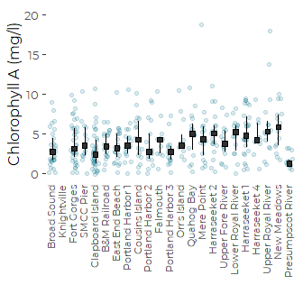

## Violin Plot

This plot also shows medians and the interquartile range. It does not
use the models and predictions.

``` r
violin_plot <- function(.data, .label, .units, .min = NA, .max = NA) {
  
  # Units and Labels
  yaxislabs = paste0(.label, if_else((! is.na(.units) & ! nchar(.units) == 0),
                                       paste0(' (', .units, ')'), ''))
  
 # Data preparation
  dat <- .data 
  # the station data still holds all possible levels.
  # Levels ordered by mean temp, as created above.
  all_stations <-  tibble(station = factor(levels(dat$station),
                                           levels = levels(dat$station)),
                          station_name = factor(levels(dat$station_name),
                                                levels = levels(dat$station_name)))
  dat <- dat %>%
    select(-station_name)
  
  dat <- all_stations %>%
    left_join(dat, by = 'station')

  p <- ggplot(dat, aes(station_name, value)) +
    geom_violin(width = 2, scale = "count", fill = cbep_colors()[6], alpha = 0.5) +
    stat_summary(fun.data = function(.x) median_hilow(.x, conf.int = .5),
                 fill = cbep_colors()[2], color = "gray15",
                 size = .4, shape = 22) +
    xlab('') +
    ylab(yaxislabs) +
    theme_cbep(base_size = 12) +
    theme(axis.text.x = element_text(angle = 90,
                                     size = 8,
                                     hjust = 1,
                                     vjust = 0.25),
          axis.ticks.length.x = unit(0, 'cm'))
  
  if(! is.na(.min) | ! is.na(.max)) {
    p <- p + scale_y_continuous(limits = c(.min, .max))
  }
  return(p)
}
```

``` r
tmp <- nested_data %>%
  filter(parameter =='chl')
dat <- tmp$data[[1]]

p <- violin_plot(dat, tmp$label, tmp$units, .min = 0, .max = 20)
print(p)
#> Warning: Removed 4 rows containing non-finite values (stat_ydensity).
#> Warning: Removed 4 rows containing non-finite values (stat_summary).
#> Warning: position_dodge requires non-overlapping x intervals
```


That is visually more confusing than the jitter plot. It is better when
the graphic is widened somewhat, allowing the violins to spread out
more.

# All Draft Plots

## Automating Limits

``` r
my_lims <- tribble( ~parameter, ~minim, ~maxim,
                   "secchi_2",      NA, NA,
                   "temperature",   5,  NA,
                   "salinity",      10, NA,
                   "do" ,           5,  NA,
                   "pctsat",        50, NA,  
                   "pH",            6.5, NA,       
                   "chl",           0,  20, 
                   "chl_log1p",     0,  NA)
```

## All Jitter Plots

``` r
for (p in c('temperature', 'salinity', 'do', 'pctsat',
                          'pH', 'secchi_2', 'chl')) {
  sel <- nested_data %>%
    filter(parameter == p)
  dat <- sel$data[[1]]
  label <- sel$label[[1]]
  unit <- sel$units[[1]]

  the_min <- my_lims %>%
    filter(parameter == p) %>%
    pull(minim)
  the_max <- my_lims %>%
    filter(parameter == p) %>%
    pull(maxim)
  
 print(jitter_plot(dat, label, unit, the_min, the_max))
}
```

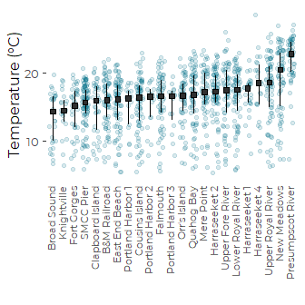

    #> Warning: Removed 70 rows containing non-finite values (stat_summary).
    #> Warning: Removed 70 rows containing missing values (geom_point).

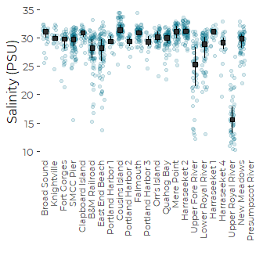

    #> Warning: Removed 14 rows containing non-finite values (stat_summary).
    #> Warning: Removed 14 rows containing missing values (geom_point).

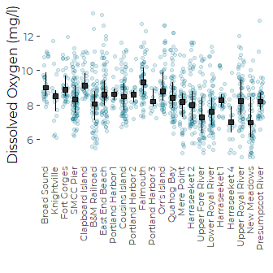

    #> Warning: Removed 3 rows containing non-finite values (stat_summary).
    #> Warning: Removed 3 rows containing missing values (geom_point).

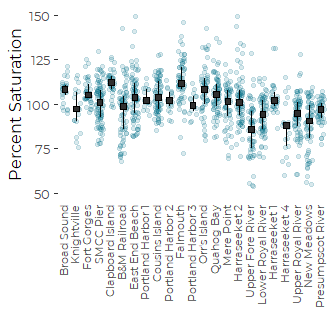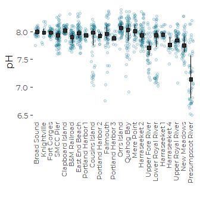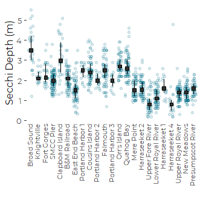

    #> Warning: Removed 4 rows containing non-finite values (stat_summary).
    #> Warning: Removed 4 rows containing missing values (geom_point).

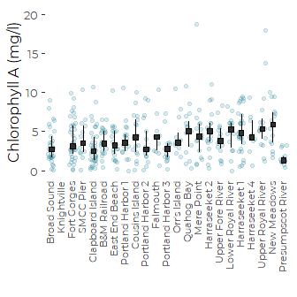

## All Violin Plots

``` r
for (p in nested_data$parameter) {
  sel <- nested_data %>%
    filter(parameter == p)
  dat <- sel$data[[1]]
  label = sel$label[[1]]
  unit = sel$units[[1]]

  the_min <- my_lims %>%
    filter(parameter == p) %>%
    pull(minim)
  the_max <- my_lims %>%
    filter(parameter == p) %>%
    pull(maxim)
  
 print(violin_plot(dat, label, unit, the_min, the_max))
}
#> Warning: position_dodge requires non-overlapping x intervals
```

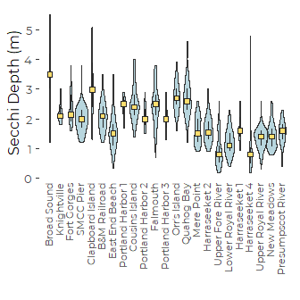

    #> Warning: position_dodge requires non-overlapping x intervals

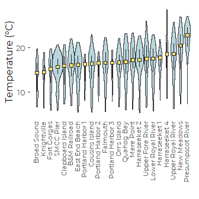

    #> Warning: Removed 70 rows containing non-finite values (stat_ydensity).
    #> Warning: Removed 70 rows containing non-finite values (stat_summary).
    #> Warning: position_dodge requires non-overlapping x intervals

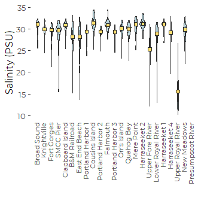

    #> Warning: Removed 14 rows containing non-finite values (stat_ydensity).
    #> Warning: Removed 14 rows containing non-finite values (stat_summary).
    #> Warning: position_dodge requires non-overlapping x intervals

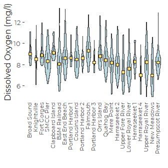

    #> Warning: Removed 3 rows containing non-finite values (stat_ydensity).
    #> Warning: Removed 3 rows containing non-finite values (stat_summary).
    #> Warning: position_dodge requires non-overlapping x intervals

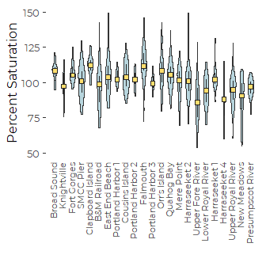

    #> Warning: position_dodge requires non-overlapping x intervals

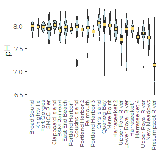

    #> Warning: Removed 4 rows containing non-finite values (stat_ydensity).
    #> Warning: Removed 4 rows containing non-finite values (stat_summary).
    #> Warning: position_dodge requires non-overlapping x intervals

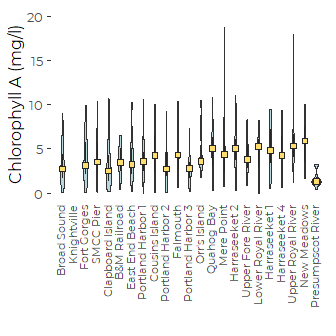

    #> Warning: Removed 2 rows containing non-finite values (stat_ydensity).
    #> Warning: Removed 2 rows containing non-finite values (stat_summary).
    #> Warning: position_dodge requires non-overlapping x intervals

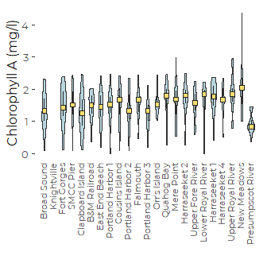

# Faceted Graphics

It would be nice to wrap those graphics up in a faceted format,
principally to simplify axis labels.

## Define Labels and Units

We need a single data frame containing all the data, and a convenient
way to label things correctly.

## New Facet Labels

``` r
labs <- paste0(units$label, 
                           if_else((! is.na(units$units) & 
                                      ! nchar(units$units) == 0),
                                       paste0(' (', units$units, ')'), ''))
names(labs) <- units$parameter
```

## Reorganize and Select Data

This is perhaps counter intuitive, because we “unnest” the nested data
here. An alternative would be to start from `recent_data` and pivot to
long form, but this ensures we are looking at the exact same data used
in our other plots.

``` r
list_df <- nested_data$data
names(list_df) <-  nested_data$parameter

data_all <- bind_rows(list_df, .id = 'Parameter')

data_sel <- data_all %>%
  filter(Parameter %in% c('temperature', 'salinity', 'do', 
                          'pH', 'secchi_2', 'chl_log1p')) %>%
  mutate(Parameter = factor(Parameter,
                            levels = c('temperature', 'salinity', 'do', 
                                       'pH', 'secchi_2', 'chl_log1p')))
rm(list_df, data_all)
```

## Draft Jitter Plot

``` r
 p <- ggplot(data_sel, aes(x = station_name, y = value)) +
    geom_jitter(aes(color = bottom_flag), width = 0.3, height = 0, alpha = 0.5) +
    stat_summary(fun.data = function(.x) median_hilow(.x, conf.int = .5),
                 fill = cbep_colors()[2], color = "gray15",
                 size = .4, shape = 22) +
    xlab('') +
    ylab('') +
  
    scale_color_manual(values = cbep_colors(), 
                       name = '', breaks = 'TRUE', label = 'Secchi On Bottom') +
  
    theme_cbep(base_size = 12) +
    theme(axis.text.x = element_text(angle = 90,
                                     size = 8,
                                     hjust = 1,
                                     vjust = 0),
          axis.ticks.length.x = unit(0, 'cm')) +
  theme(legend.position = 'bottom') +
  facet_wrap(~Parameter, nrow = 3,
               scale = 'free_y',
               labeller = labeller(Parameter = labs))
p
```

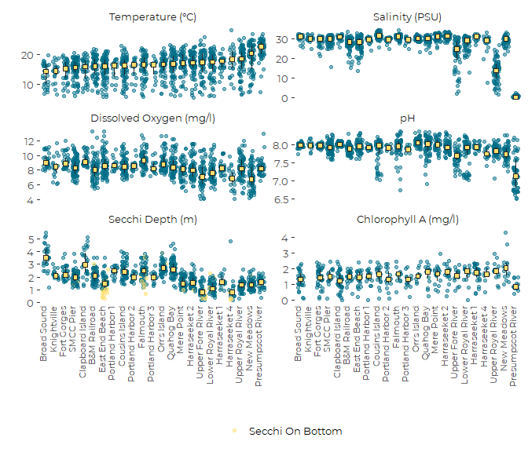

That is very close, but the Y axis for the Chlorophyll values are
misleading, since they are on a transformed scale.

### Fixing the Chlorophyll Y Axis

A little Googling suggests there is no easy way to adjust the Y axis
limits independently in a facet display. For example, see
[here:](https://stackoverflow.com/questions/11585954/varying-axis-labels-formatter-per-facet-in-ggplot-r)
for a partial explanation and a work around.

However, it **is** possible to define axis breaks and labels using a
function.  
That allows us to create a function that will create appropriate scales
if we can construct a function that provides different values depending
on which sub-plot we are in. The challenge here is that “facet” does not
“know” which subplot we are in.

We need to figure out which plot we are in based on the data passed to
the breaks and label functions. we can do that if the plot or plots we
want to alter have distinctive y axis limits, as they do here.

The help file for `scale_y_continuous()` provides the option of setting
the \`breaks parameter to:

> A function that takes the limits as input and returns breaks as output
> (e.g., a function returned by scales::extended\_breaks())

Since we do not set the axis limits manually, we don’t know what the
axis limits are. Luckily, in our use case, we DO know that the upper
axis limit for the (transformed) chlorophyll data is lower than any of
the others. Eyeballing the draft graphic, it looks like the upper limit
is around 5, while the next lowest maximum figure is well over 5.

A similar problem (and solution) faces setting the labels for the
breaks. but here, since we will have SET the breaks, we can look to see
if we have our specific breaks, and if so, set the labels appropriately.
It’s slightly trickier than that, but that is the basic concept.

#### See also

`scales::breaks_extended()` `scales::breaks_log()`

#### What labels do we want?

The inverse of the `y = log(chl + 1)` transform is z = exp(x)-1. We have
two choices for how to handle the labels. We can stick with evenly
spaced divisions, and provide “correct” labels, or we an identify
“clean” labels, and place our tick marks at those values. so the labels
we want

##### Evenly Spaced Tick Marks

``` r
round(exp(seq(0, 5, 1)) + 1, 1)
#> [1]   2.0   3.7   8.4  21.1  55.6 149.4
```

Those are fairly unpleasant. The alternative is to work things the other
way, and start with “clean” breaks, and work backwards.

##### “Clean” Tick Values

``` r
a <- c(0, 2.5, 10 , 25 ,100)
log(a +1)
#> [1] 0.000000 1.252763 2.397895 3.258097 4.615121
```

#### Create Functions

``` r
prefered_breaks =  c(0, 1, 2.5, 5, 10, 25)

my_breaks_fxn <- function(lims) {
  #browser()
  if(max(lims) < 5.1) {
    # Then we're looking at our transformed Chl data
  a <- prefered_breaks
    return(log(a +1))
  }
  else {
    return(labeling::extended(lims[[1]], lims[[2]], 5))
  }
}

# We are cheating a bit here by plotting transformed data, but providing 
# labels that are back transformed.  That work is conducted by the 
# labeling function.
my_label_fxn <- function(brks) {
  #browser()
  # frequently, brks is passed with NA in place of one or more 
  # of the candidate brks, even after I pass a vector of breaks.
  # In particular, "pretty" breaks outside the range of the data
  # are dropped and replaced with NA.
  a <- prefered_breaks
  b <- round(log(a+1), 3)
  real_breaks = round(brks[! is.na(brks)], 3)
  if (all(real_breaks %in% b)) {
    # then we have our transformed Chl data
    return(a)
  }
  else {
    return(brks)
  }
}
```

## Revised Jitter Plot

``` r
p <- ggplot(data_sel, aes(x = station_name, y = value)) +
  geom_jitter(aes(color = bottom_flag), width = 0.3, height = 0, 
              alpha = 0.15) +
  stat_summary(fun.data = function(.x) median_hilow(.x, conf.int = .5),
               fill = cbep_colors()[3], color = "black",
               size = .4, shape = 22) +
  xlab('') +
  ylab('') +
  
  scale_color_manual(values = cbep_colors()[c(1,4)], 
                     name = '', breaks = 'TRUE', label = 'Secchi On Bottom') +
  scale_y_continuous (breaks = my_breaks_fxn, labels = my_label_fxn) +
  
  theme_cbep(base_size = 12) +
  theme(axis.text.x = element_text(angle = 90,
                                   size = 8,
                                   hjust = 1,
                                   vjust = 0),
        axis.ticks.length.x = unit(0, 'cm')) +
  theme(legend.position = 'bottom') +
  
  guides(color = guide_legend(override.aes = list(size = 3, alpha = 0.5) ) ) +
  
  facet_wrap(~Parameter, nrow = 3,
             scale = 'free_y',
             labeller = labeller(Parameter = labs))
p
```

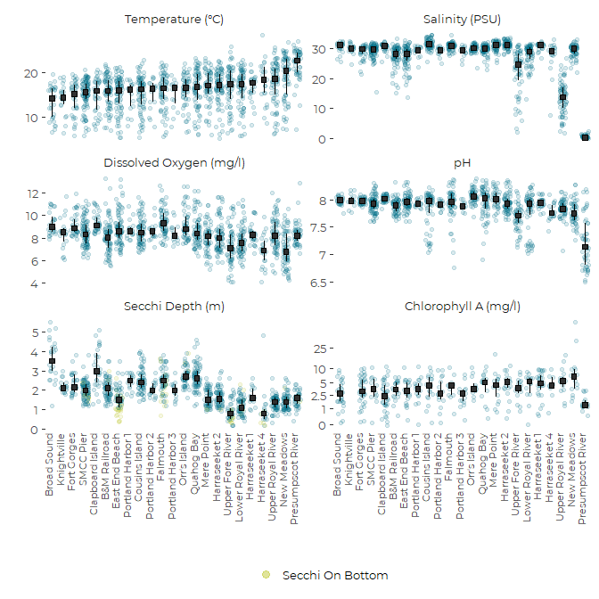

``` r
 ggsave('figures/surface_6_jitter_alt.pdf', device = cairo_pdf, 
        width = 7, height = 6)
```

## Violin Chart

``` r
p <- ggplot(data_sel, aes(station_name, value)) +
  geom_violin(width = 2, scale = "count", fill = cbep_colors()[6]) +
  stat_summary(fun.data = function(.x) median_hilow(.x, conf.int = .5),
               fill = cbep_colors()[2], color = "gray15",
               size = .4, shape = 22) +
  scale_y_continuous (breaks = my_breaks_fxn, labels = my_label_fxn) +
  xlab('') +
  ylab('') +
  theme_cbep(base_size = 12) +
  theme(axis.text.x = element_text(angle = 90,
                                   size = 8,
                                   hjust = 1,
                                   vjust = 0.25),
        axis.ticks.length.x = unit(0, 'cm')) +
  facet_wrap(~Parameter, nrow = 3,
               scale = 'free_y',
               labeller = labeller(Parameter = labs))
p
#> Warning: position_dodge requires non-overlapping x intervals

#> Warning: position_dodge requires non-overlapping x intervals

#> Warning: position_dodge requires non-overlapping x intervals

#> Warning: position_dodge requires non-overlapping x intervals

#> Warning: position_dodge requires non-overlapping x intervals

#> Warning: position_dodge requires non-overlapping x intervals
```

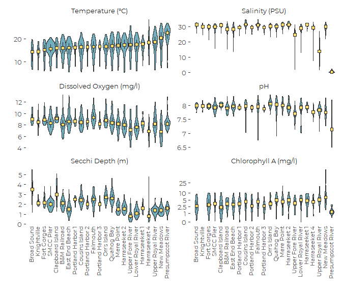

``` r
ggsave('figures/surface_6_violin.pdf', device = cairo_pdf,
       width = 7, height = 6)
#> Warning: position_dodge requires non-overlapping x intervals

#> Warning: position_dodge requires non-overlapping x intervals

#> Warning: position_dodge requires non-overlapping x intervals

#> Warning: position_dodge requires non-overlapping x intervals

#> Warning: position_dodge requires non-overlapping x intervals

#> Warning: position_dodge requires non-overlapping x intervals
```

## Bar Chart

Here the situation is a bit easier, as we do not have to plot the
extreme outliers, and only show medians and the interquartile range.

``` r
p <- ggplot(data_sel, aes(x = station_name, y = value)) +
    stat_summary(fun = median, na.rm = TRUE,
                 geom = 'col', width = 1,
                 fill = cbep_colors()[1],
                 color = cbep_colors()[3]) +
    stat_summary(fun.data = function(.x) median_hilow(.x, conf.int= 0.5), 
                 geom = 'linerange', 
                 color = cbep_colors()[2]) + 
  
    scale_y_continuous (breaks = my_breaks_fxn, labels = my_label_fxn) +
    xlab('') +
    ylab('') +
   
    theme_cbep(base_size = 12) +
    theme(axis.text.x = element_text(angle = 90,
                                     size = 8,
                                     hjust = 1,
                                     vjust = 0.25),
          axis.ticks.length.x = unit(0, 'cm')) + facet_wrap(~Parameter, 
               scale = 'free_y',
               labeller = labeller(Parameter = labs)) +
  facet_wrap(~Parameter, nrow = 3,
               scale = 'free_y',
               labeller = labeller(Parameter = labs))
p
```

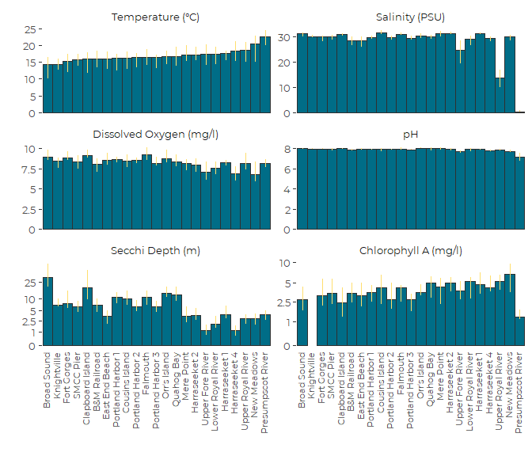

``` r
ggsave('figures/surface_6_bar.pdf', device = cairo_pdf, width = 7, height = 6)
```

The revised Bar chart is ALMOST right, but it suffers because the bar
chart automatically includes the value zero at the base of each scale.
There is no good way to convenient override that behavior in facet
graphics.  
A bar chart that includes the value zero works for all the metrics
except pH, where a pH of zero makes little sense, and the small changes
between pH of 7.8 and 8. vanish if zero is included on the scale.

(The default graphic logic here is good: the area or height of the bar
is misleading if the value is not a true ratio value, where the value
zero has meaning. It suggests we should consider alternate graphic
forms.

# Alternates to the Facet Bar Chart

The primary alternative is to construct a grid layout. It’s not clear
how to do that and not repeat the Station names for every plot….

s a poor man’s alternative, we generate final versions of all six bar
charts, with appropriate limits and scales.

## Revised Bar Chart Function

The primary change here is addition of the breaks and labeling functions
and movement of the labels to the chart title from the y axis.

``` r
bar_plot_2 <- function(.data, .label, .units, .min = NA, .max = NA) {
  # Units and Labels
  labs = paste0(.label, if_else((! is.na(.units) & ! nchar(.units) == 0),
                                       paste0(' (', .units, ')'), ''))
  
 # Data preparation
  dat <- .data 
  # the station data still holds all possible levels.
  # Levels ordered by mean temp, as created above.
  all_stations <-  tibble(station = factor(levels(dat$station),
                                           levels = levels(dat$station)),
                          station_name = factor(levels(dat$station_name),
                                                levels = levels(dat$station_name)))
  
  dat <- dat %>%
    select(-station_name)
  
  dat <- all_stations %>%
    left_join(dat, by = 'station')
  
  p <- ggplot(dat, aes(x = station_name, y = value)) +
    stat_summary(fun = median, na.rm = TRUE,
                 geom = 'col', width = 1,
                 fill = cbep_colors()[1],
                 color = cbep_colors()[3]) +
    stat_summary(fun.data = function(.x) median_hilow(.x, conf.int= 0.5), 
                 geom = 'linerange', 
                 color = cbep_colors()[4]) +  
    
    scale_y_continuous (breaks = my_breaks_fxn, labels = my_label_fxn) +
    
    xlab('') +
    ylab('') +
    ggtitle(labs) +
    theme_cbep(base_size = 12) +
    theme(axis.text.x = element_text(angle = 90,
                                     size = 8,
                                     hjust = 1,
                                     vjust = 0.25),
          axis.ticks.length.x = unit(0, 'cm'))
  
  
  if(! is.na(.min) | ! is.na(.max)) {
      p <- p + coord_cartesian(ylim = c(.min, .max))
    }
  return(p)
}
```

## Automating Limits

``` r
my_lims <- tribble( ~parameter, ~minim, ~maxim,
                   "secchi_2",     NA, NA,
                   "temperature",   10, NA,
                   "salinity",      10, NA,
                   "do" ,           5, NA,
                   "pctsat",         50, NA,  
                   "pH",            6.5, NA,       
                   "chl",           0,NA,
                   "chl_log1p",     0, NA)
```

## All Bar Plots

``` r
for (p in c('temperature', 'salinity', 'do', 
            'pH', 'secchi_2', 'chl_log1p')) {
  sel <- nested_data %>%
    filter(parameter == p)
  dat <- sel$data[[1]]
  label = sel$label[[1]]
  unit = sel$units[[1]]

  the_min <- my_lims %>%
    filter(parameter == p) %>%
    pull(minim)
  the_max <- my_lims %>%
    filter(parameter == p) %>%
    pull(maxim)
  
 print(bar_plot_2(dat, label, unit, the_min, the_max))
 fn <- paste0('bar_chart_', p, '.pdf')
 ggsave(file.path('figures',fn), device = cairo_pdf, width = 3.5, height = 3.5)
}
```

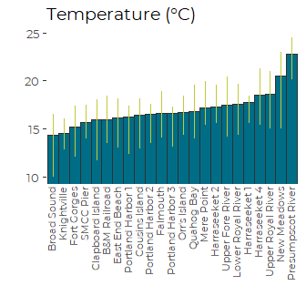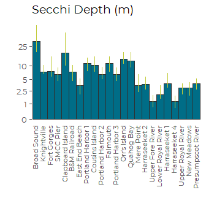

    #> Warning: Removed 1 rows containing non-finite values (stat_summary).

    #> Warning: Removed 1 rows containing non-finite values (stat_summary).

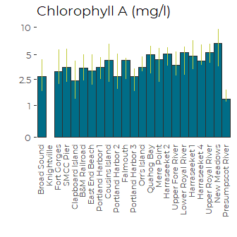
While those plots look similar, the width of the core plot is not
identical, as plot size is adjusted to accommodate the width of the axis
labels and titles. That means we can not just line up plots and have the
bars line up vertically over the Station Names.

Apparently the `egg`, `cowplot` and `patchwork` packages all have this
capability.

# Temperature / DO Graph

``` r
p <- ggplot(recent_data, aes(temperature, do)) +
  geom_point(color = cbep_colors()[5]) +
  #geom_smooth(method = 'lm', formula = y~poly(x,3), se = FALSE) +
  xlab(paste0("Temperature (", "\U00B0", "C)")) +
  ylab('Dissolved Oxygen (mg/l)') +
  theme_cbep(base_size = 12)
p
#> Warning: Removed 19 rows containing missing values (geom_point).
```

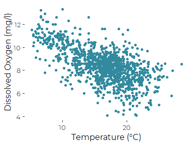

``` r
ggsave('figures/do_temp.pdf', device = cairo_pdf, width = 4, height = 3)
#> Warning: Removed 19 rows containing missing values (geom_point).
```
