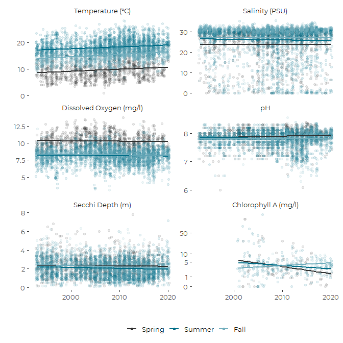
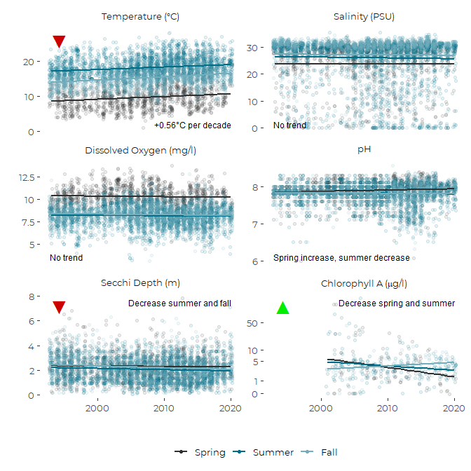
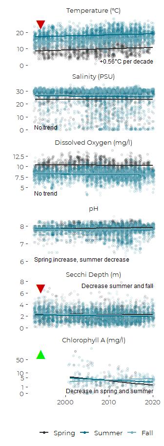
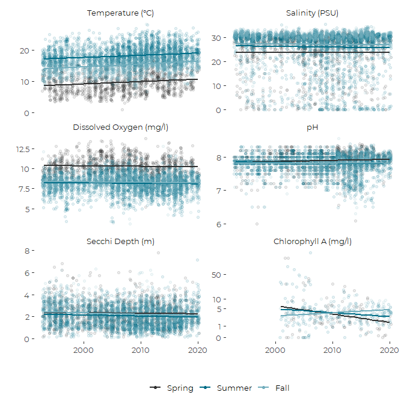
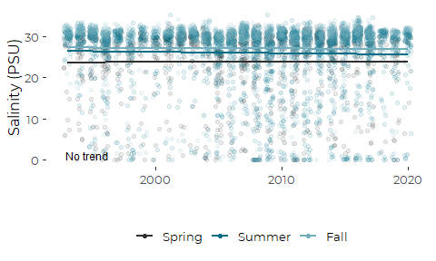
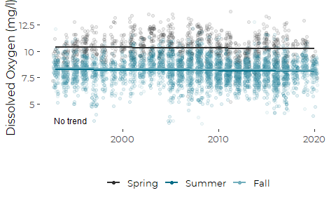
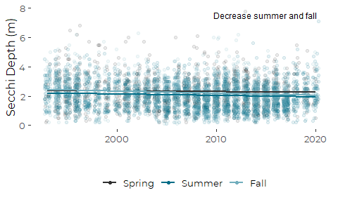

Graphics Showing Seasonal Water Quality Trends from Friends of Casco Bay
Data
================
Curtis C. Bohlen, Casco Bay Estuary Partnership
3/25/2021

-   [Introduction](#introduction)
-   [Load Libraries](#load-libraries)
-   [Part 1: Load and Organize Data](#part-1-load-and-organize-data)
    -   [Establish Folder Reference](#establish-folder-reference)
    -   [Primary Data](#primary-data)
        -   [Remove 2020 only data](#remove-2020-only-data)
        -   [Add Seasonal Factor](#add-seasonal-factor)
        -   [Address Secchi Censored
            Values](#address-secchi-censored-values)
        -   [Limit Chlorophyll to Three Long-Term
            Stations](#limit-chlorophyll-to-three-long-term-stations)
        -   [Select Parameters](#select-parameters)
    -   [Create Trend Data](#create-trend-data)
    -   [Construct Nested Tibble](#construct-nested-tibble)
-   [Part 2: Modeling](#part-2-modeling)
    -   [Models](#models)
        -   [ANOVAs](#anovas)
        -   [Compare Slopes](#compare-slopes)
    -   [Deriving Annotations from general
        results.](#deriving-annotations-from-general-results.)
    -   [Marginal Means](#marginal-means)
        -   [Limit Forecasts Chlorophyll](#limit-forecasts-chlorophyll)
-   [Part 3: Graphics](#part-3-graphics)
    -   [Facet Graphics](#facet-graphics)
        -   [Data Set up](#data-set-up)
        -   [New Facet Labels](#new-facet-labels)
        -   [Draft Graphic](#draft-graphic)
        -   [Fixing the Chlorophyll Y
            Axis](#fixing-the-chlorophyll-y-axis)
    -   [Assembling the Final Graphic](#assembling-the-final-graphic)
        -   [Base Graphic](#base-graphic)
        -   [Add Annotations](#add-annotations)
        -   [Add Symbols](#add-symbols)
        -   [Final Products](#final-products)
    -   [Separate Graphics](#separate-graphics)


# Introduction

This Notebook analyzes FOCB’s “Surface” data. These data are pulled from
long term monitoring locations around the Bay.

These are sites visited regularly by FOCB staff, either by boat or on
land. The focus is on warm season sampling (April through October), with
roughly monthly samples. Earlier data from some land-based sites was
collected by volunteers.

This notebook builds on other analyses, which looked for overall trends
and “seasonal” trends in water quality. Here we develop possible
graphics to present results of those analyses.

We produce an a three point factor for for Spring, Summer, and Fall,
based on the month of sampling, so we can show seasonal as well as
overall trends.

# Load Libraries

``` r
library(tidyverse)
#> -- Attaching packages --------------------------------------- tidyverse 1.3.0 --
#> v ggplot2 3.3.3     v purrr   0.3.4
#> v tibble  3.0.5     v dplyr   1.0.3
#> v tidyr   1.1.2     v stringr 1.4.0
#> v readr   1.4.0     v forcats 0.5.0
#> -- Conflicts ------------------------------------------ tidyverse_conflicts() --
#> x dplyr::filter() masks stats::filter()
#> x dplyr::lag()    masks stats::lag()
library(readxl)

library(mgcv)     # For `gam()` models, used here for hierarchical models
#> Loading required package: nlme
#> 
#> Attaching package: 'nlme'
#> The following object is masked from 'package:dplyr':
#> 
#>     collapse
#> This is mgcv 1.8-33. For overview type 'help("mgcv-package")'.
library(emmeans)

library(ggpmisc)  # Allows absolute positioning of annotations and text
#> Warning: package 'ggpmisc' was built under R version 4.0.4
#> 
#> Attaching package: 'ggpmisc'
#> The following object is masked from 'package:ggplot2':
#> 
#>     annotate

library(CBEPgraphics)
load_cbep_fonts()
theme_set(theme_cbep())
```

# Part 1: Load and Organize Data

## Establish Folder Reference

``` r
sibfldnm <- 'Original_Data'
parent   <- dirname(getwd())
sibling  <- file.path(parent,sibfldnm)

dir.create(file.path(getwd(), 'figures'), showWarnings = FALSE)
```

## Primary Data

We specify column names because FOCB data has a row of names, a row of
units, then the data. This approach is simpler than reading names from
the first row and correcting them to be R syntactic names.

``` r
fn    <- 'FOCB Surface All Current Sites With BSV Data.xlsx'
fpath <- file.path(sibling,fn)

mynames <- c('station', 'dt', 'time', 'sample_depth',
             'secchi', 'water_depth','temperature', 'salinity',
             'do', 'pctsat', 'pH', 'chl', 
             'month', 'year', 'fdom', 'bga', 
             'turbidity', 'blank', 'clouds', 'wndspd',
             'winddir'
             ) 

the_data <- read_excel(fpath, skip=2, col_names = mynames) %>%
  mutate(month = factor(month, levels = 1:12, labels = month.abb)) %>%
  relocate(month, year, .after = dt)

rm(mynames)
```

### Remove 2020 only data

``` r
the_data <- the_data %>%
select(-c(fdom:winddir))
```

### Add Seasonal Factor

``` r
the_data <- the_data %>%
  mutate(season_3 =  fct_collapse(month, 
                                 Spring = c('Apr', 'May'), 
                                 Summer = c('Jun','Jul', 'Aug'),
                                 Fall   =  c('Sep', 'Oct'))) %>%
  relocate(season_3, .after = month)
```

### Address Secchi Censored Values

``` r
the_data <- the_data %>%
  mutate(secchi_2 = if_else(secchi == "BSV", water_depth, as.numeric(secchi)),
         bottom_flag = secchi == "BSV") %>%
  relocate(secchi_2, .after = secchi) %>%
  relocate(bottom_flag, .after = year)
#> Warning: Problem with `mutate()` input `secchi_2`.
#> i NAs introduced by coercion
#> i Input `secchi_2` is `if_else(secchi == "BSV", water_depth, as.numeric(secchi))`.
```

### Limit Chlorophyll to Three Long-Term Stations

``` r
the_data <- the_data %>%
  mutate(chl = if_else(station %in% c('P5BSD', 'P6FGG', 'P7CBI'),
                                   chl, NA_real_)) %>%
  mutate(chl_log1p = log1p(chl))
```

### Select Parameters

We will plot six parameters, omitting percent saturation, and plotting
chlorophyll on a transformed y axis.

``` r
the_data <- the_data %>%
  select(-chl, -pctsat)
```

## Create Trend Data

First, we create a tibble containing information on years in which each
station was sampled.

``` r
years_data <- the_data %>%
  group_by(station, year) %>%
  summarize(yes = ! all(is.na(temperature)),
            .groups = 'drop_last') %>%
  summarize(years = sum(yes, na.rm = TRUE),
            recent_years =  sum(yes & year > 2014, na.rm = TRUE),
            .groups = 'drop')
```

Then we identify stations with at least 10 years of data, and at least
three years of data from the last five years, and use that list to
select data for trend analysis. Finally, we adjust the levels in the
`station` and `station_name` variables.

``` r
selected_stations <- years_data %>%
  filter(years> 9, recent_years >2) %>%
  pull(station)

trend_data <- the_data %>%
  filter(station %in% selected_stations) %>%
  mutate(station = fct_drop(station)) %>%
  mutate(station = fct_reorder(station, temperature, mean, na.rm = TRUE)) 
rm(selected_stations, years_data)
rm(the_data)
```

``` r
length(unique(trend_data$station))
#> [1] 17
```

We are reduced to only 17 stations with long-term records for trend
analysis. We noted above that we have limited chlorophyll data before
the last couple of years. We address that momentarily

## Construct Nested Tibble

``` r
units <- tibble(parm = c('temperature', 'salinity', 'do', 
                          'pH', 'secchi_2', 'chl_log1p'),
                label = c("Temperature","Salinity", "Dissolved Oxygen",
                         "pH", "Secchi Depth", "Chlorophyll A"),
                units = c(paste0("\U00B0", "C"),'PSU', 'mg/l','','m',
                          'mg/l'))

nested_data <- trend_data %>%
  select(-dt, -time, -sample_depth, 
         -secchi) %>%
  relocate(water_depth, .after = month) %>%
  pivot_longer(c(secchi_2:chl_log1p), 
               names_to = 'parm', 
               values_to = 'value') %>%
  mutate(bottom_flag = if_else(parm=='secchi_2', bottom_flag, FALSE)) %>%
  filter(! is.na(value)) %>%

  group_by(parm) %>%
  nest() %>%
  left_join(units, by = 'parm') %>%
   mutate(parm = factor(parm,
                       levels = c('temperature', 'salinity', 'do', 
                                  'pH', 'secchi_2', 'chl_log1p')))
```

# Part 2: Modeling

We treat stations as random exemplars of possible stations, and thus
rely on hierarchical models. We use a GAM model with a random factor
smoothing term. We restrict ourselves to linear trends by year.

The seasonal models were motivated by two dimensional tensor smooth GAM
models developed in “Surface\_Analysis\_Trends.Rmd”. We look at other
interaction models in “Surface\_Seasonal\_Trends.Rmd”

## Models

``` r
nested_data <- nested_data %>%
  mutate(lmer_s = map(data, function(df) gam(value ~ year * season_3 + 
                                              s(station, bs = 're'), 
                                            data = df)))
names(nested_data$lmer_s) <- nested_data$parm
```

### ANOVAs

``` r
nested_data <- nested_data %>%
  mutate(anova_3 = map(lmer_s, function(mod) anova(mod)))
names(nested_data$anova_3) <- nested_data$parm

nested_data$anova_3
#> $secchi_2
#> 
#> Family: gaussian 
#> Link function: identity 
#> 
#> Formula:
#> value ~ year * season_3 + s(station, bs = "re")
#> 
#> Parametric Terms:
#>               df     F p-value
#> year           1 2.488  0.1148
#> season_3       2 4.297  0.0137
#> year:season_3  2 4.321  0.0133
#> 
#> Approximate significance of smooth terms:
#>              edf Ref.df     F p-value
#> s(station) 15.96  16.00 419.4  <2e-16
#> 
#> $temperature
#> 
#> Family: gaussian 
#> Link function: identity 
#> 
#> Formula:
#> value ~ year * season_3 + s(station, bs = "re")
#> 
#> Parametric Terms:
#>               df      F  p-value
#> year           1 56.013 8.31e-14
#> season_3       2  3.211   0.0404
#> year:season_3  2  2.878   0.0563
#> 
#> Approximate significance of smooth terms:
#>              edf Ref.df     F p-value
#> s(station) 15.84  16.00 103.4  <2e-16
#> 
#> $salinity
#> 
#> Family: gaussian 
#> Link function: identity 
#> 
#> Formula:
#> value ~ year * season_3 + s(station, bs = "re")
#> 
#> Parametric Terms:
#>               df     F p-value
#> year           1 0.049   0.826
#> season_3       2 1.988   0.137
#> year:season_3  2 1.898   0.150
#> 
#> Approximate significance of smooth terms:
#>              edf Ref.df    F p-value
#> s(station) 15.99  16.00 1042  <2e-16
#> 
#> $do
#> 
#> Family: gaussian 
#> Link function: identity 
#> 
#> Formula:
#> value ~ year * season_3 + s(station, bs = "re")
#> 
#> Parametric Terms:
#>               df     F p-value
#> year           1 2.849  0.0915
#> season_3       2 0.136  0.8730
#> year:season_3  2 0.072  0.9302
#> 
#> Approximate significance of smooth terms:
#>              edf Ref.df     F p-value
#> s(station) 15.85  16.00 135.7  <2e-16
#> 
#> $pH
#> 
#> Family: gaussian 
#> Link function: identity 
#> 
#> Formula:
#> value ~ year * season_3 + s(station, bs = "re")
#> 
#> Parametric Terms:
#>               df     F  p-value
#> year           1 12.21  0.00048
#> season_3       2 11.77 7.93e-06
#> year:season_3  2 11.91 6.92e-06
#> 
#> Approximate significance of smooth terms:
#>             edf Ref.df     F p-value
#> s(station) 15.9   16.0 149.7  <2e-16
#> 
#> $chl_log1p
#> 
#> Family: gaussian 
#> Link function: identity 
#> 
#> Formula:
#> value ~ year * season_3 + s(station, bs = "re")
#> 
#> Parametric Terms:
#>               df      F  p-value
#> year           1 12.416 0.000473
#> season_3       2  7.355 0.000726
#> year:season_3  2  7.364 0.000720
#> 
#> Approximate significance of smooth terms:
#>                  edf    Ref.df F p-value
#> s(station) 1.484e-08 2.000e+00 0     0.4
```

-   Temperatures shows a significant trend and also a significant
    interaction (a surprise!).  
-   Salinity shows no significant trends or interactions.  
-   DO shows no significant trends or interactions.  
-   Secchi shows no overall trend, but significant differences in
    seasonal trends.  
-   pH shows significant trend, with interactions.  
-   Chloride shows significant trend, with interactions.

### Compare Slopes

Here, we pull the slopes from both models to guide preparation of
annotation for the graphics….

We want to look to see if separate slopes are significantly different
from zero. That allows us to create appropriate annotations for the
different plots. But note that this “slope” for the chlorophyll model is
still on transformed y values (not `type =`response\`).

``` r
nested_data <- nested_data %>%
  mutate(s_one_slope = map(lmer_s,
                      function(mod) summary(emtrends(mod, 
                                                     ~ 1, 
                                                     var = "year")))) %>%
  mutate(s_three_slopes = map(lmer_s,
                      function(mod) summary(emtrends(mod, 
                                                     ~ season_3, 
                                                     var = "year"))))
names(nested_data$s_one_slope) <- nested_data$parm
names(nested_data$s_three_slopes) <- nested_data$parm
```

``` r
for ( p in nested_data$parm) {
  row <- nested_data[nested_data$parm == p,]
  cat('\n\n',p,'\n')
  print(row$s_one_slope[[1]])
  print(row$s_three_slopes[[1]])
}
#> 
#> 
#>  secchi_2 
#>  1       year.trend      SE   df lower.CL upper.CL
#>  overall   -0.00939 0.00132 5152   -0.012  -0.0068
#> 
#> Results are averaged over the levels of: season_3, station 
#> Confidence level used: 0.95 
#>  season_3 year.trend      SE   df lower.CL upper.CL
#>  Spring     -0.00417 0.00264 5152 -0.00934  0.00101
#>  Summer     -0.00974 0.00171 5152 -0.01308 -0.00639
#>  Fall       -0.01426 0.00225 5152 -0.01867 -0.00984
#> 
#> Results are averaged over the levels of: station 
#> Confidence level used: 0.95 
#> 
#> 
#>  temperature 
#>  1       year.trend      SE   df lower.CL upper.CL
#>  overall     0.0809 0.00515 5622   0.0707    0.091
#> 
#> Results are averaged over the levels of: season_3, station 
#> Confidence level used: 0.95 
#>  season_3 year.trend      SE   df lower.CL upper.CL
#>  Spring       0.0778 0.01039 5622   0.0574   0.0981
#>  Summer       0.0691 0.00677 5622   0.0559   0.0824
#>  Fall         0.0957 0.00888 5622   0.0782   0.1131
#> 
#> Results are averaged over the levels of: station 
#> Confidence level used: 0.95 
#> 
#> 
#>  salinity 
#>  1       year.trend      SE   df lower.CL upper.CL
#>  overall    -0.0136 0.00768 5567  -0.0287  0.00146
#> 
#> Results are averaged over the levels of: season_3, station 
#> Confidence level used: 0.95 
#>  season_3 year.trend     SE   df lower.CL upper.CL
#>  Spring       0.0034 0.0155 5567  -0.0269   0.0337
#>  Summer      -0.0311 0.0101 5567  -0.0508  -0.0114
#>  Fall        -0.0131 0.0133 5567  -0.0391   0.0129
#> 
#> Results are averaged over the levels of: station 
#> Confidence level used: 0.95 
#> 
#> 
#>  do 
#>  1       year.trend      SE   df lower.CL upper.CL
#>  overall   -0.00631 0.00191 5504  -0.0101 -0.00257
#> 
#> Results are averaged over the levels of: season_3, station 
#> Confidence level used: 0.95 
#>  season_3 year.trend      SE   df lower.CL  upper.CL
#>  Spring     -0.00653 0.00387 5504  -0.0141  0.001054
#>  Summer     -0.00547 0.00250 5504  -0.0104 -0.000557
#>  Fall       -0.00694 0.00328 5504  -0.0134 -0.000513
#> 
#> Results are averaged over the levels of: station 
#> Confidence level used: 0.95 
#> 
#> 
#>  pH 
#>  1       year.trend       SE   df  lower.CL upper.CL
#>  overall   0.000339 0.000487 5069 -0.000615  0.00129
#> 
#> Results are averaged over the levels of: season_3, station 
#> Confidence level used: 0.95 
#>  season_3 year.trend       SE   df lower.CL  upper.CL
#>  Spring     0.003457 0.000989 5069  0.00152  0.005397
#>  Summer    -0.002217 0.000629 5069 -0.00345 -0.000983
#>  Fall      -0.000223 0.000840 5069 -0.00187  0.001424
#> 
#> Results are averaged over the levels of: station 
#> Confidence level used: 0.95 
#> 
#> 
#>  chl_log1p 
#>  1       year.trend      SE  df lower.CL upper.CL
#>  overall    -0.0191 0.00711 418  -0.0331 -0.00513
#> 
#> Results are averaged over the levels of: season_3, station 
#> Confidence level used: 0.95 
#>  season_3 year.trend      SE  df lower.CL upper.CL
#>  Spring      -0.0518 0.01471 418 -0.08077 -0.02293
#>  Summer      -0.0245 0.00919 418 -0.04261 -0.00648
#>  Fall         0.0191 0.01241 418 -0.00531  0.04347
#> 
#> Results are averaged over the levels of: station 
#> Confidence level used: 0.95
```

We also want to identify which seasons have significant slopes. We can
figure that out (approximately) by checking if sign of the upper and
lower 95% confidence intervals are the same or not.

``` r
which_sig <- function(upper, lower) {
  sig_list <- which(sign(upper) == sign(lower))
  c('Spring', 'Summer', 'Fall')[sig_list]
}

nested_data <- nested_data %>%
  mutate(seas_change = map(s_three_slopes,
                      function(df) which_sig(df$upper.CL, df$lower.CL)))
names(nested_data$seas_change) <- nested_data$parm
nested_data$seas_change
#> $secchi_2
#> [1] "Summer" "Fall"  
#> 
#> $temperature
#> [1] "Spring" "Summer" "Fall"  
#> 
#> $salinity
#> [1] "Summer"
#> 
#> $do
#> [1] "Summer" "Fall"  
#> 
#> $pH
#> [1] "Spring" "Summer"
#> 
#> $chl_log1p
#> [1] "Spring" "Summer"
```

## Deriving Annotations from general results.

We want to say the following: \* Temperatures: Highlight overall trend.
Interaction is significant, but small.  
\* “Increasing \~ 0.56 degrees C per decade”  
\* Salinity: ANOVA not significant. Possible weak summer trend.  
\* “No trend”  
\* DO: No significant terms by ANOVA, so don’t want to interpret
marginal means.  
\* “No trend”  
\* pH: Highlight different seasonal patterns that cancel each other
out.  
\* “Spring increase, summer decrease”.  
\* Secchi: Show seasonal data and highlight seasonal trend, with
declining. water quality in summer and fall, but little change in
spring.  
\* “Decrease Summer and Fall”  
\* Chlorophyll: Overall trend, but strong seasonal differences.  
\* “Decrease in spring and summer”

## Marginal Means

These means are all marginal to the identity of the stations. It’s worth
noting that differences in slope that jump out in these graphics often
vanish into relative insignificance when plotted against the source
data. Also, some “statistically significant” differences in seasonal
slopes are pretty small, on pretty small slopes, and thus are probably
not worth interpreting.

Here we use the `emmip()` function, which produces an interaction plot,
but suppress the plots, as we want to add related data to plots of our
own.

``` r
nested_data <- nested_data %>%
  mutate(emmi_3 = map(lmer_s, function(mod) emmip(mod, season_3 ~ year,
                                                         at = list(year = 1993:2020),
                                                         plotit = FALSE)))
```

### Limit Forecasts Chlorophyll

The code we just ran generated “predictions” for chlorophyll for years
in which we actually have no chlorophyll data. We could run `emmip()`
again, but it is also easy to simply select the right rows from the
existing predictions.

``` r
row <- nested_data[nested_data$parm == 'chl_log1p',]
preds <- row$emmi_3[[1]]
preds <- preds %>% filter(year > 2000)

nested_data$emmi_3[nested_data$parm == 'chl_log1p'] <- list(preds)
```

# Part 3: Graphics

## Facet Graphics

We want to generate facet graphics rather than individual graphics. The
facet graphics should mimic the organization of the graphics showing
recent conditions. That means we want to order parameters in the same
way, and use the same `log(x+1)` transformed axis for Chlorophyll.

Facet graphics are built off of data frames with an indicator variable
that assigns data to facets. So this will require rethinking the
organization of data. We need to be able to plot both raw data and
prediction lines. That means we will assemble facet graphics from two
data frames, one of data, and one of predictions.

### Data Set up

``` r
list_df <- nested_data$data
names(list_df) <-  nested_data$parm
data_sel <- bind_rows(list_df, .id = 'parm') %>%
  filter(parm %in% c('temperature', 'salinity', 'do', 
                          'pH', 'secchi_2', 'chl_log1p')) %>%
  mutate(parm = factor(parm,
                            levels = c('temperature', 'salinity', 'do', 
                                       'pH', 'secchi_2', 'chl_log1p')))

list_df <- nested_data$emmi_3
names(list_df) <-  nested_data$parm
predicts_sel <- bind_rows(list_df, .id = 'parm') %>%
  filter(parm %in% c('temperature', 'salinity', 'do', 
                          'pH', 'secchi_2', 'chl_log1p')) %>%
  mutate(parm = factor(parm,
                            levels = c('temperature', 'salinity', 'do', 
                                       'pH', 'secchi_2', 'chl_log1p')))
```

### New Facet Labels

``` r
labs <- paste0(nested_data$label, 
                           if_else((! is.na(nested_data$units) & 
                                      ! nchar(nested_data$units) == 0),
                                       paste0(' (', nested_data$units, ')'), ''))
names(labs) <- nested_data$parm
cbind(labs)
#>             labs                     
#> secchi_2    "Secchi Depth (m)"       
#> temperature "Temperature (°C)"       
#> salinity    "Salinity (PSU)"         
#> do          "Dissolved Oxygen (mg/l)"
#> pH          "pH"                     
#> chl_log1p   "Chlorophyll A (mg/l)"
```

### Draft Graphic

``` r
p <- ggplot(data_sel, aes(x = year, y = value)) +
    geom_jitter(aes(color = season_3), width = 0.3, height = 0, 
                alpha = 0.1) +
   geom_line(data = predicts_sel, 
             mapping = aes(x = year, y = yvar, color = tvar),
             size = 1) +
    xlab('') +
    ylab('') +

    scale_color_manual(values = cbep_colors2()[c(1,2,4)],
                       name = '',
                guide = guide_legend(override.aes = list(alpha = 1))) +
  
    theme_cbep(base_size = 12) +
    # theme(axis.text.x = element_text(angle = 90,
    #                                  size = 8,
    #                                  hjust = 1,
    #                                  vjust = 0),
    #       axis.ticks.length.x = unit(0, 'cm')) +
  
  theme(legend.position = 'bottom') +
  guides(color = guide_legend(override.aes = list(size = 3, alpha = 0.5) ) ) +
  
  facet_wrap(~parm, nrow = 3,
               scale = 'free_y',
               labeller = labeller(parm = labs))
p
```


### Fixing the Chlorophyll Y Axis

The Chlorophyll values we model and plot are actually a transformation
of the  
craw chlorophyll observations. As such, the values plotted are
meaningless to potential readers. We need to provide a axis that
indicates the non-linearity of the Y axis.

A little Googling suggests there is no easy way to adjust the Y axis
independently in a facet display. For example, see
[here:](https://stackoverflow.com/questions/11585954/varying-axis-labels-formatter-per-facet-in-ggplot-r)
for a partial explanation and a work around.

However, it **is** possible to define axis breaks and labels using
functions.  
We can create a function to produce appropriate breaks and another to
provide labels for the Chlorophyll plot, if only we can construct a
function that provides different values depending on the sub-plot we are
in.

The help file for `scale_y_continuous()` provides the option of setting
the \`breaks parameter to:

> A function that takes the limits as input and returns breaks as output
> (e.g., a function returned by scales::extended\_breaks())

The challenge here is that “facet” does not “know” which subplot we are
in, and we want to change the breaks and labels from the defaults only
for the chlorophyll plot.

We might be able to tell which sub-plot we are in by looking at the axis
limits, which are passed as the argument to the `breaks` function.

Since we do not set the axis limits manually, we don’t know what the
axis limits are in general, but we can make good guesses based on the
draft graphic.

Luckily, in our use case, the upper axis limit for the (transformed)
chlorophyll data is lower than any of the others. Eyeballing the draft
graphic, it looks like the upper limit is around 5, while the next
lowest maximum figure is well over 5.

A similar problem (and solution) faces setting the labels for the
breaks. but here, since we will have SET the breaks, we can look to see
if we have those specific breaks, and if so, set the labels
appropriately. It’s slightly trickier than that, but that is the basic
concept.

#### Create Breaks Function

``` r
preferred_breaks =  c(0, 1,  5, 10, 50)

my_breaks_fxn <- function(lims) {
  #browser()
  if(max(lims) < 6) {
    # Then we're looking at our transformed Chl data
  a <- preferred_breaks
    return(log(a +1))
  }
  else {
    # Return the default breaks, by calling the default breaks fxn
    return(labeling::extended(lims[[1]], lims[[2]], 5))
  }
}
```

#### Create Label Function

We are cheating a bit here by plotting transformed data, but providing
**labels** that are back transformed. That work is conducted by the
labeling function.

``` r
my_label_fxn <- function(brks) {
  # frequently, brks contians NA in place of one or more 
  # of the candidate brks, even after we pass a vector of specific breaks.
  # In particular, "pretty" breaks outside the range of the data
  # are dropped and replaced with NA.
  a <- preferred_breaks
  b <- round(log(a+1), 3)
  real_breaks = round(brks[! is.na(brks)], 3)
  if (all(real_breaks %in% b)) {
    # then we have our transformed Chl data
    return(a)
  }
  else {
    return(brks)
  }
}
```

## Assembling the Final Graphic

### Base Graphic

``` r
p_jit <- ggplot(data_sel, aes(x = year, y = value)) +
    geom_jitter(aes(color = season_3), width = 0.3, height = 0, 
                alpha = 0.1) +
   geom_line(data = predicts_sel, 
             mapping = aes(x = year, y = yvar, color = tvar),
             size = 1) +
    xlab('') +
    ylab('') +

    scale_color_manual(values = cbep_colors2()[c(1,2,4)],
                       name = '',
                guide = guide_legend(override.aes = list(alpha = 1))) +
  
    scale_y_continuous (breaks = my_breaks_fxn, labels = my_label_fxn) +
  
    theme_cbep(base_size = 12) +
    # theme(axis.text.x = element_text(angle = 90,
    #                                  size = 8,
    #                                  hjust = 1,
    #                                  vjust = 0),
    #       axis.ticks.length.x = unit(0, 'cm')) +
  
  theme(legend.position = 'bottom')
```

``` r
p_jit +
  facet_wrap(~parm, nrow = 3,
               scale = 'free_y',
               labeller = labeller(parm = labs))
```



### Add Annotations

#### A note on Terminology

Use of “Decrease” and “Increase” are consistent, but potentially
confusing. We want to add signals for “improving” or “worsening”
conditions, which sometimes correspond to increasing and sometimes
decreasing values. We do that, below, with graphical icons.

#### Define Annotations

``` r
annotations <- c(paste0(" +0.56","\U00B0", "C per decade"),
                 "No trend",
                 "No trend",
                 "Spring increase, summer decrease",
                 "Decrease summer and fall",
                 "Decrease in spring and summer")
nested_data$annot <- annotations
nested_data$annot
#> [1] " +0.56°C per decade"              "No trend"                        
#> [3] "No trend"                         "Spring increase, summer decrease"
#> [5] "Decrease summer and fall"         "Decrease in spring and summer"
```

#### Annotation Placement

Most annotations can go in upper right corner. We start with that, then
modify as needed.

``` r
ann_xloc <- rep('left', length(nested_data$parm))
ann_yloc <- rep('bottom', length(nested_data$parm))

ann_xloc[1] <- 'right'  # temperature
ann_xloc[5] <- 'right'    # Secchi
ann_yloc[5] <- 'top'    # Secchi
ann_xloc[6] <- 'right'  # Chlorophyll

annot <- tibble(parm = factor(levels(nested_data$parm), 
                              levels = levels(nested_data$parm)),
                annot = annotations, 
                ann_xloc = ann_xloc, ann_yloc = ann_yloc)
```

``` r
p_jit +
  facet_wrap(~parm, nrow = 3,
               scale = 'free_y',
               labeller = labeller(parm = labs)) +
  geom_text_npc(data = annot, 
            mapping = aes(npcx = ann_xloc, npcy = ann_yloc, label = annot),
            hjust = 'inward',
            size = 3.25)
```


``` r
ggsave('figures/wq_trends_six_wide_no_symb.pdf',
       device = cairo_pdf, width = 7, height = 7)
```

### Add Symbols

In the upper left, we want to offer symbols to signal improving or
worsening .conditions. Here we search for some suitable unicode glyphs.

Could use “troubling” and “hopeful” to describe trends…

``` r
symbols = 
c('worse',
  'steady',
  'steady',
  'steady',
  'worse',
  'better')

myglyphs <- factor(c('\U25bc', '','\U25b2'),
                   levels = c('\U25bc', '\U25ac','\U25b2'))
mycolors = c('red4', 'gray', 'green2')


syms <- tibble(parm = factor(levels(nested_data$parm), 
                              levels = levels(nested_data$parm))) %>%
  mutate(symbol =  factor(symbols, levels = c('worse', 'steady', 'better')),
         icons  =   myglyphs[as.numeric(symbol)],
         cols = mycolors[as.numeric(symbol)])
syms
#> # A tibble: 6 x 4
#>   parm        symbol icons cols  
#>   <fct>       <fct>  <fct> <chr> 
#> 1 temperature worse  <U+25BC>     red4  
#> 2 salinity    steady <NA>  gray  
#> 3 do          steady <NA>  gray  
#> 4 pH          steady <NA>  gray  
#> 5 secchi_2    worse  <U+25BC>     red4  
#> 6 chl_log1p   better <U+25B2>     green2
```

### Final Products

``` r
p_jit +
  facet_wrap(~parm, nrow = 3,
               scale = 'free_y',
               labeller = labeller(parm = labs)) +
  geom_text_npc(data = annot, 
            mapping = aes(npcx = ann_xloc, npcy = ann_yloc, label = annot),
            hjust = 'inward',
            size = 3.25) +

  geom_text_npc(data = syms, mapping = aes(label = icons),
                npcx = 'left', npcy = 'top', size = 7, 
                color = c('red3', 'grey', 'grey', 'grey', 'red3', 'green2'))
#> Warning: Removed 3 rows containing missing values (geom_text_npc).
```



``` r

ggsave('figures/wq_trends_six_wide.pdf', device = cairo_pdf, width = 7, height = 7)
#> Warning: Removed 3 rows containing missing values (geom_text_npc).
```

``` r
p_jit +
  facet_wrap(~parm, nrow = 6,
               scale = 'free_y',
               labeller = labeller(parm = labs)) +
  geom_text_npc(data = annot, 
            mapping = aes(npcx = ann_xloc, npcy = ann_yloc, label = annot),
            hjust = 'inward',
            size = 3.25) +

  geom_text_npc(data = syms, mapping = aes(label = icons),
                npcx = 'left', npcy = 'top', size = 7, 
                color = c('red3', 'grey', 'grey', 'grey', 'red3', 'green2'))
#> Warning: Removed 3 rows containing missing values (geom_text_npc).
```



``` r

ggsave('figures/wq_trends_six_long.pdf', device = cairo_pdf, width = 3.5, height = 9.5)
#> Warning: Removed 3 rows containing missing values (geom_text_npc).
```

## Separate Graphics

``` r
for (pp in levels(data_sel$parm)) {
  dat <- data_sel %>%
    filter(parm == pp)
  preds <- predicts_sel %>%
    filter(parm == pp)
  ann <- annot %>%
    filter(parm == pp)
  
  plt1 <- ggplot(dat, aes(x = year, y = value)) +
    geom_jitter(aes(color = season_3), width = 0.3, height = 0, 
                alpha = 0.1) +
    geom_line(data = preds, 
              mapping = aes(x = year, y = yvar, color = tvar),
              size = 1) +
    geom_text_npc(data = ann, 
            mapping = aes(npcx = ann_xloc, npcy = ann_yloc, label = annot),
            hjust = 'inward',
            size = 3.25) +
    
    xlab('') +
    ylab(labs[pp]) +
    
    scale_color_manual(values = cbep_colors2()[c(1,2,4)],
                       name = '',
                       guide = guide_legend(override.aes = list(alpha = 1))) +
    
    scale_y_continuous (breaks = my_breaks_fxn, labels = my_label_fxn) +
    
    theme_cbep(base_size = 12) +
    # theme(axis.text.x = element_text(angle = 90,
    #                                  size = 8,
    #                                  hjust = 1,
    #                                  vjust = 0),
    #       axis.ticks.length.x = unit(0, 'cm')) +
    
    theme(legend.position = 'bottom')
  print(plt1)
}
```


