Analysis of Seasonal Water Quality Trends from Friends of Casco Bay Data
================
Curtis C. Bohlen, Casco Bay Estuary Partnership
3/25/2021

-   [Introduction](#introduction)
-   [Load Libraries](#load-libraries)
-   [Load Data](#load-data)
    -   [Establish Folder Reference](#establish-folder-reference)
    -   [Primary Data](#primary-data)
        -   [Remove 2020 only data](#remove-2020-only-data)
        -   [Add Seasonal Factors](#add-seasonal-factors)
        -   [Address Secchi Censored
            Values](#address-secchi-censored-values)
        -   [Limit Chlorophyll to Three Long-Term
            Stations](#limit-chlorophyll-to-three-long-term-stations)
        -   [Transform the Chlorophyll A
            Data](#transform-the-chlorophyll-a-data)
-   [Create Trend Data](#create-trend-data)
-   [Construct Nested Tibble](#construct-nested-tibble)
-   [Part 1: Modeling](#part-1-modeling)
    -   [Models](#models)
        -   [ANOVAs](#anovas)
    -   [Compare Slopes](#compare-slopes)
-   [Deriving Annotations from general
    results.](#deriving-annotations-from-general-results.)
    -   [Terminology:](#terminology)
    -   [Notes](#notes)
        -   [Marginal Means](#marginal-means)
-   [Graphics](#graphics)
    -   [Primary Plots](#primary-plots)
    -   [Fix Chlorophyll Models and
        Graphic](#fix-chlorophyll-models-and-graphic)
-   [Add Annotations](#add-annotations)
    -   [Define Annotations](#define-annotations)
    -   [Annotation Placement](#annotation-placement)
    -   [Demo: Add Annotations to Plots](#demo-add-annotations-to-plots)
-   [Symbols](#symbols)
    -   [Possible Unicode Glyphs](#possible-unicode-glyphs)
        -   [Hollow Shapes](#hollow-shapes)
        -   [Solid Shapes](#solid-shapes)
        -   [Heavy Arrows](#heavy-arrows)
        -   [Alternate “No Change” Glyphs](#alternate-no-change-glyphs)
    -   [Demo Glyphs](#demo-glyphs)
    -   [Demo Add Glyphs to Plots](#demo-add-glyphs-to-plots)
-   [Add Both](#add-both)


# Introduction

This Notebook analyzes FOCB’s “Surface” data. These data are pulled from
long term monitoring locations around the Bay.

These are sites visited regularly by FOCB staff, either by boat or on
land. The focus is on warm season sampling (April through October), with
roughly monthly samples. Earlier data from some land-based sites was
collected by volunteers.

This notebook builds on other analyses, which looked for overall trends
in water quality, by looking for “seasonal” trends. We look for these by
defining seasonal variables and fitting linear interaction models

We produce an “Early vs Late” factor and a three point factor for for
Spring, Summer, and Fall, based on the month of sampling. However, the
three season model is almost always better, so we fully develop analyses
only for that version.

# Load Libraries

``` r
library(tidyverse)
#> -- Attaching packages --------------------------------------- tidyverse 1.3.0 --
#> v ggplot2 3.3.3     v purrr   0.3.4
#> v tibble  3.0.5     v dplyr   1.0.3
#> v tidyr   1.1.2     v stringr 1.4.0
#> v readr   1.4.0     v forcats 0.5.0
#> -- Conflicts ------------------------------------------ tidyverse_conflicts() --
#> x dplyr::filter() masks stats::filter()
#> x dplyr::lag()    masks stats::lag()
library(readxl)

library(mgcv)     # For `gam()` and `gamm()` models
#> Loading required package: nlme
#> 
#> Attaching package: 'nlme'
#> The following object is masked from 'package:dplyr':
#> 
#>     collapse
#> This is mgcv 1.8-33. For overview type 'help("mgcv-package")'.
library(emmeans)
library(grid)     # for lower level plotting functions
library(ggpmisc)  # Allows absolute positioning of annotations and text
#> Warning: package 'ggpmisc' was built under R version 4.0.4
#> 
#> Attaching package: 'ggpmisc'
#> The following object is masked from 'package:ggplot2':
#> 
#>     annotate

library(CBEPgraphics)
load_cbep_fonts()
theme_set(theme_cbep())
```

# Load Data

## Establish Folder Reference

``` r
sibfldnm <- 'Original_Data'
parent   <- dirname(getwd())
sibling  <- file.path(parent,sibfldnm)

dir.create(file.path(getwd(), 'figures'), showWarnings = FALSE)
```

## Primary Data

We specify column names because FOCB data has a row of names, a row of
units, then the data. This approach is simpler than reading names from
the first row and correcting them to be R syntactic names.

``` r
fn    <- 'FOCB Surface All Current Sites With BSV Data.xlsx'
fpath <- file.path(sibling,fn)

mynames <- c('station', 'dt', 'time', 'sample_depth',
             'secchi', 'water_depth','temperature', 'salinity',
             'do', 'pctsat', 'pH', 'chl', 
             'month', 'year', 'fdom', 'bga', 
             'turbidity', 'blank', 'clouds', 'wndspd',
             'winddir'
             ) 

the_data <- read_excel(fpath, skip=2, col_names = mynames) %>%
  mutate(month = factor(month, levels = 1:12, labels = month.abb)) %>%
  relocate(month, .after = dt)

rm(mynames)
```

### Remove 2020 only data

``` r
the_data <- the_data %>%
select(-c(fdom:winddir))
```

### Add Seasonal Factors

``` r
the_data <- the_data %>%
  mutate(season_2 = fct_collapse(month, 
                                 Early = c('Apr', 'May', 'Jun'),
                                 Late =  c('Jul', 'Aug', 'Sep', 'Oct')),
         season_3 =  fct_collapse(month, 
                                 Spring = c('Apr', 'May'), 
                                 Summer = c('Jun','Jul', 'Aug'),
                                 Fall   =  c('Sep', 'Oct'))) %>%
  relocate(season_2, season_3, .after = month)
```

### Address Secchi Censored Values

``` r
the_data <- the_data %>%
  mutate(secchi_2 = if_else(secchi == "BSV", water_depth, as.numeric(secchi)),
         bottom_flag = secchi == "BSV") %>%
  relocate(secchi_2, .after = secchi) %>%
  relocate(bottom_flag, .after = secchi_2)
#> Warning: Problem with `mutate()` input `secchi_2`.
#> i NAs introduced by coercion
#> i Input `secchi_2` is `if_else(secchi == "BSV", water_depth, as.numeric(secchi))`.
```

### Limit Chlorophyll to Three Long-Term Stations

``` r
the_data <- the_data %>%
  mutate(chl = if_else(station %in% c('P5BSD', 'P6FGG', 'P7CBI'),
                                   chl, NA_real_))
```

### Transform the Chlorophyll A Data

We create log(X + 1) transformed version of the Chlorophyll data. That
allows us to conduct analyses of transformed and untransformed data in
parallel.

The choice of transform for chlorophyll has significant import, as it
determines whether chlorophyll is considered to have a significant
long-term trend or not. This confusing situation is driven by fifteen
nominal “zero” values in the data from early in the data record. See
`Surface_Analysis_Chlorophyll_Trends.Rmd` for details.

``` r
the_data <- the_data %>%
  mutate(log1_chl = log1p(chl)) %>%
  relocate(log1_chl, .after = chl)
```

# Create Trend Data

First, we create a tibble containing information on years in which each
station was sampled.

``` r
years_data <- the_data %>%
  group_by(station, year) %>%
  summarize(yes = ! all(is.na(temperature)),
            .groups = 'drop_last') %>%
  summarize(years = sum(yes, na.rm = TRUE),
            recent_years =  sum(yes & year > 2014, na.rm = TRUE),
            .groups = 'drop')
```

Then we identify stations with at least 10 years of data, and at least
three years of data from the last five years, and use that list to
select data for trend analysis. Finally, we adjust the levels in the
`station` and `station_name` variables.

``` r
selected_stations <- years_data %>%
  filter(years> 9, recent_years >2) %>%
  pull(station)

trend_data <- the_data %>%
  filter(station %in% selected_stations) %>%
  mutate(station = fct_drop(station)) %>%
  mutate(station = fct_reorder(station, temperature, mean, na.rm = TRUE))
rm(selected_stations, years_data)
```

``` r
length(unique(trend_data$station))
#> [1] 17
```

We are reduced to only 17 stations with long-term records for trend
analysis. We noted above that we have limited chlorophyll data before
the last couple of years. We address that momentarily

# Construct Nested Tibble

``` r
units <- tibble(parameter = c('secchi_2', 'temperature', 
                              'salinity', 'do',
                              'pctsat', 'pH', 
                              'chl', 'log1_chl'),
                label = c("Secchi Depth", "Temperature",
                         "Salinity", "Dissolved Oxygen",
                         "Percent Saturation", "pH",
                         "Chlorophyll A", "Log(Chlorophyll A plus 1)"),
                units = c('m', paste0("\U00B0", "C"),
                          'PSU', 'mg/l',
                          '', '',
                          'mg/l', 'mg/l'))

nested_data <- trend_data %>%
  select(-time, -sample_depth, 
         -secchi, -water_depth) %>%
  mutate(year_f = factor(year)) %>%
  relocate(bottom_flag, .after = season_3) %>%
  
  pivot_longer(c(secchi_2:log1_chl), names_to = 'parameter', 
               values_to = 'value') %>%
  filter(! is.na(value)) %>%
  
  # This allows us to ensure the order of the rows in the nested tibble
  mutate(parameter = factor(parameter,
                            levels = c('secchi_2', 'temperature',
                                       'salinity', 'do',
                                       'pctsat', 'pH',
                                       'chl', 'log1_chl'))) %>%

  # change all `bottom_flag` values to FALSE except for secchi_2 df 
  # this allows selective coloring in later graphics
  mutate(bottom_flag = if_else(parameter != 'secchi_2', 
                               NA, 
                               bottom_flag)) %>%
  group_by(parameter) %>%
  nest() %>%
  arrange(parameter) %>%
  left_join(units, by = 'parameter')
```

# Part 1: Modeling

We treat stations as random exemplars of possible stations, and thus
rely on hierarchical models. We use a GAM model with a random factor
smoothing term. We restrict ourselves to linear trends by year.

The month model focus on an overall linear trend, but the deduced
overall trend is problematic because of different trends by month or
season. The seasonal models unpack those trends.

The seasonal models were motivated by two dimensional tensor smooth GAM
models developed in “Surface\_Analysis\_Trends.Rmd”. We look at other
interaction models in “Surface\_Seasonal\_Trends.Rmd”

## Models

``` r
nested_data <- nested_data %>%
  mutate(lmers = map(data, function(df) gam(value ~ year + month + 
                                              s(station, bs = 're'), 
                                            data = df))) %>%
  mutate(lmer_3_seas_2 = map(data, function(df) gam(value ~ year * season_3 + 
                                              s(station, bs = 're'), 
                                            data = df)))
  names(nested_data$lmers) <- nested_data$parameter
  names(nested_data$lmer_3_seas_2) <- nested_data$parameter
```

\#\#\#Refit the Chlorophyll Model We refit the chlorophyll model with an
included transformation.

``` r
dat <- nested_data %>%
  filter(parameter == 'chl') %>%
  pull(data)               # Returns a list
dat <- dat[[1]]  # Extract the first item....  df is now a data frame

#`emmeans` recognizes the log(value + 1) transform, but it does not recognize
# equivalent log1p() transform.  

new_mod_1 <- gam(log(value + 1) ~ year + month + 
                 s(station, bs = 're'), 
               data = dat)
new_mod_2 <- gam(log(value + 1) ~ year * season_3 + 
                 s(station, bs = 're'), 
               data = dat)

nested_data$lmers[nested_data$parameter == 'chl']        <- list(new_mod_1)
nested_data$lmer_3_seas_2[nested_data$parameter == 'chl'] <- list(new_mod_2)
nested_data <- nested_data %>%
  filter(parameter != 'log1_chl')
```

### ANOVAs

#### Month Model

``` r
nested_data <- nested_data %>%
  mutate(anova = map(lmers, function(mod) anova(mod)))
names(nested_data$anova) <- nested_data$parameter

nested_data$anova
#> $secchi_2
#> 
#> Family: gaussian 
#> Link function: identity 
#> 
#> Formula:
#> value ~ year + month + s(station, bs = "re")
#> 
#> Parametric Terms:
#>       df     F  p-value
#> year   1 55.55 1.06e-13
#> month  6 36.20  < 2e-16
#> 
#> Approximate significance of smooth terms:
#>              edf Ref.df     F p-value
#> s(station) 15.96  16.00 423.3  <2e-16
#> 
#> $temperature
#> 
#> Family: gaussian 
#> Link function: identity 
#> 
#> Formula:
#> value ~ year + month + s(station, bs = "re")
#> 
#> Parametric Terms:
#>       df      F p-value
#> year   1  225.6  <2e-16
#> month  6 3214.6  <2e-16
#> 
#> Approximate significance of smooth terms:
#>             edf Ref.df     F p-value
#> s(station) 15.9   16.0 168.3  <2e-16
#> 
#> $salinity
#> 
#> Family: gaussian 
#> Link function: identity 
#> 
#> Formula:
#> value ~ year + month + s(station, bs = "re")
#> 
#> Parametric Terms:
#>       df      F  p-value
#> year   1  12.19 0.000485
#> month  6 106.27  < 2e-16
#> 
#> Approximate significance of smooth terms:
#>              edf Ref.df    F p-value
#> s(station) 15.99  16.00 1065  <2e-16
#> 
#> $do
#> 
#> Family: gaussian 
#> Link function: identity 
#> 
#> Formula:
#> value ~ year + month + s(station, bs = "re")
#> 
#> Parametric Terms:
#>       df       F p-value
#> year   1   1.134   0.287
#> month  6 992.928  <2e-16
#> 
#> Approximate significance of smooth terms:
#>              edf Ref.df     F p-value
#> s(station) 15.87  16.00 154.6  <2e-16
#> 
#> $pctsat
#> 
#> Family: gaussian 
#> Link function: identity 
#> 
#> Formula:
#> value ~ year + month + s(station, bs = "re")
#> 
#> Parametric Terms:
#>       df     F  p-value
#> year   1 12.20 0.000483
#> month  6 72.72  < 2e-16
#> 
#> Approximate significance of smooth terms:
#>              edf Ref.df     F p-value
#> s(station) 15.86  16.00 133.8  <2e-16
#> 
#> $pH
#> 
#> Family: gaussian 
#> Link function: identity 
#> 
#> Formula:
#> value ~ year + month + s(station, bs = "re")
#> 
#> Parametric Terms:
#>       df      F p-value
#> year   1  1.372   0.242
#> month  6 17.744  <2e-16
#> 
#> Approximate significance of smooth terms:
#>             edf Ref.df     F p-value
#> s(station) 15.9   16.0 150.4  <2e-16
#> 
#> $chl
#> 
#> Family: gaussian 
#> Link function: identity 
#> 
#> Formula:
#> log(value + 1) ~ year + month + s(station, bs = "re")
#> 
#> Parametric Terms:
#>       df     F p-value
#> year   1 4.990  0.0260
#> month  6 2.535  0.0202
#> 
#> Approximate significance of smooth terms:
#>                 edf   Ref.df F p-value
#> s(station) 1.61e-08 3.00e+00 0   0.398
```

All models show statistically significant trends EXCEPT dissolved oxygen
and pH.

#### Seasonal Interactions Model

``` r
nested_data <- nested_data %>%
  mutate(anova_3 = map(lmer_3_seas_2, function(mod) anova(mod)))
names(nested_data$anova_3) <- nested_data$parameter

nested_data$anova_3
#> $secchi_2
#> 
#> Family: gaussian 
#> Link function: identity 
#> 
#> Formula:
#> value ~ year * season_3 + s(station, bs = "re")
#> 
#> Parametric Terms:
#>               df     F p-value
#> year           1 2.488  0.1148
#> season_3       2 4.297  0.0137
#> year:season_3  2 4.321  0.0133
#> 
#> Approximate significance of smooth terms:
#>              edf Ref.df     F p-value
#> s(station) 15.96  16.00 419.4  <2e-16
#> 
#> $temperature
#> 
#> Family: gaussian 
#> Link function: identity 
#> 
#> Formula:
#> value ~ year * season_3 + s(station, bs = "re")
#> 
#> Parametric Terms:
#>               df      F  p-value
#> year           1 56.013 8.31e-14
#> season_3       2  3.211   0.0404
#> year:season_3  2  2.878   0.0563
#> 
#> Approximate significance of smooth terms:
#>              edf Ref.df     F p-value
#> s(station) 15.84  16.00 103.4  <2e-16
#> 
#> $salinity
#> 
#> Family: gaussian 
#> Link function: identity 
#> 
#> Formula:
#> value ~ year * season_3 + s(station, bs = "re")
#> 
#> Parametric Terms:
#>               df     F p-value
#> year           1 0.049   0.826
#> season_3       2 1.988   0.137
#> year:season_3  2 1.898   0.150
#> 
#> Approximate significance of smooth terms:
#>              edf Ref.df    F p-value
#> s(station) 15.99  16.00 1042  <2e-16
#> 
#> $do
#> 
#> Family: gaussian 
#> Link function: identity 
#> 
#> Formula:
#> value ~ year * season_3 + s(station, bs = "re")
#> 
#> Parametric Terms:
#>               df     F p-value
#> year           1 2.849  0.0915
#> season_3       2 0.136  0.8730
#> year:season_3  2 0.072  0.9302
#> 
#> Approximate significance of smooth terms:
#>              edf Ref.df     F p-value
#> s(station) 15.85  16.00 135.7  <2e-16
#> 
#> $pctsat
#> 
#> Family: gaussian 
#> Link function: identity 
#> 
#> Formula:
#> value ~ year * season_3 + s(station, bs = "re")
#> 
#> Parametric Terms:
#>               df     F p-value
#> year           1 9.647 0.00191
#> season_3       2 2.299 0.10041
#> year:season_3  2 2.346 0.09589
#> 
#> Approximate significance of smooth terms:
#>              edf Ref.df     F p-value
#> s(station) 15.86  16.00 130.9  <2e-16
#> 
#> $pH
#> 
#> Family: gaussian 
#> Link function: identity 
#> 
#> Formula:
#> value ~ year * season_3 + s(station, bs = "re")
#> 
#> Parametric Terms:
#>               df     F  p-value
#> year           1 12.21  0.00048
#> season_3       2 11.77 7.93e-06
#> year:season_3  2 11.91 6.92e-06
#> 
#> Approximate significance of smooth terms:
#>             edf Ref.df     F p-value
#> s(station) 15.9   16.0 149.7  <2e-16
#> 
#> $chl
#> 
#> Family: gaussian 
#> Link function: identity 
#> 
#> Formula:
#> log(value + 1) ~ year * season_3 + s(station, bs = "re")
#> 
#> Parametric Terms:
#>               df      F  p-value
#> year           1 12.416 0.000473
#> season_3       2  7.355 0.000726
#> year:season_3  2  7.364 0.000720
#> 
#> Approximate significance of smooth terms:
#>                  edf    Ref.df F p-value
#> s(station) 1.484e-08 2.000e+00 0     0.4
```

Results are NOT the same. Salinity now shows no trend, while pH does.

-   Secchi shows no overall trend, but significant differences in
    seasonal trends.  
-   Temperatures shows a significant trend and also a significant
    interaction (a surprise!).  
-   Salinity shows no significant trends or interactions.  
-   DO shows no significant trends or interactions.  
-   Pct Saturation shows a significant trend, but no significant
    interactions.  
-   pH shows significant trend, with interactions.  
-   Chloride shows significant trend, with interactions.

## Compare Slopes

Here, we pull the slopes from both models to guide preparation of
annotation for the graphics….

We want to look to see if separate slopes are significantly different
from zero. That allows us to create appropriate annotations for the
different plots. But note that this “slope” for the chlorophyll model is
still on transformed y values (not `type =`response\`).

``` r
nested_data <- nested_data %>%
  mutate(slope = map(lmers,
                      function(mod) summary(emtrends(mod, 
                                                     ~ 1, 
                                                     var = "year")))) %>%
  mutate(seas_one_slope = map(lmer_3_seas_2,
                      function(mod) summary(emtrends(mod, 
                                                     ~ 1, 
                                                     var = "year")))) %>%
  mutate(seas_three_slopes = map(lmer_3_seas_2,
                      function(mod) summary(emtrends(mod, 
                                                     ~ season_3, 
                                                     var = "year"))))
names(nested_data$slope) <- nested_data$parameter
names(nested_data$seas_one_slope) <- nested_data$parameter
names(nested_data$seas_three_slopes) <- nested_data$parameter
```

``` r
for ( p in nested_data$parameter) {
  row <- nested_data[nested_data$parameter == p,]
  cat('\n\n',p,'\n')
  print(row$slope[[1]])
  print(row$seas_one_slope[[1]])
  print(row$seas_three_slopes[[1]])
}
#> 
#> 
#>  secchi_2 
#>  1       year.trend      SE   df lower.CL upper.CL
#>  overall   -0.00921 0.00124 5150  -0.0116 -0.00679
#> 
#> Results are averaged over the levels of: month, station 
#> Confidence level used: 0.95 
#>  1       year.trend      SE   df lower.CL upper.CL
#>  overall   -0.00939 0.00132 5152   -0.012  -0.0068
#> 
#> Results are averaged over the levels of: season_3, station 
#> Confidence level used: 0.95 
#>  season_3 year.trend      SE   df lower.CL upper.CL
#>  Spring     -0.00417 0.00264 5152 -0.00934  0.00101
#>  Summer     -0.00974 0.00171 5152 -0.01308 -0.00639
#>  Fall       -0.01426 0.00225 5152 -0.01867 -0.00984
#> 
#> Results are averaged over the levels of: station 
#> Confidence level used: 0.95 
#> 
#> 
#>  temperature 
#>  1       year.trend      SE   df lower.CL upper.CL
#>  overall     0.0558 0.00372 5620   0.0485   0.0631
#> 
#> Results are averaged over the levels of: month, station 
#> Confidence level used: 0.95 
#>  1       year.trend      SE   df lower.CL upper.CL
#>  overall     0.0809 0.00515 5622   0.0707    0.091
#> 
#> Results are averaged over the levels of: season_3, station 
#> Confidence level used: 0.95 
#>  season_3 year.trend      SE   df lower.CL upper.CL
#>  Spring       0.0778 0.01039 5622   0.0574   0.0981
#>  Summer       0.0691 0.00677 5622   0.0559   0.0824
#>  Fall         0.0957 0.00888 5622   0.0782   0.1131
#> 
#> Results are averaged over the levels of: station 
#> Confidence level used: 0.95 
#> 
#> 
#>  salinity 
#>  1       year.trend      SE   df lower.CL upper.CL
#>  overall    -0.0251 0.00719 5565  -0.0392   -0.011
#> 
#> Results are averaged over the levels of: month, station 
#> Confidence level used: 0.95 
#>  1       year.trend      SE   df lower.CL upper.CL
#>  overall    -0.0136 0.00768 5567  -0.0287  0.00146
#> 
#> Results are averaged over the levels of: season_3, station 
#> Confidence level used: 0.95 
#>  season_3 year.trend     SE   df lower.CL upper.CL
#>  Spring       0.0034 0.0155 5567  -0.0269   0.0337
#>  Summer      -0.0311 0.0101 5567  -0.0508  -0.0114
#>  Fall        -0.0131 0.0133 5567  -0.0391   0.0129
#> 
#> Results are averaged over the levels of: station 
#> Confidence level used: 0.95 
#> 
#> 
#>  do 
#>  1       year.trend      SE   df lower.CL upper.CL
#>  overall   -0.00179 0.00168 5502 -0.00509  0.00151
#> 
#> Results are averaged over the levels of: month, station 
#> Confidence level used: 0.95 
#>  1       year.trend      SE   df lower.CL upper.CL
#>  overall   -0.00631 0.00191 5504  -0.0101 -0.00257
#> 
#> Results are averaged over the levels of: season_3, station 
#> Confidence level used: 0.95 
#>  season_3 year.trend      SE   df lower.CL  upper.CL
#>  Spring     -0.00653 0.00387 5504  -0.0141  0.001054
#>  Summer     -0.00547 0.00250 5504  -0.0104 -0.000557
#>  Fall       -0.00694 0.00328 5504  -0.0134 -0.000513
#> 
#> Results are averaged over the levels of: station 
#> Confidence level used: 0.95 
#> 
#> 
#>  pctsat 
#>  1       year.trend     SE   df lower.CL upper.CL
#>  overall     0.0709 0.0203 5457   0.0311    0.111
#> 
#> Results are averaged over the levels of: month, station 
#> Confidence level used: 0.95 
#>  1       year.trend     SE   df lower.CL upper.CL
#>  overall     0.0886 0.0216 5459   0.0462    0.131
#> 
#> Results are averaged over the levels of: season_3, station 
#> Confidence level used: 0.95 
#>  season_3 year.trend     SE   df lower.CL upper.CL
#>  Spring       0.1357 0.0437 5459   0.0501   0.2214
#>  Summer       0.0319 0.0283 5459  -0.0235   0.0874
#>  Fall         0.0982 0.0372 5459   0.0252   0.1711
#> 
#> Results are averaged over the levels of: station 
#> Confidence level used: 0.95 
#> 
#> 
#>  pH 
#>  1       year.trend       SE   df lower.CL upper.CL
#>  overall  -0.000535 0.000457 5067 -0.00143 0.000361
#> 
#> Results are averaged over the levels of: month, station 
#> Confidence level used: 0.95 
#>  1       year.trend       SE   df  lower.CL upper.CL
#>  overall   0.000339 0.000487 5069 -0.000615  0.00129
#> 
#> Results are averaged over the levels of: season_3, station 
#> Confidence level used: 0.95 
#>  season_3 year.trend       SE   df lower.CL  upper.CL
#>  Spring     0.003457 0.000989 5069  0.00152  0.005397
#>  Summer    -0.002217 0.000629 5069 -0.00345 -0.000983
#>  Fall      -0.000223 0.000840 5069 -0.00187  0.001424
#> 
#> Results are averaged over the levels of: station 
#> Confidence level used: 0.95 
#> 
#> 
#>  chl 
#>  1       year.trend      SE  df lower.CL upper.CL
#>  overall    -0.0149 0.00668 416  -0.0281 -0.00179
#> 
#> Results are averaged over the levels of: month, station 
#> Confidence level used: 0.95 
#>  1       year.trend      SE  df lower.CL upper.CL
#>  overall    -0.0191 0.00711 418  -0.0331 -0.00513
#> 
#> Results are averaged over the levels of: season_3, station 
#> Confidence level used: 0.95 
#>  season_3 year.trend      SE  df lower.CL upper.CL
#>  Spring      -0.0518 0.01471 418 -0.08077 -0.02293
#>  Summer      -0.0245 0.00919 418 -0.04261 -0.00648
#>  Fall         0.0191 0.01241 418 -0.00531  0.04347
#> 
#> Results are averaged over the levels of: station 
#> Confidence level used: 0.95
```

We also want to identify which seasons have significant slopes. We can
figure that out (approximately) by checking if sign of the upper and
lower 95% confidence intervals are the same or not.

``` r
which_sig <- function(upper, lower) {
  sig_list <- which(sign(upper) == sign(lower))
  c('Spring', 'Summer', 'Fall')[sig_list]
}


test <- nested_data$seas_three_slopes[[3]] 
which_sig(test$upper.CL, test$lower.CL)
#> [1] "Summer"
```

``` r
nested_data <- nested_data %>%
  mutate(seas_change = map(seas_three_slopes,
                      function(df) which_sig(df$upper.CL, df$lower.CL)))
names(nested_data$seas_change) <- nested_data$parameter
nested_data$seas_change
#> $secchi_2
#> [1] "Summer" "Fall"  
#> 
#> $temperature
#> [1] "Spring" "Summer" "Fall"  
#> 
#> $salinity
#> [1] "Summer"
#> 
#> $do
#> [1] "Summer" "Fall"  
#> 
#> $pctsat
#> [1] "Spring" "Fall"  
#> 
#> $pH
#> [1] "Spring" "Summer"
#> 
#> $chl
#> [1] "Spring" "Summer"
```

# Deriving Annotations from general results.

## Terminology:

Use of “Decrease” and “Increase” are consistent, but potentially
confusing. We want to add signals for “improving” or “worsening”
conditions, which sometimes correspond to increasing and sometimes
decreasing values.

## Notes

We want to say the following: \* Secchi: Show seasonal data and
highlight seasonal trend, with declining water quality in summer and
fall, but little change in spring. \* “Decrease Summer and Fall” \*
Temperatures: Highlight overall trend. Interaction is significant, but
small. \* “Increasing \~ 0.56 degrees C per decade” \* Salinity:
Emphasize uncertainty. Possible weak trend. \* “Possible summer
decrease” \* DO: No significant terms by ANOVA, so don’t want to
interpret marginal means \* “No trend” \* Pct Saturation: Highlight
overall trend \* “Increase in spring and fall” \* pH: Highlight
different seasonal patterns that cancel each other out. \* “Spring
increase, summer decrease” \* Chlorophyll: Overall trend, but strong
seasonal differences \* “Decrease in spring and summer”

### Marginal Means

These means are all marginal to the identity of the stations. It’s worth
noting that differences in slope that jump out in these graphics often
vanish into relative insignificance when plotted against the source
data. Also, some “statistically significant” differences in seasonal
slopes are pretty small, on pretty small slopes, and thus are probably
not worth interpreting.

``` r
nested_data <- nested_data %>%
  mutate(emmi_3 = map(lmer_3_seas_2, function(mod) emmip(mod, season_3 ~ year, 
                                                        at = list(year = 1993:2020),
                                                       plotit = FALSE)))
```

# Graphics

## Primary Plots

We could construct this as a function, but the for loop is a bit faster
to develop.

``` r
plts <- list()
for (p in nested_data$parameter) {
  row <- nested_data[nested_data$parameter == p,]
  dat <- row$data[[1]]
  preds <- row$emmi_3[[1]]
  label <- row$label
  units <- row$units
  
  preds <-  preds %>%
    mutate(UCL = yvar + 1.96 * SE,
           LCL = yvar - 1.96 * SE)
  
  plt <-    ggplot() +
    geom_jitter(mapping = aes(year, value, color = season_3), data = dat, 
                alpha = 0.1, width = 0.25) +
    
    geom_line(mapping = aes(x = xvar, y = yvar, color = tvar), data = preds,
              size = 1) +
    #geom_ribbon(aes(x = xvar, ymin = LCL, ymax = UCL, fill = tvar), data = preds,
    #            color = NA, alpha = 0.15) +
    
    guides(fill = 'none') +
    scale_color_manual(values = cbep_colors2()[c(1,2,4)],
                       name = '',
                guide = guide_legend(override.aes = list(alpha = 1))) +
    scale_fill_manual(values = cbep_colors2()[c(1,2,4)]) +
    
    theme_cbep(base_size = 14) +
    theme(legend.position = 'bottom',
          axis.title.y = element_text(size = 12),
          #axis.line = element_line(color = 'gray85')
          ) +

    ylab(paste0(label, 
                if_else(nchar(units) > 0, ' (',''),
                units,
                if_else(nchar(units) > 0, ')',''))) +
    xlab('') +
    labs(color = '')
 plts[p] <- list(plt)
  print(plt)
}
```

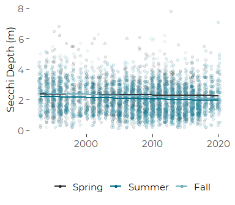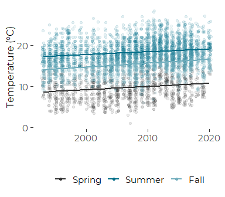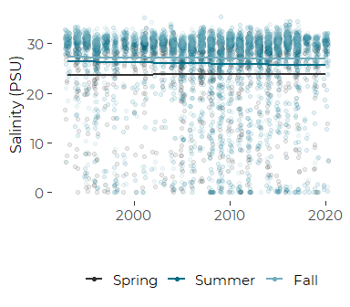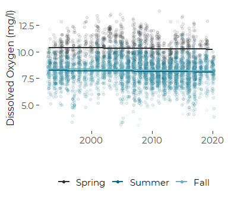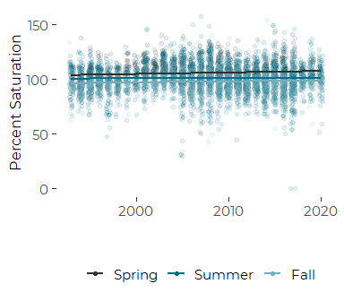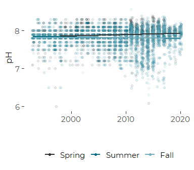

``` r
nested_data$plt <- plts
```

## Fix Chlorophyll Models and Graphic

We need to plot the chlorophyll data on a transformed axis, which takes
several steps.

1.  Extract marginal trends from the revised model with
    `type == "response"`  
2.  Redraw the plot, with an added transformation on the Y axis, while
    controlling the locations of the breaks.

`emmeans` recognizes the log(value + 1) transform, but it does not
recognize the equivalent log1p() transform.

``` r
mod<- nested_data[nested_data$parameter == 'chl',]$lmer_3_seas_2[[1]]
pred <- emmip(mod, season_3 ~ year, 
             at = list(year = 1993:2020), type = 'response',
             plotit = FALSE) %>%
  filter(year > 2000)

nested_data$emmi_3[nested_data$parameter == 'chl'] <- list(pred)
```

#### Updated Chlorophyll Plot

The primary change in the code here is addition of
`scale_y_continuous(trans = 'log1p')`. Unlike emmeans, ggplot recognizes
the transform. We also have to explicitly control the x axis to match
the other plots.

``` r
row <- nested_data[nested_data$parameter == 'chl',]
  dat <- row$data[[1]]
  preds <- row$emmi_3[[1]]
  label <- row$label
  units <- row$units
  
  preds <-  preds %>%
    mutate(UCL = yvar + 1.96 * SE,
           LCL = yvar - 1.96 * SE)
  
  plt <-  ggplot() +
    geom_jitter(mapping = aes(year, value, color = season_3), data = dat, 
                alpha = 0.1, width = 0.25) +
    
    geom_line(mapping = aes(x = xvar, y = yvar, color = tvar), data = preds,
              size = 1) +
    #geom_ribbon(aes(x = xvar, ymin = LCL, ymax = UCL, fill = tvar), data = preds,
    #            color = NA, alpha = 0.15) +
    
    guides(fill = 'none') +
    scale_color_manual(values = cbep_colors2()[c(1,2,4)],
                       name = '',
                guide = guide_legend(override.aes = list(alpha = 1))) +
    scale_fill_manual(values = cbep_colors2()[c(1,2,4)]) +
    
    theme_cbep(base_size = 14) +
    theme(legend.position = 'bottom',
          axis.title.y = element_text(size = 12),
          axis.line = element_line(color = 'gray85')) +

    ylab(paste0(label, 
                if_else(nchar(units) > 0, ' (',''),
                units,
                if_else(nchar(units) > 0, ')',''))) +
    xlab('') +
    labs(color = '') +
    xlim(1993, 2020) +
    scale_y_continuous(trans = 'log1p', breaks = c(0,1,  5, 10, 50, 100, 200))
  print(plt)
#> Warning: Removed 14 rows containing missing values (geom_point).
```


``` r
  nested_data$plt[nested_data$parameter == 'chl'] <- list(plt)
```

# Add Annotations

After some experimentation, we decided to place annotations and Symbols
with functions included in the `ggpmisc` package, specifically, the
`geom_text_npc()` function, and an overridden version of `annotate()`
that allows absolute coordinates rather than data coordinates. This
makes the placement of annotations in a series of similar graphics a bit
more straight forward.

## Define Annotations

``` r
annotations <- c("Decrease Summer and Fall",
                 "Increasing ~ 0.56 degrees C\nper decade",
                 "Possible summer decrease",
                 "No trend",
                 "Increase in spring and fall",
                 "Spring increase, summer decrease",
                 "Decrease in spring and summer")
nested_data$annot <- annotations
```

## Annotation Placement

Most annotations can go in upper right corner. We start with that, then
modify as needed.

``` r
ann_xloc <- rep('left', length(nested_data$parameter))
ann_yloc <- rep('bottom', length(nested_data$parameter))

ann_xloc[1] <- 'right'    # Secchi
ann_yloc[1] <- 'top'    # Secchi
ann_xloc[2] <- 'right'  # temperature
ann_xloc[7] <- 'right'  # Chlorophyll

nested_data$ann_x_loc <- ann_xloc
nested_data$ann_y_loc <- ann_yloc
```

## Demo: Add Annotations to Plots

``` r
for (p in nested_data$parameter) {
  row <- nested_data[nested_data$parameter == p,]
  print(row$plt[[1]] +
        annotate('text_npc', npcx = row$ann_x_loc, npcy = row$ann_y_loc, 
                 label = row$annot,
                 hjust = 'inward',
                 size = 3.5))

}
```

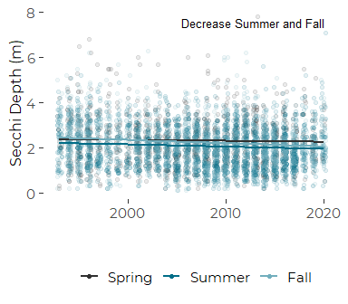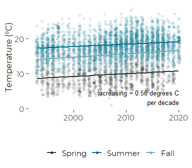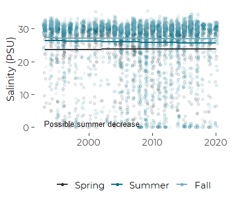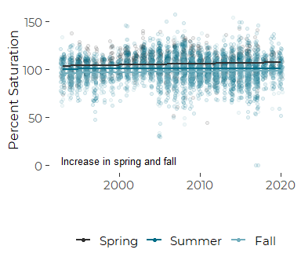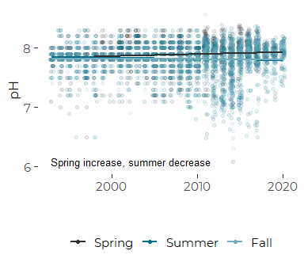

    #> Warning: Removed 14 rows containing missing values (geom_point).

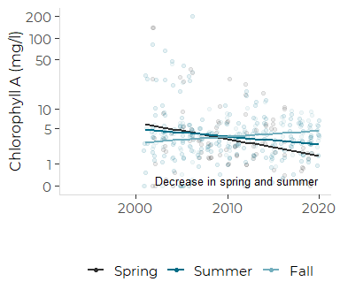

# Symbols

In the upper left, we want to offer symbols to signal improving or
worsening .conditions. Here we search for some suitable unicode glyphs.

Could use “troubling” and “hopeful” to describe trends…

``` r
symbols = 
c('worse',
  'worse',
  'steady',
  'steady',
  'better',
  'steady',
  'better')
nested_data$symbols <- factor(symbols, levels = c('worse', 'steady', 'better'))
```

The challenge we face is that we are already using a color scale for or
core symbols. what we want to do here is place a glyph without using a
color scale.

We can consider either unicode arrow glyph or simple triangle shapes as
the “up” and “down” symbols for things getting better or things getting
worse.

## Possible Unicode Glyphs

### Hollow Shapes

``` r
cat('\U1403')
#> <U+1403>
cat('\U25A1')
#> <U+25A1>
cat('\U25AD')
#> <U+25AD>
cat('\U1401')
#> <U+1401>
```

### Solid Shapes

``` r
cat('\U25bc')
#> <U+25BC>
cat('\U25ac')
#> <U+25AC>
cat('\U25b2')
#> <U+25B2>
cat('\U25fc')
#> <U+25FC>
cat('\n')
```

``` r
myglyphs <- factor(c('\U25bc', '\U25ac','\U25b2'),
                   levels = c('\U25bc', '\U25ac','\U25b2'))
```

### Heavy Arrows

Unfortunately, the following nice arrows show in RStudio, but do not
plot properly in cairo’s pdf engine (at least with the default font).

``` r
cat('\U1f81f')
#> <U+0001F81F>
cat('\U2261')
#> =
cat('\U1f81d')
#> <U+0001F81D>
```

``` r
altglyphs <- factor(c('\U1f81f', '\U2261','\U1f81d'),
                   levels = c('\U1f81f', '\U2261','\U1f81d'))
```

### Alternate “No Change” Glyphs

``` r
cat('\U2248')
#> ˜
cat('\U2194')
#> <U+2194>
```

## Demo Glyphs

Although the horizontal bar does not plot correctly here, it does,
below.

``` r
shapes <- tibble(x = 1:3, y = 1,
                 glyph = myglyphs) 
ggplot(shapes, aes(x,y)) +
  geom_text(aes(label = glyph, color = glyph), size = 12) +
  scale_color_manual(values = c('red' , 'gray', 'green')) +
  guides(color = 'none') +
  theme_void()
```

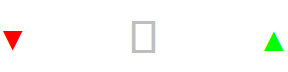

``` r
shapes <- tibble(x = 1:3, y = 1,
                 glyph = altglyphs) 
ggplot(shapes, aes(x,y)) +
  geom_text(aes(label = glyph, color = glyph), size = 12) +
  scale_color_manual(values = c('red' , 'gray', 'green')) +
  guides(color = 'none') +
  theme_void()
```


Unfortunately, those glyphs don’t plot with the cairo\_pdf engine. It
may be that the font does not include those glyphs, or that cairo can
not handle those unicode values.

## Demo Add Glyphs to Plots

``` r
for (p in nested_data$parameter) {
  row <- nested_data[nested_data$parameter == p,]
  print(row$plt[[1]] +
          if(row$symbols == 'better') {
            annotate('text_npc', npcx = 'left', npcy = 'top',
                     label = myglyphs[3], color = 'green2',
                     size = 7)
          }
        else if(row$symbols == 'worse'){
          annotate('text_npc', npcx = 'left', npcy = 'top',
                   label = myglyphs[1], color = 'red4',
                   size = 7)
        }
        else {
          annotate('text_npc', npcx = 'left', npcy = 'top',
                   label = myglyphs[2], color = 'gray50',
                   size = 7)          
        }
  )
  
}
```

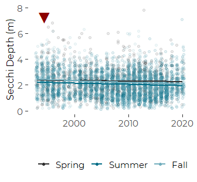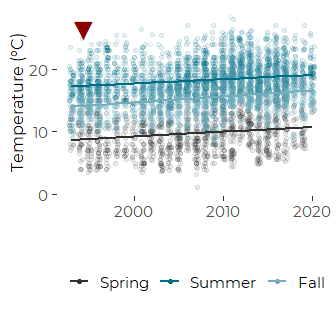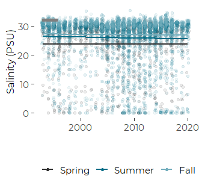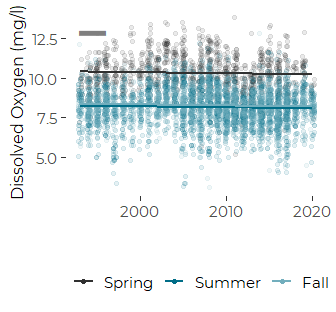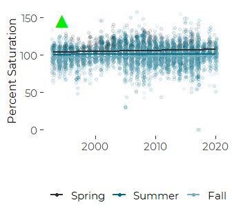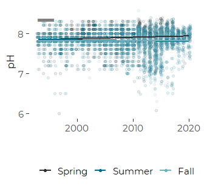

    #> Warning: Removed 14 rows containing missing values (geom_point).

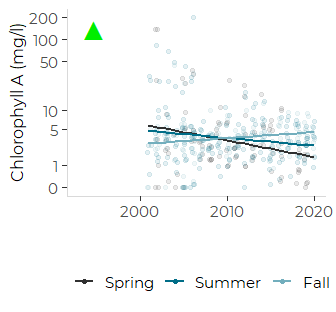

# Add Both

``` r
for (p in nested_data$parameter) {
  row <- nested_data[nested_data$parameter == p,]
  print(row$plt[[1]] +
          annotate('text_npc', npcx = row$ann_x_loc, npcy = row$ann_y_loc, 
                 label = row$annot, family = 'Montserrat',
                 size = 3) +
    
        if(row$symbols == 'better') {
            annotate('text_npc', npcx = 'left', npcy = 'top',
                     label = myglyphs[3], color = 'green2',
                     size = 7)
          }
        else if(row$symbols == 'worse'){
          annotate('text_npc', npcx = 'left', npcy = 'top',
                   label = myglyphs[1], color = 'red4',
                   size = 7)
        }
        else {
          annotate('text_npc', npcx = 'left', npcy = 'top',
                   label = myglyphs[2], color = 'gray50',
                   size = 7)          
        }
  )
  fn <- paste0('focb_s_trend_', p, '.pdf')
  fp <- file.path('figures', fn)
  ggsave(fp, device = cairo_pdf, width = 3.5, height = 3.25)


}
```

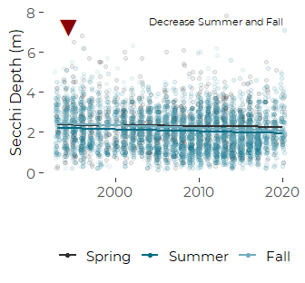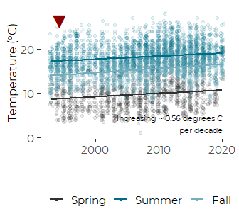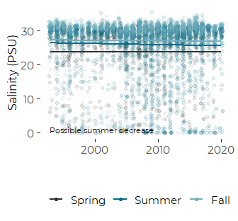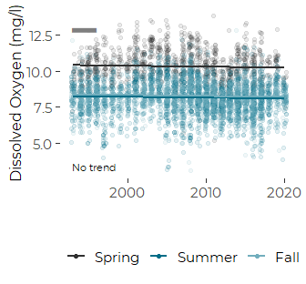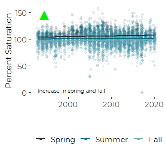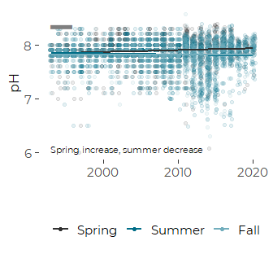

    #> Warning: Removed 14 rows containing missing values (geom_point).

    #> Warning: Removed 14 rows containing missing values (geom_point).

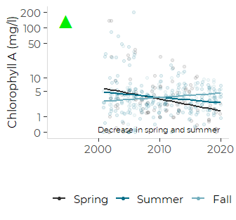
